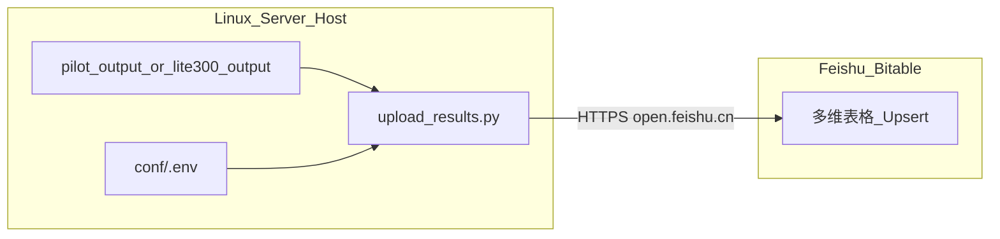

# 服务器飞书多维表格 Pipeline 指南

> **用途**：供 Agent 在 Linux 服务器 clone 的同一仓库中，配置 SWE-bench 评测结果自动写入飞书多维表格（Bitable）的完整 pipeline。  
> **核心脚本**：[`scripts/upload_results.py`](../scripts/upload_results.py)  
> **Pilot 验收**：10 题 upsert，8 Resolved + 2 Failed  
> **Lite 300 扩展**：见 [§6](#6-lite-300-扩展) 与 [`LITE300_EVAL_PLAN.md`](LITE300_EVAL_PLAN.md)

---

## 目录

1. [概述与架构](#1-概述与架构)
2. [前置条件](#2-前置条件)
3. [飞书多维表格 Schema 配置](#3-飞书多维表格-schema-配置)
4. [服务器配置步骤](#4-服务器配置步骤)
5. [Pilot 10 题 — Pipeline 接入与验收](#5-pilot-10-题--pipeline-接入与验收)
6. [Lite 300 扩展](#6-lite-300-扩展)
7. [完整 Bug 目录与解决方案](#7-完整-bug-目录与解决方案)
8. [故障排查决策树](#8-故障排查决策树)
9. [Agent 执行 Checklist](#9-agent-执行-checklist)
10. [相关文档索引](#10-相关文档索引)

---

## 1. 概述与架构

### 1.1 数据流



### 1.2 关键约束

| 约束 | 说明 |
|------|------|
| **运行位置** | 在 **宿主机仓库根目录** 执行 `upload_results.py`，**不要**在 Docker 容器内执行（容器通常无 `conf/.env`，且网络/路径不同） |
| **Upsert 键** | `(Instance ID, 系统版本)` — 同版本重跑 **更新** 旧行，不影响其他版本（如 `Baseline` vs `Pilot`） |
| **输入目录** | Pilot：`pilot_output/`；Lite 300：`lite300_output/` 或 `lite300_output/repos/<REPO>/` |
| **L3 前置** | 必须先有官方 FAIL_TO_PASS 报告（`report/report.json` + `report/instances/*.json`） |

Upsert 逻辑见 [`FeishuBitableClient.find_record` / `upsert`](../scripts/upload_results.py)：`find_record` 按 `(Instance ID, 系统版本)` 搜索，存在则 `PUT` 更新，否则 `POST` 追加。

### 1.3 与现有复现流程的关系

```
L1 Agent 生成 patch  →  L2 predictions  →  L3 Docker 评测  →  report/  →  upload_results.py  →  飞书表
```

- L1–L3 主流程：[`SERVER_REPLICATION_GUIDE.md`](SERVER_REPLICATION_GUIDE.md)
- Pilot 输出结构：[`PILOT_INCREMENTAL_EVAL_DESIGN.md`](PILOT_INCREMENTAL_EVAL_DESIGN.md) §7
- Pilot 评测入口：[`scripts/run_pilot_eval_incremental.sh`](../scripts/run_pilot_eval_incremental.sh)

---

## 2. 前置条件

| 类别 | 要求 |
|------|------|
| **服务器** | Linux（Ubuntu 20.04/22.04 推荐）；已 `git clone` 本仓库并 `git pull` 到含最新 `upload_results.py` 的分支 |
| **Python** | `python3`；`python-dotenv`（见 [`requirements-pilot-minimal.txt`](../requirements-pilot-minimal.txt)） |
| **网络** | 出站 HTTPS 可达 `https://open.feishu.cn` |
| **飞书应用** | 企业自建应用；权限含 `bitable:app` 及多维表格记录读写；目标表格已授权该应用 |
| **L3 产物** | `report/report.json` 与 `report/instances/*.json`（Pilot 评测完成，或 `--report-only` 重算） |

---

## 3. 飞书多维表格 Schema 配置

**上传前必须在飞书 UI 中预先建好下列字段与单选选项。** 飞书 API **不会**自动创建单选值；选项缺失会导致部分或全部行写入失败。

### 3.1 字段对照表

字段名须与脚本常量 **逐字一致**（含中文、空格、括号）：

| 飞书列名 | 类型 | 脚本常量 | 数据来源 |
|----------|------|----------|----------|
| `Instance ID` | 单行文本 | `FIELD_INSTANCE_ID` | `instance_id` |
| `系统版本` | 单选 | `FIELD_SYSTEM_VERSION` | CLI `--system_version` |
| `Repo` | 单选 | `FIELD_REPO` | 由 `instance_id` 前缀映射 |
| `测试状态` | 单选 | `FIELD_TEST_STATUS` | `Resolved` / `Failed` / `Running` |
| `失败原因分类` | 单选 | `FIELD_FAILURE_CATEGORY` | 见 §3.3 |
| `生成的代码行数` | 数字（整数） | `FIELD_PATCH_LINES` | patch diff 行数 |
| `测试耗时 (s)` | 数字（1 位小数） | `FIELD_ELAPSED` | `eval_state.json` → `elapsed_s` |
| `生成耗时(s)` | 数字（1 位小数） | `FIELD_GENERATION_ELAPSED` | `applicable_patch/*/cost.json` → `elapsed_seconds` |
| `报错日志/备注` | 多行文本 | `FIELD_ERROR_LOG` | F2P/P2P 失败明细等 |

> **注意**：生成耗时列名为 **`生成耗时(s)`**（括号前无空格），**不是**「生成时间(s)」。若表中尚无该列，上传时使用 `--omit-generation-elapsed`（见 §5.2）。

列名可通过环境变量覆盖：`FEISHU_FIELD_GEN_TIME=你的列名`。

### 3.2 Repo 单选（12 项，Lite 300 全量）

须在飞书 `Repo` 列中预先创建以下 **12 个选项**（与 [`ALLOWED_REPOS`](../scripts/upload_results.py) 一致）：

| Repo 选项值 | instance_id 前缀 | Lite 300 题数 |
|-------------|------------------|---------------|
| `django` | `django__` | 114 |
| `sympy` | `sympy__` | 77 |
| `matplotlib` | `matplotlib__` | 23 |
| `scikit-learn` | `scikit-learn__` | 23 |
| `pytest` | `pytest-dev__` | 17 |
| `sphinx` | `sphinx-doc__` | 16 |
| `astropy` | `astropy__` | 6 |
| `requests` | `psf__` | 6 |
| `pylint` | `pylint-dev__` | 6 |
| `xarray` | `pydata__` | 5 |
| `seaborn` | `mwaskom__` | 4 |
| `flask` | `pallets__` | 3 |
| **合计** | | **300** |

前缀 → Repo 映射见 [`INSTANCE_REPO_MAP`](../scripts/upload_results.py)。

### 3.3 其他单选选项

**`测试状态`**（3 项）：

- `Resolved`
- `Failed`
- `Running`

**`失败原因分类`**（5 项）：

- `Patch Apply Error`
- `Timeout`
- `Syntax/Import Error`
- `Assertion Failed`
- `None`

**`系统版本`**：按实验命名预先创建，例如：

- `Pilot` — Pilot 10 题验收
- `Baseline` — 基线实验
- `Ours_v1`、`Ours_v2` — 迭代版本


CLI 参数 `--system_version` 的值必须与飞书选项 **完全一致**（大小写、空格均敏感）。

### 3.4 飞书应用与表格授权

1. [飞书开放平台](https://open.feishu.cn/) 创建企业自建应用  
2. 开通权限：**查看、编辑和管理多维表格**（或 `bitable:app` + 记录读写）  
3. 发布/启用应用  
4. 在多维表格中：**更多 → 添加文档应用** → 选择该应用  
5. 从 URL 提取凭证：  
   - `APP_TOKEN`：URL 中 `/base/` 后的一段  
   - `TABLE_ID`：URL 参数 `table=` 中以 `tbl` 开头的 ID  

---

## 4. 服务器配置步骤

在服务器上于 **仓库根目录** 依次执行。

### Step 4.1 — 同步代码

```bash
cd /path/to/auto-code-rover
git pull origin <你的分支>

# 确认 12-repo 映射已存在
grep -E "scikit-learn|mwaskom|pallets" scripts/upload_results.py
```

### Step 4.2 — 创建凭证文件

**禁止**只修改 `conf/.env.example`。脚本 **仅**加载 `conf/.env`：

```bash
cp conf/.env.example conf/.env
chmod 600 conf/.env
nano conf/.env   # 或 vim
```

填入（示例结构，使用真实值替换占位符）：

```bash
FEISHU_APP_ID=cli_xxxxxxxxxx
FEISHU_APP_SECRET=xxxxxxxxxxxxxxxx
FEISHU_APP_TOKEN=bascnxxxxxxxx
FEISHU_TABLE_ID=tblxxxxxxxx

# 可选：若飞书列名不是默认「生成耗时(s)」
# FEISHU_FIELD_GEN_TIME=生成耗时(s)

# 可选：表中尚无生成耗时列时
# FEISHU_OMIT_GEN_TIME=1
```

**安全**：

- `conf/.env` **勿提交 git**（根目录 `.gitignore` 含 `.env`，建议同样勿 commit `conf/.env`）
- 真实 Secret 只放在 `conf/.env`；`.env.example` 应使用占位符
- 若 Secret 曾泄露，在飞书开放平台 **轮换 App Secret**

### Step 4.3 — 凭证与网络自检

```bash
python3 -c "
from dotenv import load_dotenv
import os
load_dotenv('conf/.env')
keys = ['FEISHU_APP_ID','FEISHU_APP_SECRET','FEISHU_APP_TOKEN','FEISHU_TABLE_ID']
print({k: ('OK' if os.getenv(k) else 'MISSING') for k in keys})
"
```

期望四个键均为 `OK`。

```bash
curl -I https://open.feishu.cn/open-apis/auth/v3/tenant_access_token/internal
```

期望 HTTP 200 或 405（说明网络可达）。

### Step 4.4 — 安装 Python 依赖

```bash
pip install python-dotenv
# 或在 conda 环境中：
# conda activate auto-code-rover && pip install python-dotenv
```

若未安装 `python-dotenv`，脚本的 `_load_dotenv()` 会 **静默跳过**，导致凭证读不到（见 Bug F8）。

---

## 5. Pilot 10 题 — Pipeline 接入与验收

Pilot 是验证飞书 pipeline 可行性的 **标准冒烟测试**：10 条记录，官方结果 **8 Resolved + 2 Failed**。

### 5.1 确保 L3 评测产物存在

**完整 L3（尚无 eval_logs 时）：**

```bash
bash scripts/run_pilot_eval_incremental.sh
```

**已有 eval_logs，仅需重算报告：**

```bash
bash scripts/run_pilot_eval_incremental.sh --report-only
```

**Lite 300 / 非 Pilot 实验目录：**

```bash
EXPR_DIR=experiment/deepseek-lite-300 bash scripts/run_pilot_eval_incremental.sh --resume
# 或容器内：python scripts/run_eval_incremental.py --expr-dir experiment/deepseek-lite-300 --resume
```

**或手动生成报告：**

```bash
python3 scripts/generate_official_report.py \
  --predictions_path pilot_output/predictions_for_swebench.sanitized.json \
  --log_dir pilot_output/eval_logs \
  --swe_bench_tasks test/fixtures/swe-bench-pilot.json \
  --output_dir pilot_output/report
```

**必需文件检查：**

```bash
test -f pilot_output/report/report.json && echo "report OK"
ls pilot_output/report/instances/*.json | wc -l   # 期望 10
test -f pilot_output/predictions_for_swebench.sanitized.json && echo "predictions OK"
```

| 文件 | 必需 | 用途 |
|------|------|------|
| `pilot_output/report/report.json` | 是 | resolved / applied 汇总 |
| `pilot_output/report/instances/*.json` | 是 | 每题 F2P/P2P、失败原因 |
| `pilot_output/predictions_for_swebench*.json` | 是 | patch 行数 |
| `pilot_output/eval_state.json` | 推荐 | 测试耗时 `elapsed_s`（由 [`run_eval_incremental.py`](../scripts/run_eval_incremental.py) 逐题写入） |
| `pilot_output/applicable_patch/*/cost.json` | 推荐 | 生成耗时（L2 后 [`verify_l2_output.py`](../scripts/verify_l2_output.py) 验收） |

### 5.2 Dry-run（必须通过后再上传）

```bash
cd /path/to/auto-code-rover

python3 scripts/upload_results.py \
  --system_version Pilot \
  --log_path pilot_output \
  --dry-run
```

**验收标准：**

```
Parsed 10 case(s) for version 'Pilot':
  ...
[DRY-RUN] Skipping Feishu upload.
```

- **10 条**（不是 9 条；若只有 9 条见 Bug F2）
- **8× Resolved**：django×3、pytest×2、sympy×1、matplotlib×1、scikit-learn×1
- **2× Failed**：`astropy__astropy-6938`、`sympy__sympy-13471`

若飞书表尚无「生成耗时(s)」列，追加：

```bash
python3 scripts/upload_results.py \
  --system_version Pilot \
  --log_path pilot_output \
  --omit-generation-elapsed \
  --dry-run
```

或：

```bash
export FEISHU_OMIT_GEN_TIME=1
```

> **建议**：优先使用 `--log_path pilot_output` **目录**，而非旧的 `pilot_output/eval_results.json`（后者可能未含 scikit-learn，仅 9 条）。

### 5.3 正式上传

```bash
python3 scripts/upload_results.py \
  --system_version Pilot \
  --log_path pilot_output
```

**期望输出（首次）：**

```
Done: created=10, updated=0, failed=0
```

**重复跑同一版本：**

```
Done: created=0, updated=10, failed=0
```

### 5.4 飞书表格人工核对

在飞书中筛选 `系统版本 = Pilot`：

| 检查项 | 预期 |
|--------|------|
| 总行数 | **10** |
| Resolved | **8** |
| Failed | **2** |
| Repo 分布 | django×3, pytest×2, sympy×2, astropy×1, matplotlib×1, scikit-learn×1 |

**Resolved 8 题（与 `report.json` 一致）：**

- `django__django-11001`, `django__django-11049`, `django__django-12700`
- `pytest-dev__pytest-5227`, `pytest-dev__pytest-7373`
- `matplotlib__matplotlib-23314`, `scikit-learn__scikit-learn-10297`, `sympy__sympy-24152`

**Failed 2 题：**

- `astropy__astropy-6938` — Assertion Failed
- `sympy__sympy-13471` — Assertion Failed

### 5.5 Pipeline 接入点（推荐）

本仓库 **不修改** `run_pilot_eval_incremental.sh`；在 L3 成功结束后 **追加一步** upload：

```bash
# 评测完成后（run_pilot_eval_incremental.sh exit 0）
python3 scripts/upload_results.py \
  --system_version Pilot \
  --log_path pilot_output
```

可选集成方式：

- **手动**：评测 tmux 会话结束后执行上述命令  
- **CI / cron**：检测 `pilot_output/report/report.json` 更新后触发  
- **包装脚本**：自行编写 2 行 shell，不在本计划范围内  

### 5.6 导出 canonical JSON（可选）

```bash
python3 scripts/upload_results.py \
  --build-from-pilot pilot_output \
  --output pilot_output/eval_results.json
```

---

## 6. Lite 300 扩展

Pilot 验收通过后，同一套 `upload_results.py` 可用于 Lite 300 全量。

**推荐编排**：使用 **Per-instance pipeline**（每题 L2 verify → L3 或飞书 L2 失败），详见 [`PER_INSTANCE_PIPELINE_GUIDE.md`](PER_INSTANCE_PIPELINE_GUIDE.md)。  
单题上传时使用 `--instance-id`；L2 终局失败使用 `--l2-failure instance:L2 Missing|L2 No Patch|L2 Unparsed`。

### 6.1 输出目录

| 场景 | `--log_path` |
|------|----------------|
| 中央合并目录 | `lite300_output` |
| 单库目录 | `lite300_output/repos/<REPO>` |

`<REPO>` 为脚本键名（如 `astropy`、`pallets`、`psf`），见 [`lite300_common.sh`](../scripts/lite300_common.sh)。

### 6.2 上传命令

**直接调用 Python（与 Pilot 相同）：**

```bash
python3 scripts/upload_results.py \
  --system_version Baseline \
  --log_path lite300_output \
  --dry-run

python3 scripts/upload_results.py \
  --system_version Baseline \
  --log_path lite300_output
```

期望：**Parsed 300 case(s)**（全量完成后）。

**使用已有 shell 封装：**

```bash
REPO=all SYSTEM_VERSION=Baseline bash scripts/lite300_upload.sh
DRY_RUN=1 REPO=all bash scripts/lite300_upload.sh   # dry-run
```

单库：

```bash
REPO=astropy SYSTEM_VERSION=Baseline bash scripts/lite300_upload.sh
```

### 6.3 字段与版本名

| 飞书列 | Lite 300 来源 |
|--------|----------------|
| 生成耗时(s) | `lite300_output/repos/<REPO>/applicable_patch/*/cost.json` |
| 测试耗时 (s) | `eval_state.json` → `elapsed_s` |

全量实验前在飞书「系统版本」新增 `DeepSeek-Lite300`（或你的实验名），并设置：

```bash
export SYSTEM_VERSION=DeepSeek-Lite300
```

### 6.4 分库 pipeline 脚本

Lite 300 分库脚本已实现（不再依赖 `LITE300_EVAL_PLAN.md`）：

| 脚本 | 用途 |
|------|------|
| [`scripts/split_lite300_tasks.py`](../scripts/split_lite300_tasks.py) | 从 `conf/swe_lite_tasks.txt` 生成 `conf/lite300_tasks/*.txt` |
| [`scripts/run_lite300_repo.sh`](../scripts/run_lite300_repo.sh) | 单库 L2→L3→飞书 Baseline |
| [`scripts/start_lite300_tmux.sh`](../scripts/start_lite300_tmux.sh) | tmux `lite300-baseline` 12 窗口并行 |
| [`scripts/lite300_upload.sh`](../scripts/lite300_upload.sh) | `REPO=all` 或单库上传 |

tmux 启动与断点续跑详见 [`SERVER_REPLICATION_GUIDE.md` §6.7.6](SERVER_REPLICATION_GUIDE.md#676-lite-300-分库-pipeline)。

---

## 7. 完整 Bug 目录与解决方案

汇总本地 Pilot、Lite300 Phase 0 与服务器配置中的 **全部已知问题**。每条含诊断步骤。

### F1 — `Missing Feishu credentials`

| 项 | 内容 |
|----|------|
| **现象** | Parsed N case(s) 后 Traceback：`ValueError: Missing Feishu credentials...` |
| **根因** | 只改了 `conf/.env.example`，未创建 `conf/.env` |
| **诊断** | `test -f conf/.env && echo exists \|\| echo MISSING` |
| **解决** | `cp conf/.env.example conf/.env`，填入 4 个 `FEISHU_*` 变量，`chmod 600 conf/.env` |

### F2 — Parsed 9 而非 10

| 项 | 内容 |
|----|------|
| **现象** | dry-run 显示 9 条；stderr 有 `[WARN] Skip scikit-learn__...` |
| **根因** | 旧版 `ALLOWED_REPOS` 缺 `scikit-learn`；或使用了 stale 的 `eval_results.json` |
| **诊断** | `grep scikit-learn scripts/upload_results.py`；`grep scikit-learn pilot_output/eval_results.json` |
| **解决** | 确认 12-repo 映射；使用 `--log_path pilot_output` 目录重新解析 |

### F3 — Parsed 10 但 `failed=N`

| 项 | 内容 |
|----|------|
| **现象** | 部分 `[created]`，部分 `[FAILED] instance_id: Feishu API error...` |
| **根因** | 飞书单选选项未预先创建（系统版本、Repo、测试状态、失败原因分类） |
| **诊断** | 查看 `[FAILED]` 行 API 返回体中的 field / option 提示 |
| **解决** | 在飞书 UI 补全 §3 全部单选选项；dry-run 后再上传 |

### F4 — `--system_version Pilot` 全部失败

| 项 | 内容 |
|----|------|
| **现象** | 10 条全部 `[FAILED]`，错误含 invalid option 或类似 |
| **根因** | 飞书「系统版本」只有 `Baseline`，无 `Pilot` |
| **诊断** | 对照 CLI 参数与飞书单选列表 |
| **解决** | 在飞书新增 `Pilot` 选项，或与已有选项对齐（如改用 `--system_version Baseline`） |

### F5 — 字段 API 报错 unknown field

| 项 | 内容 |
|----|------|
| **现象** | `Feishu API error: ... field ... not found` |
| **根因** | 列名与脚本不一致（如「生成时间(s)」vs「生成耗时(s)」） |
| **诊断** | 对照 §3.1 字段表与飞书表头 |
| **解决** | 重命名飞书列或设置 `FEISHU_FIELD_GEN_TIME` 环境变量 |

### F6 — 生成耗时列报错

| 项 | 内容 |
|----|------|
| **现象** | API 报错与 `生成耗时(s)` 相关 |
| **根因** | 表中尚无第 9 列数值字段 |
| **诊断** | 检查飞书表是否有「生成耗时(s)」列 |
| **解决** | 飞书新增该列，或 `--omit-generation-elapsed` / `FEISHU_OMIT_GEN_TIME=1` |

### F7 — astropy 测试耗时 0.0

| 项 | 内容 |
|----|------|
| **现象** | `astropy__astropy-6938` 的 `elapsed=0.0s` |
| **根因** | `eval_state.json` 中该题为 `skipped_existing_log`，无 `elapsed_s` |
| **诊断** | `grep -A5 astropy pilot_output/eval_state.json` |
| **解决** | **非阻塞**；可删 log 后 `--resume` 重跑单题 L3a 补全耗时 |

### F8 — `python-dotenv` 未安装

| 项 | 内容 |
|----|------|
| **现象** | 同 F1，`conf/.env` 存在但仍 Missing credentials |
| **根因** | `_load_dotenv()` 在 ImportError 时静默跳过 |
| **诊断** | `python3 -c "import dotenv; print('ok')"` |
| **解决** | `pip install python-dotenv` |

### F9 — 容器内执行 upload 失败

| 项 | 内容 |
|----|------|
| **现象** | 在 `docker exec acr-replicate` 内运行脚本报凭证或网络错误 |
| **根因** | 容器内无 `conf/.env` 挂载或未配置出站网络 |
| **诊断** | 容器内 `test -f /workspace/acr/conf/.env` |
| **解决** | **仅在宿主机** 仓库根目录执行 upload |

### F10 — 服务器代码过旧

| 项 | 内容 |
|----|------|
| **现象** | 无 `upload_results.py` 或缺少 12-repo / 生成耗时逻辑 |
| **根因** | clone 后未 `git pull` |
| **诊断** | `git log -1 --oneline scripts/upload_results.py` |
| **解决** | `git pull` 同步含飞书脚本的提交 |

### F11 — 部分 created、部分 failed（Repo）

| 项 | 内容 |
|----|------|
| **现象** | django 成功，seaborn 失败等 |
| **根因** | 某一 `Repo` 单选选项在飞书中缺失 |
| **诊断** | 失败行的 `repo=` 与 stderr API 信息 |
| **解决** | 补全 §3.2 全部 12 个 Repo 选项 |

### F12 — HTTP 403 / 99991663

| 项 | 内容 |
|----|------|
| **现象** | `HTTP 403` 或飞书错误码 `99991663` |
| **根因** | 应用无 bitable 权限，或表格未授权给应用 |
| **诊断** | 开放平台 → 应用权限；表格 → 添加文档应用 |
| **解决** | 开通 bitable 读写权限；重新授权表格；确认应用已发布 |

### F13 — 重复上传产生 duplicate 误解

| 项 | 内容 |
|----|------|
| **现象** | 担心重跑会产生重复行 |
| **根因** | 不了解 Upsert 语义 |
| **诊断** | 第二次上传应显示 `updated=10` 而非 `created=10` |
| **解决** | 同 `(Instance ID, 系统版本)` 仅一行；换版本才新增行 |

### F14 — `No valid records to upload`

| 项 | 内容 |
|----|------|
| **现象** | exit 1，stderr: `No valid records to upload` |
| **根因** | `report/` 缺失、路径错误，或全部被 `validate_records` 跳过 |
| **诊断** | `ls pilot_output/report/`；upload 时 stderr 的 `[WARN] Skip` |
| **解决** | 运行 §5.1 生成报告；修正 `--log_path` |

### F15 — Lite300 Windows 路径 mangling

| 项 | 内容 |
|----|------|
| **现象** | Git Bash 下路径变为 `/g/...` 导致找不到文件 |
| **根因** | MSYS 路径转换 |
| **诊断** | 见 [`LITE300_EVAL_PLAN.md` §10](LITE300_EVAL_PLAN.md) |
| **解决** | **Linux 服务器无此问题**；混合环境用 `export MSYS_NO_PATHCONV=1` |

### F16 — 密钥泄露风险

| 项 | 内容 |
|----|------|
| **现象** | Secret 出现在 git 历史、`.env.example` 或聊天日志 |
| **根因** | 误将真实密钥写入可跟踪文件 |
| **诊断** | `git log -p -- conf/.env.example` |
| **解决** | 仅 `conf/.env` 存 Secret；`.env.example` 用占位符；飞书平台轮换 Secret |

---

## 8. 故障排查决策树

按顺序排查：

```
1. 解析阶段
   ├─ Parsed 0 或 No valid records
   │    → report/ 是否存在？路径是否正确？见 F14
   ├─ Parsed < 10（Pilot）或 < 300（Lite）
   │    → stderr 有无 [WARN] Skip？见 F2、F11
   └─ Parsed 数量正确 → 进入步骤 2

2. 凭证阶段
   ├─ Missing Feishu credentials
   │    → conf/.env 是否存在？python-dotenv 是否安装？见 F1、F8
   └─ 凭证 OK → 进入步骤 3

3. API 阶段
   ├─ 全部 [FAILED]
   │    → 系统版本选项？应用权限？见 F4、F12
   ├─ 部分 [FAILED]
   │    → Repo / 字段名 / 单选选项？见 F3、F5、F6、F11
   └─ created+updated 正确、failed=0 → 进入步骤 4

4. 飞书 UI 核对
   └─ 行数、Resolved/Failed 计数、Repo 分布是否符合 §5.4
```

**常用诊断命令汇总：**

```bash
# 凭证
python3 -c "from dotenv import load_dotenv; import os; load_dotenv('conf/.env'); print({k: bool(os.getenv(k)) for k in ['FEISHU_APP_ID','FEISHU_APP_SECRET','FEISHU_APP_TOKEN','FEISHU_TABLE_ID']})"

# 解析（不调用 API）
python3 scripts/upload_results.py --system_version Pilot --log_path pilot_output --dry-run 2>&1 | tee /tmp/feishu_dryrun.log

# 跳过原因
grep WARN /tmp/feishu_dryrun.log

# L3 产物
test -f pilot_output/report/report.json && ls pilot_output/report/instances/ | wc -l
```

---

## 9. Agent 执行 Checklist

在服务器上配置并验证 Pilot 飞书 pipeline 时，逐项打勾：

- [ ] **代码**：`git pull`；`grep scikit-learn scripts/upload_results.py` 有输出
- [ ] **凭证**：`conf/.env` 存在；四变量自检均为 `OK`；`chmod 600 conf/.env`
- [ ] **依赖**：`python-dotenv` 已安装
- [ ] **网络**：`curl -I https://open.feishu.cn/...` 可达
- [ ] **飞书表 Schema**：§3 全部字段 + 12 Repo + 系统版本（含 `Pilot`）+ 测试状态 + 失败原因分类
- [ ] **飞书应用**：bitable 权限 + 表格已授权应用
- [ ] **L3 产物**：`pilot_output/report/report.json` 存在；`instances/` 含 10 个 JSON
- [ ] **Dry-run**：`Parsed 10 case(s)`；8 Resolved + 2 Failed
- [ ] **上传**：`failed=0`；`created=10` 或 `updated=10`
- [ ] **飞书核对**：§5.4 表格与 `report.json` 一致
- [ ] **（可选）Lite 300**：阅读 [`LITE300_EVAL_PLAN.md`](LITE300_EVAL_PLAN.md)；全量前新增 `DeepSeek-Lite300` 系统版本

---

## 10. 相关文档索引

| 文档 | 内容 |
|------|------|
| [`SERVER_REPLICATION_GUIDE.md`](SERVER_REPLICATION_GUIDE.md) | 服务器 L1–L3 主流程、Docker、Pilot 复现 |
| [`PILOT_INCREMENTAL_EVAL_DESIGN.md`](PILOT_INCREMENTAL_EVAL_DESIGN.md) | Pilot 逐题评测、`pilot_output/` 结构、L3b 官方报告 |
| [`LITE300_EVAL_PLAN.md`](LITE300_EVAL_PLAN.md) | Lite 300 分库 pipeline、Phase 0 验收、飞书 upsert 实测 |
| [`DOCKER_PILOT_GUIDE.md`](DOCKER_PILOT_GUIDE.md) | Docker Pilot 总览 |
| [`scripts/upload_results.py`](../scripts/upload_results.py) | 飞书 upsert 主脚本 |
| [`scripts/lite300_upload.sh`](../scripts/lite300_upload.sh) | Lite 300 上传 shell 封装 |
| [`conf/.env.example`](../conf/.env.example) | 环境变量名模板（勿写入真实 Secret） |
| [`conf/swe_lite_tasks.txt`](../conf/swe_lite_tasks.txt) | Lite 300 完整 instance 列表（300 行） |

---

**文档版本**：2026-05-31  
**Pilot 基准结果**：8/10 Resolved（`astropy-6938`、`sympy-13471` 未 resolved）
