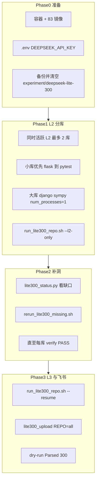

# Lite 300 Baseline 复现计划（DeepSeek + 流程修复）

> 版本：2026-06-01  
> 目标：**300 题均有 prediction** + `verify_l2_output.py` 全 PASS + 飞书 **Baseline** upsert  
> 模型：**DeepSeek-Chat**（`litellm-generic-deepseek/deepseek-chat`），非论文 GPT-4 数值对齐

---

## 1. 目标与边界

| 项 | 内容 |
|----|------|
| 任务范围 | 官方 [conf/swe_lite_tasks.txt](../conf/swe_lite_tasks.txt) **300** 题，12 repo 分库 |
| 主模型 | DeepSeek（[`conf/deepseek-lite-300.repo.conf.template`](../conf/deepseek-lite-300.repo.conf.template)） |
| Patch 选择 | [`app/agents/agent_select.py`](../app/agents/agent_select.py) 使用 **DeepSeek**（同 L2 模型） |
| 验收 | 每库 `PRED（去重）== EXP`；`no_patch/` 为空；全库飞书 **Parsed 300 case(s)** |
| 非目标 | 论文 pass@1 19% / pass@3 26%（需 GPT-4 + 三次独立实验） |

### 1.1 上次运行结论（2026-06-01）

| 指标 | 结果 |
|------|------|
| 全库 prediction（去重） | **113 / 300** |
| L3 / report | **0**（verify 全 FAIL，未进 L3） |
| tmux `lite300-baseline` | 已退出 |
| django | 日志约 **30/114** 完成计数；大量题未执行 |
| 根因 | **12 库同时 L2** + verify `set -e` 阻断 |

---

## 2. 流程总览



### 2.1 推荐 repo 顺序

```
flask(3) → seaborn(4) → xarray(5) → astropy → requests → pylint(6 each)
→ sphinx(16) → pytest(17) → matplotlib(23) → scikit-learn(23) → sympy(77) → django(114)
```

### 2.2 关键命令

```bash
cd /datadisk/pengxm/auto-code-rover
source scripts/source_env.sh

# 进度（instance 去重）
python3 scripts/lite300_status.py

# 单库 L2 + verify（不进 L3）
REPO=flask bash scripts/run_lite300_repo.sh --l2-only

# 补跑缺失题
REPO=flask bash scripts/rerun_lite300_missing.sh

# Phase1 顺序跑（脚本）
bash scripts/run_lite300_phase1_sequential.sh

# L3 + 飞书（verify 已通过后）
REPO=django bash scripts/run_lite300_repo.sh --resume
REPO=all bash scripts/lite300_upload.sh
```

---

## 3. L2 执行过程说明

单题在容器内路径：`experiment/deepseek-lite-300/repos/<REPO>/`

| 步骤 | 组件 | 产物 |
|------|------|------|
| 1 | `scripts/run.py -f`（仅首跑整库） | 清空 expr_dir |
| 2 | `app/main.py swe-bench --reproduce-and-review` | 按 setup 分组并行 |
| 3 | 搜索 | `search/`、`bug_locations` |
| 4 | 写 patch（每轮 output_0..2，overall_retry_limit=3） | `patch_raw_*.md`、`extract_status.json` |
| 5 | patch selection | `selected_patch.json`、`extracted_patch_*.diff` |
| 6 | organize | 分桶：`applicable_patch/`、`no_patch/`、`raw_patch_but_unparsed/` 等 |
| 7 | extract_swe_bench_input | `predictions_for_swebench.json` |
| 8 | complete_l2_patch_selection + verify | 质检 |

**注意**：日志 `Task xxx completed successfully` **不等于** applicable；以 verify 与 `predictions` 为准。

### 3.1 为什么会有 `no_patch/`

| 原因 | 说明 |
|------|------|
| 无 extract 记录 | 题未跑完或 patch 阶段未写入 `extract_status.json` |
| 三次 patch 均非 APPLICABLE | `Failed to write an applicable patch in 3 attempts` |
| git 异常 | 如 `git reset exit status 128` |
| 归类最好状态为 NO_PATCH | 无可用 `extracted_patch_*.diff` |

严格 verify 要求 **`no_patch/` 为空**，故需降并行、补跑失败题，并接受 DeepSeek 下 **未必一次 100% applicable**。

### 3.2 verify 做什么

[`scripts/verify_l2_output.py`](../scripts/verify_l2_output.py) **不跑测试**，仅检查：

- `predictions_for_swebench.json` 存在且条数 = 题数  
- `applicable_patch/` 目录数 = 题数  
- `no_patch/` 为空  
- 每 applicable 有 `cost.json`、`info.log` 含成功行  
- prediction 的 instance_id 与 `conf/lite300_tasks/<REPO>.txt` 完全一致  

---

## 4. Bug 汇总与解法

### 4.1 编排与资源（L2 未跑满 — 主因）

| ID | 现象 | 解法 | 有效性 |
|----|------|------|--------|
| A1 | 12 库同时 L2，django 仅部分题 | **同时 ≤2 库**；django/sympy **`num_processes=1`** | 显著改善 |
| A2 | git reset 128 | 降并行；检查 setup_result | 部分 |
| A3 | tmux 全停 | `run_lite300_phase1_sequential.sh` + `lite300_status.py` | 可观测 |
| A4 | organize shutil 冲突 | `run.py -f` + [`post_process` 目标已存在则删除](../app/post_process.py) | 已修代码 |

### 4.2 Agent 质量（no_patch / unparsed）

| ID | 现象 | 解法 | 有效性 |
|----|------|------|--------|
| B1 | no_patch 多 | 降并行 + DeepSeek patch selection | 部分 |
| B2 | UNPAR（如 flask-4045） | `conv_round_limit:12`；`rerun_lite300_missing.sh` | 部分，需多轮 |
| B3 | patch selection 失败 | 已改为 DeepSeek（`ACR_PATCH_SELECT_MODEL` 可覆盖） | 消除 OPENAI 依赖 |
| B4 | 日志误导 | 以 verify 为准 | 认知 |

### 4.3 流水线

| ID | 现象 | 解法 | 有效性 |
|----|------|------|--------|
| C1 | verify FAIL 无 L3 | Baseline 目标：**strict verify**，先 L2 再 L3 | 符合目标 |
| C2 | PRED>EXP | 每库只 `-f` 一次；`lite300_status.py` 去重统计 | 能 |
| C3 | 无 task 级 resume | [`scripts/rerun_lite300_missing.sh`](../scripts/rerun_lite300_missing.sh) | 已实现 |

### 4.4 执行期风险

| 风险 | 缓解 |
|------|------|
| API 限流/余额 | 同时 L2 ≤2 库；DeepSeek 留 ≥¥40 |
| 磁盘 | `df -h`；预留 150GB+ |
| L3 镜像 | `swe_lite_pull/missing.txt` 为 0 |
| 飞书 | 见 [FEISHU_BITABLE_SERVER_PIPELINE.md](FEISHU_BITABLE_SERVER_PIPELINE.md) |

---

## 5. 自审

1. **流程**：分库低并行 + Phase2 补洞 + strict verify，与 Baseline300 一致；**不能**用 12 路 tmux 全开。  
2. **Bug 覆盖**：A/B/C/D + 统计口径（勿用 `wc -l` 数目录当 PRED）。  
3. **解法**：A1/A4/C3 可靠；B 类**不能保证**一次 zero no_patch，靠补跑迭代。  
4. **缺口**：若拒绝补跑，只能整库 `-f` 重跑，浪费已成功题 API 费用。  
5. **模型**：保持 DeepSeek；编排修复是达到 300 条的**必要条件**，非充分条件。

---

## 6. 执行检查表

### Phase 0

- [ ] `docker ps` 含 `pengxm-acr-replicate`
- [ ] `conf/.env` 含 `DEEPSEEK_API_KEY`
- [ ] 备份旧 `experiment/deepseek-lite-300`（若有）
- [ ] `wc -l conf/swe_lite_tasks/*.txt` 合计 300

### Phase 1（每库）

- [ ] `REPO=x bash scripts/run_lite300_repo.sh --l2-only`
- [ ] `python3 scripts/lite300_status.py` → PRED==EXP，NO=0，UNPAR=0
- [ ] verify 全 PASS

### Phase 2

- [ ] `REPO=x bash scripts/rerun_lite300_missing.sh` 直至无 missing
- [ ] 全库 `SUM(expected)=300`，`SUM(PRED)=300`

### Phase 3

- [ ] 每库 `REPO=x bash scripts/run_lite300_repo.sh --resume`
- [ ] `REPO=all DRY_RUN=1 bash scripts/lite300_upload.sh` → Parsed 300
- [ ] 正式 upload

---

## 7. 费用与墙钟

| 项 | 估计 |
|----|------|
| API（DeepSeek 账单） | Pilot ¥0.83/10 题 → 全量约 **¥25**，补跑 +20~40% |
| 墙钟 | django+sympy 各 3–5h+；2 库并行可缩短日历时间 |

---

## 8. 相关脚本与文档

| 文件 | 用途 |
|------|------|
| [scripts/run_lite300_repo.sh](../scripts/run_lite300_repo.sh) | 单库 pipeline |
| [scripts/run_lite300_phase1_sequential.sh](../scripts/run_lite300_phase1_sequential.sh) | Phase1 顺序 L2 |
| [scripts/lite300_status.py](../scripts/lite300_status.py) | 去重进度 |
| [scripts/rerun_lite300_missing.sh](../scripts/rerun_lite300_missing.sh) | 补跑缺失题 |
| [SERVER_REPLICATION_GUIDE.md](SERVER_REPLICATION_GUIDE.md) §6.7.6 | 服务器复现 |
