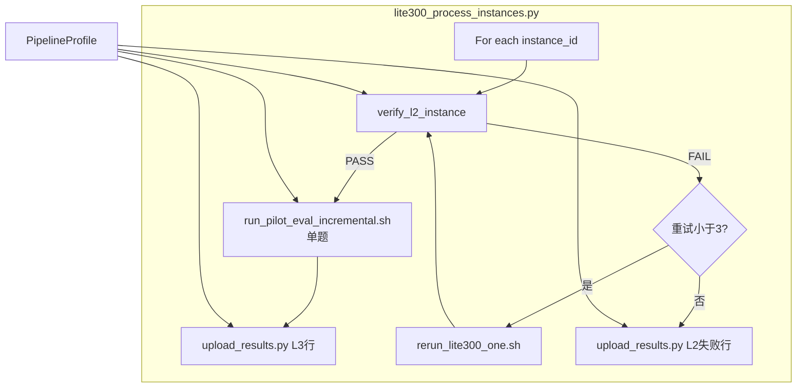

# Per-Instance Pipeline 复用指南

> **用途**：指导后续评测采用 **逐题** L2 verify → L3 或飞书 L2 失败上传 的标准流程，并通过 `PipelineProfile` 复用到 Baseline、ver1 或自定义题单。  
> **编排入口**：[`scripts/lite300_process_instances.py`](../scripts/lite300_process_instances.py)  
> **路径抽象**：[`scripts/lite300_instance_utils.py`](../scripts/lite300_instance_utils.py)  
> **飞书上传**：[`document/FEISHU_BITABLE_SERVER_PIPELINE.md`](FEISHU_BITABLE_SERVER_PIPELINE.md)

---

## 目录

1. [Per-instance vs Batch](#1-per-instance-vs-batch)
2. [架构与数据流](#2-架构与数据流)
3. [两个核心脚本职责](#3-两个核心脚本职责)
4. [PipelineProfile 与目录约定](#4-pipelineprofile-与目录约定)
5. [前置条件](#5-前置条件)
6. [标准运行命令](#6-标准运行命令)
7. [监控与排障](#7-监控与排障)
8. [与 Legacy Batch 的关系](#8-与-legacy-batch-的关系)
9. [相关文档索引](#9-相关文档索引)

---

## 1. Per-instance vs Batch

| 维度 | **Per-instance（推荐）** | Batch（Legacy，如 `run_sympy_ver1_eval.sh`） |
|------|--------------------------|---------------------------------------------|
| 粒度 | 每题 verify 后立即 L3 或飞书 | 全库 L2 → 全库 verify 门禁 → 全库 L3 → 批量飞书 |
| L2 失败 | 重试 3 次后 **立即上传飞书**（L2 Missing 等） | 通常 **不上传**，且 verify 失败则 **整库中断** |
| L2 部分成功 | 通过的题 **不等** 其余题即可 L3 | 必须 77/77（或 N/N）verify 通过才进 L3 |
| 断点续跑 | `instance_pipeline_terminal.json`（按 profile 隔离） | `eval_progress.json` |
| 适用场景 | 生产评测、ver1 实验、自定义题单 | 一次性全量复现（已不推荐用于 ver1） |

**结论**：后续 SymPy ver1、新实验版本、子集题单，应使用 **per-instance pipeline**，不要用 `run_sympy_ver1_eval.sh` 做 L3+飞书入口。

---

## 2. 架构与数据流



**脚本调用链：**

```
lite300_process_instances.py
  → verify_l2_instance.py          # 单题 L2 质检
  → run_pilot_eval_incremental.sh  # 单题 L3（EXPR_DIR/SYNC_DIR 来自 profile）
  → upload_results.py              # 飞书 upsert（--instance-id 或 --l2-failure）
  → rerun_lite300_one.sh           # L2 失败时单题重跑
```

---

## 3. 两个核心脚本职责

### 3.1 `verify_l2_instance.py` — 单题 L2 质检器

**输入**：`instance_id` + `expr_dir`（或由 `--pipeline-profile` 推导）

**检查项**：

1. 是否在 `predictions_for_swebench.json`
2. 是否在 `no_patch/` / `raw_patch_but_unparsed/`
3. 是否在 `applicable_patch/` 且含 `cost.json`、成功 `info.log`

**输出**：`L2VerifyResult(passed, category, message)`

**失败分类**（对应飞书「失败原因分类」）：

| 分类 | 含义 |
|------|------|
| `L2 Missing` | 无 prediction 或无 applicable_patch |
| `L2 No Patch` | 在 `no_patch/` |
| `L2 Unparsed` | 在 `raw_patch_but_unparsed/` 或 patch selection 未完成 |

**CLI 示例：**

```bash
python3 scripts/verify_l2_instance.py --instance-id sympy__sympy-11400 --pipeline-profile ver1
python3 scripts/verify_l2_instance.py --instance-id sympy__sympy-11400 --pipeline-profile ver1 --json
```

### 3.2 `lite300_process_instances.py` — 逐题编排器

对题单中每题：

1. 调用 `verify_l2_instance`
2. **PASS** → `run_l3` → `upsert_l3`（飞书单题 L3 结果）
3. **FAIL** → 最多 3 次 `rerun_lite300_one.sh` → 仍失败则 `upsert_l2_failure`

**状态文件**（按 profile 隔离，位于 `lite300_logs/profiles/{profile}/`）：

| 文件 | 用途 |
|------|------|
| `l2_retry_state.json` | 每题 L2 重试计数 |
| `instance_pipeline_terminal.json` | 已处理完成（L3+飞书 或 L2 终局失败）的 instance |
| `instance_pipeline.log` | 本 profile 运行日志（同时追加到 `lite300_logs/instance_pipeline.log`） |

---

## 4. PipelineProfile 与目录约定

### 4.1 内置 Profile

| Profile | `PIPELINE_PROFILE` | L2 实验目录 | L3 sync 目录 | 典型 `SYSTEM_VERSION` |
|---------|-------------------|------------|-------------|----------------------|
| baseline | `baseline`（默认） | `experiment/deepseek-lite-300/repos/{repo}` | `lite300_output/repos/{repo}` | `Baseline` |
| ver1 | `ver1` | `experiment/deepseek-lite-300-ver1/repos/{repo}` | `lite300_output_ver1/repos/{repo}` | `ver1` |
| ver1.1 | `ver1.1` | `experiment/deepseek-lite-300-ver1.1/repos/{repo}` | `lite300_output_ver1.1/repos/{repo}` | `ver1.1` |

### 4.2 Profile 解析优先级

1. CLI `--pipeline-profile`
2. 环境变量 `PIPELINE_PROFILE`
3. `SYSTEM_VERSION=ver1.1` → 自动选用 `ver1.1`；`SYSTEM_VERSION=ver1` → 自动选用 `ver1`
4. 默认 `baseline`

### 4.3 自定义实验目录

```bash
export PIPELINE_PROFILE=myexp
export PIPELINE_EXPERIMENT_PREFIX=experiment/my-custom/repos
export PIPELINE_SYNC_PREFIX=lite300_output_myexp/repos
export SYSTEM_VERSION=myexp
```

飞书表「系统版本」须预先添加 `myexp` 选项。

### 4.4 Python API（`lite300_instance_utils.py`）

```python
from lite300_instance_utils import (
    resolve_pipeline_profile,
    expr_dir_for_instance,
    sync_dir_for_instance,
    relative_expr_dir,
    load_task_ids,
)

profile = resolve_pipeline_profile("ver1")
expr = expr_dir_for_instance(ROOT, "sympy__sympy-11400", profile)
tasks = load_task_ids("conf/lite300_tasks/sympy.txt")
```

---

## 5. 前置条件

| 类别 | 要求 |
|------|------|
| Docker | 容器 `pengxm-acr-replicate`（或 `ACR_CONTAINER_NAME`）运行中 |
| 凭证 | `conf/.env`：`DEEPSEEK_API_KEY` + 飞书四元组 |
| 飞书 Schema | 「系统版本」含 `Baseline` / `ver1` / `ver1.1` / 自定义名；失败原因含 L2 三类 |
| L2 产出 | Per-instance **不替代首次全量 L2**；需先 batch L2 或依赖 orchestrator 的 L2 rerun |
| ver1 / ver1.1 L2 | 使用 `conf/deepseek-lite-300-ver1.{repo}.conf` 或 `conf/deepseek-lite-300-ver1.1.{repo}.conf`；rerun 时自动 `--enable-semantic-injection-ver1` |

---

## 6. 标准运行命令

### 6.1 Baseline 全量 Lite 300

```bash
bash scripts/start_lite300_instance_pipeline.sh
# 等价于
PIPELINE_PROFILE=baseline SYSTEM_VERSION=Baseline \
  python3 scripts/lite300_process_instances.py --system-version Baseline
```

### 6.2 SymPy ver1（77 题，L2 已有部分结果也可直接跑）

```bash
export PIPELINE_PROFILE=ver1
export SYSTEM_VERSION=ver1

python3 scripts/lite300_process_instances.py \
  --instances-file conf/lite300_tasks/sympy.txt \
  --system-version ver1 \
  --pipeline-profile ver1 \
  --reset-retry
```

### 6.3 Dry-run（验收路径，不上传飞书、不跑 Docker L3）

```bash
PIPELINE_PROFILE=ver1 python3 scripts/lite300_process_instances.py \
  --instances-file conf/lite300_tasks/sympy.txt \
  --system-version ver1 \
  --dry-run \
  --limit 3
```

### 6.4 单题 L2 重跑（手动）

```bash
PIPELINE_PROFILE=ver1 bash scripts/rerun_lite300_one.sh sympy__sympy-11400
```

### 6.5 后台 tmux 启动（Baseline）

```bash
PIPELINE_PROFILE=baseline USE_TMUX=1 bash scripts/start_lite300_instance_pipeline.sh
```

### 6.6 后台 tmux 启动（SymPy ver1，推荐）

```bash
bash scripts/start_ver1_sympy_instance_pipeline.sh
# attach: tmux attach -t ver1-sympy-instances
# 日志:   tail -f lite300_logs/profiles/ver1/instance_pipeline.log
```

ver1 脚本会自动：重置 profile 级 terminal/retry 状态、设置 `PIPELINE_PROFILE=ver1`，逐题完成 L2 verify/rerun → L3 → 飞书（L2 终局失败也会上传）。

Legacy nohup（无 tmux）：

```bash
USE_TMUX=0 bash scripts/start_ver1_sympy_instance_pipeline.sh
```

### 6.7 后台 tmux 启动（SymPy ver1.1，v2.2 pipeline）

```bash
bash scripts/start_ver1.1_sympy_instance_pipeline.sh
# attach: tmux attach -t ver1_1-sympy-instances
# 日志:   tail -f lite300_logs/profiles/ver1.1/instance_pipeline.log
```

ver1.1 脚本会自动：在**宿主机**创建 `lite300_output_ver1.1/repos/sympy`（避免 L3 `docker cp` permission denied）、经 Docker 创建 experiment 目录并 `chown` 为当前用户、重置 profile 级 terminal/retry 状态、设置 `PIPELINE_PROFILE=ver1.1` 与 `SYSTEM_VERSION=ver1.1`，对 77 题逐题完成 L2 verify/rerun → L3 → 飞书。

若 L3 评测已在 `experiment/` 完成但 sync/飞书失败，可执行：`bash scripts/repair_ver1.1_l3_sync_and_feishu.sh`

等价手动命令：

```bash
export PIPELINE_PROFILE=ver1.1
export SYSTEM_VERSION=ver1.1

python3 scripts/lite300_process_instances.py \
  --instances-file conf/lite300_tasks/sympy.txt \
  --system-version ver1.1 \
  --pipeline-profile ver1.1 \
  --reset-retry
```

---

## 7. 监控与排障

### 7.1 日志

```bash
# 按 profile
tail -f lite300_logs/profiles/ver1/instance_pipeline.log
tail -f lite300_logs/profiles/ver1.1/instance_pipeline.log

# 汇总（所有 profile 追加）
tail -f lite300_logs/instance_pipeline.log
```

### 7.2 进度

```bash
python3 scripts/lite300_status.py
# 单题 L2 状态
python3 scripts/verify_l2_instance.py --instance-id sympy__sympy-11400 --pipeline-profile ver1
```

### 7.3 飞书验收

- 筛选 `系统版本 = ver1` 或 `系统版本 = ver1.1`
- L3 完成题：`测试状态 = Resolved/Failed`
- L2 终局失败：`失败原因分类 = L2 Missing / L2 No Patch / L2 Unparsed`

### 7.4 常见问题

| 现象 | 原因 | 处理 |
|------|------|------|
| 飞书无 ver1 记录 | 误用 batch `run_sympy_ver1_eval.sh` 且在 verify 处退出 | 改用本指南 §6.2 |
| `SKIP ... missing expr dir` | 该 repo 的 L2 实验目录不存在 | 先跑 batch L2 或 `--reset-retry` 后 rerun |
| baseline/ver1 互相 skip | 旧版共用 terminal 文件 | 已按 profile 隔离至 `lite300_logs/profiles/{name}/` |
| L3 写到错误目录 | 未设 `PIPELINE_PROFILE` | 确认 `run_l3` 日志中 `EXPR_DIR=` 含 `-ver1` |

---

## 8. 与 Legacy Batch 的关系

| 脚本 | 状态 | 说明 |
|------|------|------|
| [`run_sympy_ver1_eval.sh`](../scripts/run_sympy_ver1_eval.sh) | Legacy batch | 仅适合「一次性全库 L2」；**不要**作为 L3+飞书入口 |
| [`run_sympy_ver1_gapfill_and_l3.sh`](../scripts/run_sympy_ver1_gapfill_and_l3.sh) | Legacy batch | 补跑 + batch L3；ver1 应用 per-instance 替代 |
| [`run_lite300_repo.sh`](../scripts/run_lite300_repo.sh) | Baseline batch | Baseline 单库 batch；Phase3 推荐 `run_lite300_phase3_l3_feishu.sh` → per-instance |
| [`run_lite300_phase3_l3_feishu.sh`](../scripts/run_lite300_phase3_l3_feishu.sh) | 包装器 | 调用 `start_lite300_instance_pipeline.sh` |

---

## 9. 相关文档索引

| 文档 | 内容 |
|------|------|
| [FEISHU_BITABLE_SERVER_PIPELINE.md](FEISHU_BITABLE_SERVER_PIPELINE.md) | 飞书 Schema、凭证、`upload_results.py` |
| [SERVER_REPLICATION_GUIDE.md](SERVER_REPLICATION_GUIDE.md) | 服务器复现总览 |
| [sympy_c_class_cross_case_knowledge.md](output_analysis/sympy/sympy_c_class_cross_case_knowledge.md) | ver1 语义注入与 SymPy 实验说明 |

---

*Per-instance pipeline：L2 verify 通过 → 单题 L3 → 飞书；L2 终局失败 → 飞书 L2 分类。通过 `PIPELINE_PROFILE` 复用 Baseline / ver1 / ver1.1 / 自定义题单。*
