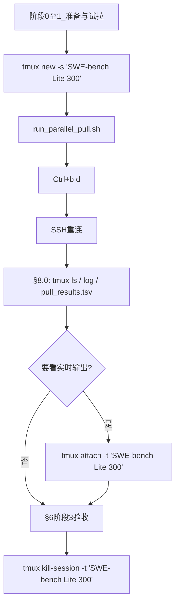

# SWE-bench Lite 300 评测镜像全量拉取计划（pengxm 服务器）

> **用途**：在组内 Linux 服务器上，为后续 **SWE-bench Lite 300 题 L3 Docker 评测** 预拉取全部所需镜像。  
> **当前状态（pengxm）**：✅ **83/83 镜像已就绪**（2026-06-01 验收通过，详见 §0）。  
> **后台运行**：全量/续拉请在 Tmux 会话 **`SWE-bench Lite 300`** 中执行；重连查进度见 §8.0，完成后关闭见 §8.3。  
> **评测工具链**：[`SWE-bench-docker`](../SWE-bench-docker/) + namespace **`autocoderover`**（与 [`scripts/run_eval_incremental.py`](../scripts/run_eval_incremental.py) 一致）。  
> **关联文档**：[SERVER_REPLICATION_GUIDE.md](SERVER_REPLICATION_GUIDE.md)（Docker 组规、镜像站、磁盘路径）。

---

## 0. 本机拉取进度（pengxm）

> **更新日期**：2026-06-01  
> **验收**：`swe_lite_pull/missing.txt` **0 行**；`docker images | grep autocoderover/swe-bench` 计数 **83**

| 阶段 | 时间 | 脚本 / 参数 | 结果 |
|------|------|-------------|------|
| 第一轮全量拉取 | 2026-05-31 17:56 – 19:36 | [`run_parallel_pull.sh`](../swe_lite_pull/run_parallel_pull.sh) · `PULL_JOBS=4` | OK **35** · SKIP **3** · FAIL **45**（Hub 超时） |
| 续拉缺失镜像 | 2026-05-31 22:10 – 2026-06-01 04:54 | [`retry_missing.sh`](../swe_lite_pull/retry_missing.sh) · `PULL_JOBS=2` · Round 1 | **45/45** 补齐 |
| §6 阶段 3 验收 | 2026-06-01 | `docker image inspect` 全清单 | **0 missing** |
| Tmux | 已关闭 | `tmux kill-session -t 'SWE-bench Lite 300'` | — |

**磁盘（验收时快照）**：`/datadisk` 可用约 **625 GB**；`docker system df` Images 约 **130 GB**（含 `experiment` 等）。

**日志与进度文件**：

| 文件 | 说明 |
|------|------|
| `swe_lite_pull/pull_all.log` | 第一轮 stdout |
| `swe_lite_pull/pull_retry.log` | 续拉 stdout |
| `swe_lite_pull/pull_results.tsv` | 第一轮每镜像 OK/FAIL/SKIP |
| `swe_lite_pull/missing.txt` | 验收输出（当前应为空） |
| `swe_lite_pull/logs/*.log` | 各镜像 `docker pull` 详情 |

**经验**：第一轮 4 路并行易触发 registry 超时；续拉改用 **2 路 + 内层重试**（`retry_missing.sh`）约 **6h45m** 补齐 45 个。若需再次续拉，直接重跑 `retry_missing.sh` 即可（已存在镜像自动跳过）。

---

## 1. 目标与范围

| 项 | 说明 |
|----|------|
| **数据集** | SWE-bench Lite，**300** 个 instance |
| **唯一 Docker 镜像** | **83** 个（非 300 个；多题共享 testbed） |
| **镜像命名** | `autocoderover/swe-bench-<repo>-testbed:<version>` 或 `...-instance:<instance_id>` |
| **拉取位置** | **宿主机 Docker daemon**（`data-root: /datadisk/docker/data`） |
| **不拉取** | Agent 实验镜像 `yuntongzhang/auto-code-rover:experiment`（约 57.6GB，L2 已具备） |

**为何在宿主机拉取：** L3 评测通过 `pengxm-acr-replicate` 挂载 `docker.sock`，嵌套 `docker run` 使用的是**宿主机本地镜像**。镜像拉在宿主机即可，**无需**导入实验容器内部。

---

## 2. 组内 Docker 管理规定（必须遵守）

摘自 [SERVER_REPLICATION_GUIDE.md §组规](SERVER_REPLICATION_GUIDE.md)：

1. **持久容器命名**：必须以用户名/缩写开头，例如 **`pengxm-acr-replicate`**。  
   - 本计划**不新建**无名或他人前缀的 sleep 容器。  
   - 拉取任务在**宿主机 shell** 执行，不额外 `docker run -d` 常驻容器。

2. **数据落盘位置**：日志、进度、镜像清单等写入个人目录：  
   **`/datadisk/pengxm/auto-code-rover/`**（bind mount 到容器 `/workspace/acr`）。

3. **镜像存储**：Docker 镜像由 daemon 写入 **`/datadisk/docker/data`**（`daemon.json` 的 `data-root`），已符合「个人盘 `/datadisk`」要求。

4. **避免被清理**：  
   - 勿在 `/tmp` 仅存进度；使用 `document/`、`logs/` 或项目根下 `swe_lite_pull/`。  
   - 拉取完成后用 `docker images | grep autocoderover` 验收，必要时 `docker save` 备份 tar 至 `/datadisk/pengxm/`。

---

## 3. 镜像清单概览

### 3.1 数量结构（基于 `/opt/SWE-bench` + SWE-bench-docker 命名规则）

| 类型 | 数量 | 说明 |
|------|------|------|
| Lite 实例 | **300** | 官方 Lite 子集 |
| **唯一镜像合计** | **83** | 实际需 `docker pull` 的次数 |
| testbed 共享镜像 | **60** | 277 题共用（按 repo+version） |
| instance 级镜像 | **23** | 主要为 scikit-learn 每题一镜像 |

### 3.2 完整 83 镜像列表

```
autocoderover/swe-bench-astropy_astropy-testbed:1.3
autocoderover/swe-bench-astropy_astropy-testbed:4.3
autocoderover/swe-bench-astropy_astropy-testbed:5.1
autocoderover/swe-bench-astropy_astropy-testbed:5.2
autocoderover/swe-bench-django_django-testbed:3.0
autocoderover/swe-bench-django_django-testbed:3.1
autocoderover/swe-bench-django_django-testbed:3.2
autocoderover/swe-bench-django_django-testbed:4.0
autocoderover/swe-bench-django_django-testbed:4.1
autocoderover/swe-bench-django_django-testbed:4.2
autocoderover/swe-bench-django_django-testbed:5.0
autocoderover/swe-bench-matplotlib_matplotlib-testbed:3.3
autocoderover/swe-bench-matplotlib_matplotlib-testbed:3.5
autocoderover/swe-bench-matplotlib_matplotlib-testbed:3.6
autocoderover/swe-bench-matplotlib_matplotlib-testbed:3.7
autocoderover/swe-bench-mwaskom_seaborn-testbed:0.12
autocoderover/swe-bench-mwaskom_seaborn-testbed:0.13
autocoderover/swe-bench-pallets_flask-testbed:2.0
autocoderover/swe-bench-pallets_flask-testbed:2.3
autocoderover/swe-bench-psf_requests-testbed:0.14
autocoderover/swe-bench-psf_requests-testbed:2.10
autocoderover/swe-bench-psf_requests-testbed:2.3
autocoderover/swe-bench-psf_requests-testbed:2.4
autocoderover/swe-bench-psf_requests-testbed:2.7
autocoderover/swe-bench-pydata_xarray-testbed:0.12
autocoderover/swe-bench-pylint-dev_pylint-testbed:2.13
autocoderover/swe-bench-pylint-dev_pylint-testbed:2.14
autocoderover/swe-bench-pylint-dev_pylint-testbed:2.15
autocoderover/swe-bench-pytest-dev_pytest-testbed:4.4
autocoderover/swe-bench-pytest-dev_pytest-testbed:4.5
autocoderover/swe-bench-pytest-dev_pytest-testbed:4.6
autocoderover/swe-bench-pytest-dev_pytest-testbed:5.0
autocoderover/swe-bench-pytest-dev_pytest-testbed:5.2
autocoderover/swe-bench-pytest-dev_pytest-testbed:5.4
autocoderover/swe-bench-pytest-dev_pytest-testbed:6.0
autocoderover/swe-bench-pytest-dev_pytest-testbed:6.3
autocoderover/swe-bench-pytest-dev_pytest-testbed:7.0
autocoderover/swe-bench-pytest-dev_pytest-testbed:8.0
autocoderover/swe-bench-scikit-learn_scikit-learn-instance:scikit-learn__scikit-learn-10297
autocoderover/swe-bench-scikit-learn_scikit-learn-instance:scikit-learn__scikit-learn-10508
autocoderover/swe-bench-scikit-learn_scikit-learn-instance:scikit-learn__scikit-learn-10949
autocoderover/swe-bench-scikit-learn_scikit-learn-instance:scikit-learn__scikit-learn-11040
autocoderover/swe-bench-scikit-learn_scikit-learn-instance:scikit-learn__scikit-learn-11281
autocoderover/swe-bench-scikit-learn_scikit-learn-instance:scikit-learn__scikit-learn-12471
autocoderover/swe-bench-scikit-learn_scikit-learn-instance:scikit-learn__scikit-learn-13142
autocoderover/swe-bench-scikit-learn_scikit-learn-instance:scikit-learn__scikit-learn-13241
autocoderover/swe-bench-scikit-learn_scikit-learn-instance:scikit-learn__scikit-learn-13439
autocoderover/swe-bench-scikit-learn_scikit-learn-instance:scikit-learn__scikit-learn-13496
autocoderover/swe-bench-scikit-learn_scikit-learn-instance:scikit-learn__scikit-learn-13497
autocoderover/swe-bench-scikit-learn_scikit-learn-instance:scikit-learn__scikit-learn-13584
autocoderover/swe-bench-scikit-learn_scikit-learn-instance:scikit-learn__scikit-learn-13779
autocoderover/swe-bench-scikit-learn_scikit-learn-instance:scikit-learn__scikit-learn-14087
autocoderover/swe-bench-scikit-learn_scikit-learn-instance:scikit-learn__scikit-learn-14092
autocoderover/swe-bench-scikit-learn_scikit-learn-instance:scikit-learn__scikit-learn-14894
autocoderover/swe-bench-scikit-learn_scikit-learn-instance:scikit-learn__scikit-learn-14983
autocoderover/swe-bench-scikit-learn_scikit-learn-instance:scikit-learn__scikit-learn-15512
autocoderover/swe-bench-scikit-learn_scikit-learn-instance:scikit-learn__scikit-learn-15535
autocoderover/swe-bench-scikit-learn_scikit-learn-instance:scikit-learn__scikit-learn-25500
autocoderover/swe-bench-scikit-learn_scikit-learn-instance:scikit-learn__scikit-learn-25570
autocoderover/swe-bench-scikit-learn_scikit-learn-instance:scikit-learn__scikit-learn-25638
autocoderover/swe-bench-scikit-learn_scikit-learn-instance:scikit-learn__scikit-learn-25747
autocoderover/swe-bench-sphinx-doc_sphinx-testbed:3.1
autocoderover/swe-bench-sphinx-doc_sphinx-testbed:3.2
autocoderover/swe-bench-sphinx-doc_sphinx-testbed:3.3
autocoderover/swe-bench-sphinx-doc_sphinx-testbed:3.4
autocoderover/swe-bench-sphinx-doc_sphinx-testbed:3.5
autocoderover/swe-bench-sphinx-doc_sphinx-testbed:4.0
autocoderover/swe-bench-sphinx-doc_sphinx-testbed:5.0
autocoderover/swe-bench-sphinx-doc_sphinx-testbed:5.1
autocoderover/swe-bench-sphinx-doc_sphinx-testbed:7.1
autocoderover/swe-bench-sympy_sympy-testbed:1.0
autocoderover/swe-bench-sympy_sympy-testbed:1.1
autocoderover/swe-bench-sympy_sympy-testbed:1.10
autocoderover/swe-bench-sympy_sympy-testbed:1.11
autocoderover/swe-bench-sympy_sympy-testbed:1.12
autocoderover/swe-bench-sympy_sympy-testbed:1.13
autocoderover/swe-bench-sympy_sympy-testbed:1.2
autocoderover/swe-bench-sympy_sympy-testbed:1.4
autocoderover/swe-bench-sympy_sympy-testbed:1.5
autocoderover/swe-bench-sympy_sympy-testbed:1.6
autocoderover/swe-bench-sympy_sympy-testbed:1.7
autocoderover/swe-bench-sympy_sympy-testbed:1.8
autocoderover/swe-bench-sympy_sympy-testbed:1.9
```

清单文件建议保存为：  
`swe_lite_pull/autocoderover_lite_83_images.txt`（一行一个 `repo:tag`）。

重新生成清单（在 **`pengxm-acr-replicate` 已启动** 时）：

```bash
docker exec pengxm-acr-replicate bash -lc '
  source /root/miniconda3/etc/profile.d/conda.sh && conda activate auto-code-rover
  python3 /workspace/acr/scripts/generate_lite_image_list.py   # 若后续添加脚本
'
```

或参考本文 §3.2 静态列表。

---

## 4. 磁盘与时间估算

### 4.1 磁盘（2026-05-31 本机快照）

| 项 | 数值 |
|----|------|
| `/datadisk` 可用 | **~688 GB** |
| 已有 Docker 镜像 | ~68 GB（含 experiment 57.6 GB） |
| Lite 83 镜像预估（层共享后） | **~80–180 GB** |
| 评测日志 + 300 题 Agent 产物 | ~5–20 GB（与 L2 规模有关） |
| **建议预留** | **≥200 GB** 可用（当前 688 GB **足够**） |

> 若与 `prune_eval_images.sh` 交替使用，峰值可更低；**全量预拉并保留**时按上限规划。

### 4.2 拉取时间（基于本机 pilot 实测）

| 场景 | 单镜像耗时（经验） | 83 镜像总耗时（顺序） | 并行度 4 |
|------|-------------------|----------------------|----------|
| 乐观（镜像站稳定、小 testbed） | 3–8 min | 4–11 h | **1–3 h** |
| 中性 | 10–20 min | 14–28 h | **4–7 h** |
| 悲观（Hub 拒绝连接、大镜像 matplotlib/django） | 30–90 min | 1–3 天 | **8–18 h** |

本机曾观测：`matplotlib` testbed 单次拉取 **~90 分钟**；`sympy` testbed 在缓存后 **数秒**。

---

## 5. 并行拉取策略

### 5.1 原则

| 原则 | 说明 |
|------|------|
| **在宿主机拉** | 不进入实验容器；避免无用户名前缀的临时容器 |
| **限制并发** | 推荐 **3–4** 路并行；过高易触发 Hub/镜像站限速、`connection refused` |
| **同仓库串行优先** | 同一 `repo` 的 testbed 层可共享，先拉该 repo **最大/最全**版本有时减少重复（可选优化） |
| **禁止同 tag 双 pull** | 同一镜像不要两个进程同时拉 |
| **与 L3 eval 错开** | 全量拉取期间勿同时跑 `run_pilot_eval_incremental.sh`（会抢带宽并 prune 镜像） |
| **scikit-learn instance 可并行** | 23 个 instance 镜像相互独立，适合作为并行 batch |

### 5.2 推荐分批（4 路并行示例）

```text
Batch A（django + sphinx，层较大）     → 并行度 2
Batch B（sympy + pytest）              → 并行度 4
Batch C（matplotlib + astropy + …）   → 并行度 3
Batch D（scikit-learn 23 instance）   → 并行度 4，分 6 轮
```

### 5.3 并行拉取脚本模板（宿主机执行）

工作目录：`/datadisk/pengxm/auto-code-rover`

```bash
mkdir -p swe_lite_pull/logs
cd /datadisk/pengxm/auto-code-rover

# 环境：并发数、超时（秒）、清单
export PULL_JOBS=4
export PULL_TIMEOUT=7200          # 单镜像 2h 超时
export IMAGE_LIST=swe_lite_pull/autocoderover_lite_83_images.txt
export RESULTS=swe_lite_pull/pull_results.tsv
export MAIN_LOG=swe_lite_pull/pull_all.log

# 使用 GNU parallel 或 xargs -P（二选一）
pull_one() {
  local img="$1"
  local log="swe_lite_pull/logs/$(echo "$img" | tr '/:' '__').log"
  if docker image inspect "$img" &>/dev/null; then
    echo "[SKIP] $img"
    return 0
  fi
  echo "[START] $(date -Iseconds) $img"
  if timeout "$PULL_TIMEOUT" docker pull "$img" >>"$log" 2>&1; then
    echo "[OK] $img"
    return 0
  else
    echo "[FAIL] $img (see $log)"
    return 1
  fi
}
export -f pull_one

# 并行拉取（跳过已存在）
grep -v '^#' "$IMAGE_LIST" | xargs -P "$PULL_JOBS" -I {} bash -c 'pull_one "$@"' _ {}
```

**进度记录：** 每成功/失败/跳过一行追加到 `swe_lite_pull/pull_results.tsv`（`status\timage\ttimestamp`），与 [`swe_lite_pull/run_parallel_pull.sh`](../swe_lite_pull/run_parallel_pull.sh) 一致，便于断点续拉。

### 5.4 使用 Tmux 后台运行（推荐）

全量拉取预计 **4–18 小时**（§4.2），SSH 断开会导致前台 shell 中的 `docker pull` 被终止。使用 **Tmux** 可在断开连接后任务继续运行，且日志同时写入 `swe_lite_pull/pull_all.log`。

**阶段划分建议**：阶段 0/1（准备与试拉）可在普通 SSH 会话完成；**阶段 2 全量拉取**再放入 Tmux。

**创建会话并启动拉取**（会话名含空格，命令须用单引号）：

```bash
cd /datadisk/pengxm/auto-code-rover

# 确认无同名会话；若存在且已废弃：tmux kill-session -t 'SWE-bench Lite 300'
tmux ls

tmux new-session -s 'SWE-bench Lite 300'

# 进入 tmux 后执行
bash swe_lite_pull/run_parallel_pull.sh 2>&1 | tee -a swe_lite_pull/pull_all.log
```

**从 Tmux 中安全脱离（不断开拉取）**

- 快捷键：先按 `Ctrl+b`，再按 `d`（detach）
- 脱离后可直接关闭 SSH 窗口，拉取仍在服务器上继续

**流程概览**



---

## 6. 执行流程（Checklist）

### 阶段 0：准备

- [x] 确认 `/datadisk` 可用 **≥200 GB**
- [x] 确认 `docker info` 中 **Registry Mirrors** 已配置
- [x] 确认 **`pengxm-acr-replicate`** 运行中（仅用于生成清单/验证；拉取在宿主机）
- [x] 创建 `swe_lite_pull/` 目录，写入 §3.2 镜像清单
- [x] **停止**正在进行的 L3 eval / 其他 `docker pull`，避免并行冲突

### 阶段 1：试拉 1 个小 + 1 个大镜像

```bash
time docker pull autocoderover/swe-bench-sympy_sympy-testbed:1.1
time docker pull autocoderover/swe-bench-matplotlib_matplotlib-testbed:3.5
```

记录耗时，用于修正 §4.2 总时间预估。（2026-05-31 第一轮前已隐含完成。）

### 阶段 2：全量并行拉取（Tmux 后台）

- [x] 创建并进入 Tmux 会话：`tmux new-session -s 'SWE-bench Lite 300'`
- [x] 在会话内执行：`bash swe_lite_pull/run_parallel_pull.sh 2>&1 | tee -a swe_lite_pull/pull_all.log`（完整步骤见 §5.4）
- [x] Detach：`Ctrl+b` 然后 `d`
- [x] 第一轮 45 个 FAIL 后，续拉：`bash swe_lite_pull/retry_missing.sh 2>&1 | tee -a swe_lite_pull/pull_retry.log`（见 §8.2）
- [x] SSH 重连后查进度：见 §8.0
- [x] 验收通过后关闭会话：见 §8.3

### 阶段 3：验收

```bash
# 应为 83（或已拉 subset 数）
grep -v '^#' swe_lite_pull/autocoderover_lite_83_images.txt | while read img; do
  docker image inspect "$img" &>/dev/null || echo "$img"
done | tee swe_lite_pull/missing.txt

wc -l swe_lite_pull/missing.txt   # 目标：0  ← 2026-06-01 已为 0

docker system df
df -h /datadisk
```

- [x] `missing.txt` 行数为 **0**（2026-06-01）
- [x] `docker images ... | grep -c autocoderover/swe-bench` 为 **83**

### 阶段 4：与实验环境衔接

镜像已在宿主机后，**无需导入** `pengxm-acr-replicate`：

```bash
# 容器内评测会自动使用宿主机镜像（docker.sock）
docker exec pengxm-acr-replicate bash -lc '
  docker images | grep autocoderover | head
'
```

后续 Lite 300 L3：

1. 使用 [`run_pilot_eval_incremental.sh`](../scripts/run_pilot_eval_incremental.sh)（**默认保留**预拉镜像；见 [SERVER_REPLICATION_GUIDE.md §6.4](SERVER_REPLICATION_GUIDE.md)）。  
2. 评测时镜像已本地缓存，启动为 **秒级/分钟级**（无 pull 等待）。

---

## 7. 异常与对策

### 7.1 镜像站波动 / Hub 不可达

| 现象 | 原因 | 处理 |
|------|------|------|
| `connection refused` / `timeout` | 直连 `registry-1.docker.io` 失败 | 检查 `/etc/docker/daemon.json` 的 `registry-mirrors`；`sudo systemctl restart docker`（注意影响运行中容器） |
| 长时间无 layer 进度 | 镜像站未命中 `autocoderover/*` | 换时段（凌晨）；或配置 daemon **HTTP 代理** |
| `short read: unexpected EOF` | 网络中断 | **原命令重试** `docker pull`；已下载层会缓存 |
| 同一镜像两个 pull 卡住 | 并行冲突 | 杀掉重复进程，单进程重拉 |

### 7.2 超时

| 策略 | 说明 |
|------|------|
| `timeout 7200 docker pull ...` | 单镜像 2h 上限，超时记 FAIL，稍后 `--resume` |
| 降低 `PULL_JOBS` | 4 → 2，减少带宽争抢 |
| 失败队列重跑 | 使用 [`retry_missing.sh`](../swe_lite_pull/retry_missing.sh)，或 `grep FAIL pull_results.tsv \| cut -f2` 手动 pull |

### 7.3 磁盘不足

```bash
docker system df
# 勿删 yuntongzhang/auto-code-rover:experiment
# 可删：已无用的 sweb.eval 中间镜像、其他用户无关镜像（需自行确认）
```

### 7.4 拉取与组规冲突项

| 不要做 | 应做 |
|--------|------|
| `docker run -d` 无名容器做 pull | 宿主机 `docker pull` |
| 容器名 `acr-pull-temp` | 无需新容器；若必须跑脚本容器，用 `pengxm-acr-pull-helper` 等 |
| 日志只放 `/tmp` | 日志放 `/datadisk/pengxm/auto-code-rover/swe_lite_pull/` |

### 7.5 与 L3 incremental 脚本的交互

- [`scripts/prune_eval_images.sh`](../scripts/prune_eval_images.sh)：**默认**仅删除 `sweb.eval` 容器/镜像；**保留** `autocoderover/*`（与 [`run_eval_incremental.py`](../scripts/run_eval_incremental.py) 默认行为一致）。  
- 若需旧版「每题删 testbed」：`run_pilot_eval_incremental.sh --prune-preloaded-images`。

---

## 8. 监控、Tmux 重连与断点续拉

### 8.0 SSH 重连后查看拉取进度

SSH 断开后重新登录服务器，**无需 attach Tmux** 即可判断进度：

| 步骤 | 命令 | 说明 |
|------|------|------|
| 1 | `tmux ls` | 确认会话 **`SWE-bench Lite 300`** 仍在（`(attached)` 或 `(detached)` 均可） |
| 2 | `cd /datadisk/pengxm/auto-code-rover && tail -n 30 swe_lite_pull/pull_all.log` | 查看最近拉取输出 |
| 3 | `grep -c '^OK' swe_lite_pull/pull_results.tsv; grep -c '^FAIL' swe_lite_pull/pull_results.tsv; grep -c '^SKIP' swe_lite_pull/pull_results.tsv` | 成功 / 失败 / 跳过计数（OK+SKIP+FAIL 趋近 83） |
| 4 | `pgrep -cf 'docker pull autocoderover'` | 当前并行 `docker pull` 进程数（0 表示可能已跑完或卡住） |
| 5 | `docker images --format '{{.Repository}}:{{.Tag}}' \| grep -c '^autocoderover/swe-bench'` | 本地已有 swe-bench 镜像数 |

**进入会话看实时输出**：

```bash
tmux attach -t 'SWE-bench Lite 300'
# 看完后再次 detach（不中断拉取）：Ctrl+b 然后 d
```

**如何判断拉取已结束**

- Tmux 内最后一行出现 `Done. Results: .../pull_results.tsv`
- 且 `pgrep -cf 'docker pull autocoderover'` 为 0，日志无新 `[START]` 行
- 然后执行 §6 阶段 3 验收（`missing.txt` 行数为 0）

### 8.1 监控命令

日常 SSH 重连优先看 §8.0 表格；需要持续跟踪时使用：

```bash
cd /datadisk/pengxm/auto-code-rover

# 总日志（实时）
tail -f swe_lite_pull/pull_all.log

# 当前并行 pull 数
pgrep -cf 'docker pull autocoderover'

# 已拉数量
docker images --format '{{.Repository}}:{{.Tag}}' | grep -c '^autocoderover/swe-bench'

# 磁盘
watch -n 60 'df -h /datadisk; docker system df'
```

### 8.2 断点续拉

**推荐（无人值守 8h+）**：[`swe_lite_pull/retry_missing.sh`](../swe_lite_pull/retry_missing.sh) — 外层循环 + 每镜像最多 8 次重试，默认 `PULL_JOBS=2`：

```bash
cd /datadisk/pengxm/auto-code-rover
tmux new-session -d -s 'SWE-bench Lite 300' \
  'bash swe_lite_pull/retry_missing.sh 2>&1 | tee -a swe_lite_pull/pull_retry.log'
```

续拉进度看 `pull_retry.log`；单镜像 layer 进度看 `swe_lite_pull/logs/<镜像>.log`（`pull_retry.log` 在长时间 pull 期间可能无新行，属正常）。

**手动单轮**（仅拉 `missing.txt`，每行一个 `repo:tag`）：

```bash
cd /datadisk/pengxm/auto-code-rover

while read img; do
  [[ -z "$img" ]] && continue
  docker image inspect "$img" &>/dev/null && continue
  echo "Pulling $img ..."
  timeout 7200 docker pull "$img" || echo "FAILED: $img"
done < swe_lite_pull/missing.txt
```

若 `missing.txt` 仍为旧格式（`MISSING: repo:tag`），先提取镜像名：

```bash
grep -oP '(?<=MISSING: ).+' swe_lite_pull/missing.txt > swe_lite_pull/missing_images.txt
# 续拉时改用 missing_images.txt
```

### 8.3 拉取完成后关闭 Tmux 会话

§6 阶段 3 验收通过（`missing.txt` 行数为 0）后：

```bash
cd /datadisk/pengxm/auto-code-rover
wc -l swe_lite_pull/missing.txt          # 应为 0

# 若仍 attach 在会话内：输入 exit 或 Ctrl+d 退出 shell

tmux kill-session -t 'SWE-bench Lite 300'
tmux ls                                   # 不应再列出 SWE-bench Lite 300
```

**说明**

- `kill-session` 只结束 Tmux 会话，**不会删除**已写入 `/datadisk/docker/data` 的 Docker 镜像
- 拉取**未完成**时不要 `kill-session`，否则会中断正在进行的 `docker pull`；中断后用 §8.2 续拉
- 日志在 `swe_lite_pull/pull_all.log` 与 `swe_lite_pull/logs/`，关闭 Tmux 不影响

---

## 9. 可选：备份与迁移

```bash
# 导出全部 autocoderover 镜像（体积大，可选）
docker images --format '{{.Repository}}:{{.Tag}}' | grep '^autocoderover/' \
  | xargs docker save -o /datadisk/pengxm/swe_lite_autocoderover_images.tar

# 恢复
docker load -i /datadisk/pengxm/swe_lite_autocoderover_images.tar
```

---

## 10. 完成后下一步

1. ~~更新 [SERVER_REPLICATION_GUIDE.md](SERVER_REPLICATION_GUIDE.md) §0 进度（Lite 300 镜像就绪）。~~ → **待做**（本仓库 §0 已记录完成）。  
2. 配置 Lite 300 Agent 实验（扩展 `conf/` 任务列表与 `experiment_dir`）。  
3. 运行 L3 评测（可基于 [`run_pilot_eval_incremental.sh`](../scripts/run_pilot_eval_incremental.sh) 扩展为 Lite 300 版）；**评测前注意** [`prune_eval_images.sh`](../scripts/prune_eval_images.sh) 会删除 `autocoderover/*`。  
4. 填写 `document/Replication_Report.md`。

---

## 11. 附录：Pilot 10 与 Lite 83 的关系

Pilot 10 题仅为 Lite 300 的子集，所需 **9** 个唯一镜像均包含在上述 **83** 个中。完成 Lite 全量拉取后，Pilot L3 所需镜像一并满足。

---

## 参考文献

- [SWE-bench-docker README](../SWE-bench-docker/README.md) — Pull Docker images 章节  
- [SERVER_REPLICATION_GUIDE.md §9.1](SERVER_REPLICATION_GUIDE.md) — Docker 镜像拉取故障  
- AutoCodeRover 复现 L3 脚本：[`run_pilot_eval_incremental.sh`](../scripts/run_pilot_eval_incremental.sh)
