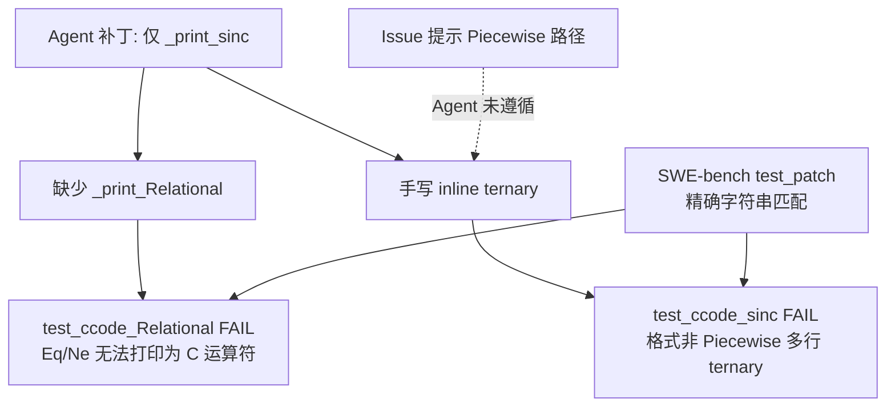

# 单案诊断临床报告：sympy__sympy-11400

> **分类**: C 类（Logic/Assertion Failure）  
> **模型**: deepseek-deepseek-chat  
> **任务目录**: `lite300_output/repos/sympy/applicable_patch/sympy__sympy-11400_2026-06-01_15-41-58/`  
> **评测结果**: L2 PASS → L3 FAIL（30 passed, 2 failed）

---

## 1. 原始问题快照 (Issue Snapshot)

### 1.1 Issue 原文

````text
ccode(sinc(x)) doesn't work
```
In [30]: ccode(sinc(x))
Out[30]: '// Not supported in C:\n// sinc\nsinc(x)'
```

I don't think `math.h` has `sinc`, but it could print

```
In [38]: ccode(Piecewise((sin(theta)/theta, Ne(theta, 0)), (1, True)))
Out[38]: '((Ne(theta, 0)) ? (\n   sin(theta)/theta\n)\n: (\n   1\n))'
```
````

> 来源：[`problem_statement.txt`](../../../lite300_output/repos/sympy/applicable_patch/sympy__sympy-11400_2026-06-01_15-41-58/problem_statement.txt)

### 1.2 核心诉求概括

| 维度 | 内容 |
|------|------|
| **报告了什么 Bug** | SymPy 的 C 代码打印器 `ccode()` 无法正确处理 `sinc(x)`，输出 `// Not supported in C` 注释而非可编译 C 表达式 |
| **数学/逻辑期望** | `sinc(x)` 在 \(x \neq 0\) 时为 \(\sin(x)/x\)，在 \(x = 0\) 时为 1；C 标准库 `math.h` 无 `sinc`，应生成等价的分段/条件表达式 |
| **Issue 给出的线索** | Reporter 演示了 `Piecewise((sin(θ)/θ, Ne(θ, 0)), (1, True))` 可被 `ccode` 打印为嵌套三元运算符，暗示修复方向是 **将 sinc 降维为 Piecewise** |
| **实际输出** | `'// Not supported in C:\n// sinc\nsinc(x)'` — 完全未翻译 |

---

## 2. Agent 运行轨迹与思维链追踪 (Agent Trajectory & CoT Analysis)

### 2.1 整体运行概况

Agent 共经历 **3 次 overall retry**（retry 0、1 失败，retry 2 成功产出补丁并通过 reviewer）：

| Retry | 检索结果 | Patch 结果 |
|-------|----------|------------|
| 0 | 10 轮检索耗尽，`bug_locations: []` | 3 次 write_patch 均失败，abort |
| 1 | 10 轮检索耗尽，`bug_locations: []` | 3 次 write_patch 均失败，abort |
| **2** | **5 轮检索后锚定 `ccode.py`** | conv_patch_0（known_functions 格式串）→ conv_patch_1（`_print_sinc`）→ **reviewer-approved** |

> 来源：[`info.log`](../../../lite300_output/repos/sympy/applicable_patch/sympy__sympy-11400_2026-06-01_15-41-58/info.log)

### 2.2 Stage 1 工具调用时序（Retry 2，最终成功轮）

| 轮次 | Agent 思维摘要 | API 调用序列 |
|------|----------------|--------------|
| **R0** | 搜索 ccode 与 sinc 相关代码 | `search_code("ccode(sinc")` · `search_code("def ccode")` · `search_class("CCodePrinter")` · `search_code("sinc")` |
| **R1** | 分析 CCodePrinter 如何处理函数 | `search_method_in_class("_print_Function", "CodePrinter")` · `search_code_in_file("def _print_Function", "codeprinter.py")` · `search_code_in_file("known_functions", "ccode.py")` · `search_code_in_file("sinc", "ccode.py")` |
| **R2** | 查看 sinc 类定义与 known_functions | `search_code_in_file("class sinc", "trigonometric.py")` · `get_code_around_line("ccode.py", 1, 30)` · `search_code_in_file("known_functions", "ccode.py")` |
| **R3** | 深入 known_functions 与 _print_Function | `get_code_around_line("ccode.py", 25, 80)` · `search_code_in_file("def _print_Function", "codeprinter.py")` |
| **R4** | 判定上下文足够，输出 bug_locations | （无新 API 调用） |

> 来源：[`output_2/search/search_round_4.json`](../../../lite300_output/repos/sympy/applicable_patch/sympy__sympy-11400_2026-06-01_15-41-58/output_2/search/search_round_4.json)

### 2.3 最终锚定的 Fault Location

Agent 在 R4 输出两处 bug location（处理后写入 [`bug_locations_after_process.json`](../../../lite300_output/repos/sympy/applicable_patch/sympy__sympy-11400_2026-06-01_15-41-58/output_2/search/bug_locations_after_process.json)）：

| # | 文件 | 类/位置 | 锚定 intended_behavior |
|---|------|---------|------------------------|
| 1 | `sympy/printing/ccode.py` | 模块级 `known_functions` 字典（~L25） | 添加 `"sinc"` 映射为 `((x == 0) ? 1 : sin(x)/x)` |
| 2 | `sympy/printing/ccode.py` | `CCodePrinter` / `_print_Function` 机制 | 通过 known_functions 让 `_print_Function` 自动处理 sinc |

**文件级定位：正确**（与 Ground Truth 一致，均为 `sympy/printing/ccode.py`）。  
**方法级定位：部分正确** — 最终补丁确实新增了 `_print_sinc`，但锚定策略指向 `known_functions`，与 GT 的 Piecewise 委托路径不同。

### 2.4 定位评估与认知偏差

**Agent 找对地方了吗？**  
- **是**，在文件层面；SymPy 的 C 打印逻辑确实在 `CCodePrinter` 中缺少对 `sinc` 的处理。  
- **否**，在修复策略层面；Issue 已明示 Piecewise 范例，Agent 却选择了 `known_functions` + 手写 C 三元表达式。

**思维链中的关键认知偏差：**

1. **忽略 Issue 中的架构线索**  
   Issue 展示 `ccode(Piecewise(..., Ne(...), ...))` 的输出格式，但 Agent 将其理解为"数学上等价即可"，而非"应复用 Piecewise 打印路径"。同类代码 `_print_ITE`（L216–219）已将 ITE 降维为 Piecewise 再委托 `_print`，Agent 检索时未关联此模式。

2. **误解 `known_functions` 机制**  
   conv_patch_0 尝试 `"sinc": "((%s == 0) ? 1 : sin(%s)/%s)"`，Agent 假设 `_print_Function` 会做 `%s` 替换；实际上 known_functions 的值只能是 **C 函数名字符串**或 **条件映射列表**，不支持内联表达式模板。Reviewer 反馈后才改为 `_print_sinc`。

3. **未识别 `_print_Relational` 依赖**  
   sinc 的正确实现需要 `Ne(x, 0)` 打印为 `x != 0`。Agent 全程未检索 `_print_Relational` 或 `Relational` 相关打印逻辑，导致补丁范围不足。

4. **混淆"数学等价"与"输出格式契约"**  
   Agent 认为 `((x == 0) ? 1 : sin(x)/x)` 与 `((x != 0) ? sin(x)/x : 1)` 数学等价即可通过测试；SWE-bench 测试要求 **字符串精确匹配** Piecewise 多行格式。

5. **自生成 reproducer 过于宽松**  
   Agent 的 conv_patch 反馈 reproducer 只检查"不含 Not supported"和"含 sin"，未约束输出格式，使错误补丁通过了内部 reviewer。

---

## 3. 失败补丁解剖 (Failed Patch Dissection)

### 3.1 完整失败补丁

来源：[`output_2/extracted_patch_1.diff`](../../../lite300_output/repos/sympy/applicable_patch/sympy__sympy-11400_2026-06-01_15-41-58/output_2/extracted_patch_1.diff)

```diff
diff --git a/sympy/printing/ccode.py b/sympy/printing/ccode.py
index 30a07a7b59..568bb1316c 100644
--- a/sympy/printing/ccode.py
+++ b/sympy/printing/ccode.py
@@ -248,6 +248,10 @@ def _print_For(self, expr):
                 '{step}) {{\n{body}\n}}').format(target=target, start=start,
                 stop=stop, step=step, body=body)
 
+    def _print_sinc(self, expr):
+        arg = self._print(expr.args[0])
+        return '(({0} == 0) ? 1 : sin({0})/{0})'.format(arg)
+
     def _print_sign(self, func):
         return '((({0}) > 0) - (({0}) < 0))'.format(self._print(func.args[0]))
```

等价 Python 代码：

```python
def _print_sinc(self, expr):
    arg = self._print(expr.args[0])
    return '(({0} == 0) ? 1 : sin({0})/{0})'.format(arg)
```

### 3.2 逐行白话解释

| 行 | 代码 | 解释 |
|----|------|------|
| L1 | `def _print_sinc(self, expr):` | 为 SymPy 的 `sinc` 函数类注册专用打印方法；SymPy Printer 通过 `_print_<ClassName>` 分发，`sinc(x)` 会路由到此方法而非默认的 unsupported 路径 |
| L2 | `arg = self._print(expr.args[0])` | 取出 sinc 的唯一参数（如符号 `x`），并通过父类打印链递归渲染（处理复合表达式时会加括号） |
| L3 | `return '(({0} == 0) ? 1 : sin({0})/{0})'.format(arg)` | 直接拼接 C 三元运算符：若 `arg == 0` 返回 1，否则返回 `sin(arg)/arg`；Agent 认为这实现了 sinc 的数学定义 |
| — | 插入位置在 `_print_For` 与 `_print_sign` 之间 | 遵循 CCodePrinter 中其他 `_print_*` 方法的排列惯例 |

**Agent 的想当然逻辑：**  
C 没有 `sinc()` → 手写最接近的 C 表达式 → 数学上对 → 问题解决。  
**遗漏：** 未走 Piecewise 委托链 → 输出格式与 Relational 打印均不符合 SWE-bench 契约。

### 3.3 Patch 演化链

| 版本 | 来源 | 策略 | 结果 |
|------|------|------|------|
| v0 | `conv_patch_0.json` | `known_functions["sinc"] = "((%s == 0) ? 1 : sin(%s)/%s)"` | 输出字面量 `((%s == 0) ? 1 : sin(%s)/%s)(x)`，reviewer 拒绝 |
| **v1（最终）** | `conv_patch_1.json` | 新增 `_print_sinc`，手写 inline ternary | reviewer-approved，但 L3 评测 2 测失败 |

**Agent 实际输出（推断）：**

```
((x == 0) ? 1 : sin(x)/x)
```

---

## 4. 黄金标准对比 (Ground Truth Alignment)

### 4.1 Ground Truth 补丁

来源：[`developer_patch.diff`](../../../lite300_output/repos/sympy/applicable_patch/sympy__sympy-11400_2026-06-01_15-41-58/developer_patch.diff)（与 [`meta.json`](../../../lite300_output/repos/sympy/applicable_patch/sympy__sympy-11400_2026-06-01_15-41-58/meta.json) 中 `task_info.patch` 一致）

```diff
diff --git a/sympy/printing/ccode.py b/sympy/printing/ccode.py
--- a/sympy/printing/ccode.py
+++ b/sympy/printing/ccode.py
@@ -231,6 +231,20 @@ def _print_Symbol(self, expr):
         else:
             return name
 
+    def _print_Relational(self, expr):
+        lhs_code = self._print(expr.lhs)
+        rhs_code = self._print(expr.rhs)
+        op = expr.rel_op
+        return ("{0} {1} {2}").format(lhs_code, op, rhs_code)
+
+    def _print_sinc(self, expr):
+        from sympy.functions.elementary.trigonometric import sin
+        from sympy.core.relational import Ne
+        from sympy.functions import Piecewise
+        _piecewise = Piecewise(
+            (sin(expr.args[0]) / expr.args[0], Ne(expr.args[0], 0)), (1, True))
+        return self._print(_piecewise)
+
     def _print_AugmentedAssignment(self, expr):
         lhs_code = self._print(expr.lhs)
         op = expr.rel_op
```

### 4.2 并排对比

#### Agent 失败补丁 vs Ground Truth

```python
# ── Agent（仅 _print_sinc）──────────────────────────────────────
def _print_sinc(self, expr):
    arg = self._print(expr.args[0])
    return '(({0} == 0) ? 1 : sin({0})/{0})'.format(arg)

# ── Ground Truth（_print_Relational + _print_sinc）──────────────
def _print_Relational(self, expr):
    lhs_code = self._print(expr.lhs)
    rhs_code = self._print(expr.rhs)
    op = expr.rel_op
    return ("{0} {1} {2}").format(lhs_code, op, rhs_code)

def _print_sinc(self, expr):
    from sympy.functions.elementary.trigonometric import sin
    from sympy.core.relational import Ne
    from sympy.functions import Piecewise
    _piecewise = Piecewise(
        (sin(expr.args[0]) / expr.args[0], Ne(expr.args[0], 0)), (1, True))
    return self._print(_piecewise)
```

#### 差异矩阵

| 维度 | Agent 失败补丁 | Ground Truth |
|------|----------------|--------------|
| **修改范围** | 仅 1 个方法 `_print_sinc` | 2 个方法：`_print_Relational` + `_print_sinc` |
| **实现策略** | 直接拼接 C 字符串（inline ternary） | 构造 SymPy AST（Piecewise），委托 `_print_Piecewise` |
| **条件形式** | `(x == 0) ? 1 : sin(x)/x` | `(x != 0) ? sin(x)/x : 1`（通过 `Ne(x, 0)`） |
| **输出格式** | 单行 | 多行嵌套三元（与 `_print_Piecewise` 一致） |
| **代码复用** | 独立实现，与 `_print_ITE` 模式无关 | 与 `_print_ITE` 同构：降维 → 委托已有 printer |
| **Relational 支持** | 无 | `Ne` → `x != 0`，`Eq` → `x == y` 等 |

#### 期望输出对比（`ccode(sinc(x))`）

```
# SWE-bench test_ccode_sinc 期望（Ground Truth 产出）:
((x != 0) ? (
   sin(x)/x
)
: (
   1
))

# Agent 失败补丁产出:
((x == 0) ? 1 : sin(x)/x)
```

### 4.3 核心分析：人类多考虑了什么？

1. **Printer 组合委托模式（Composition over String Hacking）**  
   人类开发者不在 `_print_sinc` 里拼 C 字符串，而是构造 `Piecewise((sin(x)/x, Ne(x,0)), (1, True))` 并调用 `self._print(_piecewise)`。这复用了 `_print_Piecewise` 的多行 ternary 格式化逻辑，与 `_print_ITE` 的处理方式完全一致。

2. **Relational 是 sinc 的前置依赖**  
   `Ne(x, 0)` 必须被 `_print_Relational` 渲染为 `x != 0` 而非 `(Ne(x, 0))`（Issue 原文中 Piecewise 范例在未修复时正是后者）。SWE-bench 的 `test_ccode_Relational` 独立测试 6 种关系运算符，说明 PR 作者有意将 Relational 支持与 sinc 支持 **打包提交**。

3. **输出格式精确契约**  
   测试使用 `assert ccode(expr) == (...)` 精确字符串匹配，包括换行与缩进。只有走 `_print_Piecewise` 路径才能得到 SWE-bench 期望的多行格式；inline 单行 ternary 即使数学等价也会失败。

4. **Issue 线索的完整解读**  
   Issue 不仅说"sinc 应能打印"，还通过 Piecewise 范例暗示 **实现路径**；人类补丁忠实地遵循了这一暗示。

---

## 5. 评测报告与崩溃堆栈 (Evaluation Log & Traceback)

### 5.1 评测环境

| 项 | 值 |
|----|-----|
| 日志 | [`eval_logs/sympy__sympy-11400.deepseek-deepseek-chat.eval.log`](../../../lite300_output/repos/sympy/eval_logs/sympy__sympy-11400.deepseek-deepseek-chat.eval.log) |
| Patch apply | 成功（`sympy/printing/ccode.py` cleanly applied） |
| 测试命令 | `bin/test -C --verbose sympy/printing/tests/test_ccode.py` |
| 结果 | **30 passed, 2 failed**（0.19s） |
| Pipeline 标记 | `failure=Assertion Failed` |

### 5.2 失败测试详情

#### 失败 1：`test_ccode_Relational`

```
________________________________________________________________________________
___________ sympy/printing/tests/test_ccode.py:test_ccode_Relational ___________
  File "/home/swe-bench/sympy__sympy/sympy/printing/tests/test_ccode.py", line 125, in test_ccode_Relational
    assert ccode(Eq(x, y)) == "x == y"
AssertionError
```

- **断言内容**: `ccode(Eq(x, y)) == "x == y"`
- **根因**: Agent 补丁未实现 `_print_Relational`；`Eq(x,y)` 无法被渲染为标准 C 关系表达式 `"x == y"`

SWE-bench 对该测试的完整期望（来自 `meta.json` test_patch）：

```python
def test_ccode_Relational():
    from sympy import Eq, Ne, Le, Lt, Gt, Ge
    assert ccode(Eq(x, y)) == "x == y"
    assert ccode(Ne(x, y)) == "x != y"
    assert ccode(Le(x, y)) == "x <= y"
    assert ccode(Lt(x, y)) == "x < y"
    assert ccode(Gt(x, y)) == "x > y"
    assert ccode(Ge(x, y)) == "x >= y"
```

#### 失败 2：`test_ccode_sinc`

```
________________________________________________________________________________
______________ sympy/printing/tests/test_ccode.py:test_ccode_sinc ______________
  File "/home/swe-bench/sympy__sympy/sympy/printing/tests/test_ccode.py", line 179, in test_ccode_sinc
    "((x != 0) ? (\n"
AssertionError
```

- **断言内容**: `ccode(sinc(x))` 必须精确等于多行 Piecewise 格式
- **期望**:

```
((x != 0) ? (
   sin(x)/x
)
: (
   1
))
```

- **Agent 实际输出**: `((x == 0) ? 1 : sin(x)/x)` — 条件方向、分支顺序、换行格式均不匹配

### 5.3 失败因果链



### 5.4 根本原因总结

| 层次 | 原因 |
|------|------|
| **直接原因 1** | 缺少 `_print_Relational` → `test_ccode_Relational` 6 个断言全部失败 |
| **直接原因 2** | `_print_sinc` 输出格式为 inline 单行 ternary → `test_ccode_sinc` 字符串不匹配 |
| **深层原因** | Agent 将 Issue 理解为"数学翻译问题"而非"Printer 架构扩展问题"；未复用 Piecewise 委托链 |
| **系统性原因** | Patch 阶段不可见 SWE-bench test_patch；内部 reproducer 验收标准过宽，使错误补丁通过 reviewer |

---

## 6. 总结

**大模型在这个 Case 里之所以失败，是因为它缺乏关于 SymPy Printer 组合委托模式（将特殊函数降维为 Piecewise/Relational 等已有 AST 节点并复用 `_print_*` 链）以及 C 代码生成输出格式精确契约的自然语义常识。**

### Prompt 注入建议（供后续静态语义注入参考）

1. 当 Issue 给出某 AST 节点的打印范例（如 Piecewise）时，优先查找同类 `_print_*` 委托模式（如 `_print_ITE`），而非直接拼接目标语言字符串。
2. 在 SymPy CodePrinter 中，若修复涉及 `Ne`/`Eq` 等 Relational 节点，需同步检查是否缺少 `_print_Relational`。
3. C 代码生成的测试常要求 **精确字符串匹配**（含换行/缩进），必须走已有 printer 路径以保证格式一致。

---

## 附录：关键源文件索引

| 用途 | 相对路径（自 `auto-code-rover/`） |
|------|-----------------------------------|
| Issue 原文 | `lite300_output/repos/sympy/applicable_patch/sympy__sympy-11400_2026-06-01_15-41-58/problem_statement.txt` |
| Agent 运行日志 | `.../info.log` |
| 检索轨迹 | `.../output_2/search/search_round_*.json` |
| 定位结果 | `.../output_2/search/bug_locations_after_process.json` |
| Patch 思维链 | `.../output_2/conv_patch_0.json`, `conv_patch_1.json` |
| 失败补丁 | `.../output_2/extracted_patch_1.diff` |
| 选中记录 | `.../selected_patch.json` |
| Ground Truth | `.../developer_patch.diff`, `.../meta.json` |
| 预测提交 | `lite300_output/repos/sympy/predictions_sympy__sympy-11400.json` |
| L3 评测日志 | `lite300_output/repos/sympy/eval_logs/sympy__sympy-11400.deepseek-deepseek-chat.eval.log` |
| 失败分类 | `lite300_output/repos/sympy/sympy_failure_analysis.json` |

---

## 自审记录

| 检查项 | 状态 | 说明 |
|--------|------|------|
| Issue 原文完整未篡改 | ✅ | 与 `problem_statement.txt` 逐字一致 |
| 引用路径可访问 | ✅ | 均位于 `lite300_output/` 或 `document/` 下 |
| Agent 补丁全文 | ✅ | 含完整 diff 与等价 Python |
| GT 补丁全文 | ✅ | 含 `_print_Relational` + `_print_sinc` |
| 两个失败测试期望/实际 | ✅ | 与 eval_log 及 meta.json test_patch 一致 |
| 总结句反映根因 | ✅ | Printer 委托 + Relational + 格式契约 |
| Retry 0/1 背景 | ✅ | §2.1 已简要说明，重点在 retry 2 |
