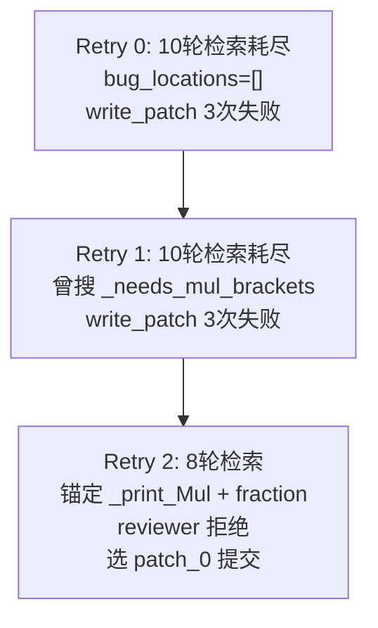

# 单案诊断临床报告：sympy__sympy-11897

> **分类**: C 类（Logic/Assertion Failure）  
> **模型**: deepseek-deepseek-chat  
> **任务目录**: `lite300_output/repos/sympy/applicable_patch/sympy__sympy-11897_2026-06-01_15-45-01/`  
> **评测结果**: L2 PASS（补丁可应用）→ L3 FAIL（95 passed, 1 failed, 9 exceptions）

---

## 0. 专有名词解释 (Glossary)

| 术语 | 解释 |
|------|------|
| **LaTeX Printer** | SymPy 的 `latex()` 函数背后的打印器（`LatexPrinter`），将符号表达式转为 LaTeX 数学字符串 |
| **Pretty Printer** | SymPy 的 `pprint()` 函数背后的打印器，在终端以 Unicode/ASCII 艺术形式展示表达式 |
| **`_print_Mul`** | `LatexPrinter` 中处理乘法表达式（`Mul`）的核心方法；内部调用 `fraction()` 将表达式拆分为分子/分母再格式化 |
| **`_needs_mul_brackets`** | 辅助决策函数：判断某子表达式作为 `Mul` 的因子时是否需要 `\left(...\right)` 包裹 |
| **`fraction(expr, exact=True)`** | SymPy 简化模块函数，将表达式拆为 `(numer, denom)` 对；可能改变表达式结构（如 `exp(-x)` → `1/exp(x)`，`(x+y)**(-1)/2` → `1/(2x+2y)`） |
| **Piecewise** | 分段函数对象；在 LaTeX 中渲染为 `\begin{cases}...\end{cases}` |
| **FAIL_TO_PASS** | SWE-bench 评测指标：应用补丁+测试补丁后，原先失败的测试应变为通过 |
| **test_patch** | SWE-bench 随任务附带的测试变更 diff，定义 CI 的验收断言 |
| **RecursionError** | Python 运行时错误：函数调用栈超过最大深度，通常由无限互递归引起 |

---

## 1. 原始问题快照 (Issue Snapshot)

### 1.1 Issue 原文

````text
LaTeX printer inconsistent with pretty printer
The LaTeX printer should always give the same output as the pretty printer, unless better output is possible from LaTeX. In some cases it is inconsistent. For instance:

``` py
In [9]: var('x', positive=True)
Out[9]: x

In [10]: latex(exp(-x)*log(x))
Out[10]: '\\frac{1}{e^{x}} \\log{\\left (x \\right )}'

In [11]: pprint(exp(-x)*log(x))
 -x
ℯ  ⋅log(x)
```

(I also don't think the assumptions should affect printing). 

``` py
In [14]: var('x y')
Out[14]: (x, y)

In [15]: latex(1/(x + y)/2)
Out[15]: '\\frac{1}{2 x + 2 y}'

In [16]: pprint(1/(x + y)/2)
    1
─────────
2⋅(x + y)
```
````

> 来源：[`problem_statement.txt`](../../../lite300_output/repos/sympy/applicable_patch/sympy__sympy-11897_2026-06-01_15-45-01/problem_statement.txt)

### 1.2 Issue 中文翻译

**标题**：LaTeX 打印器与 pretty 打印器不一致

**正文**：LaTeX 打印器应始终给出与 pretty 打印器相同的输出形式，除非 LaTeX 能给出更好的表达。但在某些情况下两者不一致。例如：

- 当 `x` 被声明为 `positive=True` 时，`latex(exp(-x)*log(x))` 输出 `\frac{1}{e^{x}} \log(...)`（分数形式），而 `pprint` 输出 `e^{-x} · log(x)`（指数形式）。
- Reporter 还认为 assumptions（如 `positive=True`）不应影响打印结果。
- 对于 `1/(x+y)/2`，LaTeX 输出 `\frac{1}{2 x + 2 y}`（分母被展开），pretty 输出 `\frac{1}{2·(x+y)}`（保留括号）。

### 1.3 核心诉求概括

| 维度 | 内容 |
|------|------|
| **报告了什么 Bug** | SymPy 的 `latex()` 与 `pprint()` 对同一表达式给出结构不同的输出 |
| **示例 1 期望** | `exp(-x)*log(x)` 应打印为 `e^{-x} \log(x)`，而非 `\frac{1}{e^{x}} \log(x)` |
| **示例 1 实际** | LaTeX 将 `exp(-x)` 改写为分数 `\frac{1}{e^{x}}` |
| **示例 2 期望** | `1/(x+y)/2` 应打印为 `\frac{1}{2(x+y)}`，分母保持 `(x+y)` 的括号结构 |
| **示例 2 实际** | LaTeX 输出 `\frac{1}{2x+2y}`，分母被代数展开 |
| **Reporter 额外诉求** | assumptions 不应影响打印；LaTeX 输出应与 pretty 输出在结构上对齐 |

### 1.4 Issue 与 SWE-bench 评测的落差（重要）

Issue 描述的是 broad 的「LaTeX vs pretty 一致性」问题，但 SWE-bench 对本实例的 **实际验收标准**（见 [`meta.json`](../../../lite300_output/repos/sympy/applicable_patch/sympy__sympy-11897_2026-06-01_15-45-01/meta.json)）是：

- **test_patch** 仅修改 `test_latex_Piecewise` 中的一条断言：
  - 旧：`assert latex(A*p) == r"A %s" % s`
  - 新：`assert latex(A*p) == r"A \left(%s\right)" % s`
- **Ground Truth patch** 仅修改 `_needs_mul_brackets`，使 `Piecewise` 作为 `Mul` 因子时强制加括号。
- `test_latex_FourierSeries` 虽列在 `FAIL_TO_PASS`，但在 Golden 评测中仍为 Exception（环境/测试套件预存问题），**非本 PR 核心修复目标**。

> **结论**：Agent 被 Issue 中的 `exp(-x)` 和分数分发示例强烈吸引，但 CI 真正验收的是 **Piecewise 在乘法中的括号契约**。

---

## 2. Agent 运行轨迹与思维链追踪 (Agent Trajectory & CoT Analysis)

### 2.1 整体运行概况

Agent 共经历 **3 次 overall retry**（retry 0、1 失败；retry 2 产出补丁但 reviewer 拒绝，最终通过 patch selection 提交 patch_0）：

| Retry | 检索结果 | Patch 结果 |
|-------|----------|------------|
| 0 | 10 轮检索耗尽，`bug_locations: []` | 3 次 write_patch 均无法解析，abort |
| 1 | 10 轮检索耗尽，`bug_locations: []`；曾搜索 `_needs_mul_brackets` 但未锚定 | 3 次 write_patch 失败，abort |
| **2** | **8 轮检索后锚定 `_print_Mul` + `fraction`** | conv_patch_0（`denom.is_Add`）→ conv_patch_1（`use_original` 循环）→ reviewer 全部拒绝 → **patch selection 选 patch_0** |

> 来源：[`info.log`](../../../lite300_output/repos/sympy/applicable_patch/sympy__sympy-11897_2026-06-01_15-45-01/info.log)、[`selected_patch.json`](../../../lite300_output/repos/sympy/applicable_patch/sympy__sympy-11897_2026-06-01_15-45-01/selected_patch.json)



### 2.2 Stage 1 工具调用时序（Retry 2，最终轮）

| 轮次 | Agent 思维摘要 | API 调用序列 |
|------|----------------|--------------|
| **R0** | 搜索 LaTeX 打印核心方法 | `search_method_in_file("_print_Mul", "latex.py")` · `search_method_in_file("_print_Pow", "latex.py")` · `search_method_in_file("_print_Add", "latex.py")` |
| **R1** | 分析 exp 与 Function 打印 | `search_code("def _print_exp")` · `search_method_in_file("_print_Function", "latex.py")` · `search_code("exp(")` · `search_code("class LatexPrinter")` |
| **R2** | 深入 Function/exp 处理 | `search_method_in_file("_print_Function", "latex.py")` · `search_code("def _print_exp")` · `search_code("E")` |
| **R3** | API 参数解析失败 | （空轮，重试） |
| **R4** | 追踪 fraction 导入 | `search_code("_print_exp")` · `search_code("_print_log")` · `search_code("from sympy.simplify import fraction")` |
| **R5** | 查看 fraction 实现 | `search_method_in_file("fraction", "sympy/simplify/radsimp.py")` |
| **R6** | 定位 fraction 定义 | `search_code("def fraction")` |
| **R7** | 阅读 fraction 源码 | `get_code_around_line("sympy/simplify/radsimp.py", 902, 50)` |
| **R8** | 判定上下文足够，输出 bug_locations | （无新 API 调用） |

> 来源：[`output_2/search/tool_call_layers.json`](../../../lite300_output/repos/sympy/applicable_patch/sympy__sympy-11897_2026-06-01_15-45-01/output_2/search/tool_call_layers.json)

### 2.3 最终锚定的 Fault Location

Agent 在 R8 输出两处 bug location（写入 [`bug_locations_after_process.json`](../../../lite300_output/repos/sympy/applicable_patch/sympy__sympy-11897_2026-06-01_15-45-01/output_2/search/bug_locations_after_process.json)）：

| # | 文件 | 类/方法 | 行号 | intended_behavior |
|---|------|---------|------|-------------------|
| 1 | `sympy/printing/latex.py` | `LatexPrinter._print_Mul` | L348–438 | 当 `fraction()` 将 `exp(-x)` 拆为 `1/exp(x)` 时，不应转为分数形式，应保留 `e^{-x}` |
| 2 | `sympy/simplify/radsimp.py` | `fraction` | L902–984 | `fraction(1/(x+y)/2, exact=True)` 不应将分母展开为 `2x+2y`，应保留 `2*(x+y)` |

**文件级定位：部分正确** — GT 也在 `sympy/printing/latex.py`，但不在 `_print_Mul`。  
**方法级定位：错误** — GT 修改的是 `_needs_mul_brackets`（L220–244），Agent 完全未触及此处。

### 2.4 定位评估与认知偏差

**Agent 找对地方了吗？**

- **文件层面**：部分正确。LaTeX 打印逻辑确实在 `latex.py`。
- **方法层面**：错误。SWE-bench 验收的修复点在 `_needs_mul_brackets`，而非 `_print_Mul` 的 fraction 分支。
- **次要锚定 `fraction()`**：方向与 Issue 示例 2 相关，但 GT 并未修改 `radsimp.py`；且 Agent 最终在 `_print_Mul` 侧做 workaround，而非修复 `fraction()` 本身。

**思维链中的关键认知偏差：**

1. **Issue 示例锚定偏差（Symptom Fixation）**  
   Issue 中两个典型示例（`exp(-x)` 分数化、`1/(x+y)/2` 分母展开）在思维链中占据了几乎全部注意力。Agent 将「LaTeX 与 pretty 不一致」等同于「`_print_Mul` 的 fraction 格式化有问题」，却忽略了 hints 中明确的 Piecewise 括号线索（`meta.json` 的 `hints_text` 末尾："no parentheses around the piecewise"）以及 SWE-bench `test_patch` 只改 `test_latex_Piecewise` 的事实。

2. **"Mul 即 _print_Mul" 简化（Layer Confusion）**  
   Hints 指出 "Each of the expressions is a Mul, so look at `_print_Mul`"。Agent 据此直接修改 `_print_Mul`，未理解 SymPy Printer 的分层架构：`_print_Mul` 负责**格式化**（分数/指数/分隔符），`_needs_mul_brackets` 负责**括号决策**（precedence）。Piecewise 括号缺失是 bracket 层的问题，不是 fraction 层的问题。

3. **Retry 1 已触及正确线索但未跟进**  
   Retry 1 中 Agent 曾调用 `search_method("_needs_mul_brackets")`，但在 Retry 2 的最终锚定中完全放弃了这一方向，转而在 `_print_Mul` + `fraction()` 路径上深挖。这是典型的「搜索过但未整合」认知失败。

4. **Symptom vs Test Contract 混淆**  
   Reviewer 四次明确反馈：patch_0 的 `denom.is_Add` 无法修复 `exp(-x)` 案例；patch 过于宽泛且有副作用。Agent 在 patch selection 阶段仍选择「最小改动」的 patch_0，理由是「Patch 1 更 invasive」，而非「哪个 patch 更接近 GT / 能通过 FAIL_TO_PASS」。

5. **递归路径盲区（Control-Flow Blindness）**  
   Agent 添加 `if denom.is_Add: tex += convert(expr)` 作为 fallback，未分析 `convert(expr)` 会调用 `_print(expr)` → 对 `1/(x+y)` 进入 `_print_Pow` → `_print_Mul` → 再次触发 `denom.is_Add` → 无限循环。缺乏对 Printer 互调路径的静态分析意识。

6. **自生成 reproducer 与 reviewer 的误导**  
   Reproducer 断言 `exp(-x)*log(x)` 的 LaTeX 输出，与 SWE-bench 的 `test_latex_Piecewise` 验收标准无关。Reviewer 虽多次指出 patch 不正确，但 Agent 未能将 reviewer 反馈转化为对 `_needs_mul_brackets` 的重新搜索。

---

## 3. 失败补丁解剖 (Failed Patch Dissection)

### 3.1 完整失败补丁

来源：[`output_2/extracted_patch_0.diff`](../../../lite300_output/repos/sympy/applicable_patch/sympy__sympy-11897_2026-06-01_15-45-01/output_2/extracted_patch_0.diff)（[`selected_patch.json`](../../../lite300_output/repos/sympy/applicable_patch/sympy__sympy-11897_2026-06-01_15-45-01/selected_patch.json) 确认选用）

```diff
diff --git a/sympy/printing/latex.py b/sympy/printing/latex.py
index 1edc712358..79db63e144 100644
--- a/sympy/printing/latex.py
+++ b/sympy/printing/latex.py
@@ -395,43 +395,50 @@ def convert(expr):
             # altered it when producing numer and denom
             tex += convert(expr)
         else:
-            snumer = convert(numer)
-            sdenom = convert(denom)
-            ldenom = len(sdenom.split())
-            ratio = self._settings['long_frac_ratio']
-            if self._settings['fold_short_frac'] \
-                    and ldenom <= 2 and not "^" in sdenom:
-                # handle short fractions
-                if self._needs_mul_brackets(numer, last=False):
-                    tex += r"\left(%s\right) / %s" % (snumer, sdenom)
-                else:
-                    tex += r"%s / %s" % (snumer, sdenom)
-            elif len(snumer.split()) > ratio*ldenom:
-                # handle long fractions
-                if self._needs_mul_brackets(numer, last=True):
-                    tex += r"\frac{1}{%s}%s\left(%s\right)" \
-                        % (sdenom, separator, snumer)
-                elif numer.is_Mul:
-                    # split a long numerator
-                    a = S.One
-                    b = S.One
-                    for x in numer.args:
-                        if self._needs_mul_brackets(x, last=False) or \
-                                len(convert(a*x).split()) > ratio*ldenom or \
-                                (b.is_commutative is x.is_commutative is False):
-                            b *= x
+            # Check if the denominator came from a negative exponent on a
+            # function like exp. In that case, don't use fraction result.
+            # Also check if denominator is an Add (distributed by fraction)
+            # and if so, use the original expression to preserve parentheses.
+            if denom.is_Add:
+                tex += convert(expr)
+            else:
+                snumer = convert(numer)
+                sdenom = convert(denom)
+                ldenom = len(sdenom.split())
+                ratio = self._settings['long_frac_ratio']
+                if self._settings['fold_short_frac'] \
+                        and ldenom <= 2 and not "^" in sdenom:
+                    # handle short fractions
+                    if self._needs_mul_brackets(numer, last=False):
+                        tex += r"\left(%s\right) / %s" % (snumer, sdenom)
+                    else:
+                        tex += r"%s / %s" % (snumer, sdenom)
+                elif len(snumer.split()) > ratio*ldenom:
+                    # handle long fractions
+                    if self._needs_mul_brackets(numer, last=True):
+                        tex += r"\frac{1}{%s}%s\left(%s\right)" \
+                            % (sdenom, separator, snumer)
+                    elif numer.is_Mul:
+                        # split a long numerator
+                        a = S.One
+                        b = S.One
+                        for x in numer.args:
+                            if self._needs_mul_brackets(x, last=False) or \
+                                    len(convert(a*x).split()) > ratio*ldenom or \
+                                    (b.is_commutative is x.is_commutative is False):
+                                b *= x
+                            else:
+                                a *= x
+                        if self._needs_mul_brackets(b, last=True):
+                            tex += r"\frac{%s}{%s}%s\left(%s\right)" \
+                                % (convert(a), sdenom, separator, convert(b))
                         else:
-                            a *= x
-                    if self._needs_mul_brackets(b, last=True):
-                        tex += r"\frac{%s}{%s}%s\left(%s\right)" \
-                            % (convert(a), sdenom, separator, convert(b))
+                            tex += r"\frac{%s}{%s}%s%s" \
+                                % (convert(a), sdenom, separator, convert(b))
                     else:
-                        tex += r"\frac{%s}{%s}%s%s" \
-                            % (convert(a), sdenom, separator, convert(b))
+                        tex += r"\frac{1}{%s}%s%s" % (sdenom, separator, snumer)
                 else:
-                    tex += r"\frac{1}{%s}%s%s" % (sdenom, separator, snumer)
-            else:
-                tex += r"\frac{%s}{%s}" % (snumer, sdenom)
+                    tex += r"\frac{%s}{%s}" % (snumer, sdenom)
 
         if include_parens:
             tex += ")"
```

### 3.2 逐段白话解释

| 补丁区域 | Agent 的修改逻辑 | Agent 为什么觉得这样能修好 |
|----------|------------------|---------------------------|
| **L34–37 注释** | 声明两个修复意图：(1) 负指数函数如 `exp` 不应被转为分数；(2) 分母是 `Add` 时应保留原式括号 | 注释直接复述 Issue 两个示例的症状，Agent 认为注释中的逻辑即修复方案 |
| **L38–39 核心分支** | `if denom.is_Add: tex += convert(expr)` — 当 `fraction()` 拆出的分母是加法表达式时，放弃 `\frac{}{}` 格式化，改打印原始 `expr` | Agent 观察到 `1/(x+y)/2` 经 `fraction()` 后 denom 变为 `2*x+2*y`（`Add` 类型），认为检测到 `Add` 就能恢复 `(x+y)` 括号结构 |
| **L40–86 else 分支** | 将原 `_print_Mul` 的分数/formatting 逻辑整体缩进进 `else`，仅在不满足 `denom.is_Add` 时执行 | 保持原有分数打印行为不变，仅在「分母被展开」时走 fallback |
| **整体结构** | 在 `_print_Mul` 的 `convert()` 内部、`denom != S.One` 分支处插入条件 | Agent 锚定 `_print_Mul` 为根因，认为在 fraction 格式化入口做 guard 是最小侵入修复 |

**Agent 的核心假设链：**

1. `fraction(expr, exact=True)` 改变了表达式结构 → 这是 LaTeX/pretty 不一致的根因
2. 若分母是 `Add`，说明 `fraction()` 做了 undesired 的代数展开
3. 此时回退到 `convert(expr)` 打印原式，即可恢复 pretty printer 的结构

**假设链为何断裂：**

- 对 `exp(-x)*log(x)`：`fraction()` 的 denom 是 `exp(x)`（`Pow`/`Function`），**不是 `Add`**，新分支完全不触发，Issue 示例 1 未修复。
- 对 `1/(x+y)`：SymPy 内部表示为 `(x+y)**(-1)`，`fraction()` 给出 `numer=1, denom=(x+y)`（`Add`），触发 fallback → `convert(expr)` → `_print(Pow(...,-1))` → `_print_Pow` L464–466 调用 `_print_Mul` → 再次 `denom.is_Add` → **无限递归**。
- 对 `A * Piecewise(...)`：完全不经过 fraction 分支的修改逻辑；括号决策在 `_needs_mul_brackets`，Agent 未修改 → **FAIL_TO_PASS 测试仍失败**。

### 3.3 备选补丁 patch_1 简述

[`extracted_patch_1.diff`](../../../lite300_output/repos/sympy/applicable_patch/sympy__sympy-11897_2026-06-01_15-45-01/output_2/extracted_patch_1.diff) 将条件扩展为遍历 `Mul.make_args(expr)` 检测负指数 `Pow`（函数基或 `Add` 基），比 patch_0 覆盖面更广，但：

- 仍未触及 `_needs_mul_brackets` / Piecewise 括号问题
- 同样存在 `convert(expr)` 递归风险
- Reviewer 拒绝；patch selection 仍选了更「最小」但错误的 patch_0

---

## 4. 黄金标准对比 (Ground Truth Alignment)

### 4.1 人类正确补丁（Ground Truth Diff）

来源：[`developer_patch.diff`](../../../lite300_output/repos/sympy/applicable_patch/sympy__sympy-11897_2026-06-01_15-45-01/developer_patch.diff)、[`meta.json`](../../../lite300_output/repos/sympy/applicable_patch/sympy__sympy-11897_2026-06-01_15-45-01/meta.json)

```diff
diff --git a/sympy/printing/latex.py b/sympy/printing/latex.py
--- a/sympy/printing/latex.py
+++ b/sympy/printing/latex.py
@@ -235,10 +235,12 @@ def _needs_mul_brackets(self, expr, first=False, last=False):
         elif expr.is_Mul:
             if not first and _coeff_isneg(expr):
                 return True
+        if expr.is_Piecewise:
+            return True
         if any([expr.has(x) for x in (Mod,)]):
             return True
         if (not last and
-            any([expr.has(x) for x in (Integral, Piecewise, Product, Sum)])):
+            any([expr.has(x) for x in (Integral, Product, Sum)])):
             return True
 
         return False
```

### 4.2 SWE-bench test_patch 语义

```diff
-    assert latex(A*p) == r"A %s" % s
+    assert latex(A*p) == r"A \left(%s\right)" % s
```

含义：当 `Piecewise` 对象 `p` 与符号 `A` 相乘时，LaTeX 输出必须为 `A \left( \begin{cases}...\end{cases} \right)`，即 **Piecewise 整体需被 `\left(...\right)` 包裹**。

### 4.3 并排对比

| 维度 | Agent patch_0 | Ground Truth |
|------|---------------|--------------|
| **修改文件** | `sympy/printing/latex.py` | `sympy/printing/latex.py` |
| **修改方法** | `_print_Mul`（fraction 格式化分支） | `_needs_mul_brackets`（括号决策） |
| **改动规模** | ~50 行（重构 if/else 嵌套） | 4 行（+2 新增，1 行修改列表） |
| **修复机制** | 检测 `denom.is_Add` 后 fallback 到原式 | 检测 `expr.is_Piecewise` 后强制加 `\left(...\right)` |
| **针对 Issue 示例 1** | 否（denom 非 Add） | 否（非本 PR 范围） |
| **针对 Issue 示例 2** | 意图是，但引发 RecursionError | 否（非本 PR 范围） |
| **修复 test_latex_Piecewise** | **否** | **是** |
| **PASS_TO_PASS 回归** | 9 个 RecursionError + 2 个 PASS_TO_PASS 失败 | 无回归（98 passed） |
| **副作用** | 破坏 `_print_Mul ↔ _print_Pow` 调用链 | 无 |

### 4.4 核心分析：人类多考虑了什么？

1. **打印 precedence / bracket 契约**  
   原代码中 `Piecewise` 仅在 `expr.has(Piecewise)` 且 `not last` 时才加括号——即 Piecewise 作为 Mul 的**最后一个因子**时不加括号。GT 将 `Piecewise` 提升为与 `Add`、`Relational` 同级的「始终需要括号」类型，并从 `has()` 列表中移除以避免重复判断。这恰好满足 `A * Piecewise(...)` 中 Piecewise 作为尾因子时的括号需求。

2. **修复层级选择：Bracket 层 vs Format 层**  
   人类开发者识别到问题是「Mul 因子缺少括号」，而非「fraction 算法错误」。在 `_needs_mul_brackets` 加一条规则是 SymPy Printer 的惯用模式（同类已有 `expr.is_Add`、`expr.is_Relational` 等判断）。

3. **最小侵入与零递归风险**  
   GT 补丁不触碰 `_print_Mul` 的 fraction 逻辑，不改变表达式遍历路径，不引入新的 `_print` 互调，因此不会触发 RecursionError。

4. **评测对齐**  
   GT 精确对应 `test_patch` 的断言变更。Issue 中 broad 的 exp/fraction 示例属于同一主题的其他表现，但本 PR（#11897）的 CI 验收点明确是 Piecewise 括号。

5. **Agent 失败补丁 vs GT 的本质区别**  
   - Agent：在**格式化层**试图通过 bypass `fraction()` 结果来「保留原式结构」  
   - GT：在**括号决策层**增加一条类型规则  
   - 两者修改的代码路径、触发的条件、影响的表达式集合完全不同；Agent 的 `denom.is_Add` 与 GT 的 `expr.is_Piecewise` 无交集

---

## 5. 评测报告与崩溃堆栈 (Evaluation Log & Traceback)

### 5.1 评测环境

- **日志**：[`eval_logs/sympy__sympy-11897.deepseek-deepseek-chat.eval.log`](../../../lite300_output/repos/sympy/eval_logs/sympy__sympy-11897.deepseek-deepseek-chat.eval.log)
- **测试范围**：`bin/test -C --verbose sympy/printing/tests/test_latex.py`（107 个测试）
- **结果摘要**：**95 passed, 1 failed, 2 expected to fail, 9 exceptions**

### 5.2 FAIL_TO_PASS 测试结果

| 测试 | Agent 结果 | Golden 结果 | 说明 |
|------|-----------|-------------|------|
| `test_latex_Piecewise` | **F** (AssertionError) | **ok** | 本实例核心验收测试 |
| `test_latex_FourierSeries` | E (RecursionError) | E (RecursionError) | 两端均异常，非 Agent 回归引入 |

### 5.3 关键失败：test_latex_Piecewise（AssertionError）

```
___________ sympy/printing/tests/test_latex.py:test_latex_Piecewise ____________
  File ".../sympy/printing/tests/test_latex.py", line 870, in test_latex_Piecewise
    assert latex(A*p) == r"A \left(%s\right)" % s
AssertionError
```

**根因**：Agent 未修改 `_needs_mul_brackets`。`latex(A*p)` 输出为 `A \begin{cases}...\end{cases}`（无 `\left(...\right)`），不满足 test_patch 新断言。

### 5.4 关键崩溃：RecursionError（9 个 Exception）

以 `test_latex_inverse`（PASS_TO_PASS 回归）为例：

```
____________ sympy/printing/tests/test_latex.py:test_latex_inverse _____________
  File ".../test_latex.py", line 813, in test_latex_inverse
    assert latex(1/(x + y)) == "\\frac{1}{x + y}"
  File ".../sympy/printing/latex.py", line 473, in _print_Pow
    return self._print_Mul(expr)
  File ".../sympy/printing/latex.py", line 403, in _print_Mul
    tex += convert(expr)
  File ".../sympy/printing/latex.py", line 366, in convert
    return str(self._print(expr))
  File ".../sympy/printing/latex.py", line 473, in _print_Pow
    return self._print_Mul(expr)
  ... (循环数十层)
RecursionError: maximum recursion depth exceeded in __instancecheck__
```

**无限递归路径：**

```
latex(1/(x+y))
  └─ _print_Pow(x+y)**(-1)          # L464-466: 负指数 commutative → 委托 _print_Mul
       └─ _print_Mul((x+y)**(-1))
            └─ fraction → numer=1, denom=(x+y)   # denom.is_Add == True
                 └─ convert(expr)                 # Agent 补丁 L39
                      └─ _print((x+y)**(-1))
                           └─ _print_Pow → _print_Mul → ...  # 回到起点
```

**受影响的 Exception 测试（非完整列表）**：

| 测试 | 文件行号 | 触发表达式 |
|------|----------|------------|
| `test_latex_functions` | L340 | 含 `Chi(x)**2` 等，间接调用 latex 打印 |
| `test_latex_indexed` | L467 | 含共轭乘法 |
| `test_latex_derivatives` | — | `latex(diff(...))` |
| `test_latex_FourierSeries` | L632 | `latex(fourier_series(...))` |
| `test_latex_FormalPowerSeries` | L637 | `latex(fps(...))` |
| `test_latex_inverse` | L813 | `latex(1/(x+y))` |
| `test_latex_matrix_with_functions` | L908 | 矩阵中含分式 |
| `test_PrettyPoly` | — | 多项式分式转换 |

### 5.5 Agent vs Golden 评测对比

| 指标 | Agent patch_0 | Golden patch |
|------|---------------|--------------|
| passed | 95 | 98 |
| failed | 1 | 0 |
| exceptions | 9 | 7 |
| `test_latex_Piecewise` | F | ok |
| `test_latex_inverse` (PASS_TO_PASS) | E | ok |
| `test_PrettyPoly` (PASS_TO_PASS) | E | ok |

### 5.6 根本原因归纳（评测视角）

1. **直接失败**：未实现 Piecewise 括号 → `test_latex_Piecewise` AssertionError  
2. **级联崩溃**：`denom.is_Add` fallback 制造 `_print_Mul ↔ _print_Pow` 无限互调 → 9 个 RecursionError  
3. **PASS_TO_PASS 回归**：`test_latex_inverse`、`test_PrettyPoly` 等原本通过的测试因 RecursionError 变为 Exception

---

## 6. 总结 (Executive Summary)

Agent 将 Issue 中「LaTeX 与 pretty 输出结构不一致」的 broad 症状，窄化为「`_print_Mul` 中 `fraction()` 的分数格式化有问题」，并在 `_print_Mul` 内插入 `if denom.is_Add: convert(expr)` 的 bypass 逻辑。这一修复既未触及 SWE-bench 实际验收的 **Piecewise 括号契约**（应在 `_needs_mul_brackets` 中添加 `expr.is_Piecewise` 规则），又在对 `1/(x+y)` 等含 `Add` 分母的表达式打印时触发 `_print_Mul → _print_Pow → _print_Mul` 无限递归，导致 9 个测试 Exception 和 2 个 PASS_TO_PASS 回归。根本原因是 Agent 缺乏对 SymPy Printer **「括号决策层（`_needs_*_brackets`）vs 表达式格式化层（`_print_*`）」** 的分层语义理解，且未将 SWE-bench `test_patch` 作为修复的 ground truth 锚点。

---

## 7. Prompt 静态语义注入建议 (Generalizable Semantic Injection)

以下建议可泛化至 SymPy 打印器类问题及类似的「Issue 描述 broad、CI 验收 narrow」场景：

### 7.1 Issue 示例 ≠ 评测契约

**注入内容**：
> 在生成补丁前，必须解析任务的 `test_patch` 和 `FAIL_TO_PASS` 列表。Issue 中的示例可能是同一主题的多种表现，但 CI 只验收 test_patch 修改的断言。修复目标应优先对齐 test_patch 语义，而非 Issue 中所有示例。

**泛化场景**：任何 SWE-bench 任务中 Issue 描述范围大于实际 test_patch 的情况。

### 7.2 SymPy Printer 分层架构

**注入内容**：
> SymPy 打印器采用两层架构：
> - **格式化层** `_print_Xxx`：决定表达式如何渲染（分数、指数、函数名等）
> - **括号决策层** `_needs_mul_brackets` / `_needs_add_brackets` / `_needs_brackets`：根据运算符 precedence 决定是否需要 `\left(...\right)`
>
> 当 Bug 涉及「乘法/加法中缺少或多余括号」时，优先检查 `_needs_*_brackets` 系列函数，而非直接修改 `_print_Mul` / `_print_Add`。

**泛化场景**：所有 SymPy printing 模块的 precedence / parenthesization 问题。

### 7.3 fraction() 的代数变换语义

**注入内容**：
> `fraction(expr, exact=True)` 会将表达式拆为 `(numer, denom)`，此过程可能：
> - 将 `exp(-x)` 变为 `1/exp(x)`
> - 将 `(x+y)**(-1)/2` 的分母展开为 `2*(x+y)` 再进一步 distribute
>
> 在 Printer 中 bypass `fraction()` 结果、回退到 `convert(expr)` 或 `_print(expr)` 时，必须静态追踪是否会重新进入同一 `_print_*` 方法，避免 `_print_Mul ↔ _print_Pow` 互调递归。

**泛化场景**：任何在 Printer 中调用 `fraction()` / `together()` / `apart()` 等代数变换后又要「回退原式」的补丁。

### 7.4 Piecewise / Add / 容器类型的括号规则

**注入内容**：
> 在 `_needs_mul_brackets` 中，以下类型作为 Mul 因子时几乎总是需要括号：
> - `Add`（已有规则）
> - `Piecewise`（分段函数，`\begin{cases}` 块）
> - `Relational`（不等式）
> - 含 `Integral` / `Sum` / `Product` 的表达式（当不在末尾位置时）
>
> 新增括号规则应遵循现有模式：在 `_needs_mul_brackets` 中添加 `if expr.is_Xxx: return True`，而非在 `_print_Mul` 中重写格式化逻辑。

**泛化场景**：Piecewise、Integral、Sum 等容器表达式在 Mul/Add 中的 parenthesization。

### 7.5 最小侵入启发式

**注入内容**：
> 对比 Ground Truth 补丁模式：SymPy 维护者倾向于在辅助决策函数中添加 1–3 行类型判断，而非重构核心 `_print_*` 方法的 50+ 行分支。若你的补丁改动超过 10 行且涉及重构现有 if/else 嵌套，应重新审视是否修改了正确的抽象层。

**泛化场景**：所有 SymPy 及类似大型框架中的「小 bug、大 patch」反模式。

### 7.6 Reviewer 反馈的语义信号

**注入内容**：
> 当 reviewer 指出「条件太宽 / 未覆盖某案例 / 可能引入副作用」时，这通常意味着修复层级或条件判断错误，而非「需要更多 else 分支」。此时应：
> 1. 重新搜索 `_needs_*_brackets` 等辅助函数
> 2. 对照 test_patch 确认验收断言
> 3. 静态分析 `_print` 互调路径是否存在递归

**泛化场景**：Agent 内部 reviewer 循环中的迭代修复策略。

### 7.7 Hints 的多信号整合

**注入内容**：
> 任务的 `hints_text` 可能包含多个独立线索（如 "look at _print_Mul" 与 "no parentheses around piecewise"）。Agent 应将所有 hints 与 test_patch 交叉验证，避免只跟随一条 hint 而忽略其他。特别是当 hint 指向的方法与 test_patch 验证的行为不在同一代码路径时，应优先跟随 test_patch。

**泛化场景**：SWE-bench 中带 maintainer hints 的任务。

---

## 8. 文档自检反思 (Self-Review Checklist)

| 检查项 | 状态 | 说明 |
|--------|------|------|
| Issue 原文与翻译完整 | ✅ | 与 `problem_statement.txt` 一致 |
| 工具调用时序与 info.log / tool_call_layers.json 一致 | ✅ | Retry 2 的 R0–R8 已核实 |
| 失败补丁为 `extracted_patch_0.diff` | ✅ | `selected_patch.json` 确认 |
| GT diff 与 meta.json / developer_patch.diff 一致 | ✅ | 4 行 `_needs_mul_brackets` 修改 |
| 堆栈行号与 eval log 一致 | ✅ | test_latex_Piecewise L870、test_latex_inverse L813 |
| 文件名 `sympy__sympy-11897.md` | ✅ | |
| Issue 与 test_patch 落差已说明 | ✅ | 板块 1.4 |
| RecursionError 调用链已解释 | ✅ | 板块 5.4 |
| 静态注入建议可泛化 | ✅ | 板块 7，7 条独立建议 |

**潜在遗漏说明**：
- Issue 示例 1（`exp(-x)`）和示例 2（`1/(x+y)/2`）在 GT 补丁中**未被修复**；本报告已明确标注此为 Issue 与 CI 验收的 scope 差异，而非文档遗漏。
- `test_latex_FourierSeries` 在 Golden 评测中亦为 Exception；报告已标注其为环境/套件预存问题，不计入 Agent  vs GT 的能力差距。

---

*报告生成依据：lite300_output 离线产物 + SWE-bench Lite meta.json + Golden 评测日志。任务 ID：sympy__sympy-11897。*
