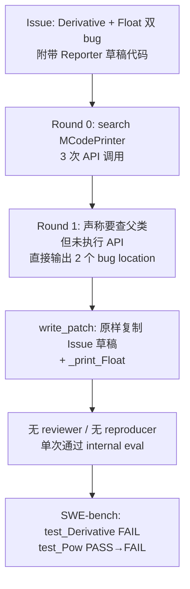

# 单案诊断临床报告：sympy__sympy-12171

> **分类**: C 类（Logic/Assertion Failure）  
> **模型**: deepseek-deepseek-chat  
> **任务目录**: `lite300_output/repos/sympy/applicable_patch/sympy__sympy-12171_2026-06-01_15-50-48/`  
> **评测结果**: L2 PASS（补丁可应用）→ L3 FAIL（8 passed, 2 failed）

---

## 0. 专有名词解释 (Glossary)

| 术语 | 解释 |
|------|------|
| **Mathematica Code Printer (`MCodePrinter`)** | SymPy 中将符号表达式转换为 Wolfram Mathematica 语法的打印器，入口函数为 `mathematica_code()` |
| **`_print_<Type>` 方法** | SymPy Printer 体系中的**分派钩子**：遇到特定 AST 节点类型（如 `Derivative`、`Float`）时，打印器会调用对应的 `_print_*` 方法生成目标语言字符串 |
| **`Hold[...]`** | Mathematica 的**非求值包装符**：告诉 Mathematica「保留符号形式、不要立即计算」。`MCodePrinter` 对 `Integral`、`Sum` 均使用 `Hold[Integrate[...]]` / `Hold[Sum[...]]` 模式 |
| **`doprint(expr)`** | 打印器的**递归分派入口**：对子表达式再次走完整的 `_print_*` 分派链，确保 `sin(x)` → `Sin[x]` 等映射生效 |
| **`stringify(args, sep)`** | `StrPrinter` 提供的辅助函数：对参数列表做 `parenthesize` + 拼接，**不**额外包裹外层语义结构（如 `Hold`） |
| **`FAIL_TO_PASS`** | SWE-bench 指标：应用 developer patch + test patch 后，原先失败的测试应变为通过。本实例仅 `test_Derivative` |
| **`PASS_TO_PASS`** | 回归指标：原先通过的测试在应用 agent patch 后仍应通过。本实例 agent 导致 `test_Pow` 从 PASS 变为 FAIL |
| **Issue 建议代码 vs Ground Truth** | Issue 正文附带 Reporter 的「简易修复草稿」，**不等于** PR 合并后的正式实现，更不等于 SWE-bench 的验收标准 |

---

## 1. 原始问题快照 (Issue Snapshot)

### 1.1 Issue 原文

````text
matematica code printer does not handle floats and derivatives correctly
In its current state the mathematica code printer does not handle Derivative(func(vars), deriver) 
e.g. Derivative(f(t), t) yields Derivative(f(t), t) instead of D[f[t],t]

Also floats with exponents are not handled correctly e.g. 1.0e-4 is not converted to 1.0*^-4

This has an easy fix by adding the following lines to MCodePrinter:


def _print_Derivative(self, expr):
        return "D[%s]" % (self.stringify(expr.args, ", "))

def _print_Float(self, expr):
        res =str(expr)
        return res.replace('e','*^') 


````

> 来源：[`problem_statement.txt`](../../../lite300_output/repos/sympy/applicable_patch/sympy__sympy-12171_2026-06-01_15-50-48/problem_statement.txt)

### 1.2 Issue 中文翻译

**标题**：Mathematica 代码打印器无法正确处理浮点数和导数

**正文**：

- 当前 Mathematica 打印器不能正确处理 `Derivative(func(vars), deriver)`。例如 `Derivative(f(t), t)` 输出 `Derivative(f(t), t)`（SymPy 默认字符串），而不是 Mathematica 语法 `D[f[t], t]`。
- 带指数的浮点数也不能正确转换，例如 `1.0e-4` 没有被转为 Mathematica 科学计数法 `1.0*^-4`。
- Reporter 认为修复很简单：在 `MCodePrinter` 中添加上述两个 `_print_*` 方法即可。

### 1.3 核心诉求概括

| 维度 | 内容 |
|------|------|
| **报告了什么 Bug** | `mathematica_code()` 对 **导数** 和 **科学计数法浮点** 两类表达式缺少专用打印逻辑，回退到 SymPy 通用字符串 |
| **导数 — 期望** | `Derivative(f(t), t)` → `D[f[t], t]`（Mathematica 的 `D` 运算符 + 方括号参数列表） |
| **导数 — 实际** | 输出 `Derivative(f(t), t)` 或类似 SymPy repr，Mathematica 无法识别 |
| **浮点 — 期望** | `1.0e-4` → `1.0*^-4`（Mathematica 的 `*^` 科学计数法） |
| **浮点 — 实际** | 保留 Python/C 风格的 `e` 指数记法 |
| **Reporter 额外建议** | 直接在 Issue 中给出了两行 `_print_*` 草稿代码 |

### 1.4 Issue 与 SWE-bench 验收的落差（重要）

Issue 描述**两个**子问题（Derivative + Float），但 SWE-bench 对本实例的实际验收标准是：

| 来源 | 内容 |
|------|------|
| **`FAIL_TO_PASS`** | 仅 `test_Derivative` |
| **`PASS_TO_PASS`** | 含 `test_Pow` 等 8 项，**不含任何 Float 专项测试** |
| **Ground Truth patch** | **只**添加 `_print_Derivative`，**未**添加 `_print_Float` |
| **test_patch** | 仅新增 `test_Derivative` 的 5 条断言，全部要求 `Hold[D[...]]` 格式 |

> **结论**：Agent 被 Issue 正文的「双 bug + 示例代码」整体吸引，实现了 Reporter 草稿的全部内容；而人类开发者与 CI 只合并、验收了 **Derivative + Hold 包装** 这一半。

---

## 2. Agent 运行轨迹与思维链追踪 (Agent Trajectory & CoT Analysis)

### 2.1 整体运行概况

| 阶段 | 结果 |
|------|------|
| **Retry 次数** | 0（一次成功，无 reviewer） |
| **检索轮次** | 2 轮（Round 0 搜索类，Round 1 直接输出 bug location） |
| **Reproducer** | 跳过（Issue 无可复现步骤，见 `conv_reproducible.json`） |
| **Patch 生成** | 1 次 write_patch 即通过 internal evaluation |
| **最终提交** | `output_0/extracted_patch_0.diff` |

> 来源：[`info.log`](../../../lite300_output/repos/sympy/applicable_patch/sympy__sympy-12171_2026-06-01_15-50-48/info.log)



### 2.2 Stage 1 工具调用时序

| 轮次 | Agent 思维摘要 | API 调用序列 |
|------|----------------|--------------|
| **R0** | 「先搜索 MCodePrinter 类了解现状」 | `search_class_in_file("MCodePrinter", "mathematica.py")` · `search_class("MCodePrinter")` · `search_code("class MCodePrinter")` |
| **R1** | 中间曾计划查父类 `CodePrinter` 的默认 `_print_Derivative` / `_print_Float`，但**最终未发起 API**；直接声明「上下文足够」 | （无 API 调用，`tool_call_layers.json` 第二项为 `[]`） |

> 来源：[`tool_call_layers.json`](../../../lite300_output/repos/sympy/applicable_patch/sympy__sympy-12171_2026-06-01_15-50-48/output_0/search/tool_call_layers.json)、[`search_round_1.json`](../../../lite300_output/repos/sympy/applicable_patch/sympy__sympy-12171_2026-06-01_15-50-48/output_0/search/search_round_1.json)

**R1 中 Agent 口头计划但未执行的调用**（出现在 CoT 中间，被丢弃）：

- `search_method_in_class("_print_Derivative", "CodePrinter")`
- `search_method_in_class("_print_Float", "CodePrinter")`
- `search_method("_print_Derivative")`
- `search_method("_print_Float")`

### 2.3 最终锚定的 Fault Location

| # | 文件 | 类 | 方法 | 行号（上下文块） | intended_behavior |
|---|------|-----|------|------------------|-------------------|
| 1 | `sympy/printing/mathematica.py` | `MCodePrinter` | `_print_Derivative`（新增） | L37–110 块末尾 | 添加 `_print_Derivative`，用 `stringify(expr.args, ", ")` 格式化为 `D[...]` |
| 2 | `sympy/printing/mathematica.py` | `MCodePrinter` | `_print_Float`（新增） | 同上 | 添加 `_print_Float`，`str(expr).replace('e', '*^')` |

> 来源：[`bug_locations_after_process.json`](../../../lite300_output/repos/sympy/applicable_patch/sympy__sympy-12171_2026-06-01_15-50-48/output_0/search/bug_locations_after_process.json)

### 2.4 定位评估与认知偏差

#### 文件级定位：**正确**

- Agent 与 Ground Truth 均修改 `sympy/printing/mathematica.py` 的 `MCodePrinter` 类。
- 检索 2 轮即锚定，属于「Issue 明示类名 + 文件」的 easy case。

#### 方法级 / 语义级定位：**部分正确，实现契约错误**

- `_print_Derivative` 方向正确，但 Agent **未对齐** 同类方法 `_print_Integral` / `_print_Sum` 的 **`Hold[...]` 包装 + `doprint` 递归** 模式。
- `_print_Float` 属于 **Issue 延伸需求**，Ground Truth **未实现**；Agent 盲目跟随 Issue 草稿导致 **PASS_TO_PASS 回归**。

#### 认知偏差详解

| 偏差 | 表现 | 产生原因 |
|------|------|----------|
| **「Issue 草稿 = 正确补丁」锚定** | Patch 阶段几乎逐字复制 Issue 中的 `_print_Derivative` 和 `_print_Float` | Issue 标题写「easy fix」并内嵌完整代码块；Agent 在 `conv_patch_0.json` 中复述「按 issue 添加两个方法」 |
| **局部模式 blindness** | 已检索到 `_print_Integral` 使用 `Hold[Integrate[` + `doprint` + `]]`，却未迁移到 `_print_Derivative` | Round 1 过早终止检索；未对比「同类 symbolic operator 的打印契约」 |
| **父类语义未探索** | 计划搜索 `CodePrinter._print_Derivative = _print_not_supported` 但未执行 | 若执行会发现 Derivative 当前走 `_print_not_supported` → `emptyPrinter`，从而理解「只需新增 override」；同时可发现 `StrPrinter._print_Float` 的正规 mpf 格式化逻辑 |
| **Issue 范围 vs CI 范围混淆** | 实现了 Float 修复，GT 和 test_patch 均未要求 | 未读取 `meta.json` 的 `FAIL_TO_PASS` / `test_patch`；Reproducer 也被跳过，无法在本地暴露 `test_Pow` 回归 |
| **检索阶段 self-poisoning** | `bug_locations` 的 `intended_behavior` 直接复述 Issue 草稿（含 `stringify` 和 `replace('e')`） | 检索 Agent 的输出成为 Patch Agent 的「权威规格」，错误规格被级联放大 |

---

## 3. 失败补丁解剖 (Failed Patch Dissection)

### 3.1 Agent 失败补丁全文

```diff
diff --git a/sympy/printing/mathematica.py b/sympy/printing/mathematica.py
index 4c2ffd81e1..3730b3a346 100644
--- a/sympy/printing/mathematica.py
+++ b/sympy/printing/mathematica.py
@@ -109,6 +109,13 @@ def _print_Integral(self, expr):
     def _print_Sum(self, expr):
         return "Hold[Sum[" + ', '.join(self.doprint(a) for a in expr.args) + "]]"
 
+    def _print_Derivative(self, expr):
+        return "D[%s]" % (self.stringify(expr.args, ", "))
+
+    def _print_Float(self, expr):
+        res = str(expr)
+        return res.replace('e', '*^')
+
 
 def mathematica_code(expr, **settings):
     r"""Converts an expr to a string of the Wolfram Mathematica code
```

> 来源：[`extracted_patch_0.diff`](../../../lite300_output/repos/sympy/applicable_patch/sympy__sympy-12171_2026-06-01_15-50-48/output_0/extracted_patch_0.diff)

### 3.2 逐行白话解读

| 行 / 块 | Agent 的逻辑 | Agent 的「想当然」 |
|---------|-------------|-------------------|
| `+ def _print_Derivative(...)` | SymPy 遇到 `Derivative` 节点时会调用此方法，不再走父类 `_print_not_supported` | 正确：确实需要 override |
| `return "D[%s]" % (self.stringify(...))` | Issue 示例写 `D[%s]` + `stringify`，Reporter 说 `Derivative(f(t),t)` → `D[f[t],t]` | 以为 Issue 示例就是验收标准；忽略了同文件 `_print_Sum` 的 `Hold[Sum[...]]` 先例 |
| `self.stringify(expr.args, ", ")` | `stringify` 在同文件 `_print_Function` 中已有使用，「风格一致」 | 未注意到 `_print_Integral` / `_print_Sum` 对**结构性运算符**用的是 `doprint` + 逗号 join，而非 `stringify` |
| `+ def _print_Float(...)` | Issue 第二条 bug：科学计数法 `e` → `*^` | 以为 Issue 两个 bug 都要修；不知道 GT / CI 只验 Derivative |
| `res = str(expr)` | 最简单地把 SymPy Float 对象转字符串 | 不知道 `StrPrinter._print_Float` 用 `mpmath.to_str` + `full_prec` / `precision` 设置控制精度 |
| `return res.replace('e', '*^')` | Issue 字面意思：把 `e` 换成 `*^` | 未考虑：① 全局 replace 会误伤含字母 `e` 的子串；② 破坏原有 `3.5` 等简单浮点的精度格式，导致 `test_Pow` 回归 |

---

## 4. 黄金标准对比 (Ground Truth Alignment)

### 4.1 人类正确补丁（Ground Truth）

```diff
diff --git a/sympy/printing/mathematica.py b/sympy/printing/mathematica.py
--- a/sympy/printing/mathematica.py
+++ b/sympy/printing/mathematica.py
@@ -109,6 +109,9 @@ def _print_Integral(self, expr):
     def _print_Sum(self, expr):
         return "Hold[Sum[" + ', '.join(self.doprint(a) for a in expr.args) + "]]"
 
+    def _print_Derivative(self, expr):
+        return "Hold[D[" + ', '.join(self.doprint(a) for a in expr.args) + "]]"
+
 
 def mathematica_code(expr, **settings):
```

> 来源：[`developer_patch.diff`](../../../lite300_output/repos/sympy/applicable_patch/sympy__sympy-12171_2026-06-01_15-50-48/developer_patch.diff)、[`meta.json`](../../../lite300_output/repos/sympy/applicable_patch/sympy__sympy-12171_2026-06-01_15-50-48/meta.json) 中的 `task_info.patch`

### 4.2 并排对比

| 维度 | Agent 失败补丁 | 人类正确补丁 |
|------|---------------|-------------|
| **修改范围** | `_print_Derivative` + `_print_Float` | **仅** `_print_Derivative` |
| **外层包装** | 无 `Hold` → `D[...]` | `Hold[D[...]]` — 与 `Integrate` / `Sum 一致 |
| **参数格式化** | `stringify(expr.args, ", ")` | `', '.join(self.doprint(a) for a in expr.args)` |
| **递归打印** | 经 `stringify` → `parenthesize` → `_print`（间接） | 显式 `doprint` 逐参数分派 |
| **Float 处理** | 新增粗糙 override | **不修改**，继续继承 `StrPrinter._print_Float` |
| **行数** | +7 行 | +3 行 |

### 4.3 SWE-bench test_patch 定义的验收契约

test_patch 新增的 `test_Derivative` 断言（节选）：

```python
def test_Derivative():
    assert mcode(Derivative(sin(x), x)) == "Hold[D[Sin[x], x]]"
    assert mcode(Derivative(x, x)) == "Hold[D[x, x]]"
    assert mcode(Derivative(sin(x)*y**4, x, 2)) == "Hold[D[y^4*Sin[x], x, x]]"
    assert mcode(Derivative(sin(x)*y**4, x, y, x)) == "Hold[D[y^4*Sin[x], x, y, x]]"
    assert mcode(Derivative(sin(x)*y**4, x, y, 3, x)) == "Hold[D[y^4*Sin[x], x, y, y, y, x]]"
```

### 4.4 核心分析：人类多考虑了什么？

1. **Printer 家族契约（Hold 包装）**  
   在 `MCodePrinter` 中，「会在 Mathematica 侧被求值/展开的符号运算符」——`Integrate`、`Sum`、`D`——统一用 `Hold[Operator[...]]` 延迟求值。Reporter 的 Issue 草稿省略了 `Hold`，但合并 PR 的开发者遵循了**已有代码风格**而非 Issue 字面文本。

2. **`doprint` vs `stringify` 的语义分工**  
   - `doprint`：完整递归分派，每个子表达式走 `_print_Function` → `Sin[x]`、`y^4` 等。  
   - `stringify`：仅做 precedence 括号 + 拼接，适用于函数参数列表等「扁平」场景。  
   对 `Derivative` 这种**运算符节点**，GT 选择与 `_print_Sum` 相同的 `doprint` 模式。

3. **最小修复原则（YAGNI）**  
   Float 问题在 Issue 中被提及，但：  
   - 无对应 `FAIL_TO_PASS` 测试；  
   - 现有 `PASS_TO_PASS` 中 `test_Pow` 依赖默认 `_print_Float` 的精度行为；  
   人类开发者选择**不引入** `_print_Float`，避免未测试功能带来的回归风险。

4. **继承链上的既有实现**  
   `StrPrinter._print_Float` 已通过 `mpmath.to_str` + `full_prec`/`precision` 正确处理浮点字符串。粗暴 `str(expr).replace('e','*^')` 绕过了这套机制。

### 4.5 Agent 补丁 vs GT 的本质区别

| 失败根因 | 说明 |
|----------|------|
| **缺少 `Hold`** | 直接导致 `test_Derivative` 全部 AssertionError（期望 `Hold[D[...]]`，实际 `D[...]`） |
| **多余且错误的 `_print_Float`** | 破坏 `StrPrinter._print_Float` 的精度/格式逻辑，导致 `test_Pow` 中 `3.5` 的字符串与期望 `"(3.5*f[x])^..."` 不匹配 |
| **Scope creep** | 修复了 CI 未要求的部分（Float），引入 CI 未预期的回归 |

---

## 5. 评测报告与崩溃堆栈 (Evaluation Log & Traceback)

### 5.1 评测命令与环境

```
conda run -n sympy__sympy__1.0 bin/test -C --verbose sympy/printing/tests/test_mathematica.py
```

> 来源：[`eval_log`](../../../lite300_output/repos/sympy/eval_logs/sympy__sympy-12171.deepseek-deepseek-chat.eval.log)

### 5.2 测试结果摘要

| 指标 | 结果 |
|------|------|
| **总计** | 8 passed, **2 failed** |
| **FAIL_TO_PASS** | `test_Derivative` — **仍失败** |
| **PASS_TO_PASS** | `test_Pow` — **从通过变为失败**（回归） |
| **补丁应用** | `Applied patch sympy/printing/mathematica.py cleanly.` |

### 5.3 失败堆栈（原文）

#### 失败 1：`test_Pow`（PASS_TO_PASS 回归）

```
________________________________________________________________________________
______________ sympy/printing/tests/test_mathematica.py:test_Pow _______________
  File "/home/swe-bench/sympy__sympy/sympy/printing/tests/test_mathematica.py", line 36, in test_Pow
    "(3.5*f[x])^(-x + y^x)/(x^2 + y)"
AssertionError
```

**触发断言**（base commit 测试文件）：

```python
assert mcode(1/(f(x)*3.5)**(x - y**x)/(x**2 + y)) == \
    "(3.5*f[x])^(-x + y^x)/(x^2 + y)"
```

#### 失败 2：`test_Derivative`（FAIL_TO_PASS 未修复）

```
________________________________________________________________________________
___________ sympy/printing/tests/test_mathematica.py:test_Derivative ___________
  File "/home/swe-bench/sympy__sympy/sympy/printing/tests/test_mathematica.py", line 78, in test_Derivative
    assert mcode(Derivative(sin(x), x)) == "Hold[D[Sin[x], x]]"
AssertionError
```

### 5.4 根因分析：为什么 Agent 补丁报这些错？

#### `test_Derivative` AssertionError

| 项目 | Agent 实际输出（推断） | 测试期望 |
|------|----------------------|----------|
| `mcode(Derivative(sin(x), x))` | `"D[Sin[x], x]"` | `"Hold[D[Sin[x], x]]"` |

**根因**：Agent 按 Issue 草稿输出 `D[...]`，缺少 Mathematica 打印器对微分运算符的 **`Hold` 非求值包装**。这是 **输出格式契约错误**，不是定位错误。

#### `test_Pow` AssertionError

| 项目 | 说明 |
|------|------|
| **表达式** | 含 Python 字面量 `3.5`（SymPy 内部为 `Float`） |
| **Agent 行为** | `_print_Float` 用 `str(expr)` 替代继承的 `StrPrinter._print_Float` |
| **后果** | `3.5` 可能被格式化为 `3.50000000000000` 或其他与 `full_prec='auto'` / `precision=15` 不一致的字符串，导致整条 `mcode(...)` 输出与精确期望字符串不匹配 |
| **根因** | **过度修复（scope creep）** + **不了解 Printer 继承链上 Float 的既有格式化语义** |

#### Golden 对照

Ground Truth 补丁在相同测试套件上 **10 passed, 0 failed**（见 `SWE-bench_Lite_golden` eval log），证实 GT 的「仅 `_print_Derivative` + `Hold`」策略是正确的最小修复。

---

## 6. 总结

Agent 在本案中的失败，**不是定位错误**（文件、类均正确），而是 **实现语义与项目契约脱节**：它把 Issue Reporter 附带的「简易草稿」当作权威规格逐字实现，既漏掉了同文件 `_print_Integral` / `_print_Sum` 已建立的 **`Hold[Operator[...]]` 模式**，又画蛇添足地加入了 CI 未验收的 `_print_Float`，用 `str().replace('e','*^')` 粗暴覆盖了 `StrPrinter._print_Float` 的 mpmath 精度逻辑，引发 `test_Pow` 回归。本质上，Agent 缺乏三类「常识」：**(1) SymPy Printer 家族内同类方法的风格一致性（读邻居代码比读 Issue 草稿更权威）；(2) `doprint` 递归分派 vs `stringify` 扁平拼接的适用边界；(3) 最小修复原则——Issue 描述范围 ⊃ CI 验收范围时，应以 test_patch / FAIL_TO_PASS 为最终契约，且不能破坏 PASS_TO_PASS。**

---

## 7. Prompt 静态语义注入建议（可泛化）

以下建议面向 Auto-Code-Rover / SWE-agent 类系统的 **Prompt 或 Retrieval 阶段静态注入**，不限于本题。

### 7.1 【Printer 模块】「读邻居 `_print_*` 比读 Issue 草稿更权威」

**注入内容**：

> 在 SymPy（及类似项目）的 `printing/` 模块中，新增 `_print_<NodeType>` 时，**必须**先阅读同 Printer 类中语义相近的已有方法（如 `_print_Integral`、`_print_Sum`、`_print_Limit`），提取其 **外层包装符**（如 `Hold[...]`）、**参数 join 方式**（`doprint` vs `stringify`）、**括号风格**（`[...]` vs `(...)`）。Issue Reporter 的内嵌代码仅为**示意**，可能与 merged PR 风格不一致。

**泛化场景**：任何「Issue 附带 suggested fix 代码块」的 printer / serializer / formatter 类任务。

### 7.2 【Printer 分派链】`doprint` / `stringify` / `parenthesize` 语义卡片

**注入内容**：

| API | 语义 | 适用 |
|-----|------|------|
| `self.doprint(subexpr)` | 完整递归分派，子节点走 `_print_*` 链 | 运算符节点（Integrate, Sum, Derivative）的参数、需函数名映射（sin→Sin）的子树 |
| `self.stringify(args, sep)` | 对 args 做 precedence 括号后 join | 函数参数列表等扁平结构 |
| `self.parenthesize(expr, prec)` | 仅 precedence 括号，内部仍 `_print` | 嵌入更大表达式时的子项 |

**规则**：若同类运算符（如 `_print_Sum`）已用 `doprint`，新方法应默认 follow，除非 test 明确否则。

### 7.3 【Hold / Unevaluated 包装】Mathematica / 符号 CAS 导出通用模式

**注入内容**：

> 向 Mathematica、Maple 等**符号计算系统**导出 AST 时，「会被目标系统立即求值的构造」（积分、求和、微分、极限）通常需要 **Hold / HoldForm / unevaluated** 包装，以保持符号形式供下游使用（如 `NDSolve`、`Integrate` 符号输入）。新增导出方法前，检查同文件是否已有 `Hold[...]` 先例。

**泛化场景**：sympy→mathematica/maple、math→latex 中 `\left` 包装等「目标语言求值语义」问题。

### 7.4 【Issue 范围 vs CI 范围】验收契约优先级

**注入内容**：

> 修复优先级：`test_patch` 断言 > `FAIL_TO_PASS` 列表 > Ground Truth diff 风格 > Issue 正文描述 > Issue 内嵌草稿代码。  
> Issue 可能描述多个 bug，但 SWE-bench 的 `FAIL_TO_PASS` 仅覆盖其中一部分；**未在 FAIL_TO_PASS / test_patch 中出现的子问题，默认不在本次修复范围**。  
> 任何新增 override（如 `_print_Float`）若不在验收范围，需评估对 `PASS_TO_PASS` 的回归风险；**无测试覆盖的功能不应为了「Issue 完整性」而实现**。

### 7.5 【继承链感知】Override 前先查父类实现

**注入内容**：

> 在 Printer 子类中新增 `_print_<Type>` 之前，检索继承链：`MCodePrinter → CodePrinter → StrPrinter → Printer`。若父类已有 `_print_<Type>`（如 `StrPrinter._print_Float` 使用 mpmath 格式化），子类 override 必须 **复用或调用 super 逻辑**，而非 `str(expr)` 等捷径。若父类标记 `_print_<Type> = _print_not_supported`，则子类需完整实现且应对齐同类已支持节点。

**检索提示**：在 search 阶段强制一轮 `search_method_in_class("_print_<TargetType>", "<ParentPrinter>")`。

### 7.6 【字符串 replace 反模式】科学计数法 / 转义

**注入内容**：

> 禁止对打印结果做无约束的 `str.replace('e', ...)` 或 `replace('E', ...)`：浮点科学计数法、函数名（`Exp`、`Sin`）、符号名均含字母 `e`。正确做法：在 `_print_Float` 内用 regex 匹配指数部分（如 `(\d+)e([+-]?\d+)`），或调用项目已有的 mpf→string 工具（SymPy 中为 `mpmath.libmp.to_str`）。

### 7.7 【Reproducer 缺失时的防御性 Patch 策略】

**注入内容**：

> 当 Issue 被判定为「无可复现步骤」时，Patch 阶段应：  
> (1) 阅读 `test_patch` diff（若可获取）推断精确断言；  
> (2) 对 PASS_TO_PASS 相关代码路径做 **impact analysis**（本例：新增 `_print_Float` 影响所有含浮点的表达式）；  
> (3) 禁止实现 test_patch 未引用且 FAIL_TO_PASS 未覆盖的新 override。

---

## 8. 附录：关键 artifact 路径

| Artifact | 路径 |
|----------|------|
| Issue | `lite300_output/repos/sympy/applicable_patch/sympy__sympy-12171_2026-06-01_15-50-48/problem_statement.txt` |
| Agent log | `.../info.log` |
| Bug locations | `.../output_0/search/bug_locations_after_process.json` |
| Agent patch | `.../output_0/extracted_patch_0.diff` |
| Ground Truth | `.../developer_patch.diff` |
| Eval log | `lite300_output/repos/sympy/eval_logs/sympy__sympy-12171.deepseek-deepseek-chat.eval.log` |
| Eval report | `lite300_output/repos/sympy/report/instances/sympy__sympy-12171.json` |
| SWE-bench meta | `.../meta.json` |

---

## 9. 文档自审清单

| 检查项 | 状态 |
|--------|------|
| Issue 原文完整引用 | ✅ |
| Stage 1 工具调用时序与 source 一致 | ✅（R0: 3 calls; R1: 0 calls） |
| Fault location 与 bug_locations_after_process.json 一致 | ✅ |
| Agent patch 全文与 extracted_patch_0.diff 一致 | ✅ |
| GT patch 与 developer_patch.diff / meta.json 一致 | ✅ |
| 评测失败与 eval log 行号一致 | ✅（test_Pow L36, test_Derivative L78） |
| 分析 test_Pow 回归根因（_print_Float override） | ✅ |
| 分析 test_Derivative 根因（缺少 Hold） | ✅ |
| Issue vs SWE-bench 范围落差 | ✅ |
| 可泛化 prompt 注入建议 | ✅ |

**已知局限**：eval log 未打印 assert 的 actual vs expected 具体值；`test_Pow` 失败推断基于 `StrPrinter._print_Float` 源码分析与 Golden 对照，未在本地运行 SymPy 复现。
