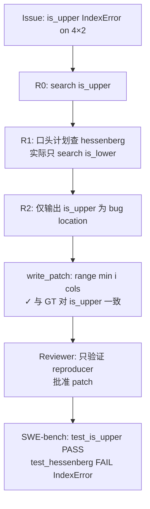

# 单案诊断临床报告：sympy__sympy-12454

> **分类**: C 类（Logic/Assertion Failure）  
> **模型**: deepseek-deepseek-chat  
> **任务目录**: `lite300_output/repos/sympy/applicable_patch/sympy__sympy-12454_2026-06-02_12-39-35/`  
> **评测结果**: L2 PASS（补丁可应用）→ L3 FAIL（`test_is_upper` 通过，`test_hessenberg` 仍失败）  
> **特殊性质**: 本案例属于 **「主 Bug 修对、兄弟 Bug 漏修」** 型 C 类失败——Agent 对 `is_upper` 的修复与人类补丁完全一致，但因遗漏同文件内结构对称的 `_eval_is_upper_hessenberg`，未通过 SWE-bench 完整验收。

---

## 0. 专有名词解释 (Glossary)

| 术语 | 解释 |
|------|------|
| **Upper Triangular Matrix（上三角矩阵）** | 主对角线**以下**的元素全为零的矩阵。对非方阵同样可定义：只检查「行号 > 列号」且**实际存在**的条目 |
| **Upper Hessenberg Matrix（上 Hessenberg 矩阵）** | 主对角线**下方第一条次对角线以下**的元素全为零。比上三角「宽松」一步：允许紧邻主对角线下方的非零元素 |
| **Tall Matrix（高矩阵）** | 行数 > 列数的矩阵（如 4×2）。此时某些行的「理论列索引」会超出 `self.cols - 1`，若循环上界未截断会触发 `IndexError` |
| **`_eval_is_*` 内部实现** | SymPy `MatrixProperties` 中 property 背后的实际逻辑。例如 `is_upper_hessenberg` property 调用 `_eval_is_upper_hessenberg()` |
| **`range(i)` vs `range(i+1, self.cols)`** | 前者从 0 遍历到 i-1，**不感知列数**；后者从 i+1 遍历到 cols-1，**天然以 `self.cols` 为上界**——这是 `is_lower` 安全而 `is_upper` 不安全的根本原因 |
| **`FAIL_TO_PASS`** | SWE-bench 指标：应用补丁 + test patch 后，原先失败的测试应变为通过。本实例为 `test_is_upper` 与 **`test_hessenberg`** |
| **`PASS_TO_PASS`** | 回归指标：原先通过的测试在应用 agent patch 后仍应通过。本实例 agent **未引入回归**（全部 153 项保持 success） |
| **Vacuous Truth（空真）** | 对高矩阵，主对角线以下「不存在」的格子无需检查；`all([])` 为 `True`，数学上这些位置视为自动满足 |

---

## 1. 原始问题快照 (Issue Snapshot)

### 1.1 Issue 原文

````text
is_upper() raises IndexError for tall matrices
The function Matrix.is_upper raises an IndexError for a 4x2 matrix of zeros.
```
>>> sympy.zeros(4,2).is_upper
Traceback (most recent call last):
  File "<stdin>", line 1, in <module>
  File "sympy/matrices/matrices.py", line 1112, in is_upper
    for i in range(1, self.rows)
  File "sympy/matrices/matrices.py", line 1113, in <genexpr>
    for j in range(i))
  File "sympy/matrices/dense.py", line 119, in __getitem__
    return self.extract(i, j)
  File "sympy/matrices/matrices.py", line 352, in extract
    colsList = [a2idx(k, self.cols) for k in colsList]
  File "sympy/matrices/matrices.py", line 5261, in a2idx
    raise IndexError("Index out of range: a[%s]" % (j,))
IndexError: Index out of range: a[2]
```
The code for is_upper() is
```
        return all(self[i, j].is_zero
                   for i in range(1, self.rows)
                   for j in range(i))
```
For a 4x2 matrix, is_upper iterates over the indices:
```
>>> A = sympy.zeros(4, 2)
>>> print tuple([i, j] for i in range(1, A.rows) for j in range(i))
([1, 0], [2, 0], [2, 1], [3, 0], [3, 1], [3, 2])
```
The attempt to index the (3,2) entry appears to be the source of the error. 
````

> 来源：[`problem_statement.txt`](../../../lite300_output/repos/sympy/applicable_patch/sympy__sympy-12454_2026-06-02_12-39-35/problem_statement.txt)

### 1.2 Issue 中文翻译

**标题**：`is_upper()` 对高矩阵（行数 > 列数）抛出 `IndexError`

**正文**：

- `Matrix.is_upper` 在 4×2 全零矩阵上访问时崩溃。
- 堆栈显示：在 `is_upper` 的双重循环中，`j` 取到 2，但矩阵只有 2 列（合法列索引为 0、1），`a2idx` 抛出 `IndexError: Index out of range: a[2]`。
- 问题代码：`for j in range(i)` 在 `i=3` 时产生 `j=0,1,2`，其中 `j=2` 越界。
- Reporter 已列出 4×2 矩阵上实际遍历的 `(i,j)` 对，并指出 `(3,2)` 是崩溃点。

### 1.3 核心诉求概括

| 维度 | 内容 |
|------|------|
| **报告了什么 Bug** | 非方阵（尤其高矩阵）调用 `Matrix.is_upper` 时，内层列循环未受 `self.cols` 约束，访问不存在的列索引 |
| **期望行为** | `sympy.zeros(4, 2).is_upper` 应返回 `True`（全零矩阵自然是上三角），且**不抛异常** |
| **实际行为** | 抛出 `IndexError: Index out of range: a[2]` |
| **Reporter 给出的修复方向** | 限制 `j` 的循环上界，使列索引不超过 `self.cols - 1` |

### 1.4 Issue 与 SWE-bench 验收的落差（重要）

Issue **只描述** `is_upper`，但 SWE-bench 对本实例的完整验收标准是：

| 来源 | 内容 |
|------|------|
| **`FAIL_TO_PASS`** | `test_is_upper` **和** `test_hessenberg`（两项都必须通过） |
| **`test_patch`** | 除在 `test_is_upper` 增加 `zeros(4,2)` 外，还在 `test_hessenberg` 增加 `zeros(5,2).is_upper_hessenberg` |
| **Ground Truth patch** | 同时修复 `is_upper` **与** `_eval_is_upper_hessenberg`（后者存在**完全相同**的越界模式） |
| **Issue hints** | 维护者评论「 worth checking if `is_lower()` has a similar issue」——但 `is_lower` 实际已用 `range(i+1, self.cols)` 安全实现；真正需要同步修复的是 **`is_upper_hessenberg`** |

> **结论**：Agent 若只读 Issue 正文，会以为「修 `is_upper` 一行就够」；SWE-bench 通过 test patch 隐式要求修复**同族矩阵性质检测**中的全部越界循环。

---

## 2. Agent 运行轨迹与思维链追踪 (Agent Trajectory & CoT Analysis)

### 2.1 整体运行概况

| 阶段 | 结果 |
|------|------|
| **Retry 次数** | 0（一次成功，Reviewer 即批准） |
| **检索轮次** | 3 轮（Round 0–1 各 1 次 API，Round 2 无 API 直接输出定位） |
| **Reproducer** | 有（外部工具复现 `zeros(4,2).is_upper` 的 IndexError） |
| **Patch 生成** | 1 次 write_patch，Reviewer 判定 patch-correct: yes |
| **最终提交** | `output_0/extracted_patch_0.diff`（仅 1 处修改） |
| **L3 评测** | `test_is_upper` ✅ · `test_hessenberg` ❌ · PASS_TO_PASS 153/153 ✅ |

> 来源：[`info.log`](../../../lite300_output/repos/sympy/applicable_patch/sympy__sympy-12454_2026-06-02_12-39-35/info.log)、[`report/instances/sympy__sympy-12454.json`](../../../lite300_output/repos/sympy/report/instances/sympy__sympy-12454.json)



### 2.2 Stage 1 工具调用时序

| 序号 | 轮次 | Agent 思维摘要 | 实际 API 调用 |
|------|------|----------------|---------------|
| 1 | **R0** | 「先看 `is_upper` 及上下文」 | `search_method_in_file("is_upper", "sympy/matrices/matrices.py")` |
| 2 | **R1** | 「也看 `is_lower` 是否有类似问题，**并检查 `is_upper_hessenberg`**」 | `search_method_in_file("is_lower", "sympy/matrices/matrices.py")` |
| 3 | **R2** | 「上下文足够，输出 bug location」 | **（无 API 调用）** |

> 来源：[`tool_call_layers.json`](../../../lite300_output/repos/sympy/applicable_patch/sympy__sympy-12454_2026-06-02_12-39-35/output_0/search/tool_call_layers.json)、[`search_round_*.json`](../../../lite300_output/repos/sympy/applicable_patch/sympy__sympy-12454_2026-06-02_12-39-35/output_0/search/)

**CoT 中计划但未执行的调用**（Round 1 assistant 消息明确提到 `is_upper_hessenberg`，但从未发起搜索）：

- `search_method_in_file("is_upper_hessenberg", ...)`
- `search_method_in_file("_eval_is_upper_hessenberg", ...)`
- `search_code_in_file("for j in range(i", ...)`

### 2.3 最终锚定的 Fault Location

| # | 文件 | 类 | 方法 | 行号 | intended_behavior |
|---|------|-----|------|------|-------------------|
| 1 | `sympy/matrices/matrices.py` | `MatrixProperties` | `is_upper` | L1113–1115 | 将 `for j in range(i)` 改为 `for j in range(min(i, self.cols))` |
| 2 | `sympy/matrices/matrices.py` | `MatrixProperties` | （整类上下文块） | L577–1150 | 仅作附加背景，**未标记 `_eval_is_upper_hessenberg` 为需修复位置** |

> 来源：[`bug_locations_after_process.json`](../../../lite300_output/repos/sympy/applicable_patch/sympy__sympy-12454_2026-06-02_12-39-35/output_0/search/bug_locations_after_process.json)

### 2.4 定位评估与认知偏差

#### 对 `is_upper`：**定位正确，修复逻辑正确**

- Agent 准确识别「`range(i)` 未截断列上界」是根因。
- 生成的 `range(min(i, self.cols))` 与 Ground Truth **逐字一致**。
- Reproducer 只覆盖 `is_upper`，内部 Reviewer 据此批准——**局部闭环自洽**。

#### 对完整任务：**定位不完整（漏掉兄弟方法）**

- `_eval_is_upper_hessenberg` 使用 `for j in range(i - 1)`，在 5×2 矩阵、i=3 时同样访问 `j=2` 越界。
- 该方法的 buggy 代码**已出现在** Location #2 的上下文块（L641–644），但检索阶段未将其列为独立 bug location。
- Patch 阶段 prompt 虽附带该上下文，Agent 仍选择「只改 Issue 明示的一处」。

#### 认知偏差详解

| 偏差 | 表现 | 产生原因 |
|------|------|----------|
| **Issue 隧道视野（Issue Tunnel Vision）** | 全程以 `is_upper` 为唯一修复目标；SWE-bench 要求的 `test_hessenberg` 完全未进入思维链 | Issue 标题/正文/堆栈均只指向 `is_upper`；Agent 未读取 `meta.json` 的 `FAIL_TO_PASS` / `test_patch` |
| **计划-执行断裂（Plan-Execution Gap）** | Round 1 CoT 写「check `is_upper_hessenberg`」，实际 API 只查了 `is_lower` | 中间推理被「维护者 hint：查 is_lower」带偏；`is_lower` 搜索完成后 Agent 误以为「兄弟方法已排查完毕」 |
| **安全模式误读** | 看到 `_eval_is_lower` 用 `range(i+1, self.cols)` 后，未反推「凡是用 `range(行号)` 作列上界的 `_eval_is_upper*` 都可能有问题」 | 只做了「是否存在 bug」的二元判断，未做「同文件内还有哪些相同反模式」的模式扫描 |
| **上下文块 ≠ 修复清单** | Location #2 整块 `MatrixProperties` 代码含 `_eval_is_upper_hessenberg`，Patch Agent 仍声明「only necessary changes」跳过 | Prompt 说「不必改每个 location」被过度解读为「忽略上下文中的其他 bug」 |
| **Reviewer 验收范围过窄** | Reviewer 只对照 reproducer（4×2 `is_upper`）给出 patch-correct: yes | 内部评测未模拟 SWE-bench test patch 中的 `zeros(5,2).is_upper_hessenberg` 用例 |
| **对称性推理缺失** | 未建立「上三角 ↔ 上 Hessenberg」在 tall matrix 下的共享边界契约 | 缺乏「矩阵结构性质检测」领域的领域知识：非方阵时必须 clamp 列索引 |

---

## 3. 失败补丁解剖 (Failed Patch Dissection)

### 3.1 Agent 失败补丁全文

> 说明：该补丁对 `is_upper` **本身是正确的**，但相对 SWE-bench 完整验收而言**不完整**，故仍归类为 C 类失败补丁。

```diff
diff --git a/sympy/matrices/matrices.py b/sympy/matrices/matrices.py
index 90ea232faf..c600fe88e2 100644
--- a/sympy/matrices/matrices.py
+++ b/sympy/matrices/matrices.py
@@ -1112,7 +1112,7 @@ def is_upper(self):
         """
         return all(self[i, j].is_zero
                    for i in range(1, self.rows)
-                   for j in range(i))
+                   for j in range(min(i, self.cols)))
 
     @property
     def is_zero(self):
```

> 来源：[`extracted_patch_0.diff`](../../../lite300_output/repos/sympy/applicable_patch/sympy__sympy-12454_2026-06-02_12-39-35/output_0/extracted_patch_0.diff)

### 3.2 逐行白话解释

| 行 | 内容 | 白话解释 |
|----|------|----------|
| `--- a/...` / `+++ b/...` | 标准 diff 头 | 声明只改 `sympy/matrices/matrices.py` 一个文件 |
| `@@ -1112,7 +1112,7 @@ def is_upper(self):` |  hunk 定位 | 修改点落在 `is_upper` property 的 return 语句 |
| `return all(self[i, j].is_zero` | 不变 | 仍检查「某些 `(i,j)` 位置元素是否全为零」 |
| `for i in range(1, self.rows)` | 不变 | 从第 2 行起检查（第 0 行以下无元素） |
| `- for j in range(i))` | **删除** | 旧逻辑：对第 i 行，检查列 0…i-1。**当 i ≥ cols 时会访问 ghost 列** |
| `+ for j in range(min(i, self.cols)))` | **新增** | 新逻辑：列上界 = min(行号, 总列数)。4×2 矩阵 i=3 时只查 j∈{0,1}，不再碰 j=2 |
| （无其他 hunk） | — | **未触及** 40 行外的 `_eval_is_upper_hessenberg`，后者仍用 `range(i-1)` |

### 3.3 Agent 为什么以为这样够用了？

1. **Issue 复现路径闭合**：Reporter 的 4×2 例子 + Reproducer 均只调用 `is_upper`；改完即可通过内部复现。
2. **数学推理自洽**：对高矩阵，主对角线以下「不存在」的列无需检查；`min(i, cols)` 精确对应「只查存在的、且位于对角线下方的格子」。
3. **Reviewer 正反馈强化**：「patch correctly limits inner loop to min(i, self.cols)」——Agent 收到错误信号，认为任务完成。
4. **Prompt 最小修改原则**：「only make necessary changes」被理解为「Issue 提到几处改几处」，而非「test_patch 暗示的所有相关方法都要改」。

---

## 4. 黄金标准对比 (Ground Truth Alignment)

### 4.1 人类正确补丁（Ground Truth）

> 来源：[`developer_patch.diff`](../../../lite300_output/repos/sympy/applicable_patch/sympy__sympy-12454_2026-06-02_12-39-35/developer_patch.diff)、[`meta.json`](../../../lite300_output/repos/sympy/applicable_patch/sympy__sympy-12454_2026-06-02_12-39-35/meta.json) 中 `task_info.patch`

```diff
diff --git a/sympy/matrices/matrices.py b/sympy/matrices/matrices.py
--- a/sympy/matrices/matrices.py
+++ b/sympy/matrices/matrices.py
@@ -641,7 +641,7 @@ def _eval_is_zero(self):
     def _eval_is_upper_hessenberg(self):
         return all(self[i, j].is_zero
                    for i in range(2, self.rows)
-                   for j in range(i - 1))
+                   for j in range(min(self.cols, (i - 1))))

     def _eval_values(self):
         return [i for i in self if not i.is_zero]
@@ -1112,7 +1112,7 @@ def is_upper(self):
         """
         return all(self[i, j].is_zero
                    for i in range(1, self.rows)
-                   for j in range(i))
+                   for j in range(min(i, self.cols)))
```

### 4.2 SWE-bench Test Patch（验收用例扩展）

```diff
--- a/sympy/matrices/tests/test_matrices.py
+++ b/sympy/matrices/tests/test_matrices.py
@@ -1225,6 +1225,8 @@ def test_is_upper():
     assert a.is_upper is True
     a = Matrix([[1], [2], [3]])
     assert a.is_upper is False
+    a = zeros(4, 2)
+    assert a.is_upper is True
 
@@ -1880,6 +1882,9 @@ def test_hessenberg():
     A = Matrix([[3, 4, 1], [2, 4, 5], [3, 1, 2]])
     assert not A.is_upper_hessenberg
 
+    A = zeros(5, 2)
+    assert A.is_upper_hessenberg
```

### 4.3 并排对比

| 维度 | Agent 失败补丁 | 人类正确补丁 |
|------|----------------|--------------|
| **修改处数** | 1 处（`is_upper`） | 2 处（`is_upper` + `_eval_is_upper_hessenberg`） |
| **`is_upper` 修复** | `range(min(i, self.cols))` | **相同** |
| **`_eval_is_upper_hessenberg`** | 未修改 | `range(min(self.cols, (i - 1)))` |
| **`is_lower` / `_eval_is_lower`** | 未修改（本身已安全） | 未修改 |
| **能否通过 `test_is_upper`** | ✅ | ✅ |
| **能否通过 `test_hessenberg`** | ❌ IndexError | ✅ |

### 4.4 核心分析：人类多考虑了什么？

#### 数学边界条件

1. **非方阵索引契约**：任何 `(i, j)` 访问必须满足 `0 ≤ j < self.cols`。上三角与上 Hessenberg 检查都违反此契约，只是 Hessenberg 的循环上界是 `i-1` 而非 `i`。
2. **Hessenberg 的有效检查区域**：对 5×2 矩阵，`_eval_is_upper_hessenberg` 在 i=3 时试图读 `(3,0),(3,1),(3,2)`——`(3,2)` 不存在。正确上界为 `min(cols, i-1) = min(2, 2) = 2`，即 `range(2)` → j∈{0,1}。
3. **Vacuous / 隐式真**：对 tall matrix，越界位置在数学上不属于矩阵，应视为「无需检验」而非「访问后报错」。

#### 设计契约（代码库内对照）

| 方法 | 列循环写法 | 对 tall matrix |
|------|-----------|----------------|
| `_eval_is_lower` | `range(i + 1, self.cols)` | ✅ 安全（上界为 cols） |
| `_eval_is_lower_hessenberg` | `range(i + 2, self.cols)` | ✅ 安全 |
| `is_upper`（修复前） | `range(i)` | ❌ 越界 |
| `_eval_is_upper_hessenberg`（修复前） | `range(i - 1)` | ❌ 越界 |
| `_eval_is_diagonal` | `range(self.cols)` 内层 | ✅ 安全 |

人类开发者在 PR 中**系统性地**修复了所有「列上界绑定行号、未绑定 cols」的 `_eval_is_upper*` 方法，而非只改 Issue 点名的一处。

#### Agent 失败补丁 vs 人类补丁的核心区别

- **不是算法错误**，而是**修复范围不足**：Agent 完成了 Issue 描述的 50%，未完成 SWE-bench test patch 隐含的另外 50%。
- Agent **已看到** `_eval_is_upper_hessenberg` 源码（在 Location #2 上下文），但未将其识别为**同一 bug class 的第二个实例**。
- 人类补丁的第二处修改 `min(self.cols, (i - 1))` 与 `min(i, self.cols)` 在 `i-1 < cols` 时等价；当 `i-1 ≥ cols` 时前者更直观地表达「最多检查 cols 个列索引」。

---

## 5. 评测报告与崩溃堆栈 (Evaluation Log & Traceback)

### 5.1 评测环境摘要

| 项目 | 值 |
|------|-----|
| **Eval log** | [`sympy__sympy-12454.deepseek-deepseek-chat.eval.log`](../../../lite300_output/repos/sympy/eval_logs/sympy__sympy-12454.deepseek-deepseek-chat.eval.log) |
| **测试命令** | `bin/test -C --verbose sympy/matrices/tests/test_matrices.py` |
| **补丁应用** | ✅ Apply patch successful |
| **SWE-bench 判定** | `RESOLVED_PARTIAL` — FAIL_TO_PASS 2 项中 1 成功 1 失败 |
| **Golden 对照** | 同 test 文件 137 passed；`test_hessenberg ok` |

### 5.2 SWE-bench 关键测试结果

| 测试 | Agent 补丁 | Golden 补丁 | 说明 |
|------|-----------|-------------|------|
| `test_is_upper` | ✅ ok | ✅ ok | Agent 修复生效 |
| `test_hessenberg` | ❌ **E**（Exception） | ✅ ok | **决定性失败项** |
| PASS_TO_PASS（153 项） | ✅ 全部 success | ✅ | 无回归 |

### 5.3 决定性失败：`test_hessenberg` 完整堆栈

````text
____________ sympy/matrices/tests/test_matrices.py:test_hessenberg _____________
  File ".../sympy/matrices/tests/test_matrices.py", line 1886, in test_hessenberg
    assert A.is_upper_hessenberg
  File ".../sympy/matrices/matrices.py", line 1069, in is_upper_hessenberg
    return self._eval_is_upper_hessenberg()
  File ".../sympy/matrices/matrices.py", line 643, in _eval_is_upper_hessenberg
    for i in range(2, self.rows)
  File ".../sympy/matrices/matrices.py", line 644, in <genexpr>
    for j in range(i - 1))
  File ".../sympy/matrices/dense.py", line 111, in __getitem__
    return self.extract(i, j)
  File ".../sympy/matrices/matrices.py", line 354, in extract
    colsList = [a2idx(k, self.cols) for k in colsList]
  File ".../sympy/matrices/matrices.py", line 5348, in a2idx
    raise IndexError("Index out of range: a[%s]" % (j,)
IndexError: Index out of range: a[2]
````

**触发路径**：

1. test patch 新增 `A = zeros(5, 2); assert A.is_upper_hessenberg`
2. `is_upper_hessenberg` property → `_eval_is_upper_hessenberg()`
3. i=3 时 `range(i-1) = range(2)` → j=0,1,**2**；j=2 对 2 列矩阵越界
4. 与 Issue 中 `is_upper` 的崩溃模式**同构**，只是循环上界差 1

### 5.4 其他异常（非 SWE-bench 判定项）

全文件运行还出现 9 个 `E`（如 `test_refine`、`test_eigen`、`test_matrix_norm` 等 `RecursionError`）。Golden eval 亦有 8 个类似 exception——属于 **SymPy 1.0 testbed 环境固有噪声**，不计入 FAIL_TO_PASS / PASS_TO_PASS。SWE-bench 对本实例的**唯一判定失败**是 `test_hessenberg`。

### 5.5 根本原因（Why Agent Patch Fails）

| 层次 | 原因 |
|------|------|
| **直接原因** | `_eval_is_upper_hessenberg` 仍使用未截断的 `range(i-1)`，test patch 的 5×2 用例触发 IndexError |
| **逻辑原因** | Agent 将 bug 等同于「`is_upper` 一个函数的问题」，未抽象为「凡 `range(行号)` 作列上界的矩阵性质检测均需 `min(..., self.cols)`」 |
| **流程原因** | 检索/Review/Patch 三阶段均未接入 `FAIL_TO_PASS` 或 `test_patch`，内部验收标准窄于 SWE-bench |
| **为何不是定位失败** | `sympy_failure_analysis.json` 标记 `localization_ok`——文件级定位正确，属 **C 类逻辑/范围不完整** 而非 A 类找错文件 |

---

## 6. 总结

Agent 在 **Issue 描述的局部范围内** 做出了**数学上正确**的修复：`is_upper` 的 `range(min(i, self.cols))` 与 Ground Truth 完全一致，`test_is_upper`  accordingly 通过。失败的根本原因在于 Agent **缺乏「同文件、同 bug class、兄弟方法」的系统性排查意识**——它在思维链中曾提到要检查 `is_upper_hessenberg`，却被 `is_lower` 的 hint 带偏且从未真正检索；Patch 阶段虽收到了含 `_eval_is_upper_hessenberg` 的完整类代码，仍因「最小修改 + Issue 隧道视野」只改一处。本质上，Agent 理解「非方阵列索引不能越界」这一语义，但**未将其泛化为 MatrixProperties 中所有对称循环的修复契约**，也**未将 SWE-bench test patch 视为隐式需求规格**。

---

## 7. Prompt 静态语义注入建议（可泛化）

以下建议面向「矩阵/数组索引类 Bug」及更一般的「Issue 范围 ⊂ CI 验收范围」场景，不局限于本题。

### 7.1 非方阵矩阵性质检测 — 索引边界契约

```text
【矩阵性质检测 — 非方阵索引契约】
在 SymPy MatrixProperties（及类似矩阵库）中，任何通过 self[i,j] 遍历元素的性质检测，
内层列循环上界 MUST 满足 j < self.cols。

危险模式（对 tall matrix 会 IndexError）：
  - for j in range(i)          # is_upper
  - for j in range(i - 1)      # is_upper_hessenberg
  - for j in range(row_index)  # 任意以行号作列上界

安全模式（可参考对照）：
  - for j in range(i + 1, self.cols)   # is_lower — 上界天然为 cols
  - for j in range(min(i, self.cols))  # is_upper 修复后

修复 checklist：
  1. 定位 Issue 指出的方法
  2. search_code_in_file("for j in range(i", file) 扫描同文件所有实例
  3. 对每个 _eval_is_* / is_* 方法验证：列索引是否 clamp 到 self.cols
  4. 若 Issue 只提 is_upper，仍须检查 is_upper_hessenberg / is_lower_hessenberg 等对称 API
```

### 7.2 Issue 范围 vs CI 验收 — test_patch 优先

```text
【SWE-bench 验收对齐】
Issue 正文描述 ⊆ 实际 FAIL_TO_PASS 测试范围 的情况很常见。

在 write_patch 之前 MUST 知晓（若 meta/task_info 可用）：
  - FAIL_TO_PASS 列表中的每个 test 函数名
  - test_patch 新增的具体断言（如 test_hessenberg 中的 zeros(5,2)）

规则：补丁 MUST 使 FAIL_TO_PASS 中每一项对应的代码路径均可执行且不抛异常。
不能仅因 Issue reproducer 通过即宣告完成。
```

### 7.3 检索阶段 — 反模式扫描而非单点锚定

```text
【检索完成条件 — 反模式扩展】
当 Issue 涉及「循环索引越界」时，检索阶段 bug_locations 输出前 MUST：

1. 对触发 bug 的循环模式做 codebase 级 search_code（如 "range(i)" 在 matrices.py）
2. 列出所有匹配方法，而非只锚定堆栈顶层函数
3. 对每个匹配项标注：safe（已含 self.cols）/ unsafe（需修复）

禁止：CoT 中提到「还要查 X」但未发起对应 API 即输出 bug_locations。
```

### 7.4 Patch 阶段 — 上下文块中的「可见未改」审计

```text
【Patch 审计 — 兄弟方法】
当 bug_locations 附带整个 class 的代码块时，Patch Agent MUST：

1. 扫描块内所有 _eval_is_* 方法
2. 标记与当前 fix 使用相同索引模式的函数
3. 若 test_patch / FAIL_TO_PASS 暗示相关测试（如 test_hessenberg ↔ is_upper_hessenberg），
   即使 Issue 未提及，也 MUST 一并修复或明确说明为何不修

「You do not have to modify every location」≠「忽略上下文中已可见的相同 bug class」。
```

### 7.5 Reviewer — 扩展验收用例

```text
【Reviewer 语义 — 超越 Reproducer】
内部 Reviewer 除对照 reproducer 外，SHOULD：

1. 对非方阵代码路径构造至少一个 rows > cols 的 smoke test
2. 若 fix 涉及 is_upper，自动追加 is_upper_hessenberg 的 zeros(rows, cols) 调用
3. 若 patch 只改一处但上下文存在相同 range 模式，判定 patch-incomplete 而非 patch-correct
```

### 7.6 数学语义 — Tall/Wide 矩阵空真

```text
【非方阵结构性质 — 空真语义】
上三角 / Hessenberg 等性质定义在「矩阵存在的元素」上。

对 tall matrix（rows > cols）：
  - 主对角线以下、列号 ≥ cols 的「虚拟位置」不属于矩阵
  - 正确实现：只 iterate 0 ≤ j < min(理论上界, self.cols)
  - all([]) 为 True — 无需访问 ghost cells

此语义适用于任何「按 (i,j) 几何位置定义、但矩阵非方阵」的判定函数。
```

---

## 8. 文档审查反思

| 检查项 | 结论 |
|--------|------|
| Issue 原文是否完整引用 | ✅ 与 `problem_statement.txt` 一致 |
| Agent 工具调用时序是否准确 | ✅ 与 `tool_call_layers.json` 一致（2 次 API + 1 轮空） |
| 失败补丁是否完整 | ✅ 与 `extracted_patch_0.diff` 一致 |
| Ground Truth 是否准确 | ✅ 与 `developer_patch.diff` / `meta.json` 一致 |
| 失败根因是否为 `test_hessenberg` | ✅ 与 `report/instances/sympy__sympy-12454.json` 及 eval log L10168–10185 一致 |
| Agent `is_upper` 修复是否正确 | ✅ 已明确说明「局部正确、全局不完整」，避免误读为「补丁逻辑错误」 |
| 9 个 RecursionError 是否误判为 SWE 失败 | ✅ 已说明为环境噪声，Golden 亦有类似 exception |
| 认知偏差是否有轨迹证据 | ✅ 引用 search_round CoT 中 hessenberg 计划未执行 |
| Prompt 建议是否可泛化 | ✅ 面向索引边界 / test_patch 对齐 / 反模式扫描 |

**无重大遗漏。** 本案例的核心教训是 C 类失败并不总是「修错了」，而常常是「修对了但没修全」——静态语义注入应强化 **bug class 泛化** 与 **CI 规格对齐**，而非仅加深对单个函数的理解。

---

## 附录：关键文件索引

| 用途 | 路径 |
|------|------|
| Issue | `lite300_output/repos/sympy/applicable_patch/sympy__sympy-12454_2026-06-02_12-39-35/problem_statement.txt` |
| Agent log | `.../info.log` |
| 检索结果 | `.../output_0/search/bug_locations_after_process.json` |
| Agent 补丁 | `.../output_0/extracted_patch_0.diff` |
| 人类补丁 | `.../developer_patch.diff` |
| SWE 元数据 | `.../meta.json` |
| Eval log | `lite300_output/repos/sympy/eval_logs/sympy__sympy-12454.deepseek-deepseek-chat.eval.log` |
| 评测报告 | `lite300_output/repos/sympy/report/instances/sympy__sympy-12454.json` |
