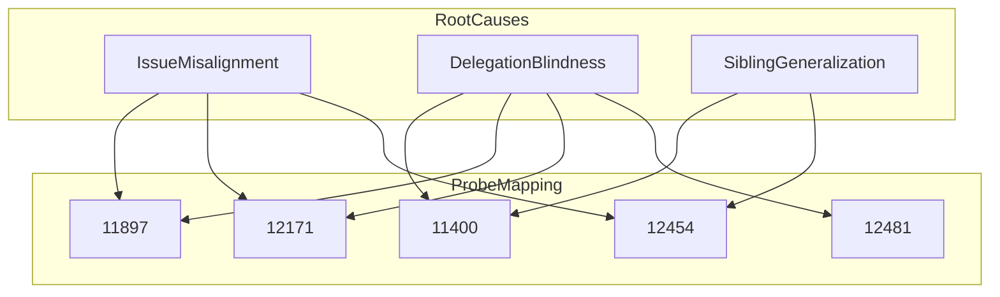
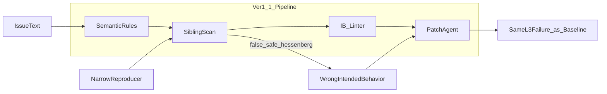

# 五宗典型 C 类探针：Baseline / ver1 / ver1.1 失败原因对比分析报告

> **文档类型**：ver1.1 优化效果诊断 · 探针集横向对比  
> **覆盖 Instance**：sympy__sympy-11400、11897、12171、12454、12481  
> **数据来源**：
> - Baseline 临床报告：[`document/baseline/sympy/`](../baseline/sympy/)
> - ver1 临床报告：[`document/ver1/sympy/`](../ver1/sympy/)（11400 / 12171 / 12454；11897 / 12481 无独立 ver1 文档，辅以 eval 日志）
> - ver1.1 运行工件：`lite300_output_ver1.1/repos/sympy/`、`experiment/deepseek-lite-300-ver1.1/repos/sympy/`
> - 跨案知识库：[`sympy_c_class_cross_case_knowledge.md`](../baseline/sympy/sympy_c_class_cross_case_knowledge.md)
> - 聚合分析：[`my_reproduction_analysis.md`](../my_reproduction_analysis.md)

---

## 目录

1. [执行摘要](#1-执行摘要)
2. [评测结果总览](#2-评测结果总览)
3. [跨版本失败范式归纳](#3-跨版本失败范式归纳)
4. [逐案对比分析](#4-逐案对比分析)
5. [ver1.1 机制为何未闭合探针失败](#5-ver11-机制为何未闭合探针失败)
6. [对模块一（规范解析智能体）的启示](#6-对模块一规范解析智能体的启示)
7. [附录：关键证据索引](#7-附录关键证据索引)

---

## 1. 执行摘要

本报告针对 SymPy 77 题集中 **5 宗典型 C 类（Logic/Assertion Failure）探针**，对比 Baseline、ver1（软语义规则注入）、ver1.1（规范驱动 + 机械门禁 + Sibling Scan + Intended Behavior Linter）三版流水线的失败根因，并解释 **ver1.1 为何未能改善其中 4 题、且使 11897 出现工程退化**。

**核心结论（一句话）**：ver1.1 的机械约束提升了「过程可观测性」，但未能在探针集上把 **Issue 语义 → 可执行规范 → 类内拓扑闭合** 这条链打通；对 printing 族的 **委托链/前置依赖** 与 matrices 族的 **兄弟方法 CO_FIX** 两类根因，门禁要么未触发、要么触发方向错误，反而增加了 L2 解析失败与 Search 成本。

| 探针 | Baseline | ver1 | ver1.1 | ver1.1 相对 ver1 |
|------|----------|------|--------|------------------|
| 11400 | L3 FAIL | L3 FAIL | L3 FAIL | 无改善（仍缺 Relational + Piecewise 格式契约） |
| 11897 | L3 FAIL | L3 FAIL | **L2 Unparsed** | **退化**（未进 L3） |
| 12171 | L3 FAIL | L3 FAIL | L3 FAIL | 无改善（仍草稿锚定 + scope creep） |
| 12454 | L3 FAIL | L3 FAIL | L3 FAIL | 无改善（sibling_scan 误判 hessenberg 为 safe） |
| 12481 | L3 FAIL | **L3 PASS** | **L3 PASS** | **维持 ver1 增益**（守卫最小修改） |

**五题中 ver1.1 唯一明确受益的仍是 12481**（与 ver1 相同）；11400 / 12171 / 12454 三题 L3 失败签名与 Baseline 实质相同；11897 从「能进 L3 但失败」恶化为「L2 无法解析补丁」。

---

## 2. 评测结果总览

### 2.1 L2 / L3 结果矩阵

| Instance | 模块 | Baseline L2→L3 | ver1 L2→L3 | ver1.1 L2→L3 | FAIL_TO_PASS 关键项 |
|----------|------|----------------|------------|--------------|---------------------|
| **11400** | printing/ccode | PASS → **FAIL** | PASS → **FAIL** | PASS → **FAIL** | `test_ccode_sinc`, `test_ccode_Relational` |
| **11897** | printing/latex | PASS → **FAIL** | PASS → **FAIL** | **Unparsed×3** → N/A | `test_latex_Piecewise`（GT 仅改 `_needs_mul_brackets`） |
| **12171** | printing/mathematica | PASS → **FAIL** | PASS → **FAIL** | PASS → **FAIL** | `test_Derivative`（`test_Pow` 为 PASS→FAIL 回归） |
| **12454** | matrices | PASS → **FAIL** | PASS → **FAIL** | PASS → **FAIL** | `test_is_upper` ✅ · **`test_hessenberg` ❌** |
| **12481** | combinatorics | PASS → **FAIL** | PASS → **PASS** | PASS → **PASS** | `test_args` |

### 2.2 定量背景（SymPy 77 全集）

据 [`my_reproduction_analysis.md`](../my_reproduction_analysis.md)：

- Baseline Resolved@L3：**24/77（31.17%）**
- ver1 Resolved@L3：**26/77（33.77%）**，净增 2 题
- ver1.1 Resolved@L3：**16/77（20.78%）**，较 Baseline **−10.39pp**，较 ver1 **−13.99pp**

本探针集是 ver1 抽象 Bug Class 的直接来源，但 ver1.1 在全集上的回撤说明：**针对这五题设计的改进机制，尚未在端到端上稳定转化为 L3 增益**；12481 属于「守卫 vs 核心逻辑分离」类问题的成功样本。

---

## 3. 跨版本失败范式归纳

依据 [`sympy_c_class_cross_case_knowledge.md`](../baseline/sympy/sympy_c_class_cross_case_knowledge.md)，五题可归为三种泛化范式；下表说明各版本是否触及根因。

| 范式 | 含义 | 主要覆盖 | Baseline | ver1 | ver1.1 |
|------|------|---------|----------|------|--------|
| **A：Issue 锚定错位** | 把 Issue 草稿/症状当完整规格 | 11897, 12171, 12454 | ❌ | ❌（规则被淹没） | ❌（Linter 未 block 草稿规格） |
| **B：架构层/委托链盲区** | 错层打补丁或未复用邻居基础设施 | 11400, 11897, 12171, 12481 | ❌ | ❌ | ❌（11400/12171）；12481 ✅ |
| **C：Bug Class 泛化不足** | 修触发点未修兄弟/前置依赖 | 12454, 11400 | ❌ | ❌ | ❌（scan 表误判） |



---

## 4. 逐案对比分析

### 4.1 sympy__sympy-11400 — CCodePrinter / sinc + Relational

#### 问题本质

`ccode(sinc(x))` 应通过 **Piecewise + Ne** 委托既有 `_print_Piecewise` 链输出多行三元表达式；同时必须新增 **`_print_Relational`**，否则 `Ne`/`Eq` 无法渲染为 C 的 `!=`/`==`。

#### 三版失败签名

| 版本 | L3 | 失败测试 | 补丁特征 |
|------|-----|---------|---------|
| Baseline | FAIL | `test_ccode_sinc`, `test_ccode_Relational` | inline 三元 `((x==0)?1:sin(x)/x)`，无 `_print_Relational` |
| ver1 | FAIL | 同上 | 与 Baseline **语义等价**；conv_patch_0 曾用 Piecewise 委托，被 Reproducer 误导 **架构回退** |
| ver1.1 | FAIL | 同上（30 passed, 2 failed） | 有 Piecewise 委托尝试，但用 **Eq 而非 Ne**，仍缺 `_print_Relational` |

ver1.1 选中补丁（`extracted_patch_1.diff`）片段：

```python
return self._print(Piecewise((1, Eq(arg, 0)), (sin(arg)/arg, True)))
```

SWE-bench 期望：`Ne(x, 0)` + 精确多行格式 + `_print_Relational` 六关系运算符。

#### Baseline 根因（摘自临床报告）

1. 将 Printer 问题当作「字符串翻译」而非 AST 组合委托（范式 B2）。
2. 只加 `_print_sinc`，遗漏 `_print_Relational` 前置依赖（范式 C）。
3. 内部 Reproducer/Reviewer 验收过窄（范式 A 次因）。

#### ver1 相对 Baseline 的变化与未解决问题

- **过程**：语义规则已注入；首轮补丁曾接近 GT 架构。
- **结果**：Reproducer 因 Relational 未实现而误判 Piecewise 方案失败 → Reviewer 反馈推动 inline 回退（BC-ARCHITECTURE-ROLLBACK）。
- **结论**：软规则无法对抗 **窄复现闭环 + 反馈放大**。

#### ver1.1 依旧失败的原因

1. **`sibling_scan` 为空**（`localization_artifact.json`），未识别「Relational 是 Piecewise 条件的前置依赖」这一跨-handler 依赖。
2. **`intended_behavior` 仍为 Issue 窄规格**：「Print sinc(x) as sin(x)/x」，`spec_source=issue_example`——未升格为「Piecewise 委托 + Relational 支持」双点契约。
3. **Linter 未 block**：规格未要求 `_print_Relational`；Patch Linter 未检测「Piecewise 条件含未打印 Relational 节点」。
4. ver1.1 相对 ver1 **未复现**「conv_patch_0 正确委托后被回退」链（可能因 patch 轮次/选择不同），但 **最终 L3 签名与 Baseline 相同**，说明机械门禁未导向 GT 双点修复。

---

### 4.2 sympy__sympy-11897 — LatexPrinter / Piecewise 括号

#### 问题本质

Issue 描述 broad 的 LaTeX vs pretty 不一致（`exp(-x)`、分数展开），但 **SWE-bench 隐藏验收**仅为：在 `_needs_mul_brackets` 中对 `expr.is_Piecewise` 返回 `True`，使 `A * Piecewise(...)` 输出 `\left(...\right)`。

#### 三版失败签名

| 版本 | 最高到达阶段 | 失败表现 |
|------|-------------|---------|
| Baseline | L3 FAIL | 改 `_print_Mul` + `denom.is_Add` → **RecursionError×9** + `test_latex_Piecewise` FAIL |
| ver1 | L3 FAIL | 定位退化 `bug_locations: []`；`_print_Mul` 类改动 → 大量 PASS_TO_PASS 失败 |
| ver1.1 | **L2 Unparsed（terminal）** | 3 次 retry 均 `RAW_PATCH_BUT_UNPARSED`；**未进 L3** |

#### Baseline 根因

1. **Issue 锚定错位**（范式 A）：被 `exp(-x)`、`1/(x+y)/2` 吸引，修格式化层 `_print_Mul` 而非括号决策层 `_needs_mul_brackets`。
2. **架构层混淆**（范式 B1）：`denom.is_Add` 绕过触发 `_print_Mul ↔ _print_Pow` 互递归。
3. Issue 与 hidden test 落差：真实验收是 Piecewise 括号，非 Issue 前两例。

#### ver1 相对 Baseline

- 检索曾触及 `_needs_mul_brackets`，但最终 **空 bug_locations** 或错误层补丁。
- 规则在 prompt 中存在，**末轮规格仍被 Issue 症状锚定**（BC-RULE-DROWNED）。
- L3 失败模式与 Baseline 不同（更多 PASS_TO_PASS 回归），但仍是 C 类逻辑失败。

#### ver1.1 失败原因（含工程退化）

1. **L2 Unparsed**：最终 retry 的 `extract_status.json` 三项均为 `RAW_PATCH_BUT_UNPARSED`——补丁正文已生成，但 `post_process` 无法解析为可应用 diff。
2. **流水线异常**：`instance_pipeline.log` 多次出现 `list index out of range`（batch 汇总阶段），该 instance 在 `with_logs` 中 **缺失**（`report.json` 有 generate/applied 但无 L3 log）。
3. **机制层面**：多轮 Search + Linter rewrite + Sibling Scan 专用 LLM 步 **拉长对话**，提高 patch 格式失控概率；对「只需改一行 `_needs_mul_brackets`」的题 **过度工程化**。
4. **对比 Baseline/ver1**：至少能产出可应用补丁并在 L3 暴露 true failure；ver1.1 在 **收敛性** 上退步，属于 ver1.1 全集 Resolved 下降的重要子类型。

---

### 4.3 sympy__sympy-12171 — MCodePrinter / Derivative

#### 问题本质

为 `Derivative` 新增 `_print_Derivative`，格式须对齐同文件 `_print_Integral` / `_print_Sum` 的 **`Hold[Operator[...]]` + `doprint` join**；Issue 提到的 Float 格式化 **不在 CI 验收范围**，override `_print_Float` 会回归 `test_Pow`。

#### 三版失败签名

| 版本 | L3 | 失败测试 | 补丁 |
|------|-----|---------|------|
| Baseline | FAIL | `test_Derivative`, `test_Pow` | `_print_Derivative` 无 Hold + `_print_Float` scope creep |
| ver1 | FAIL | 同上 | 与 Baseline **语义等价**（+7 行相同结构） |
| ver1.1 | FAIL | 同上（8 passed, 2 failed） | **字节级相同错误模式** |

ver1.1 补丁：

```python
def _print_Derivative(self, expr):
    return "D[%s]" % (self.stringify(expr.args, ", "))
def _print_Float(self, expr):
    res = str(expr)
    return res.replace('e', '*^')
```

期望：`Hold[D[Sin[x], x]]`；Float 应继承 `StrPrinter`。

#### Baseline / ver1 根因

1. **Issue 草稿当权威**（范式 A）：Reporter 内嵌代码缺少 Hold 包装。
2. **未读邻居契约**（范式 B3）：同文件 Integral/Sum 已展示正确模式。
3. **Scope creep**（范式 A）：未验收子问题 Float 引入 PASS→FAIL。

ver1 加深了父类检索，但 **`intended_behavior` 仍复述 Issue 草稿**；语义规则为软约束，Patch Agent 服从错误规格。

#### ver1.1 依旧失败的原因

1. **L2 证据三角未触发 block**：`spec_source=issue_example` 被允许通过（设计如此：Issue 正确时不误杀），但本题 Issue **不完整**。
2. **ContractFeatureSet / Neighbor Template Fallback 未生效**：未强制对齐 `_print_Integral` 的 `Hold[...]` + `doprint` 委托特征。
3. **`MODULE_PATTERN_SCAN` 未阻止 scope creep**：Float handler 无 scan 证明 needs_fix=yes，仍被 Patch 加入。
4. ver1.1 的 **机械门禁针对「与邻居冲突」**，而非「Issue 本身不完整」——对本题无效。

---

### 4.4 sympy__sympy-12454 — MatrixProperties / is_upper + hessenberg

#### 问题本质

`is_upper` 与 `_eval_is_upper_hessenberg` 共享 **AP-MATRIX-DIM-UNCLAMPED**：`for j in range(i)` 在高矩阵上列索引越界。GT 同步修改两处 `range(min(i, self.cols))`。

#### 三版失败签名

| 版本 | L3 | test_is_upper | test_hessenberg | Agent 补丁 |
|------|-----|---------------|-----------------|------------|
| Baseline | FAIL | ✅ | ❌ IndexError | 仅 `is_upper` |
| ver1 | FAIL | ✅ | ❌ | **与 Baseline diff 相同** |
| ver1.1 | FAIL | ✅ | ❌ | **仍仅 `is_upper`** |

#### Baseline 根因（范式 C）

- `is_upper` 修复与 GT **第一 hunk 逐字一致**，但遗漏兄弟 `_eval_is_upper_hessenberg`。
- CoT 曾计划查 hessenberg，未执行；上下文块已含 hessenberg 源码但未泛化。

#### ver1 相对 Baseline

- 检索 **更深**：实际调用 `_eval_is_upper_hessenberg`、`_eval_is_lower` API。
- 仍得出「只修 is_upper」——**Sibling Audit 规则未被执行**。
- 最终补丁与 Baseline **字节相同**；过程成本更高，结果零增益。

#### ver1.1 依旧失败的原因（关键反例）

ver1.1 的 `localization_artifact.json` **已有完整 sibling_scan**，但存在 **致命误判**：

| method | needs_fix | scope_proof（摘要） |
|--------|-----------|---------------------|
| `is_upper` | **yes** | Issue repro IndexError |
| `is_upper_hessenberg` | **no** | 「Delegates to _eval…; **no repro for tall matrices**」 |
| `_eval_is_upper_hessenberg` | （未单独列出为需修） | — |

**失败机理**：

1. **Reproducer 隧道**：内部 reproducer 只测 `is_upper`，scan 表据此将 hessenberg 判为 safe——正是 ver1.1 规则 ISSUE_SCOPE 要防的 **BC-ISSUE-TUNNEL**，但 scan 仍被 repro 窄闭环误导。
2. **CO_FIX 未触发**：`is_upper` 与 `_eval_is_upper_hessenberg` 同 anti_pattern_id，按规则应齐修；但 scan 将 hessenberg **needs_fix=no**，决策树走「仅修 Issue 点名处」。
3. **Linter 通过错误规格**：`intended_behavior` 只描述 `is_upper` 的 clamp，未要求 hessenberg 同步。
4. ver1.1 在本题上 **比 ver1 多了 scan artifact，但 artifact 内容错误**，属于「规范驱动反而固化错误结论」。

---

### 4.5 sympy__sympy-12481 — Permutation / non-disjoint cycles

#### 问题本质

守卫 `has_dups` 对 cyclic form 过严；GT **仅**改守卫为 `if has_dups(temp) and not is_cycle`，**保留**下游 `Cycle()` 合成逻辑。

#### 三版结果对比

| 版本 | L3 | 补丁策略 |
|------|-----|---------|
| Baseline | **FAIL** | 守卫 ✅ + **重写 Cycle 合成路径** ❌ → `test_args` 数学语义错误 |
| ver1 | **PASS** | 最小守卫修改；候选中选择 GT 等价补丁 |
| ver1.1 | **PASS** | 同上；`selected_patch.json` 选中 `extracted_patch_4.diff`（守卫-only） |

ver1.1 选中补丁：

```python
if has_dups(temp) and not is_cycle:
    raise ValueError('there were repeated elements.')
```

Agent 选择理由（摘要）：「minimal change… leaving existing cycle composition logic」——与 ver1.1 **GUARD vs CORE 分离** 规则一致。

#### 为何 ver1 / ver1.1 成功而 Baseline 失败

1. Baseline **过度修复**（范式 B4）：混淆 array form 赋值与置换复合。
2. ver1 语义规则强调「Error message 提示用 Cycle → 说明 Cycle 路径已正确」。
3. ver1.1 强化 **守卫 vs 核心逻辑分离** + Patch 选择 commentary 倾向 minimal guard。
4. Issue 举例窄于 hidden test（`[[0,1],[0,1]]` vs `[[0,1],[0,2]]`），但 **正确守卫 + 保留 Cycle 合成** 对更一般情形仍成立——本题规则与 GT 对齐。

**本题说明 ver1.1 机制并非无效**，而是 **仅在与 Issue 结构简单、GT 为最小守卫类修复时有效**；对 printing 委托链、矩阵兄弟齐修无效。

---

## 5. ver1.1 机制为何未闭合探针失败

### 5.1 设计目标 vs 探针结果对照

| ver1.1 机制 | 设计意图 | 11400 | 11897 | 12171 | 12454 | 12481 |
|-------------|---------|-------|-------|-------|-------|-------|
| 模块族规则 + 末轮 Checklist | 抗 Rule Drowning | ❌ 仍窄 spec | ❌ Unparsed | ❌ 草稿 spec | ❌ scan 误判 | ✅ |
| sibling_scan artifact | CO_FIX 兄弟齐修 | ❌ 空 scan | — | ❌ 未阻 creep | ❌ **反向误导** | — |
| intended_behavior_linter | 规格投毒 block | ❌ issue_example 放行 | — | ❌ | ❌ | ✅ |
| ContractFeatureSet | 邻居契约对齐 | ❌ | — | ❌ | — | — |
| Patch architecture linter | 防 inline 回退 | — | — | ❌ | — | ✅ |

### 5.2 三类系统性缺口

**缺口 1：规范源仍是 Issue，而非「Issue + Hidden 契约差」**

- 四题失败均涉及 **Issue 范围 ⊂ 真实修复范围**（11400 Relational、11897 Piecewise 括号、12454 hessenberg、12171 排除 Float）。
- ver1.1 的 `spec_source=issue_example` 路径 **刻意保护 Issue 正确场景**，但未区分「Issue 不完整」——缺少模块一将要做的 **Structured Specification + acceptance_criteria 泛化**。

**缺口 2：Sibling Scan 依赖 Reproducer，复现窄则 scan 假阴**

- 12454 是 ver1.1 最清晰的 **负向证据**：scan 表写入 artifact 却将 hessenberg 标 safe。
- 规则写在 prompt 里，**scan 输出作为结构化真相** 反而压制了 CO_FIX。

**缺口 3：工程收敛性侵蚀全集效能**

- 11897 的 L2 Unparsed 代表 **patch 解析/多轮 rewrite 失败** 子类。
- 全集 77 题中大量 instance 无法稳定到达 L3，拉低 Resolved@L3 至 16/77——**不是单题 patch 质量单调变差**，而是 **管道 throughput 下降**。



### 5.3 ver1 → ver1.1 探针集净效果

| 变化类型 | 探针 |
|---------|------|
| **改善并维持** | 12481（Baseline FAIL → ver1/ver1.1 PASS） |
| **无变化** | 11400, 12171, 12454（L3 失败签名不变） |
| **退化** | 11897（L3 FAIL → L2 Unparsed） |

ver1 对 12481 的 +1 增益 ver1.1 **保留**；ver1.1 未在其余四题上兑现「机械门禁 → 契约闭合」承诺，且 **11897 证明门禁可损害工程可达性**。

---

## 6. 对模块一（规范解析智能体）的启示

基于本探针对比，模块一 `spec_parser` 应优先补齐 ver1.1 **未结构化** 的三类信息：

| 探针教训 | 模块一应对 |
|---------|-----------|
| Issue 与 hidden test 落差（11897, 12454, 12481） | `acceptance_criteria` 强制写入 **generalization gap** must/should 项 |
| Relational 为 Piecewise 前置（11400） | 从 Issue 线索 + 仓库依赖图抽取 **prerequisite handlers** |
| Reproducer 窄导致 scan 假阴（12454） | 沙箱校准脚本覆盖 **同 anti-pattern 兄弟**，不仅 Issue 点名 API |
| Issue 草稿非完整规格（12171） | `constraints` 标注 Reporter 草稿；`goals` 对齐邻居契约而非草稿 API |
| 守卫 vs 核心分离（12481 成功） | `failure_anchor.named_entities` + 规则「勿重写已验证下游逻辑」写入 SWM |

**结论**：ver1.1 验证了「仅在后端加 Linter/Scan 而不改 **上游规范**」不足；模块一作为流水线 **前置** 写入 SWM，是闭合 BC-ISSUE-TUNNEL、BC-ISSUE-DRAFT-ANCHOR 的必要条件，且需与 **宽于 Issue 的验收脚本** 联动，避免 12454 类 scan 假阴。

---

## 7. 附录：关键证据索引

| Instance | 文档 / 工件 |
|----------|------------|
| 11400 Baseline | [`baseline/sympy/sympy__sympy-11400.md`](../baseline/sympy/sympy__sympy-11400.md) |
| 11400 ver1 | [`ver1/sympy/sympy__sympy-11400.md`](../ver1/sympy/sympy__sympy-11400.md) |
| 11400 ver1.1 patch | `lite300_output_ver1.1/.../sympy__sympy-11400_.../output_2/extracted_patch_1.diff` |
| 11400 ver1.1 artifact | `.../output_2/search/localization_artifact.json`（`sibling_scan: []`） |
| 11897 Baseline | [`baseline/sympy/sympy__sympy-11897.md`](../baseline/sympy/sympy__sympy-11897.md) |
| 11897 ver1.1 | `.../sympy__sympy-11897_.../output_2/extract_status.json`（全 Unparsed） |
| 11897 pipeline | `lite300_logs/profiles/ver1.1/instance_pipeline.log`（L2 terminal Unparsed） |
| 12171 Baseline | [`baseline/sympy/sympy__sympy-12171.md`](../baseline/sympy/sympy__sympy-12171.md) |
| 12171 ver1 | [`ver1/sympy/sympy__sympy-12171.md`](../ver1/sympy/sympy__sympy-12171.md) |
| 12171 ver1.1 patch | `.../sympy__sympy-12171_.../output_2/extracted_patch_0.diff` |
| 12454 Baseline | [`baseline/sympy/sympy__sympy-12454.md`](../baseline/sympy/sympy__sympy-12454.md) |
| 12454 ver1 | [`ver1/sympy/sympy__sympy-12454.md`](../ver1/sympy/sympy__sympy-12454.md) |
| 12454 ver1.1 scan | `.../sympy__sympy-12454_.../output_1/search/localization_artifact.json` |
| 12481 Baseline | [`baseline/sympy/sympy__sympy-12481.md`](../baseline/sympy/sympy__sympy-12481.md) |
| 12481 ver1.1 选中 | `.../sympy__sympy-12481_.../selected_patch.json` + `output_1/extracted_patch_4.diff` |
| 跨案矩阵 | [`baseline/sympy/sympy_c_class_cross_case_knowledge.md`](../baseline/sympy/sympy_c_class_cross_case_knowledge.md) |
| ver1.1 全集 report | `lite300_output_ver1.1/repos/sympy/report/report.json` |

---

*报告版本 v1.0.0 · 生成于 model1 文档目录*
