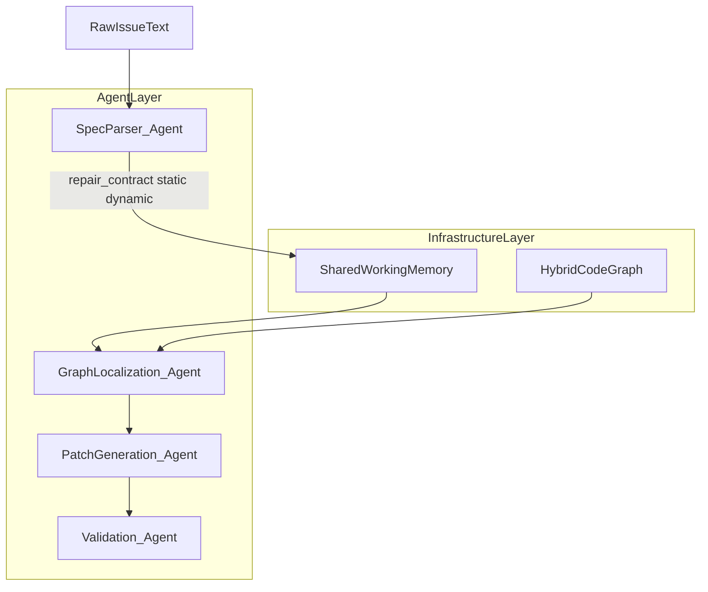
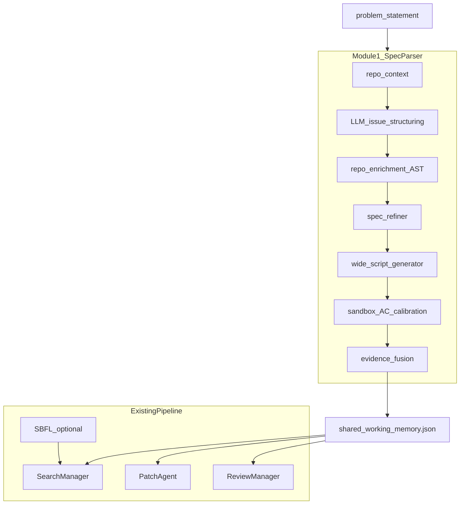

# 模块一：规范解析智能体（Specification Parsing Agent）搭建与集成计划

> **项目**：《面向复杂软件的 Issue 自动化处理智能体》（中国科学院大学本科生创新训练计划）  
> **模块定位**：智能体层 · 模块一 —— 规范解析智能体（`spec_parser`）  
> **基座框架**：[autoCodeRover](https://github.com/nus-apr/auto-code-rover)  
> **文档版本**：v2.2.0  
> **状态**：v2.2 实施中（M10–M15 Search 契约增强）  
> **修订说明（v2.2）**：P1.5 契约后处理 + P2 实体→文件 v2 + search_context 增强 + enrichment 降噪 + 校准闭环；见 §4.13。  
> **修订说明（v2.1）**：P5 动态校准 v2：`ac_markers` + `script_linter` + `calibration_gate` + `per_ac_runner`；见 §4.12。  
> **修订说明（v2.0）**：P2 重构为 **实体索引 → context_domain → 契约驱动 AnalysisScope → 通用 Visitor**；**不依赖 SymPy 专用映射/插件**；**推广默认 deterministic**；`spec_parser_scope_llm=true` 时启用 ScopePlan LLM（输出须经 candidate 交集校验）。  
> **v1.1 基线**：宽脚本、ExecutionEvidence、SWM、ver1 Search 注入仍保留。  
> **关联文档**：
> - [five_probe_baseline_ver1_ver11_failure_analysis.md](five_probe_baseline_ver1_ver11_failure_analysis.md)
> - [sympy_c_class_cross_case_knowledge.md](../baseline/sympy/sympy_c_class_cross_case_knowledge.md)  
> **关联代码（计划改动）**：`app/spec_parser/`（新建）、`app/infrastructure/shared_memory.py`（新建）、`app/inference.py`、`app/search/search_manage.py`、`app/agents/agent_search.py`、`app/config.py`、`app/main.py`、`test/app/spec_parser/`（新建）、`scripts/eval_spec_parser.py`（新建）

---

## 目录

1. [模块背景与拟解决的关键问题](#0-模块背景与拟解决的关键问题)
2. [目标架构与文件目录设计](#一目标架构与文件目录设计)
3. [核心数据结构定义 (Schema)](#二核心数据结构定义-schema)
4. [核心工作流与逻辑设计](#三核心工作流与逻辑设计)
5. [纯 AST 静态分析规范](#四纯-ast-静态分析规范)
6. [核心 Prompt 模板设计](#五核心-prompt-模板设计)
7. [模块测试与消融评测方案](#六模块测试与消融评测方案)
8. [分阶段实施路线](#七分阶段实施路线)
9. [风险与缓解](#八风险与缓解)
10. [附录 A：Python 代码框架骨架](#附录-apython-代码框架骨架)
11. [附录 B：sympy__sympy-12481 端到端示例](#附录-bsympy__sympy-12481-端到端示例)
12. [附录 C：sympy__sympy-11400 端到端示例](#附录-csympy__sympy-11400-端到端示例)
13. [附录 D：与现有模块复用关系表](#附录-d与现有模块复用关系表)

---

## 0. 模块背景与拟解决的关键问题

### 0.1 系统两层架构中的位置

| 层级 | 职责 | 本模块关系 |
|------|------|-----------|
| **基础设施层** | 混合代码图谱 + 共享工作记忆（SWM） | 写入 SWM：修复契约、静态 enrichment、动态 ExecutionEvidence、失败锚点、调用轨迹 |
| **智能体层** | 规范解析、图谱定位、补丁生成、验证校验 | **第一个智能体**；为后续模块提供稳定语义锚点，替代「裸 Issue」驱动 |



### 0.2 模块定位（v1.1）

> **规范解析智能体的产物不是「Issue 的 JSON 版」，而是在不可见 hidden test 的前提下，由 Issue 人话 + 仓库 AST 事实 + 宽验收脚本动态证据合成的「修复契约（Repair Contract）」，并写入 SWM，作为 Search / sibling_scan / intended_behavior / Patch / Review 的上游真源。**

相对 v1.0 仅输出 `{Goal, Constraints, AC}` + 窄复现脚本，v1.1 强调：

- **静态 + 动态双轨**：AST 判定缺 handler、共修点；沙箱按 AC 分段验证。
- **宽验收优于窄复现**：打穿 BC-ISSUE-TUNNEL（12454 hessenberg 假阴、11400 窄 repro 架构回退）。
- **与 ver1.1 下游对接**：SWM 种子化 `sibling_scan`，`repair_goals` 替代 Issue 窄 `intended_behavior`。

### 0.3 核心痛点与 ver1.1 失败机理对照

当前 autoCodeRover 在 `app/inference.py` 中将 `problem_statement.txt` 直接交给 Reproducer → Search → Patch。五探针与 [失败分析报告](five_probe_baseline_ver1_ver11_failure_analysis.md) 表明：

| 失败范式 | 代表探针 | ver1.1 仍失败原因 | 模块一应补齐 |
|---------|---------|-------------------|-------------|
| **A Issue 锚定错位** | 11897, 12171, 12454 | Issue/草稿当完整规格；reproducer 过窄 | `symptom_goals` / `repair_goals`；`reporter_drafts`；`out_of_scope` |
| **B 架构/委托盲区** | 11400, 12171, 12481 | 错层打补丁或未走邻居委托 | `architecture_hint`；`neighbor_reference`；`negative_constraints` |
| **C Bug Class 未泛化** | 12454, 11400 | 只修 Issue 点名处；缺前置依赖 | `co_fix_required`；`prerequisite`；宽 AC 脚本 |

### 0.4 拟解决的子问题（v1.1 扩展）

| # | 子问题 | 模块内解法 | 核心输出 |
|---|--------|-----------|---------|
| 1 | 从 Issue 抽取故障特征、期望、约束 | LLM + `spec_refiner` | `symptom_goals`, `repair_goals`, `constraints` |
| 2 | 机器可读修复契约 | Pydantic Schema + `FixScope` | `StructuredSpecification` |
| 3 | 仓库侧共修/邻居/前置（无 hidden test） | **通用 P2**：索引 + Scope 编译 + Visitor | `RepoEnrichment`, `target_resolution.json` |
| 4 | 宽验收脚本 + 沙箱按 AC 校准 | `script_generator` + `sandbox_executor` | `ReproScriptArtifact`, `ExecutionEvidence` |
| 5 | 静态+动态融合后写入 SWM | `evidence_fusion` + `SharedMemoryStore` | `shared_working_memory.json` |

---

## 一、目标架构与文件目录设计

### 1.1 设计原则

1. **最小侵入**：流水线 **前置** 插入模块一，不重构 Search/Patch 核心。
2. **静态优先、LLM 辅助**：P2 默认 **确定性**（索引 + Visitor）；LLM 仅 P1 读题、P4 脚本；**可选** `spec_parser_scope_llm` 做 ScopePlan（须 candidate 校验）。
3. **宽验收优于窄复现**：脚本覆盖全部 `must` 级 AC（含 co_fix、prerequisite）。
4. **静态 + 动态融合**：沙箱结果结构化注入 Search，实现 `inference.py` 中已有 TODO。
5. **复用 ver1 资产**：`contract_features.extract_from_issue`、`search_utils.find_python_files`（符号索引）；**不再**以 `printing_rules`/`detect_module_families` 为主路径。
6. **规格简短可执行**：`spec_parser_max_spec_tokens` 控制长度，避免 11897 类工程退化。
7. **无 Agent 基类**：与 `agent_reproducer.py` 一致，采用类 + 模块级 Prompt。
8. **SWM 文件后端**：`shared_working_memory.json`；`app/infrastructure/shared_memory.py` 预留可替换后端。

### 1.2 与现有 autoCodeRover 流水线关系



**与现有 reproducer 槽位**：`inference.py` 已将 `repro_stderr` 传入 `search_iterative`；v1.1 用 **校准通过的宽脚本 + ExecutionEvidence** 升级该槽位，并可 `spec_parser_skip_legacy_reproducer` 跳过 TestAgent LLM 写脚本。

### 1.3 新增文件目录树

```
auto-code-rover/
├── app/
│   ├── spec_parser/
│   │   ├── __init__.py
│   │   ├── agent.py
│   │   ├── schema.py
│   │   ├── parser_prompts.py
│   │   ├── script_prompts.py
│   │   ├── script_generator.py
│   │   ├── script_templates.py          # 【v1.1】无 LLM 降级模板
│   │   ├── repo_context.py
│   │   ├── entity_extraction.py         # 【v2.0】P1+Issue 实体收集
│   │   ├── symbol_index.py              # 【v2.0】类/函数 → 文件索引
│   │   ├── target_resolution.py         # 【v2.0】候选文件 + context_domain
│   │   ├── scope_compiler.py            # 【v2.0】契约 → AnalysisScope（确定性）
│   │   ├── scope_plan.py                # 【v2.0】可选 ScopePlan LLM + 校验
│   │   ├── generic_enrichment.py        # 【v2.0】通用 Visitor → RepoEnrichment
│   │   ├── repo_enrichment.py           # 【v2.0】P2 编排入口
│   │   ├── spec_refiner.py
│   │   ├── evidence_fusion.py
│   │   ├── sandbox_executor.py
│   │   ├── trace_collector.py
│   │   ├── memory_writer.py
│   │   ├── validators.py
│   │   ├── visitors/
│   │   │   ├── return_shape.py          # delegate / loop（语言级）
│   │   │   ├── for_loop.py
│   │   │   ├── guard_raise.py           # 【v2.0】
│   │   │   └── method_index.py
│   │   └── rules/                       # 【legacy】仅单测/对照，主路径不调用
│   │       ├── common_rules.py
│   │       ├── printing_rules.py
│   │       └── matrix_rules.py
│   ├── infrastructure/
│   │   ├── __init__.py
│   │   └── shared_memory.py
│   ├── inference.py
│   ├── agents/agent_search.py
│   ├── search/search_manage.py
│   ├── config.py
│   └── main.py
├── test/app/spec_parser/
│   ├── test_schema.py
│   ├── test_repo_enrichment.py          # 【v1.1】
│   ├── test_evidence_fusion.py          # 【v1.1】
│   ├── test_for_loop_visitor.py         # 【v1.1】
│   ├── test_validators.py
│   ├── test_sandbox_executor.py
│   ├── test_agent.py
│   └── fixtures/
├── scripts/eval_spec_parser.py
└── document/model1/
    └── spec_parser_dev_plan.md
```

### 1.4 集成改动清单

| 文件 | 改动 |
|------|------|
| `app/inference.py` `_run_one_task` | `SpecParsingAgent.run()` 前置；SWM 填充 `repro_stderr` + 结构化证据；可选跳过 TestAgent |
| `app/agents/agent_search.py` | 注入 `SharedMemoryStore.to_search_context()`（含 ExecutionEvidence） |
| `app/search/search_manage.py` | 读 SWM；`co_fix_required` 作 sibling_scan **种子** |
| `app/agents/agent_write_patch.py` | 读 `negative_constraints`、`architecture_hint` |
| `app/api/review_manage.py` | Review 使用宽校准脚本 |
| `app/knowledge/intended_behavior_linter.py` | Phase 2：消费 `acceptance_criteria` |

### 1.5 配置项

```python
enable_spec_parser: bool = False
spec_parser_max_calibration_rounds: int = 3
spec_parser_enable_trace: bool = True
spec_parser_script_timeout_sec: int = 120
spec_parser_enable_repo_enrichment: bool = True
spec_parser_ac_isolated_run: bool = False
spec_parser_skip_legacy_reproducer: bool = False
spec_parser_max_spec_tokens: int = 4000
spec_parser_fusion_require_static_dynamic_agree: bool = True

# v2.0 P2 generic static
spec_parser_max_resolve_candidates: int = 15
spec_parser_candidate_score_threshold: float = 0.3
spec_parser_symbol_index_cache: bool = True
spec_parser_scope_llm: bool = False          # 推广默认 False
spec_parser_scope_llm_fallback: bool = True  # LLM 失败 → deterministic Scope
spec_parser_scope_merge_confidence_min: float = 0.6
```

CLI：`--enable-spec-parser`；`--spec-parser-scope-llm`；环境变量 `ACR_SPEC_PARSER=1`、`ACR_SPEC_PARSER_SCOPE_LLM=1`。

### 1.6 每任务输出工件

| 文件名 | 内容 |
|--------|------|
| `shared_working_memory.json` | 完整 SWM |
| `target_resolution.json` | 【v2.0】entities、candidates、analysis_scope、scope_plan 元数据 |
| `scope_plan.json` | 【v2.0】可选 ScopePlan LLM 原始输出与校验结果 |
| `repo_enrichment.json` | 通用 Visitor 分析结果 |
| `execution_evidence.json` | 按 AC 的动态失败报告 |
| `spec_fusion.json` | 融合后契约摘要 |
| `spec_parser_round_{n}.json` | MessageThread 快照 |
| `reproduce_issue.py` / `test_feature.py` | 校准通过的宽验收脚本 |

---

## 二、核心数据结构定义 (Schema)

> **实现文件**：`app/spec_parser/schema.py`  
> **依赖**：Pydantic v2（`pydantic==2.5.3`）

### 2.1 设计说明

`StructuredSpecification` 为权威输出，在申请书五字段基础上扩展 **修复契约** 块：

| 申请书字段 | v1.1 实现 |
|-----------|----------|
| `task_type` | `TaskType` 枚举 |
| `goals` | 拆为 `symptom_goals` + **`repair_goals`**（下游以 repair 为准） |
| `constraints` | `Constraint[]` |
| `acceptance_criteria` | 增 `covers_entity`, `criterion_role` |
| `failure_anchor` | 沙箱后由 `ExecutionEvidence` 细化 |

扩展块：`FixScope`, `ArchitectureHint`, `IssueCompleteness`, `NegativeConstraint`, `RepoEnrichment`, `ExecutionEvidence`。

### 2.2 核心 Schema（节选）

```python
from enum import Enum
from typing import Literal
from pydantic import BaseModel, Field


class TaskType(str, Enum):
    BUG_FIX = "BUG_FIX"
    FEATURE = "FEATURE"


class FixScope(BaseModel):
    in_scope: list[str] = Field(default_factory=list)
    out_of_scope: list[str] = Field(default_factory=list)
    co_fix_required: list[str] = Field(default_factory=list)
    prerequisite: list[str] = Field(default_factory=list)


class ArchitectureHint(BaseModel):
    layer: Literal[
        "guard", "bracket_decision", "formatter", "delegate_chain",
        "core_logic", "dimension_clamp", "unknown"
    ] = "unknown"
    pattern: Literal[
        "delegate_ast", "neighbor_template", "minimal_guard",
        "dimension_clamp", "inline_forbidden", "unknown"
    ] = "unknown"
    neighbor_reference: str | None = None


class IssueCompleteness(BaseModel):
    reporter_drafts: list[str] = Field(default_factory=list)
    symptom_vs_root_gap: str = ""
    completeness: Literal["full", "partial", "ambiguous"] = "ambiguous"


class NegativeConstraint(BaseModel):
    description: str
    rationale: str


class AcceptanceCriterion(BaseModel):
    id: str
    description: str
    check_type: Literal[
        "assertion", "exception", "return_value",
        "no_regression", "behavioral"
    ]
    observable: str
    priority: Literal["must", "should"] = "must"
    covers_entity: str = ""
    criterion_role: Literal[
        "fail_to_pass", "no_regression_sentinel", "generalization"
    ] = "fail_to_pass"


class CriterionResult(BaseModel):
    criterion_id: str
    passed_on_buggy_code: bool
    expected_failure: bool = True
    message: str = ""
    stderr_excerpt: str = ""
    skipped_reason: str | None = None


class ExecutionEvidence(BaseModel):
    calibration_passed: bool = False
    overall_exit_code: int | None = None
    per_criterion_results: list[CriterionResult] = Field(default_factory=list)
    primary_failure_ac_id: str | None = None
    calibration_error: str | None = None  # ImportError/SyntaxError


class RepoEnrichment(BaseModel):
    target_files: list[str] = Field(default_factory=list)
    missing_handlers: list[str] = Field(default_factory=list)
    co_fix_candidates: list[str] = Field(default_factory=list)
    neighbor_reference: str | None = None
    architecture_pattern: str = "unknown"
    negative_patterns: list[str] = Field(default_factory=list)
    search_api_hints: list[str] = Field(default_factory=list)
    evidence_snippets: dict[str, str] = Field(default_factory=dict)


class StructuredSpecification(BaseModel):
    task_type: TaskType
    summary: str
    symptom_goals: list[str] = Field(default_factory=list)
    repair_goals: list[str] = Field(min_length=1)
    constraints: list[Constraint] = Field(default_factory=list)
    acceptance_criteria: list[AcceptanceCriterion] = Field(min_length=1)
    fix_scope: FixScope = Field(default_factory=FixScope)
    architecture_hint: ArchitectureHint = Field(default_factory=ArchitectureHint)
    issue_completeness: IssueCompleteness = Field(default_factory=IssueCompleteness)
    negative_constraints: list[NegativeConstraint] = Field(default_factory=list)
    failure_anchor: FailureAnchor | None = None
    repro_script: ReproScriptArtifact | None = None
    dynamic_call_trace: DynamicCallTrace | None = None
    execution_evidence: ExecutionEvidence | None = None
    repo_enrichment: RepoEnrichment | None = None
    issue_noise_filtered: list[str] = Field(default_factory=list)
    confidence: float = Field(ge=0.0, le=1.0, default=0.0)
    parser_version: str = "1.1.0"


class SharedWorkingMemory(BaseModel):
    instance_id: str
    repo: str
    problem_statement_hash: str
    structured_spec: StructuredSpecification
    created_at: str
    spec_parser_threads: list[str] = Field(default_factory=list)
    schema_version: str = "1.1.0"
```

### 2.2.1 辅助类型（沿用 v1.0，与 v1.1 扩展块并存）

```python
class ConstraintKind(str, Enum):
    ENVIRONMENT = "environment"
    BUILD = "build"
    TEST = "test"
    IMPLICIT_HISTORY = "implicit_history"
    API_COMPAT = "api_compat"


class Constraint(BaseModel):
    kind: ConstraintKind
    description: str
    source: Literal["explicit", "implicit"] = "explicit"
    evidence_quote: str = ""


class StackFrame(BaseModel):
    file: str
    line: int
    function: str = ""
    code_context: str = ""


class FailureAnchor(BaseModel):
    anchor_type: Literal["inferred", "assertion_error", "exception", "trace"] = "inferred"
    exception_type: str | None = None
    message: str | None = None
    top_frame_file: str | None = None
    top_frame_line: int | None = None
    named_entities: list[str] = Field(default_factory=list)
    stack_frames: list[StackFrame] = Field(default_factory=list)


class TraceEvent(BaseModel):
    event: Literal["call", "line", "return", "exception"]
    filename: str
    lineno: int
    funcname: str = ""


class DynamicCallTrace(BaseModel):
    events: list[TraceEvent] = Field(default_factory=list)
    truncated: bool = False
    entry_function: str = "main"


class ReproScriptArtifact(BaseModel):
    filename: str
    content: str
    calibration_passed: bool = False
    calibration_round: int = 0
    exit_code: int | None = None
    stderr_excerpt: str = ""


class RepoContext(BaseModel):
    repo_name: str
    python_version: str | None = None
    conda_env: str | None = None
    test_framework: str = "unknown"
    sample_test_files: list[str] = Field(default_factory=list)
    top_level_packages: list[str] = Field(default_factory=list)
```

### 2.3 JSON 示例：sympy__sympy-11400（精简）

```json
{
  "task_type": "BUG_FIX",
  "summary": "CCodePrinter 需支持 sinc，并通过 Piecewise 委托链输出",
  "symptom_goals": ["ccode(sinc(x)) 不再输出 Not supported"],
  "repair_goals": [
    "新增 _print_sinc：Piecewise(sin(x)/x, Ne(x,0), (1,True)) 后 self._print 委托",
    "新增 _print_Relational：Ne/Eq 渲染为 !=/=="
  ],
  "fix_scope": {
    "in_scope": ["CCodePrinter._print_sinc", "CCodePrinter._print_Relational"],
    "prerequisite": ["_print_Relational 是 Piecewise 条件 Ne 的前置"],
    "out_of_scope": ["known_functions 内联 C 模板"]
  },
  "architecture_hint": {
    "layer": "delegate_chain",
    "pattern": "delegate_ast",
    "neighbor_reference": "_print_ITE"
  },
  "acceptance_criteria": [
    {
      "id": "AC-REL",
      "priority": "must",
      "covers_entity": "_print_Relational",
      "criterion_role": "fail_to_pass",
      "observable": "ccode(Ne(x,0)) 含 '!='"
    },
    {
      "id": "AC-SINC",
      "priority": "must",
      "covers_entity": "_print_sinc",
      "criterion_role": "fail_to_pass",
      "observable": "ccode(sinc(x)) 为多行 Piecewise 形态"
    }
  ],
  "negative_constraints": [
    {
      "description": "禁止 inline 单行三元替代 Piecewise 委托",
      "rationale": "SWE-bench 要求精确多行格式"
    }
  ],
  "execution_evidence": {
    "primary_failure_ac_id": "AC-REL",
    "per_criterion_results": [
      {"criterion_id": "AC-REL", "passed_on_buggy_code": false, "expected_failure": true}
    ]
  },
  "parser_version": "1.1.0"
}
```

### 2.4 JSON 示例：sympy__sympy-12481

保留 v1.0 结构，补充：

```json
{
  "architecture_hint": {"layer": "guard", "pattern": "minimal_guard"},
  "negative_constraints": [
    {
      "description": "禁止重写 Cycle() 合成路径",
      "rationale": "错误信息 use Cycle(...) 表明下游逻辑已正确"
    }
  ],
  "acceptance_criteria": [
    {
      "id": "AC-001",
      "priority": "must",
      "observable": "Permutation([[0,1],[0,1]]) 为单位置换",
      "criterion_role": "fail_to_pass"
    },
    {
      "id": "AC-002",
      "priority": "should",
      "observable": "Permutation([[0,1],[0,2]]) 正确合成",
      "criterion_role": "generalization"
    }
  ]
}
```

---

## 三、核心工作流与逻辑设计

### 3.1 六阶段总体流程

```mermaid
sequenceDiagram
    participant Agent as SpecParsingAgent
    participant LLM as SELECTED_MODEL
    participant AST as repo_enrichment
    participant Ref as spec_refiner
    participant Gen as ScriptGenerator
    participant Box as SandboxExecutor
    participant Fus as evidence_fusion
    participant SWM as SharedMemoryStore

    Agent->>Agent: P0 build_repo_context
    Agent->>LLM: P1 issue_structuring
    LLM-->>Agent: draft spec
    Agent->>AST: P2 repo_enrichment
    AST-->>Agent: RepoEnrichment
    Agent->>Ref: P3 merge draft + enrichment
    Ref-->>Agent: StructuredSpecification
    loop calibration
        Agent->>Gen: P4 wide_script
        Agent->>Box: P5 execute AC breakdown
        Box-->>Agent: ExecutionEvidence
    end
    Agent->>Fus: P6 fuse static + dynamic
    Agent->>SWM: write shared_working_memory.json
```

### 3.2 阶段说明

| 阶段 | 名称 | LLM? | 输入 | 输出 |
|------|------|------|------|------|
| P0 | `repo_context` | 否 | Task | `RepoContext` |
| P1 | `issue_structuring` | 是 | Issue | 草案 spec |
| P2 | `repo_enrichment` | **否** | Issue 代码块 + 目标 .py | `RepoEnrichment` |
| P3 | `spec_refiner` | 规则为主 | 草案 + enrichment | 完整 spec |
| P4 | `wide_script_generator` | 是/模板 | AC + fix_scope | `ReproScriptArtifact` |
| P5 | `sandbox_calibration` | 否 | 脚本 | `ExecutionEvidence`, trace |
| P6 | `evidence_fusion` | 规则 | 静态 + 动态 | 最终 spec → SWM |

### 3.3 沙箱校准判定（修订）

**不再**以「exit≠0 且含 AssertionError」为唯一标准。

1. 每个 `must` 级 AC 在 buggy 代码上 **按预期失败**（或 `ac_isolated_run` 分段记录）。
2. `ImportError` / `SyntaxError` → `calibration_error`，非 bug 复现。
3. 静态 `co_fix_required` 中实体 M 未被脚本覆盖 → `calibration_warning`，回灌脚本生成。
4. 校准通过：所有 `must` AC 预期失败模式成立，且无 calibration_error。

### 3.4 evidence_fusion 规则（确定性）

- 静态 `prerequisite` 含 X 且动态 `AC-X` 先失败 → `confidence += 0.15`
- 静态 `co_fix` 含 M 但动态未测 M → 不通过校准，补脚本
- 动态栈与 `architecture_hint.layer` 冲突 → 栈标 **symptom**，repair 层以 `architecture_hint` 为准（11897）

### 3.5 Search 前动态证据注入

`SharedMemoryStore.to_search_context(swm)` 包含：

1. **Repair Contract 摘要**（`repair_goals`, `fix_scope`, `negative_constraints`）
2. **ExecutionEvidence**（如「AC-REL failed first」）
3. **Failure Anchor / Trace**（可选）
4. **Repo enrichment 要点**（missing_handlers, neighbor_reference）

写入 `agent_search.py` 的 reproducer 槽位，并追加独立 user message 块（结构化，非仅 stderr 字符串）。

### 3.6 与 ver1.1 下游对接

| SWM 字段 | 消费方 | 作用 |
|----------|--------|------|
| `fix_scope.co_fix_required` | `search_manage` sibling_scan | **种子**，LLM scan 验证而非从零猜 |
| `repair_goals` + `neighbor_reference` | `intended_behavior` | 替代 `spec_source=issue_example` 窄 spec |
| `negative_constraints` | Patch / Review | 11897 禁改 `_print_Mul` |
| `architecture_hint` | Search API 路由 | 优先 `_needs_mul_brackets` |
| `repro_script`（校准通过） | ReviewManager | 替代窄 TestAgent 脚本 |

### 3.7 SpecParsingAgent 伪代码

```python
class SpecParsingAgent:
    def run(self, issue_text: str) -> StructuredSpecification:
        repo_ctx = build_repo_context(self.task)
        draft, t1 = self._extract_and_structure(issue_text, repo_ctx)

        enrichment = None
        resolution = None
        if config.spec_parser_enable_repo_enrichment:
            enrichment, resolution = repo_enrichment.run(
                self.task, issue_text, repo_ctx, draft, self.output_dir
            )
            write_json(self.output_dir / "target_resolution.json", resolution)
        spec = spec_refiner.merge(draft, enrichment)

        feedback = None
        for rnd in range(1, config.spec_parser_max_calibration_rounds + 1):
            script, t2 = self.script_generator.generate(
                spec, repo_ctx, feedback=feedback, round_no=rnd
            )
            if config.spec_parser_ac_isolated_run:
                evidence = self.sandbox.execute_per_ac(script.content, spec)
            else:
                evidence = self.sandbox.execute_with_ac_breakdown(
                    script.content, spec, enable_trace=True
                )
            passed, feedback = validate_ac_calibration(spec, evidence)
            spec.execution_evidence = evidence
            spec.repro_script = script.with_calibration(evidence, passed)
            if passed:
                break

        spec = evidence_fusion.merge(spec, enrichment, spec.execution_evidence)
        swm = SharedMemoryStore.build_from_task(self.task, issue_text, spec)
        SharedMemoryStore.write(self.output_dir, swm)
        return spec
```

### 3.8 inference.py 集成

```python
structured_spec = None
if config.enable_spec_parser:
    spec_agent = SpecParsingAgent(api_manager.task, output_dir)
    structured_spec = spec_agent.run(problem_stmt)

if config.enable_spec_parser and config.spec_parser_skip_legacy_reproducer:
    if structured_spec and structured_spec.repro_script?.calibration_passed:
        reproduced = True
        repro_stderr = SharedMemoryStore.to_search_context(
            SharedMemoryStore.read(output_dir)
        )
        reproduced_test_content = structured_spec.repro_script.content
    else:
        ...  # fallback TestAgent
else:
    ...  # 现有 TestAgent
```

---

## 四、通用静态 enrichment 规范（v2.0）

### 4.1 原则

| 输入类型 | 处理方式 |
|---------|---------|
| Issue 散文 | LLM（**P1**，必选） |
| P1 契约草案 | **确定性** Scope 编译；可选 ScopePlan LLM（须校验） |
| Issue fenced code | `extract_from_issue` → callees |
| 仓库 `.py` | **符号索引** → Top-K 文件 → **契约驱动 AnalysisScope** → **通用 Visitor** |
| 结论合并 | `spec_refiner`（确定性 if/else） |

**推广默认**：P2 **不用 LLM**。`spec_parser_scope_llm=true` 时在 **候选文件确定之后** 调用 ScopePlan LLM；`focus_files` 必须是 candidates 的子集。

**不依赖**：SymPy `TYPE→HANDLER` 表、`printing_rules`/`matrix_rules` 主路径、repo 插件。

### 4.2 P2 管线

```text
collect_entities(issue_text, draft)
    → resolve_target_files(project_path, entities)   # 符号索引 + grep
    → infer_context_domain(candidates)                 # 目录前缀，非「模块族路由」
    → compile_analysis_scope(draft, candidates)        # 确定性；契约驱动 Visitor 选择
    → [optional] plan_scope_llm → validate_scope_plan  # candidate 交集校验
    → merge_scopes(base, plan)
    → run_generic_enrichment(scope) → RepoEnrichment
```

### 4.3 实体收集（`entity_extraction.py`）

来源（按 weight）：P1 `named_entities`、`covers_entity`、`fix_scope`；Issue 路径正则；fenced code callees。规范化 `X constructor` → class `X`；stoplist 过滤泛词。

### 4.4 符号索引 → 候选文件（`symbol_index.py` + `target_resolution.py`）

- 对 `project_path` 非 test 的 `.py` 建 `{class → [(file, line)]}`、`{function → [...]}`。  
- 实体查索引 + 路径直匹配 + 受限 grep；打分取 Top-K（`spec_parser_max_resolve_candidates`）。  
- **不用 LLM**。

### 4.5 context_domain

候选文件 **最长公共目录前缀**（单文件则其父目录）。写入 `RepoEnrichment.context_domain` 与 `search_context.txt`（可选一行）。

### 4.6 契约 → AnalysisScope（`scope_compiler.py`）

**确定性编译**（不调用 LLM）：

- **methods/classes**：P1 实体 + 索引对齐的 MUST 集合。  
- **visitors**（语言级，非 SymPy 专用）：  
  - `architecture_hint.layer == guard` → `guard_raise`  
  - `delegate_chain` / pattern delegate → `delegate_call`  
  - `co_fix_required` 非空或 symptom/repair 命中 `LOOP_KEYWORDS` → `loop_bound`  
  - 永远 → `missing_symbol`  
- **expand_siblings**：co_fix 非空 / loop_bound / `no_regression_sentinel` AC。

不同 Issue 因 **P1 草案字段不同** 而 Scope 不同——非固定全量扫描。

### 4.7 可选 ScopePlan LLM（`scope_plan.py`）

**配置**：`spec_parser_scope_llm=false`（默认）。

输入：Issue 摘要 + P1 草案 + **候选文件列表（path+score）** + 每文件 **方法名列表**（索引生成）。  
输出 JSON：`focus_files`, `focus_symbols`, `visitor_intents`, `expand_siblings`, `confidence`。

**`validate_scope_plan`**（必须）：

```text
focus_files ⊆ candidate_paths
focus_symbols ⊆ P1_entities ∪ indexed_methods(focus_files)
无效或 LLM 失败 → fallback compile_analysis_scope(draft, ...)
merge：visitors/files/methods = union(base, validated_plan)，低 confidence 以 base 为准
```

### 4.8 通用 Visitor → RepoEnrichment（`generic_enrichment.py`）

| Visitor | 检测 |
|---------|------|
| `missing_symbol` | 契约要求的方法/符号在 class 中是否存在 |
| `guard_raise` | `if …: raise …` 门卫分支 |
| `delegate_call` | `return self.other(...)`（ReturnShapeVisitor） |
| `loop_bound` | `for j in range(i)` 未 clamp + `self[i,j]`（ForLoopVisitor） |

产出：`missing_handlers`（= missing symbols）、`co_fix_candidates`、`neighbor_reference`、`architecture_pattern`、`evidence_snippets`、`enrichment_confidence`。

### 4.9 repo_enrichment 入口（v2.0）

```python
def run(
    task: Task,
    issue_text: str,
    repo_ctx: RepoContext,
    draft: StructuredSpecification,
    output_dir: Path | None = None,
) -> tuple[RepoEnrichment, TargetResolutionArtifact]:
    entities = collect_entities(issue_text, draft)
    index = build_symbol_index(task.project_path)
    candidates = resolve_target_files(task.project_path, entities, index)
    domain = infer_context_domain(candidates)
    base_scope = compile_analysis_scope(draft, candidates, index, domain)
    scope, plan_meta = maybe_apply_scope_plan(draft, candidates, index, base_scope)
    enrichment = run_generic_enrichment(task, scope, draft, index)
    artifact = build_target_resolution_artifact(entities, candidates, scope, plan_meta)
    return enrichment, artifact
```

### 4.10 局限

- 不执行程序；不做全库 parse（Top-K + 索引）。  
- P1 实体漏抽 → Scope 偏窄；靠 ScopePlan LLM（可选）与 P5 动态校准补救。  
- 继承/动态 dispatch 仅部分可见；结论带 `confidence`。

### 4.11 实施里程碑

| 阶段 | 内容 |
|------|------|
| **M1** | P1→P2 接线；entity + target_resolution + `target_resolution.json` |
| **M3** | AC 分节正则 + 校准 break 与 `calibration_passed` 对齐 |
| **M2** | symbol_index + scope_compiler + generic_enrichment + Visitors |
| **M4** | scope_plan LLM + validate + merge + config/CLI |
| **M5** | spec_refiner 通用化；eval 增 `target_resolution_exists`；parser_version 2.0.0 |

### 4.12 动态校准 v2（M6–M9）

> **目标**：修复 P5 格式假失败、弱脚本误通过、`execution_evidence` 与 `repro_script` 不一致、per-AC 语义缺失等问题。  
> **原则**：单一校准门（`calibration_gate`）；先 preflight lint、后沙箱；默认可用 holistic，探针可开 per-AC。

#### 4.12.1 问题清单

| ID | 局限 | 修复 |
|----|------|------|
| F1 | AC 分节格式过窄（`=== AC ===`、`def test_ac_*`） | M6 `ac_markers.py` 多模式解析 |
| F2 | evidence 与 repro 双轨不一致 | M8 `calibration_gate.evaluate_calibration` 单一真源 |
| F3 | 整脚本粗粒度 exit code | M9 `per_ac_runner.py`（可选） |
| F4 | `execute_per_ac` 空壳 | M9 接线 `agent.py` + `sandbox_executor` |
| F5 | legacy 过宽（任意 Error） | M8 `spec_parser_strict_legacy` |
| F6 | 弱断言无静态拦截 | M7 `script_linter.preflight` |
| F7 | co_fix 仅 substring | M7 L2-COFIX-COVERAGE |

#### 4.12.2 模块与管线

```text
P4 script → script_linter.preflight (M7)
         → holistic / per_ac sandbox (M9)
         → calibration_gate.evaluate (M8)
         → repro_script + execution_evidence（同一 verdict）
```

| 模块 | 职责 |
|------|------|
| `ac_markers.py` | `parse_ac_sections` / `extract_ac_section_body` |
| `script_linter.py` | L1–L6 preflight；落盘 `script_lint_round_{n}.json` |
| `calibration_gate.py` | `evaluate_calibration` + `strict_legacy_ok` |
| `per_ac_runner.py` | 按 AC 切片 subprocess |

#### 4.12.3 Preflight 规则

| 规则 | 条件 | blocking |
|------|------|----------|
| L1-MISSING-AC | must AC 未在脚本标记 | yes |
| L2-COFIX-COVERAGE | co_fix 实体未出现 | yes |
| L3-WEAK-ASSERT-SINC | 仅 `Not supported not in` | yes |
| L3-WEAK-ASSERT-PREREQ | prerequisite 含 Relational 但无 Ne/Eq probe | yes |
| L4-SWALLOW-EXCEPTION | except 后 return False 无 assert | yes |
| L5-EXIT-PATH | BUG_FIX 无 exit(1)/raise | warning |
| L6-UNKNOWN-AC | 脚本 AC 不在 spec | warning |

#### 4.12.4 配置（v2.1）

```python
spec_parser_script_preflight: bool = True
spec_parser_strict_legacy: bool = True
spec_parser_ac_isolated_run: bool = False      # M9 探针可 true
spec_parser_normalize_ac_markers: bool = True
spec_parser_preflight_counts_as_round: bool = False
spec_parser_require_ac_fail_marker: bool = False
```

#### 4.12.5 实施里程碑

| 阶段 | PR | 内容 | Gate |
|------|-----|------|------|
| **M6** | #1 | `ac_markers` + validators 委托 | 11897 `=== AC ===` 识别 |
| **M7** | #2 | `script_linter` + agent preflight | 11400 L3 拦截弱脚本 |
| **M8** | #3 | `calibration_gate` + strict legacy | 12481 repro==evidence |
| **M9** | #4 | `per_ac_runner` + eval 指标 | 11400 isolated primary AC |

#### 4.12.6 评测指标（eval v2.1）

- `preflight_artifact_exists` / `preflight_passed`
- `repro_evidence_agree`
- `execution_mode`（holistic | per_ac）

`parser_version` 升至 **2.1.0**。

### 4.13 Search 契约增强（M10–M15）

> **目标**：在不引入仓库专用规则表的前提下，提升 `search_context.txt` 对 Search 的指导性。  
> **原则**：通用算法（类-方法绑定、共现加分、Issue 符号覆盖、结构型 sibling）+ 模板层暴露 P2 事实；禁止硬编码 instance/路径。  
> **依据**：[`ver2.0/five_probe_spec_parser_v2_analysis_summary.md`](ver2.0/five_probe_spec_parser_v2_analysis_summary.md)

#### 4.13.1 问题清单（v2.0 探针暴露）

| ID | 局限 | 修复 |
|----|------|------|
| G1 | 裸 `__init__` 全仓库投票 → 12481 定位 hyperexpand | M10 类-方法绑定 + 歧义 method stoplist |
| G2 | Issue 英文词误抽为 class（If/I/Calling） | M10 `ISSUE_CLASS_STOPLIST` + index 存在性过滤 |
| G3 | search_context 缺 target_files / neighbor / drafts | M11 `to_search_context_from_spec` 扩展 |
| G4 | P1 未从 reporter_drafts 推断 prerequisite | M12 `contract_refiner.py` |
| G5 | missing_handlers 语义弱（ccode/sinc）；co_fix 噪声 | M13 `issue_symbol_coverage` + sibling 收紧 |
| G6 | det 11400/11897 脚本工程失败；fusion 不回写 | M14 linter L7–L9 + evidence_fusion |
| G7 | ScopePlan 选中无 primary 类文件 | M15 validate 共现门禁 |

#### 4.13.2 管线（v2.2）

```text
P1 LLM extract
P1.5 contract_refiner.refine(issue_text)          ← M12
P2 index → collect_entities(index)               ← M10
P2 resolve_target_files + cooccurrence_bonus       ← M10
P2 scope_compiler + scope_plan (primary gate)    ← M15
P2 generic_enrichment + issue_symbol_coverage    ← M13
P3 spec_refiner (filtered co_fix / in_scope)     ← M13
P4 script → script_linter (L7–L9)               ← M14
P5 sandbox → calibration_gate
P6 evidence_fusion → search_context (M11 模板)
```

#### 4.13.3 新增/修改模块

| 模块 | 里程碑 | 职责 |
|------|--------|------|
| `entity_policy.py` | M10 | 歧义 method / issue class stoplist；fix_scope 标签规范化 |
| `entity_extraction.py` | M10 | `Permutation.__init__` 绑定实体；primary 标记 |
| `target_resolution.py` | M10 | qualified method 解析；共现 bonus |
| `contract_refiner.py` | M12 | prerequisite / symptom-repair / scope creep 确定性修正 |
| `issue_symbol_coverage.py` | M13 | Issue 代码块符号 → scoped 文件 handler 覆盖检查 |
| `visitors/sibling_patterns.py` | M13 | 同 loop 反模式 sibling（非硬编码方法名） |
| `shared_memory.py` | M11 | Target Files / Primary Anchor / Reporter Drafts 段 |
| `scope_plan.py` | M15 | primary class 必须在 focus_files 中定义 |

#### 4.13.4 配置（v2.2）

```python
spec_parser_cooccurrence_bonus: float = 3.0
spec_parser_primary_entity_boost: float = 1.2
spec_parser_max_co_fix: int = 8
spec_parser_require_class_in_index_for_issue_class: bool = True
spec_parser_require_primary_class_in_scope: bool = True
spec_parser_search_context_max_snippet_chars: int = 400
```

`parser_version` 升至 **2.2.0**。

#### 4.13.5 实施里程碑

| 阶段 | 内容 | 五探针 Gate |
|------|------|-------------|
| **M10** | entity_policy + target_resolution v2 | 12481 target 含 permutations |
| **M11** | search_context 模板 | 五题均有 Target Files 段 |
| **M12** | contract_refiner + P1 prompt | 11400 prerequisite；12171 无 Float repair |
| **M13** | coverage + co_fix 降噪 | 11400 missing `_print_Relational`；12454 co_fix ≤8 |
| **M14** | linter L7–L9 + fusion | det 校准 ≥4/5 |
| **M15** | ScopePlan primary gate | 12481 fallback 后 deterministic 正确 |

#### 4.13.6 Preflight 增补（M14）

| 规则 | 条件 | blocking |
|------|------|----------|
| L7-NUMPY-LAMBDA | `lambdify(..., 'numpy')` | yes |
| L8-FUTURE-IMPORT | `from __future__` 不在文件前部 | yes |
| L9-FAKE-IMPORT | `get_sympy` / `path_hack` 等 | yes |

---

## 五、核心 Prompt 模板设计

> **存放**：`parser_prompts.py`、`script_prompts.py`

### 5.1 Prompt 一：Issue 规范抽取

#### 5.1.1 System Prompt（完整原文，v1.1）

```text
You are a senior open-source maintainer and issue triage expert. Your job is to convert a raw GitHub Issue report into a machine-readable REPAIR CONTRACT for an automated bug-fixing pipeline.

## Your responsibilities
1. Filter noise: separate verifiable facts from reporter opinions, emotions, and speculation.
2. Classify task type: BUG_FIX vs FEATURE.
3. Extract symptom_goals (what the reporter wants to see) AND repair_goals (what engineering must change).
4. Infer implicit constraints, fix scope, architecture hints, and negative constraints.
5. Draft testable acceptance criteria with covers_entity and criterion_role.
6. Draft failure_anchor with named_entities only. Leave stack_frames empty.

## Output format
Respond with ONLY valid JSON (no markdown, no commentary):

{
  "task_type": "BUG_FIX" | "FEATURE",
  "summary": "one-sentence task summary",
  "symptom_goals": ["surface symptom 1", ...],
  "repair_goals": ["engineering fix 1", ...],
  "constraints": [...],
  "fix_scope": {
    "in_scope": [], "out_of_scope": [], "co_fix_required": [], "prerequisite": []
  },
  "architecture_hint": {
    "layer": "guard" | "bracket_decision" | "formatter" | "delegate_chain" | "core_logic" | "dimension_clamp" | "unknown",
    "pattern": "delegate_ast" | "neighbor_template" | "minimal_guard" | "dimension_clamp" | "inline_forbidden" | "unknown",
    "neighbor_reference": null
  },
  "issue_completeness": {
    "reporter_drafts": [], "symptom_vs_root_gap": "", "completeness": "full" | "partial" | "ambiguous"
  },
  "negative_constraints": [{"description": "", "rationale": ""}],
  "acceptance_criteria": [{
    "id": "AC-001", "description": "", "check_type": "assertion",
    "observable": "", "priority": "must", "covers_entity": "",
    "criterion_role": "fail_to_pass" | "no_regression_sentinel" | "generalization"
  }],
  "failure_anchor": {"anchor_type": "inferred", "named_entities": [], "stack_frames": []},
  "issue_noise_filtered": [],
  "confidence": 0.0
}

## v1.1 rules (CRITICAL)
- repair_goals are authoritative for downstream; symptom_goals are context only.
- Reporter fenced code → reporter_drafts; do NOT copy as only repair_goals.
- Broad printing inconsistency → symptom_vs_root_gap may point to bracket_decision layer.
- Unverified sub-symptoms → out_of_scope.
- "use Cycle" style errors → minimal_guard pattern.
- Every must AC needs covers_entity; at least one should AC with generalization.
- Multiple handlers (Ne + sinc) → list co_fix_required / prerequisite.

Do NOT invent file paths. Do NOT output bug_locations or patch suggestions.
```

#### 5.1.2 User Prompt 模板

```text
## Repository Context
- Repository: {repo_name}
- Python environment: {python_version}
- Conda env: {conda_env}
- Detected test framework: {test_framework}
- Sample test files:
{sample_test_files_list}

## Raw Issue Text
{issue_text}

## Instructions
Produce the repair contract JSON.
- symptom_goals = what reporter wants to see
- repair_goals = what code must change (downstream authority)
- acceptance_criteria = verifiable checks per AC section
```

---

### 5.2 Prompt 二：宽验收脚本生成

#### 5.2.1 System Prompt（完整原文，v1.1）

```text
You are an experienced software engineer writing a standalone Python script to validate a REPAIR CONTRACT inside a sandbox.

## Script requirements (MANDATORY)
1. Output exactly ONE Python file in a single ```python ... ``` block.
2. Runnable via: python3 <filename>.py
3. Read-only imports; no repo modification; no network.
4. Include print_stacktrace helper (standard template).

## v1.1 WIDE ACCEPTANCE rules (CRITICAL)
1. Structure BY AC: `# --- AC-XXX ---` or `def test_ac_xxx():` per criterion id.
2. Cover ALL must ACs AND fix_scope.co_fix_required AND prerequisite probes.
3. no_regression_sentinel ACs → sentinel cases that must pass after fix.
4. No weak checks like "Not supported not in output" alone.
5. Respect negative_constraints.

## Behavior
- BUG_FIX: unpatched → fail; fixed → exit 0.
- FEATURE: missing → clear fail; not ImportError.

## Filename: reproduce_issue.py (BUG_FIX) or test_feature.py (FEATURE)
```

#### 5.2.2 User Prompt 模板

```text
## Structured Specification
{structured_spec_json}

## Fix Scope & Constraints
fix_scope: {fix_scope_json}
negative_constraints: {negative_constraints_json}
co_fix_required: {co_fix_required_list}

## Repository Context
- Repository: {repo_name}
- Test framework: {test_framework}
- Top-level packages: {top_level_packages}

## Task
Write {script_filename} with AC-separated sections. Task type: {task_type}
{feedback_section}
```

### 5.3 无 LLM 降级：`script_templates.py`

LLM 失败时，从 AC 列表用 Jinja/字符串模板生成最小脚本：

```python
def render_ac_stub(ac: AcceptanceCriterion) -> str:
    if "Ne" in ac.observable:
        return 'out = ccode(Ne(x, 0)); assert "!=" in out'
    ...
```

---

## 六、模块测试与消融评测方案

### 6.1 单元测试

| 测试文件 | 覆盖点 |
|---------|--------|
| `test_schema.py` | 扩展 Schema 校验 |
| `test_repo_enrichment.py` | 11400 → missing Relational + neighbor ITE |
| `test_for_loop_visitor.py` | 12454 → co_fix 含 hessenberg |
| `test_evidence_fusion.py` | 静态+动态一致/冲突 |
| `test_validators.py` | AC 校准、ImportError 拒绝 |
| `test_ac_calibration.py` | AC 分段失败顺序 |
| `test_agent.py` | 端到端 mock LLM |

Fixtures：[`document/baseline/sympy/`](../baseline/sympy/) 五探针 Issue 文本。

### 6.2 探针驱动指标

| 指标 | 11400 | 11897 | 12171 | 12454 | 12481 |
|------|-------|-------|-------|-------|-------|
| prerequisite_recall | Relational | — | — | — | — |
| co_fix_recall | — | — | — | hessenberg | — |
| layer_accuracy | delegate | bracket | neighbor | clamp | guard |
| repro_width | sinc+Rel | Pw*Mul | Deriv+Pow | upper+hess | overlap |
| ac_first_failure_match | AC-REL | — | — | hessenberg | — |

### 6.3 消融实验组

| 组 | 配置 |
|----|------|
| A0 | Baseline，无 spec_parser |
| A1 | 仅 LLM 抽取，无 repo_enrichment |
| A2 | + repo_enrichment，无宽脚本 |
| A3 | + 宽脚本，旧窄校准 |
| A4 | + AC 校准 + evidence_fusion（完整 v1.1） |
| A5 | A4 + 替换 TestAgent + SWM 喂 sibling_scan 种子 |

**探针集成功标准**：11400/12171/12454 L3 签名改善；11897 不劣化 L2 可达性；12481 保持 PASS。

### 6.4 评测脚本

`scripts/eval_spec_parser.py`：`--mode spec-only|search-injection`；输出 `spec_parser_eval_report.json`；指标含 `target_resolution_exists`（v2.0）。

### 6.5 P2 ScopePlan LLM 开关

| 方式 | 开启 | 关闭（默认） |
|------|------|-------------|
| CLI（主流程） | `python -m app.main swe-bench ... --enable-spec-parser --spec-parser-scope-llm` | 省略 `--spec-parser-scope-llm` |
| CLI（探针） | `python scripts/run_spec_parser_probe.py --instance-id ... --spec-parser-scope-llm` | 省略该 flag |
| 环境变量 | `ACR_SPEC_PARSER_SCOPE_LLM=1` | `ACR_SPEC_PARSER_SCOPE_LLM=0` 或不设置 |
| 代码 | `config.spec_parser_scope_llm = True` | `False`（默认） |

**说明**：P1 Issue 结构化 LLM 与 P4 脚本 LLM 不受此开关影响；本开关仅控制 P2 可选 ScopePlan LLM。失败或未通过 `validate_scope_plan` 时自动回退 deterministic scope（`spec_parser_scope_llm_fallback=true`）。

### 6.6 动态校准 v2 配置

| 配置 | 默认 | 说明 |
|------|------|------|
| `spec_parser_script_preflight` | true | 沙箱前 L1–L6 lint |
| `spec_parser_strict_legacy` | true | 要求 AssertionError 或 AC-XXX FAIL |
| `spec_parser_ac_isolated_run` | false | 探针 11400 建议 true |
| `spec_parser_normalize_ac_markers` | true | LLM 输出规范化（预留） |

---

## 七、分阶段实施路线

| 阶段 | 周期 | 交付物 | 探针验收 |
|------|------|--------|---------|
| **M1** | — | P1→P2 接线；`target_resolution.json` | 五探针均有 candidates |
| **M3** | — | AC 分节正则（`--- AC-XXX :`）；校准 break 对齐 | 12481 不再因格式假失败 |
| **M2** | — | symbol_index + scope_compiler + generic_enrichment | 12454 co_fix / 11400 missing |
| **M4** | — | scope_plan LLM + config/CLI/env | A/B 消融 ScopePlan |
| **M5** | — | spec_refiner 通用化；eval `target_resolution_exists` | parser_version 2.0.0 |
| **M6** | — | `ac_markers` 多模式 AC 解析 | 11897 `=== AC ===` |
| **M7** | — | `script_linter` preflight | 11400 弱断言拦截 |
| **M8** | — | `calibration_gate` 单一真源 | 12481 repro==evidence |
| **M9** | — | `per_ac_runner` + eval v2.1 | isolated primary AC |
| **M10** | — | entity→file v2（绑定+共现） | 12481 permutations 首位 |
| **M11** | — | search_context 模板增强 | Target Files 段 |
| **M12** | — | `contract_refiner` | 11400 prerequisite |
| **M13** | — | issue_symbol_coverage + co_fix 降噪 | Relational missing；co_fix≤8 |
| **M14** | — | linter L7–L9 + fusion 回写 | det 校准 ≥4/5 |
| **M15** | — | ScopePlan primary gate | scope_llm 不误选 hyperexpand |
| **P0–P4** | v1.1 | Schema/SWM/宽脚本/Search 注入 | 见 rollout_plan |

---

## 八、风险与缓解

| 风险 | 缓解 |
|------|------|
| LLM JSON 不稳定 | retry + Pydantic + `script_templates` 降级 |
| AST co_fix 误报 | `accesses_self_ij` + `is_unclamped` 双条件；动态 AC 确认 |
| 动态栈误导层级（11897） | fusion：栈=symptom，architecture_hint=repair |
| 规格过长 | `spec_parser_max_spec_tokens` |
| 与 ver1.1 linter 冲突 | SWM 标记 `spec_source=spec_parser` |
| sympy 源码路径 | `task.project_path` parse；失败降级仅 LLM |
| 与 TestAgent 重复 | `spec_parser_skip_legacy_reproducer` |
| FEATURE 样本少 | 合成 fixture |

---

## 附录 A：Python 代码框架骨架

### A.1 `repo_enrichment.py`（v2.0 编排入口）

```python
def run(
    task: Task,
    issue_text: str,
    repo_ctx: RepoContext,
    draft: StructuredSpecification,
    output_dir: Path | None = None,
) -> tuple[RepoEnrichment, TargetResolutionArtifact]:
    entities = collect_entities(issue_text, draft)
    index = build_symbol_index(task.project_path)
    candidates = resolve_target_files(task.project_path, entities, index)
    domain = infer_context_domain(candidates)
    base_scope = compile_analysis_scope(draft, candidates, index, domain)
    scope, plan_meta = maybe_apply_scope_plan(draft, candidates, index, base_scope)
    enrichment = run_generic_enrichment(task, scope, draft, index)
    artifact = TargetResolutionArtifact(...)
    return enrichment, artifact
```

### A.2 `spec_refiner.py`

```python
def merge(
    draft: StructuredSpecification,
    enrichment: RepoEnrichment | None,
) -> StructuredSpecification:
  # 规则：enrichment.missing_handlers → fix_scope.in_scope / prerequisite
  # enrichment.co_fix_candidates → fix_scope.co_fix_required
  # enrichment.neighbor_reference → architecture_hint
  # draft.reporter_drafts 保留；repair_goals 不被草稿覆盖
    ...
```

### A.3 `evidence_fusion.py`

```python
def merge(
    spec: StructuredSpecification,
    enrichment: RepoEnrichment | None,
    evidence: ExecutionEvidence | None,
) -> StructuredSpecification:
  # 更新 confidence, failure_anchor.primary_failure_ac_id
  # 冲突时以 repair_goals / architecture_hint 为准
    ...
```

### A.4 `sandbox_executor.py`（增补）

```python
def execute_per_ac(
    self, script_content: str, spec: StructuredSpecification
) -> ExecutionEvidence:
    """按 AC 分段 subprocess；填充 per_criterion_results。"""
    ...

def execute_with_ac_breakdown(self, script_content: str, spec, *, enable_trace: bool):
    """整脚本运行 + 解析 AC 标记 / 断言顺序。"""
    ...
```

### A.5 `agent.py`、`shared_memory.py`

与 §3.7、§3.5 一致；`to_search_context` 输出 Repair Contract + ExecutionEvidence 摘要。

### A.6 `visitors/for_loop.py`、`visitors/return_shape.py`

见 §四；`ForLoopVisitor`、`ReturnShapeVisitor` 实现。

---

## 附录 B：sympy__sympy-12481 端到端示例

### B.1 Issue（节选）

```text
`Permutation` constructor fails with non-disjoint cycles
Calling `Permutation([[0,1],[0,1]])` raises a `ValueError` instead of constructing
the identity permutation.
```

### B.2 规范要点（v1.1）

- `architecture_hint`: `guard` + `minimal_guard`
- `negative_constraints`: 禁止重写 `Cycle()` 合成
- `repair_goals`: 仅改 `has_dups` 守卫
- AC `should`: `Permutation([[0,1],[0,2]])` 泛化

### B.3 宽脚本语义

在 buggy 代码上：触发 `ValueError` 或断言失败；修复后 exit 0。应覆盖重叠轮换（should AC）。

### B.4 与 ver1/ver1.1 成功关系

守卫最小修改 + 不重写下游 → ver1/ver1.1 **L3 PASS**；规范解析应 **固化** 此模式到 `negative_constraints`。

---

## 附录 C：sympy__sympy-11400 端到端示例

### C.1 Issue 线索

Reporter 演示 `ccode(Piecewise(..., Ne(...), ...))` 可打印，暗示 **Piecewise 委托**；`sinc` 需 `Ne` 渲染。

### C.2 RepoEnrichment（AST 预期）

```json
{
  "missing_handlers": ["_print_sinc", "_print_Relational"],
  "neighbor_reference": "_print_ITE",
  "architecture_pattern": "delegate_ast",
  "search_api_hints": ["_print_Relational", "_print_Piecewise", "_print_ITE"]
}
```

### C.3 宽脚本结构

```python
# --- AC-REL ---
out_ne = ccode(Ne(x, 0))
assert "!=" in out_ne and "Ne" not in out_ne

# --- AC-SINC ---
out_sinc = ccode(sinc(x))
assert "Not supported" not in out_sinc
assert "\n" in out_sinc  # 多行 Piecewise 形态
```

### C.4 ExecutionEvidence（buggy 代码）

- `primary_failure_ac_id`: `AC-REL`
- 解释：Relational 缺失时，sinc 的 Piecewise 方案无法成立

### C.5 Search 注入片段

```text
## Repair Contract (Module 1)
- Must fix: _print_sinc AND _print_Relational (prerequisite)
- Pattern: delegate_ast via _print_ITE neighbor
- Dynamic: AC-REL failed first on buggy code
- Do NOT: inline single-line ternary
```

### C.6 与 GT 对照

| 维度 | Agent 常见失败 | Ground Truth |
|------|---------------|--------------|
| 范围 | 仅 `_print_sinc` | `_print_Relational` + `_print_sinc` |
| 策略 | inline 三元 | Piecewise + `self._print` |
| 条件 | `Eq(x,0)` | `Ne(x,0)` |

---

## 附录 D：与现有模块复用关系表

| 能力 | 现有模块 | spec_parser 用法 |
|------|---------|-----------------|
| return 特征 | `contract_features` | neighbor / issue 特征、Jaccard |
| 文件索引 | `search_utils.parse_python_file` | 列 `_print_*`、方法行号 |
| 模块族 | `detect_module_families` | 路由 `rules/*.py` |
| 沙箱 | `Task.execute_reproducer` | AC 分段包装 |
| Search 注入 | `agent_search.generator` | SWM + ExecutionEvidence |
| SBFL | `analysis/sbfl.py` | 并行，不互替 |
| Linter | `intended_behavior_linter` | Phase 2 消费 AC |
| Reproducer | `agent_reproducer` | 可被宽脚本替代 |

---

## 附录 E：五探针驱动需求对照表

> 依据 [`five_probe_baseline_ver1_ver11_failure_analysis.md`](five_probe_baseline_ver1_ver11_failure_analysis.md)

| 探针 | 模块一应额外提供的信息 | 关键 Schema 字段 | 宽脚本必测项 |
|------|------------------------|-----------------|-------------|
| **11400** | 双修复点；Piecewise 委托；Relational 前置 | `prerequisite`, `delegate_ast`, `inline_forbidden` | AC-REL 先于 AC-SINC |
| **11897** | 症状在打印层；根因在 bracket 决策 | `symptom_vs_root_gap`, `out_of_scope._print_Mul` | Piecewise(Mul) 括号 |
| **12171** | 邻居模板；Float 未验证；Pow 哨兵 | `neighbor_reference`, `no_regression_sentinel` | Deriv + Pow 不回退 |
| **12454** | co_fix hessenberg；循环未 clamp | `co_fix_required`, `dimension_clamp` | upper + hessenberg |
| **12481** | guard_only；禁改 Cycle | `minimal_guard`, `generalization` | 重叠 + 非不交轮换 |

---

*文档结束 — 模块一规范解析智能体开发计划 v2.2.0*
