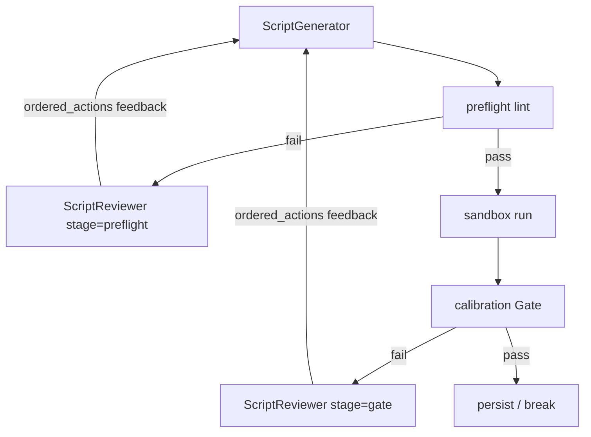

# Spec Parser ver3.2 技术设计文档

> **项目**：AutoCodeRover — 规范解析智能体（Module 1）  
> **基座路径**：`/datadisk/pengxm/auto-code-rover`  
> **基线版本**：v3.1.0（脚本质量门禁：L10–L13、硬化 Gate、intentional AC fail）  
> **目标版本**：v3.2.0  
> **前置文档**：[spec_parser_ver3_dev_plan.md](./spec_parser_ver3_dev_plan.md)、探针合成 [v3.1_probe_audit_synthesis.md](../../outputs/deepswe_spec_parser/deepswe-spec-parser-python-v3.1-probes/v3.1_probe_audit_synthesis.md)  
> **状态**：已实施（代码 + 本文档）

---

## 1. 背景与 3.1 探针结论

ver3.1 在 15 题探针集上验证：

| 结果 | 含义 |
|------|------|
| 探针假阳性 `calibration_passed` = **0** | Gate/Lint 止血「坏卷假校准」成功 |
| **14/15 NO_SCRIPT** | 拒识后再生失败；模型听不懂短规则名 |
| httpx 金标被 **L4** 误伤 | `except` 规则过粗，合法「捕获后 raise AC FAIL」也难过 |
| 卷面 STRONG/PARTIAL/INVALID 并存 | 拦住坏结构 ≠ 写出与 Issue 对齐的好脚本 |

**3.1 主矛盾**：会拦、不会改。  
**3.2 目标**：在现有校准环中加入**审视 LLM**，把机器判据 + Issue 对齐分析翻译成合规改法，回灌生成模型；并细化 L4。

---

## 2. 目标与非目标

### 2.1 目标

1. 在 lint 失败 / Gate 失败时，调用审视 LLM，输出结构化 `diagnosis` + `blocking_fixes` / `gate_fixes` + Issue 缺口 + `ordered_actions`。
2. 生成模型收到可执行反馈（非仅 `L4-SWALLOW-EXCEPTION`）。
3. **lint / Gate 仍为硬门槛**；审视不得建议吞异常、Stub、existence-only、未调用 `test_*`。
4. **不注入**官方/隐藏测意图（审视输入不含 `sample_test_excerpt` / solution / `test.patch`）。
5. 细化 L4：允许「预期产品异常 + pass」与「broad except → raise AssertionError(AC FAIL)」。

### 2.2 非目标

- 不以「审视 LLM 宣布完美」为停止条件。
- 不接入 Harbor 隐藏测或 solution.patch。
- 本迭代不强制扩跑全量 34 题（验收建议仍用 15 探针）。
- 不改 P1 extract 大结构。

---

## 3. 架构与时序



- 默认最多 `spec_parser_max_calibration_rounds = 3`。
- `spec_parser_enable_script_review=False` → 回退 `format_feedback_v3`（3.1 行为）。
- 审视 LLM 异常 / 解析失败 → 降级规则短反馈，不中断流水线。

---

## 4. 模块、配置与产物

### 4.1 新增 / 改动文件

| 路径 | 说明 |
|------|------|
| `app/spec_parser/script_review_prompts.py` | 审视 System/User Prompt、lint 法规摘要 |
| `app/spec_parser/script_reviewer.py` | LLM 调用、JSON 解析、`sanitize_review`、`format_review_feedback` |
| `app/spec_parser/schema.py` | `ScriptReviewReport` / `ReviewDiagnosis` / `ReviewGateFix` / `ReviewBlockingFix` / `ReviewIssueGap` |
| `app/spec_parser/agent.py` | `_build_failure_feedback`；校准环接入审视 |
| `app/spec_parser/pipeline.py` | `V3_PARSER_VERSION = "3.2.0"`；`apply_spec_parser_version` 开关 |
| `app/spec_parser/script_linter.py` | L4 细化 |
| `app/spec_parser/script_prompts_v3.py` | 生成侧接受 reviewer feedback 的说明 |
| `app/config.py` | `spec_parser_enable_script_review` 等 |
| `scripts/run_deepswe_spec_parser.py` / `app/main.py` | CLI：`--enable-script-review` / `--no-script-review` |
| `test/app/spec_parser/test_script_reviewer.py` | 审视 + L4 单测 |

### 4.2 配置项

| 配置 | 默认 | 含义 |
|------|------|------|
| `spec_parser_version` | 运行时设为 `3.2.0` | `startswith("3")` → v3 pipeline |
| `spec_parser_enable_script_review` | `True`（全局默认）；`apply(3.1.x)` 时关 | 总开关 |
| `spec_parser_script_review_on_preflight` | `True` | lint 失败时审视 |
| `spec_parser_script_review_on_gate` | `True` | Gate 失败时审视 |

`apply_spec_parser_version("3.2.0")`：打开 v3 prompts + script review。  
`apply_spec_parser_version("3.1.0")`：关闭 script review（对照实验）。

### 4.3 产物文件（每轮）

| 文件 | 含义 |
|------|------|
| `script_round_{n}.json` / thread | 生成 |
| `script_lint_round_{n}.json` | 静态 lint |
| `script_review_round_{n}.json` | 审视结构化结果（新） |
| `script_review_round_{n}` thread | 审视对话（新） |
| `execution_evidence.json` | 动态校准（过 lint 后） |

---

## 5. 审视 Prompt 契约与输出 schema

### 5.1 输入（仅这些）

- Issue 文本  
- 当前脚本  
- `task_type`、`stage`（preflight|gate）、`round_no`  
- lint `blocking_rules` + 规则释义摘要  
- 可选：`validation_reason`、`stderr`、`exit_code`、失败 AC ids  

**禁止输入**：`sample_test_excerpt`、solution、隐藏测、考点清单。

### 5.2 输出 JSON

```json
{
  "diagnosis": {
    "failure_class": "lint|gate_feature|gate_env|mixed|none",
    "summary": "<=2 sentences"
  },
  "blocking_fixes": [
    {"rule": "exact id from blocking_rules", "bad_pattern": "...",
     "legal_rewrite": "pasteable code skeleton", "why_legal": "..."}
  ],
  "gate_fixes": [
    {"kind": "intentional_ac_fail|not_implemented|env_not_script|other",
     "evidence": "...", "legal_rewrite": "...", "why": "..."}
  ],
  "issue_alignment": [
    {"kind": "missing_must|weak_assert|over_spec_risk", "detail": "...",
     "legal_rewrite": "...", "superseded_by_blocking": false}
  ],
  "deferred_issue_gaps": [],
  "ordered_actions": ["1. Clear blocking lint/gate first ...", "2. Then Issue gaps ..."]
}
```

约束：`blocking_fixes` 与本轮 `blocking_rules` 一一对应；`legal_rewrite` 须可粘贴；`stage=gate` 须区分 FEATURE vs ENV；截断时只评可见区域。解析层兼容旧字段：`pass_to_generator`→`ordered_actions`，字符串 `gate_fixes`→结构化对象。

### 5.3 回灌生成侧

`format_review_feedback` 强制前缀：

> If reviewer conflicts with lint, follow lint.

并输出 `diagnosis` / 结构化 `gate_fixes` / `ordered_actions`。

---

## 6. 与机器判据冲突消解

| 层 | 机制 |
|----|------|
| Prompt | 优先级：lint/Gate > Issue 对齐；禁止吞异常/Stub/existence/死 test |
| `sanitize_review()` | 丢弃 `legal_rewrite` 中含 `except Exception: pass`、Stub、`assert True` 的条目 |
| 生成侧 | Absolute constraints 再次声明必须清零 blocking_rules |
| 下一轮 | 必须再跑 lint；不过则继续审视 |

**L4 合法范式（v3.2）**：

- `except SpecificError: pass`（负向预期该异常）  
- `except Exception as e: raise AssertionError(f"AC-xxx FAIL: {e}")`  
- **非法**：`except Exception: pass` / `except: pass` / `return False`

---

## 7. 相对 3.1 的 diff 与回退

| 能力 | 3.1 | 3.2 |
|------|-----|-----|
| L10–L13 / Gate ENV / intentional fail | 有 | 保留 |
| 失败反馈 | 规则短标签 | 审视 LLM 结构化改法（可关） |
| L4 | 过粗 | 细化 |
| 版本常量 | 3.1.0 | **3.2.0** |

回退：

```bash
--spec-parser-version 3.1.0
# 或
--spec-parser-version 3.2.0 --no-script-review
```

---

## 8. 验收标准（建议探针回归）

沿用 15 题探针 + 金标（见 `conf/deepswe_python_tasks_v3.1_probes.txt`），建议新输出目录  
`deepswe-spec-parser-python-v3.2-probes`。

| 指标 | 3.1.0 本批 | 3.2.0 目标 |
|------|------------|------------|
| 脚本产出率 | 1/15 | ≥5/15（含 ≥2 金标） |
| 金标 httpx NO_SCRIPT | 2/2 | 0/2 |
| 探针假阳性 calib_pass | 0 | **保持 0** |
| 本目录脚本 audit ≥ STRONG | 0（仅 calib 对照） | ≥3 |

单测：`test_script_reviewer.py` + `test_script_linter_v31.py`。

---

## 9. 风险与后续

| 风险 | 缓解 |
|------|------|
| 审视幻觉加戏 | Issue 锚定 + sanitize + lint 再跑 |
| 成本（每轮多 1 次 LLM） | 可关 review；或仅 preflight 开启 |
| 仍 PARTIAL / WRONG_LAYER | 后续可选：公开 API 签名 grounding（非测例） |
| 再生仍 Stub 循环 | 审视模板强化；可选保留「违规更少」中间稿 |

**后续（非本版）**：AC 角色 happy/negative 强制；契约抽检；扩跑 34 题。

---

## 10. 运行示例

```bash
PYTHONPATH=. python scripts/run_deepswe_spec_parser.py \
  --conf-file conf/deepseek-deepswe-spec-parser-v3.1-probes.conf \
  --spec-parser-version 3.2.0 \
  --use-v3-prompts \
  --stop-after calibration
# 关闭审视对照：
#   --no-script-review
```

（建议复制 conf 并改 `id: deepswe-spec-parser-python-v3.2-probes` 以免覆盖 3.1 产物。）

---

## 附录：与合成报告优化 backlog 映射

| 合成项 | 3.2 落地 |
|--------|----------|
| P0-A 细化 L4 | `script_linter._has_swallowed_exceptions` |
| P0-B/C 拒识→再生改法 | `ScriptReviewer` + `format_review_feedback` |
| 不注入官方测意图 | 审视 Prompt 硬禁止；输入无 sample_test |
| 审视 vs 机器打架 | sanitize + feedback 优先级 + 生成侧绝对约束 |
