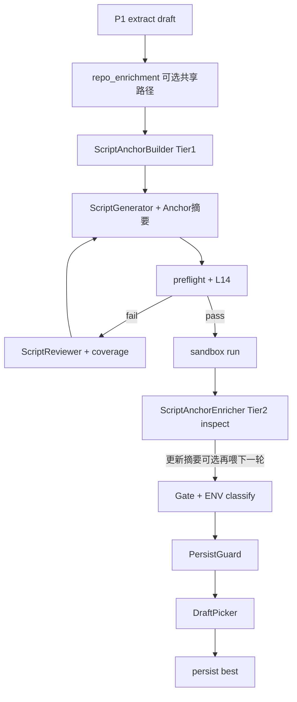

# Spec Parser ver3.3.1 技术设计文档

> **项目**：AutoCodeRover — 规范解析智能体（Module 1）  
> **基座路径**：`/datadisk/pengxm/auto-code-rover`  
> **基线版本**：v3.3.0（Issue↔AC 证据链 + 脚本选稿/门禁决策链 + L14 + ENV Gate）  
> **目标版本**：v3.3.1  
> **前置文档**：[spec_parser_ver3.3_design.md](./spec_parser_ver3.3_design.md)、[spec_parser_ver3.2_design.md](./spec_parser_ver3.2_design.md)、探针合成 [v3.2_probe_audit_synthesis.md](../../outputs/deepswe_spec_parser/deepswe-spec-parser-python-v3.2-probes/v3.2_probe_audit_synthesis.md)  
> **状态**：已按审查修订（B1–B5）并完成代码落地（Phase D/E/F 核心）；待 15 题探针回归验收  
> **审查报告**：[spec_parser_ver3.3.1_design_review.md](./spec_parser_ver3.3.1_design_review.md)

---

## 0. 元信息

| 项 | 值 |
|----|-----|
| 主矛盾（相对 3.3） | 3.3 抬覆盖与门禁；**仍缺「仓库契约锚定」** → OVER_SPEC / WRONG_LAYER 难从根上消 |
| 3.3.1 一句话 | **ver3.3 + ScriptAnchor（Tier1 静态锚定 + Tier2 运行时签名）** |
| 承接 3.3 §2.2 / §12 | 将「公开 API 签名检索（原标可选 3.4）」**升格为本版必做 Tier1/Tier2** |
| 硬约束不变 | lint / Gate 最终裁决；**不注入**官方/隐藏测 / `solution.patch` / Harbor；不以审视「完美」毕业 |
| **审查裁决** | Conditional Go：先落地 B1–B5 补丁再实现；**Tier1 为 P0 ROI** |

### 0.1 审查补丁摘要（相对初稿，有证据）

| ID | 问题 | 代码/探针证据 | 设计变更 |
|----|------|---------------|----------|
| **B1** | Tier1 若依赖 enrich 会空转 | `configure_repo_enrichment`：v3 → `enable_repo_enrichment=False`（实测） | Tier1 **必须自建** `build_symbol_index` |
| **B2** | 错签名比无锚定更糟 | adaptix audit：`Retort(name_mapping=)` 致命 | `confidence<0.5` 不注入参数列表；ambiguous 标注 |
| **B3** | Tier2 在 sandbox 后，首轮看不到 runtime | agent 环：gen→lint→sand | Tier2 **默认只服务 regen**；首轮不阻塞 |
| **B4** | 只数 json 不证明质量 | synthesis：STRONG/PARTIAL 才是卷面 | 增加 signature-consistency / entry-aware 指标 |
| **B5** | 签名违规启发式误报 | 静态扫 attr 噪声大 | `anchor_signature_violations` **默认权重 0** |

---

## 1. 背景与问题陈述

### 1.1 3.3 已覆盖 vs 本版补齐

| 3.3 能力 | 解决 | **仍缺** |
|----------|------|----------|
| `issue_coverage_chain` | 知不知道测到了 Issue Must | 知道「该测 CLI」≠ 知道 **CLI 入口符号/命令名** |
| L14 / ENV Gate / best-of | 假产出、假校准、越修越差 | 参数序猜错、编造 API（**OVER_SPEC**） |
| wrong_layer 启发式 | 事后 warning | 生成前缺少 **入口元数据**，模型仍默认测底层 API |

### 1.2 仓库知识需求分层（复现脚本视角）

| 层 | 需要什么 | 没有时的失败模式 | 本版 |
|----|----------|------------------|------|
| **运行层** | 顶层包名、conda | ImportError | 已有 `RepoContext`；ENV 见 3.3 |
| **入口层** | 公开 API / CLI / HTTP 入口 | WRONG_LAYER | **Tier1：pyproject + 装饰器启发式** |
| **契约层** | 签名（参数名/序/默认值）、async、简短 docstring | OVER_SPEC | **Tier1：小范围 AST；Tier2：inspect** |
| **语义层** | Issue 明文期望值/行为 | WEAK_ASSERT / NARROW | 仍靠 Issue + 3.3 证据链，**不靠全库 AST** |

### 1.3 为何不全库 AST？

| 手段 | 适合 | 不适合 / 成本 |
|------|------|----------------|
| 全仓库深度 AST + 调用图 | 修 bug 的 enrich / visitor | 对单脚本验收 **过重、误报多** |
| Issue 驱动按需检索 + 小范围 AST | 定位符号、抽签名 | CLI/依赖配置需旁路文件 |
| `inspect`（sandbox 已装包） | 真实可调用契约 | 依赖 import 成功；动态成员不全 |
| `pyproject.toml` / `__all__` | console_scripts、包导出 | 非 Python AST |

**设计原则**：**Issue 驱动、按需取证、摘要注入**；不建全库知识图谱；不读测试文件作 oracle。

### 1.4 与现有代码的关系

| 模块 | 现状 | 3.3.1 用法 |
|------|------|-----------|
| `entity_extraction.py` | Issue/draft → 符号查询 | **复用** 为 Anchor 输入种子 |
| `symbol_index.py` | AST 建 class/function 索引 | **复用** 定位定义文件 |
| `target_resolution.py` | entity → 候选文件 | **复用** `resolve_target_files` / grep |
| `generic_enrichment.py` | guard/delegate 等 **修 bug 向** | **不直接喂脚本**；可共享「已解析文件路径」 |
| `repo_context.py` | 顶层包 + sample_test_excerpt | 保留；**新增** `script_anchor` 独立产物 |
| `script_prompts_v3.py` | 几乎无签名/入口 | **注入 ScriptAnchor 摘要块** |
| `script_reviewer.py` / 证据链 | Issue↔AC | Anchor 供 `product_calls` / `expected_layer` **机器补全** |

---

## 2. 目标与非目标

### 2.1 目标（可验收）

1. **ScriptAnchor 产物**：每题产出 `script_anchor.json`（符号定位 + 签名摘要 + 入口提示）。
2. **Tier1（静态，默认开）**：
   - Issue/AC 点名符号 → `symbol_index` + grep 定位；
   - 命中文件 AST 抽取 `def`/`async def` 签名骨架；
   - `pyproject.toml` / `setup.cfg` / `setup.py` 抽取 `console_scripts`；
   - `__init__.py` 的 `__all__`（可选轻量）提示公开导出；
   - 摘要注入 `format_script_user_v3`。
3. **Tier2（运行时，默认开，可降级）**：
   - sandbox 可 import 时，对锚定符号执行 `inspect.signature` / `getdoc` 一行摘要；
   - 失败则保留 Tier1 AST 结果，决策链记 `anchor_inspect_degraded`。
4. **层约束钩子**：当 AC/coverage 期望 `cli|web|http` 而 Anchor **无对应入口** → `layer_unknown`，写入决策链 + 审视/生成反馈（默认 **不单独 calib_fail**）。
5. **与 3.3 双链集成**：
   - 证据链：`product_calls` / `expected_layer` 可被 Anchor 机器字段校验或提示；
   - 决策链：新增 `D_anchor_build`、`D_anchor_layer_gap`、`D_anchor_inspect`。
6. **版本**：`V3_PARSER_VERSION = "3.3.1"`；`apply_spec_parser_version("3.3.1")` 开启 3.3 全部能力 + ScriptAnchor。

### 2.2 非目标

- 不注入 `sample_test` / Harbor / `solution` / 官方断言意图。
- 不做全仓库调用图、数据流、框架完整路由图（3.4+ 可选）。
- 不改 P1 extract 大结构；不替代 3.3 的 L14 / ENV / best-of。
- 不以「Anchor 命中率 100%」为硬门槛；锚定失败时脚本仍可生成（带 `confidence=low`）。
- 不把测试文件内容写入 Anchor（`is_test_file` 路径一律排除）。

---

## 3. 架构与时序

### 3.1 概念：ScriptAnchor 在双链中的位置

```text
Issue 明文（行为 oracle）
    +
ScriptAnchor（调用契约 / 入口地图）  ← 本版
    ↓
生成脚本 → Lint/L14 → Gate/ENV → 证据链覆盖 → 决策链选稿
```

| 链 | 3.3 | 3.3.1 增量 |
|----|-----|------------|
| 证据链 | Issue Must ↔ AC ↔ 断言强度 | Anchor 提供「合法 product_calls 候选」与层入口是否存在 |
| 决策链 | Gate / Persist / Pick / EarlyStop | Anchor 构建成败、inspect 降级、layer_unknown |
| 思维链 | 审视/生成内部 | Anchor **摘要只作事实输入**，不要求 LLM 再猜签名 |

### 3.2 时序图（在 3.3 环上插入）



**时机约定（审查 B1/B3 修订）**：

| 步骤 | 何时 | 说明 |
|------|------|------|
| Tier1 | **首次生成前** | **必须**；**独立** `build_symbol_index(project_path)`，**不依赖** `repo_enrichment`（v3 默认关闭 P2） |
| Tier2 | sandbox 执行之后（import 环境可用时） | **默认只服务 regen**：更新 `signature_runtime`，写入下一轮 feedback/user prompt；**禁止**为等 Tier2 推迟首轮生成 |
| 再注入 | Tier2 更新且仍需 regen | feedback **置顶** runtime 签名；覆盖同名 AST 展示 |
| 可选加速 | 生成前轻量 inspect（默认关） | `spec_parser_anchor_pre_gen_inspect=False`；失败 skip |

### 3.3 LLM vs 确定性

| 组件 | 类型 |
|------|------|
| `ScriptAnchorBuilder`（定位、AST 签名、pyproject） | **确定性** |
| `ScriptAnchorEnricher`（inspect） | **确定性**（subprocess/in-process） |
| `format_anchor_for_prompt` | 确定性模板 |
| 生成 / 审视 | LLM（消费 Anchor，禁止发明未锚定符号的参数名——软约束） |

---

## 4. ScriptAnchor 数据模型

新增至 `app/spec_parser/schema.py`（或独立再 re-export）：

```python
class AnchorSymbol(BaseModel):
    """One Issue/AC-named symbol grounded in the repo (non-test)."""

    name: str                          # e.g. "Retort", "Client.post", "main"
    kind: str = "unknown"              # class|function|method|module|cli_entry|http_hint|unknown
    module_hint: str = ""              # importable dotted path if inferred
    rel_path: str = ""                 # defining file, non-test
    lineno: int | None = None
    signature_ast: str = ""            # "(self, *, x: int = 1) -> None" from AST
    is_async: bool = False
    docstring_head: str = ""           # first line, <=120 chars, AST/source
    signature_runtime: str = ""        # from inspect; empty until Tier2
    docstring_runtime: str = ""        # inspect.getdoc first line
    public_export: bool | None = None  # True if in __all__ or top-level package export
    source: str = "issue"              # issue|ac|co_fix_grounded|entrypoint_meta
    confidence: float = 0.0            # 0..1


class AnchorEntrypoint(BaseModel):
    """CLI / console / coarse HTTP hints (not a full router map)."""

    kind: str                          # console_script|click_command|flask_route|fastapi_route|unknown
    name: str = ""                     # command or script name
    target: str = ""                   # "pkg.module:func" or decorator target
    rel_path: str = ""
    evidence: str = ""                 # short quote from pyproject / source line
    confidence: float = 0.0


class ScriptAnchor(BaseModel):
    task_id: str = ""
    parser_version: str = "3.3.1"
    package_roots: list[str] = Field(default_factory=list)
    symbols: list[AnchorSymbol] = Field(default_factory=list)
    entrypoints: list[AnchorEntrypoint] = Field(default_factory=list)
    layer_hints: dict[str, str] = Field(default_factory=dict)
    # e.g. {"cli": "present"|"absent"|"unknown", "http": "...", "library": "present"}
    missing_issue_symbols: list[str] = Field(default_factory=list)
    build_errors: list[str] = Field(default_factory=list)
    tier1_ok: bool = False
    tier2_ok: bool = False
    tier2_skipped_reason: str = ""
```

**产物文件**：`script_anchor.json`（任务级；Tier2 原地更新同文件或写 `script_anchor_runtime.json` 再 merge）。

### 4.1 字段语义与硬规则

| 规则 | 说明 |
|------|------|
| 路径排除 | `is_test_file(rel)` → 不得进入 `rel_path` |
| `issue_quote` 不在此模型 | 行为期望仍只在 Issue / coverage_chain |
| `signature_*` | **仅描述契约**，禁止从测试抄断言表达式 |
| `confidence` | 索引唯一命中 ≥0.8；多命中取 score 最高并 ≤0.6；仅 grep 无 AST ≤0.4 |
| 上限 | `symbols` 默认最多 **12**；`entrypoints` 最多 **8**（防 prompt 膨胀） |
| **B2 注入门禁** | `confidence < 0.5`：**只注入 name + rel_path**，不注入 `signature_*` 参数列表；多命中标注 `ambiguous=true` 并最多列 2 条 alternate paths |
| Issue vs Anchor | **Issue 行为/期望值优先**；Anchor 只约束「怎么调用」；ambiguous 时生成侧优先 Issue 代码块中的调用形 |

---

## 5. Tier1 — 静态锚定（必做）

### 5.1 流水线步骤

```text
0. Index (B1 — 强制)
   - index = build_symbol_index(task.project_path)  # 可用 LRU cache
   - 不得假设 repo_enrichment 已跑；v3 默认关闭 P2 时本步仍必须成功

1. Seed symbols
   - entity_extraction.collect_entities(issue, draft, index)
   - 额外：AC.covers_entity / observable 中的 CamelCase / call-like tokens（复用 IDENT_RE/CALL_RE）
   - 仅保留 grounded（名字出现在 Issue 或 AC 明文）— 与 v3 grounding 一致

2. Locate
   - symbol_index.classes / .functions
   - target_resolution.resolve_target_files / _grep_entity（排除 *test*）

3. Extract AST signature (per hit file, only matched defs)
   - ast.FunctionDef / AsyncFunctionDef → format_args(node.args)
   - 所属 ClassDef 名写入 kind=method / name="Cls.meth"
   - docstring = ast.get_docstring → first line

4. Entrypoints
   - parse pyproject.toml [project.scripts] / [project.entry-points] / poetry scripts
   - setup.cfg [options.entry_points] console_scripts
   - setup.py 启发式（可选，失败则 skip）
   - 轻量装饰器扫描（仅已定位文件 + 入口候选文件，不做全库）：
     @click.command / @click.group
     @app.route / @router.(get|post|...) / APIRouter

5. Layer hints
   - 若 entrypoints 含 console_script|click_* → layer_hints["cli"]="present"
   - 若含 *route* → layer_hints["http"]="present"
   - 若 symbols 非空 → layer_hints["library"]="present"
   - 否则对应键 "absent" 或 "unknown"

6. Persist + D_anchor_build
```

### 5.2 签名格式化（确定性）

```python
def format_ast_signature(node: ast.AST) -> str:
    """Return e.g. "(self, data, *, files=None) -> Any" without evaluating defaults."""
```

- 默认值：用 `ast.unparse`（Py3.9+）或常量字面量；复杂表达式用 `...`
- 不展开 `*args` 语义之外的推断

### 5.3 pyproject / setup 解析

新增 `app/spec_parser/entrypoint_meta.py`：

| 输入 | 输出 |
|------|------|
| `pyproject.toml` | `AnchorEntrypoint(kind=console_script, name=..., target=module:func)` |
| `setup.cfg` | 同上 |
| 缺失 | `entrypoints=[]`，`build_errors` 可记 `no_packaging_metadata`（非失败） |

**禁止**：解析 `tests/`、`tox.ini` 里的 test 命令当作产品 CLI（除非同名且 pyproject scripts 已声明）。

### 5.4 Prompt 注入格式

扩展 `format_script_user_v3`（`script_prompts_v3.py`）：

```text
## ScriptAnchor (repo contract — do NOT invent params/entries absent here)
### Symbols (prefer these signatures)
- Retort (class)  path=adaptix/_internal/retort/retort.py:42
  AST: (self, *, recipe=())
  doc: "..."
- Client.post (method)  path=httpx/_client.py:...
  AST: (self, url, ...)
  runtime: (pending Tier2)

### Entrypoints
- console_script: aiomonitor = aiomonitor.cli:main
- click: snapshot (group) @ aiomonitor/... 

### Layer hints
- cli: present | http: absent | library: present

Rules:
- Issue behavior/expected values OVERRIDE Anchor when they conflict.
- Call parameters SHOULD match ScriptAnchor signatures when the symbol is listed
  AND confidence >= 0.5 AND not marked ambiguous.
- If a symbol is low-confidence/ambiguous, prefer call shapes from Issue code blocks;
  do not invent kwargs from a guessed signature.
- If Issue requires CLI/Web and layer hint is absent/unknown, either find entry via listed entrypoints
  or mark NOT_IMPLEMENTED / document gap — do NOT fake with unrelated lower-level API as the only check.
- Do not copy assertions from any test files.
```

配置 `spec_parser_anchor_prompt_max_chars: int = 3500`：超长按 confidence 截断。  
`format_anchor_for_prompt`：**confidence < 0.5 时省略 signature_ast/runtime 参数列表**（B2）。

### 5.5 Tier1 与证据链 / 启发式

| 集成点 | 行为 |
|--------|------|
| `coverage_heuristics.check_layer_mismatch` | 若 AC 要 CLI 且 `layer_hints.cli=="present"` 但脚本未用 entrypoint 名 / CliRunner → 仍 WRONG_LAYER warning |
| `issue_coverage_chain` sanitize | `product_calls` 若完全不在 Anchor.symbols/entrypoints 且非 Issue 字面量 → 可标 `over_spec_risk`（warning） |
| PersistGuard | **不**因 Anchor 缺失而拒稿（避免产出率崩） |

---

## 6. Tier2 — 运行时签名（强推荐，默开可降级）

### 6.1 触发条件（B3：不阻塞首轮）

```python
def should_run_tier2(anchor: ScriptAnchor, sandbox_ok_import: bool) -> bool:
    return (
        config.spec_parser_enable_script_anchor_tier2
        and sandbox_ok_import
        and bool(anchor.symbols)
    )
```

`sandbox_ok_import`：sandbox 中 `import <top_level_package>` 成功，或脚本已执行到非「缺产品包」的错误。

**硬约定**：

1. 首轮 `ScriptGenerator.generate` **不得等待** Tier2。  
2. Tier2 在 sandbox 之后跑；结果 merge 进 `script_anchor.json`，供 **下一轮** prompt/feedback。  
3. 若本轮已 `calibration_passed` 且不再 regen，仍可写 runtime 字段供审计，但不必再生成。

### 6.2 实现策略（二选一，推荐 A）

| 方案 | 做法 | 取舍 |
|------|------|------|
| **A. sandbox 内探针脚本**（推荐） | 生成临时 `_anchor_inspect.py`：对 `module_hint`/`target` 列表 `import` + `inspect.signature`，stdout JSON | 与校准同环境；隔离好 |
| B. 宿主机 conda env | 直接 import task.env | 快，但路径/依赖易与 sandbox 不一致 |

探针伪代码：

```python
# _anchor_inspect.py (generated, not persisted as acceptance script)
import importlib, inspect, json, sys
specs = json.loads(sys.argv[1])
out = []
for item in specs:
    try:
        mod = importlib.import_module(item["module"])
        obj = mod
        for part in item["qualname"].split("."):
            obj = getattr(obj, part)
        out.append({
            "name": item["name"],
            "signature_runtime": str(inspect.signature(obj)),
            "docstring_runtime": (inspect.getdoc(obj) or "").splitlines()[:1],
            "ok": True,
        })
    except Exception as e:
        out.append({"name": item["name"], "ok": False, "error": type(e).__name__})
print(json.dumps(out))
```

**安全**：只 inspect Anchor 白名单符号；超时 ≤10s；失败单条 skip。

### 6.3 合并与再注入

- 写回 `AnchorSymbol.signature_runtime` / `docstring_runtime`
- `tier2_ok = True` 若至少 1 条成功
- 决策节点 `D_anchor_inspect`：`decision=enriched|degraded|skipped`
- 若校准仍需 regen：下一轮 prompt **优先展示 runtime 签名**（覆盖 AST 同名字段）

### 6.4 ENV 交互（与 3.3 Gate）

| 情况 | 行为 |
|------|------|
| 缺传递依赖导致 inspect 失败 | Tier2 degraded；**不**把该失败当作 FEATURE NOT_IMPLEMENTED |
| 产品符号 `AttributeError` | 保留 AST；可提示生成侧「运行时无此属性」→ 合法 NOT_IMPLEMENTED 探测 |

---

## 7. 层缺口钩子（Tier1+2 共用）

### 7.1 `layer_unknown` 判定

```python
def detect_layer_gaps(spec, issue_text, anchor: ScriptAnchor) -> list[str]:
    """
    If Issue/AC text implies CLI|Web|HTTP and corresponding layer_hints != present
    → return codes: LAYER_GAP_CLI, LAYER_GAP_HTTP
    """
```

暗示词（与 3.3 heuristics 对齐）：`CLI`, `command line`, `click`, `Web`, `HTTP`, `/api/`。

### 7.2 决策节点 `D_anchor_layer_gap`

| 项 | 值 |
|----|-----|
| **触发** | Tier1 完成后；及每轮审视前可复评 |
| **options** | `ok`, `layer_unknown`, `entrypoint_present_unused`（脚本侧后置） |
| **policy** | `anchor_layer_v331` |
| **action** | 写入 `ordered_actions` / feedback；**默认不 calib_fail** |
| **evidence_refs** | `anchor:layer_hints.cli=absent`, `issue:Add snapshot CLI group` |

配置 `spec_parser_anchor_layer_gap_blocks_persist: bool = False`（3.3.1 默认 False；实验可开）。

---

## 8. 决策链扩展（相对 3.3）

### 8.1 新增节点

#### D_anchor_build

| 项 | 值 |
|----|-----|
| **触发** | Tier1 结束 |
| **options** | `ok`, `partial`, `empty` |
| **decision** | `ok` if `symbols or entrypoints`；`empty` if 二者皆空 |
| **action** | `empty` → 仍生成，但 prompt 标注 low confidence；trace `reason` |
| **evidence_refs** | `script_anchor.json`, `missing_issue_symbols:[...]` |

#### D_anchor_inspect

| 项 | 值 |
|----|-----|
| **触发** | Tier2 尝试后 |
| **options** | `enriched`, `degraded`, `skipped` |
| **policy** | `anchor_inspect_v331` |

#### D_anchor_layer_gap

见 §7.2。

### 8.2 DecisionTrace `parser_version`

`ScriptDecisionTrace.parser_version = "3.3.1"`；节点可与 3.3 节点共存于同一 `script_decision_trace.json`。

### 8.3 DraftMetrics 增量（可选，利于 best-of）

```python
# DraftMetrics 扩展字段（3.3.1）
anchor_signature_violations: int = 0   # 启发式：调用关键字参数名 ∉ signature（弱）
anchor_layer_gap_count: int = 0
```

Score 微调（相对 `draft_score_v33`，**B5 修订**）：

```text
score_v331 = score_v33
  - anchor_layer_gap_count * 3          # 可选；默认开启权重 3
  - anchor_signature_violations * W_sig # W_sig 默认 **0**（关闭）
```

配置 `spec_parser_anchor_score_signature_weight: float = 0.0`。  
签名违规仅作 reviewer soft hint（`flag_over_spec_calls`），**不得**默认左右 best-of。

---

## 9. 证据链集成

### 9.1 机器辅助字段（非替换 LLM coverage）

新增 `app/spec_parser/anchor_coverage_bridge.py`：

```python
def suggest_product_calls(anchor: ScriptAnchor, ac_text: str) -> list[str]:
    """Intersect AC text tokens with anchor.symbols / entrypoints names."""

def flag_over_spec_calls(script: str, anchor: ScriptAnchor) -> list[str]:
    """
    Soft: Call attrs whose names are in script but neither in Issue nor Anchor.
    Do not block; feed reviewer as over_spec_risk hints.
    """
```

### 9.2 审视 Prompt 增补（`script_review_prompts.py`）

```text
ScriptAnchor (machine, may be incomplete):
{anchor_json_compact}

When writing issue_coverage_chain.product_calls and legal_rewrite:
- Prefer symbols/entrypoints listed in ScriptAnchor.
- If expected_layer=cli|web and Anchor layer_hints show present, legal_rewrite MUST use that entry style
  (CliRunner/console script or HTTP client), not only lower-level library calls.
- Do not invent parameter names that contradict signature_runtime/signature_ast.
```

### 9.3 sanitize

| 检查 | 动作 |
|------|------|
| `legal_rewrite` 使用的 kwargs 与唯一高置信签名明显冲突（可选，Phase F） | warning；3.3.1 可不自动改写 |
| Anchor 为空仍标 `verdict=covered` + wrong_layer | 保持 3.3 sanitize 降级规则 |

---

## 10. 模块、配置与文件改动表

| 路径 | 变更 | 职责 |
|------|------|------|
| `app/spec_parser/schema.py` | 修改 | `AnchorSymbol`, `AnchorEntrypoint`, `ScriptAnchor`；DraftMetrics 可选字段 |
| `app/spec_parser/script_anchor.py` | **新增** | `ScriptAnchorBuilder.build_tier1`；`format_anchor_for_prompt`；persist |
| `app/spec_parser/script_anchor_inspect.py` | **新增** | Tier2 探针生成与解析 |
| `app/spec_parser/entrypoint_meta.py` | **新增** | pyproject/setup.cfg console_scripts |
| `app/spec_parser/anchor_coverage_bridge.py` | **新增** | 与 coverage / heuristics 桥接 |
| `app/spec_parser/decision_trace.py` | 修改 | 登记 D_anchor_* 节点 |
| `app/spec_parser/coverage_heuristics.py` | 修改 | 消费 `layer_hints` / entrypoint 名 |
| `app/spec_parser/script_prompts_v3.py` | 修改 | 注入 Anchor 块 + 绝对约束 |
| `app/spec_parser/script_review_prompts.py` | 修改 | 审视输入含 compact Anchor |
| `app/spec_parser/script_reviewer.py` | 修改 | user prompt 带 anchor；可选 bridge hints |
| `app/spec_parser/agent.py` | 修改 | 生成前 Tier1；sandbox 后 Tier2；trace |
| `app/spec_parser/draft_picker.py` | 修改 | score_v331 软项 |
| `app/spec_parser/pipeline.py` | 修改 | `V3_PARSER_VERSION = "3.3.1"`；`apply_spec_parser_version` |
| `app/config.py` | 修改 | 下表开关 |
| `app/main.py` / `scripts/run_deepswe_spec_parser.py` | 修改 | CLI |
| `test/app/spec_parser/test_script_anchor_tier1.py` | **新增** | 定位 + AST 签名 + pyproject fixtures |
| `test/app/spec_parser/test_entrypoint_meta.py` | **新增** | console_scripts 解析 |
| `test/app/spec_parser/test_script_anchor_tier2.py` | **新增** | inspect merge / degrade |
| `test/app/spec_parser/test_anchor_layer_gap.py` | **新增** | LAYER_GAP_* |
| `test/app/spec_parser/test_anchor_prompt_format.py` | **新增** | 截断与注入 |

**复用（只读调用，尽量不复制逻辑）**：`entity_extraction`, `symbol_index`, `target_resolution`, `search_utils.is_test_file`。

### 10.1 配置项

| 配置 | 默认（3.3.1） | 含义 |
|------|---------------|------|
| `spec_parser_version` | `"3.3.1"` | 运行时版本 |
| `spec_parser_enable_script_anchor` | `True` | Tier1 总开关 |
| `spec_parser_enable_script_anchor_tier2` | `True` | Tier2 inspect |
| `spec_parser_anchor_max_symbols` | `12` | 符号上限 |
| `spec_parser_anchor_max_entrypoints` | `8` | 入口上限 |
| `spec_parser_anchor_prompt_max_chars` | `3500` | 注入截断 |
| `spec_parser_anchor_layer_gap_blocks_persist` | `False` | layer_unknown 是否拒落盘 |
| `spec_parser_anchor_scan_decorators` | `True` | 轻量 click/route 扫描 |
| `spec_parser_anchor_inspect_timeout_sec` | `10` | Tier2 超时 |

`apply_spec_parser_version("3.3.1")`：

```python
# 先应用 3.3.0 全部开关，再：
config.spec_parser_enable_script_anchor = True
config.spec_parser_enable_script_anchor_tier2 = True
```

`apply_spec_parser_version("3.3.0")`：关闭 Anchor（对照实验）。  
`apply_spec_parser_version("3.2.0")`：关闭双链 + Anchor。

### 10.2 产物文件（增量）

| 文件 | 含义 |
|------|------|
| `script_anchor.json` | Tier1（+ merge 后的 Tier2） |
| `script_anchor_inspect_round_{n}.json` | 可选：单次 inspect 原始输出 |
| `script_decision_trace.json` | 追加 D_anchor_* |

---

## 11. Prompt 绝对约束增补（生成侧）

在 3.3 约束之上追加（`script_prompts_v3.py`）：

```text
- When ScriptAnchor lists a symbol, do not invent parameter names/order that contradict
  signature_runtime (preferred) or signature_ast.
- When ScriptAnchor lists console_script/click entrypoints and Issue requires CLI,
  exercise those entrypoints (CliRunner/subprocess); do not only call lower-level APIs.
- If a needed symbol is in missing_issue_symbols, prefer NOT_IMPLEMENTED after a real import/probe
  over fabricating APIs.
- Never treat sample_test_excerpt or any test file as acceptance oracle.
```

---

## 12. 与机器判据冲突消解

| 场景 | 机制 |
|------|------|
| Anchor 签名与 Issue 示例冲突 | **Issue 行为优先**；签名只约束「怎么调用」，不发明期望值 |
| Anchor 定位错文件 | confidence 低；多命中时只注入 top-1 并标注 `ambiguous` |
| Tier2 import 触发 ENV | Gate 走 3.3 env；Tier2 degraded |
| 审视要求 CLI 但无 entrypoint | `layer_unknown` + deferred；允许 library 探测 + 标明 gap |
| Anchor 与 L14 | 无关；空壳仍 L14 blocking |
| prompt 超长 | 按 confidence 截断；decision trace 记 `anchor_truncated` |

---

## 13. 相对 3.3 / 3.2 的 diff 与回退

| 能力 | 3.2 | 3.3 | 3.3.1 |
|------|-----|-----|-------|
| 审视 + L4 | ✓ | ✓ | ✓ |
| 证据链 / 决策链 / L14 / ENV / best-of | — | ✓ | ✓ |
| ScriptAnchor Tier1 | — | —（曾标 3.4） | **✓** |
| ScriptAnchor Tier2 inspect | — | — | **✓** |
| layer_unknown 决策节点 | — | heuristics only | **✓ + entry 元数据** |
| 版本 | 3.2.0 | 3.3.0 | **3.3.1** |

回退：

```bash
--spec-parser-version 3.3.0          # 关 Anchor，保留双链
--spec-parser-version 3.3.1 --no-script-anchor
--spec-parser-version 3.3.1 --no-script-anchor-tier2   # 仅 Tier1
```

---

## 14. 验收标准（15 题探针）

题单同 3.2/3.3；输出目录建议：`deepswe-spec-parser-python-v3.3.1-probes`。

| 指标 | 3.2 | 3.3 目标 | **3.3.1 目标** |
|------|-----|----------|----------------|
| 脚本产出率 | 11/15 | ≥12/15 | **≥11/15**（允许略降，禁止为冲数量关 L14） |
| STRONG | 3 | ≥5 | **≥5**，且 OVER_SPEC 类 PARTIAL **下降** |
| INVALID 骗 lint | 1 | 0 | **0**（继承 3.3） |
| ENV 误标 | 风险 | 0 | **0** |
| `script_anchor.json` | — | — | **15/15 有文件**（允许 symbols=[]；** alone 不算质量成功**） |
| **Signature consistency（B4）** | — | — | 对 `confidence≥0.8` 符号：脚本 kwargs ⊆ signature 形参（adaptix/cattrs/httpx 子集报告） |
| **Entry-aware（B4）** | — | — | `layer_hints.cli==present` 且 Issue 含 CLI 时，脚本出现 CliRunner/entrypoint 名的比例 ↑ |
| Tier2 | — | — | 可 import 题中 **≥50%** `tier2_ok` 或明确 degraded reason |
| 人工抽检 | — | — | adaptix：**不得**再以 `Retort(name_mapping=` 为主构造路径 |
| aiomonitor 类 CLI/Web | PARTIAL WRONG_LAYER | coverage 改法 | Anchor 含 **cli entry** 时 feedback **必须**点名该 entry |

单测：§10 新增测试全绿；3.3 相关测试无回归。

---

## 15. 分阶段落地计划

### Phase D — Tier1 核心（本版 P0）

| 项 | 内容 |
|----|------|
| **改动** | `schema` Anchor 模型；`entrypoint_meta.py`；`script_anchor.py` Tier1；`agent` 生成前调用；`script_prompts_v3` 注入；`D_anchor_build` |
| **单测** | `test_script_anchor_tier1.py`, `test_entrypoint_meta.py`, `test_anchor_prompt_format.py` |
| **冒烟题** | httpx-multipart（签名可见）、aiomonitor（console_script/click 若存在）、sqlite-utils |
| **DoD** | 每题有 `script_anchor.json`；生成 user prompt 含 `## ScriptAnchor`；3.3 回退开关可用 |

### Phase E — 层缺口 + 证据桥（P1）

| 项 | 内容 |
|----|------|
| **改动** | `detect_layer_gaps`；`D_anchor_layer_gap`；`anchor_coverage_bridge.py`；`coverage_heuristics` 消费 entry；审视 prompt 带 compact Anchor |
| **冒烟题** | aiomonitor（WRONG_LAYER）、bandit（无假入口） |
| **DoD** | CLI Issue + 无 entry → trace 有 layer_unknown；有 entry → 审视 legal_rewrite 倾向 CliRunner/script |

### Phase F — Tier2 inspect（P1）

| 项 | 内容 |
|----|------|
| **改动** | `script_anchor_inspect.py`；sandbox 后 enrich；runtime 优先注入；`D_anchor_inspect` |
| **单测** | `test_script_anchor_tier2.py`（mock import / 超时 degraded） |
| **冒烟题** | cattrs / adaptix（OVER_SPEC 敏感）、mashumaro |
| **DoD** | 成功题 `signature_runtime` 非空；ENV 题 degraded 且不 calib_pass |

### Phase G — score 软项 + 探针回归（P2）

| 项 | 内容 |
|----|------|
| **改动** | draft_picker `score_v331`；conf `v3.3.1-probes`；对照 3.3 |
| **DoD** | 15 题跑批；附录 C 清单勾选；合成笔记（可选） |

### 依赖关系

```text
3.3 Phase A（L14/ENV）建议先合入
    ↓
Phase D（Tier1）──可与 3.3 Phase B 并行（prompt 注入互不阻塞）
    ↓
Phase E → Phase F → Phase G
```

若 3.3 尚未实现：允许 **先合 Phase D**（Anchor 不依赖 coverage_chain 解析），但审视桥接（E）应在 3.3 Phase B 之后。

---

## 16. 风险与不足

| 风险 | 缓解 |
|------|------|
| 符号重名定位错 | confidence + top-1；ambiguous 标注；Issue 路径暗示加权（复用 target_resolution score） |
| pyproject 无 scripts | layer_hints=unknown；不硬 fail |
| inspect 与 AST 不一致 | **runtime 优先**；并存展示 |
| prompt 噪声导致忽略 Issue | Anchor 块置于 AC 表之后、Feedback 之前；绝对约束写清 Issue 行为优先 |
| 装饰器扫描误报 | 仅限已定位文件；可关 `spec_parser_anchor_scan_decorators` |
| 泄漏测试意图 | 禁止 test 路径；禁止把 sample_test 断言写入 Anchor |
| OVER_SPEC 未清零 | Tier1/2 降发生率，不保证；复杂 generic/TypeVar 签名仍难 |

**不足**：

- 不做完整 HTTP 路由表 → 复杂 Web 题仍可能 partial。
- 动态 API（`getattr` 插件）锚定弱 → 允许 NOT_IMPLEMENTED。
- 与 3.3 证据链均为「辅助」；最终 STRONG 仍靠人工/探针 audit。

---

## 17. 运行示例

```bash
cp conf/deepseek-deepswe-spec-parser-v3.2-probes.conf \
   conf/deepseek-deepswe-spec-parser-v3.3.1-probes.conf
# 编辑 id: deepswe-spec-parser-python-v3.3.1-probes

PYTHONPATH=. python scripts/run_deepswe_spec_parser.py \
  --conf-file conf/deepseek-deepswe-spec-parser-v3.3.1-probes.conf \
  --spec-parser-version 3.3.1 \
  --use-v3-prompts \
  --stop-after calibration

# 仅 Tier1：
# --spec-parser-version 3.3.1 --no-script-anchor-tier2

# 对照无 Anchor：
# --spec-parser-version 3.3.0
```

---

## 附录 A — D1–D6 与 Tier 映射

| 缺陷 | 3.3 | **3.3.1 Tier1/2** |
|------|-----|-------------------|
| D1 WRONG_LAYER | coverage + heuristics | **入口元数据 + layer_gap + 生成约束** |
| D1 OVER_SPEC | Prompt 弱约束 | **AST/inspect 签名锚定** |
| D1 WEAK/NARROW | coverage_chain | 间接（正确入口后断言仍靠 Issue） |
| D2 Stub | L14 + 例题 + early stop | Anchor 提供「最小合法调用」素材给 blocking_fixes |
| D3 骗 L12 | L14 | 无直接变更 |
| D4 ENV | Gate ENV | Tier2 degraded，不污染 FEATURE |
| D5 越修越差 | best-of | score 软项可选 |
| D6 PERFECT | 非目标 | 非目标 |

---

## 附录 B — `script_anchor.json` 样例（简化）

```json
{
  "parser_version": "3.3.1",
  "package_roots": ["aiomonitor"],
  "symbols": [
    {
      "name": "Monitor.capture_snapshot",
      "kind": "method",
      "module_hint": "aiomonitor.monitor",
      "rel_path": "aiomonitor/monitor.py",
      "lineno": 120,
      "signature_ast": "(self, *, title=None)",
      "is_async": false,
      "signature_runtime": "(self, *, title: str | None = None)",
      "docstring_head": "Capture a task snapshot.",
      "source": "issue",
      "confidence": 0.85
    }
  ],
  "entrypoints": [
    {
      "kind": "console_script",
      "name": "aiomonitor",
      "target": "aiomonitor.cli:main",
      "rel_path": "pyproject.toml",
      "evidence": "aiomonitor = \"aiomonitor.cli:main\"",
      "confidence": 0.9
    }
  ],
  "layer_hints": {"cli": "present", "http": "unknown", "library": "present"},
  "missing_issue_symbols": [],
  "tier1_ok": true,
  "tier2_ok": true
}
```

---

## 附录 C — 实现 Agent 检查清单

- [x] `V3_PARSER_VERSION = "3.3.1"` 与 `apply_spec_parser_version`（先匹配 3.3.1）
- [x] Tier1：独立 `build_symbol_index` → entity → locate → AST 签名 → `script_anchor.json`
- [x] `entrypoint_meta`：pyproject/setup.cfg console_scripts
- [x] 测试路径永不进入 Anchor（单测：test decoy Retort 被排除）
- [x] `format_script_user_v3` 含 ScriptAnchor 块；B2 低置信省略签名
- [x] Tier2：inspect 探针、PYTHONPATH=project、degraded、仅服务 regen
- [x] `D_anchor_build` / `D_anchor_inspect` / `D_anchor_layer_gap` 写入 decision trace
- [x] 审视 prompt 支持 compact Anchor 段
- [x] `--no-script-anchor` / `--no-script-anchor-tier2` CLI
- [x] 单测 Phase D/E/F（`test_script_anchor_*` / `test_entrypoint_meta` / `test_anchor_*`）
- [ ] 15 题探针 + 与 3.3/3.2 指标对照（待跑批）
- [x] 确认无 sample_test / solution 进入 Anchor（builder 不读测试文件）

---

## 附录 D — 与先前讨论的 Tier 对照

| 讨论项 | 本设计落点 |
|--------|------------|
| Tier1：Issue 符号 → index/grep | §5.1 步骤 1–2 |
| Tier1：命中文件 AST 签名 | §5.1 步骤 3、§5.2 |
| Tier1：pyproject CLI | §5.3 `entrypoint_meta` |
| Tier1：注入生成 prompt | §5.4 |
| Tier2：sandbox inspect | §6 |
| Tier2：cli/http 无入口 → layer_unknown | §7 |
| 不靠全库 AST | §1.3、非目标 |
| 接入 3.3 证据链/决策链 | §3、§8、§9 |

---

## 附录 E — 3.3 文档交叉引用

实现本版时，建议在 [spec_parser_ver3.3_design.md](./spec_parser_ver3.3_design.md) §2.2 / §12 将「公开 API 签名检索 → 3.4」改为：

> 已由 **ver3.3.1**（[spec_parser_ver3.3.1_design.md](./spec_parser_ver3.3.1_design.md)）承接为 ScriptAnchor Tier1/Tier2。
