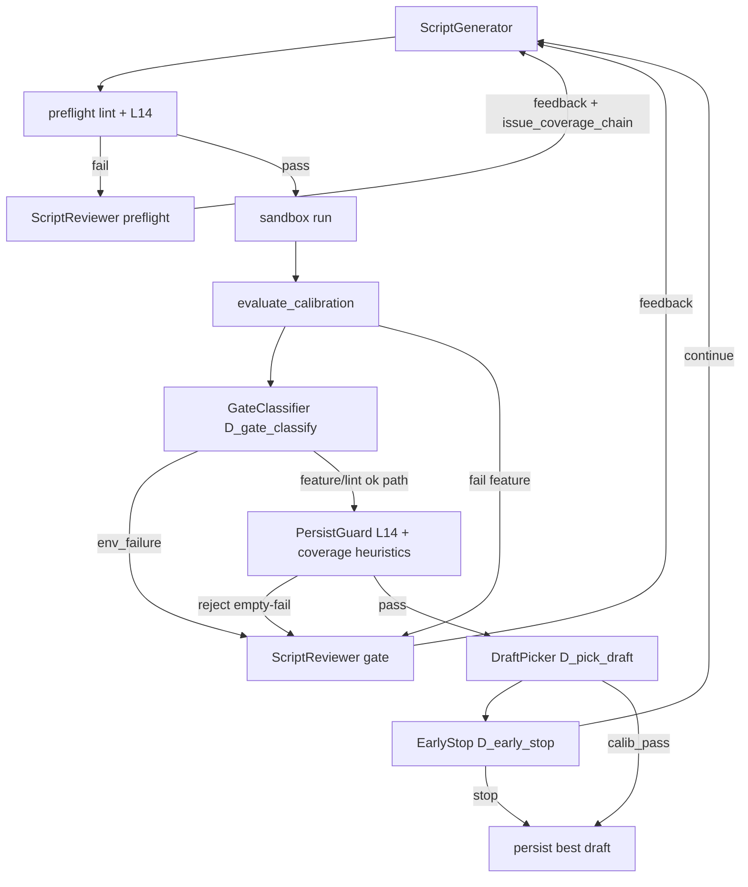

# Spec Parser ver3.3 技术设计文档

> **项目**：AutoCodeRover — 规范解析智能体（Module 1）  
> **基座路径**：`/datadisk/pengxm/auto-code-rover`  
> **基线版本**：v3.2.0（审视 LLM + 细化 L4 + 结构化改法回灌）  
> **目标版本**：v3.3.0  
> **前置文档**：[spec_parser_ver3.2_design.md](./spec_parser_ver3.2_design.md)、探针合成 [v3.2_probe_audit_synthesis.md](../../outputs/deepswe_spec_parser/deepswe-spec-parser-python-v3.2-probes/v3.2_probe_audit_synthesis.md)  
> **状态**：已实施（代码 + 本文档；验收以 15 题探针回归为准）

---

## 0. 元信息

| 项 | 值 |
|----|-----|
| 主矛盾（3.2 后） | 会改、能出卷；**卷面多数 PARTIAL**；Stub 顽固；骗 Lint；ENV 误标；越修越差 |
| 3.3 一句话 | **ver3.2 + Issue↔AC 证据链 + 脚本选稿/门禁决策链** |
| 硬约束不变 | lint / Gate 仍为最终裁决；不注入官方/隐藏测；不以审视「完美」为毕业证 |

---

## 1. 背景与 3.2 探针结论

ver3.2 在 15 题探针集（同 v3.1 题单）上验证：

| 结果 | 含义 |
|------|------|
| 脚本产出 **1/15 → 11/15** | 审视 LLM 把「拒识」变成「可改、可交卷」 |
| `calibration_passed` **1 → 10** | intentional-fail 路径大体可用 |
| 金标 httpx **NO_SCRIPT → SCRIPT+STRONG** | L4 细化有效 |
| 卷面 **STRONG 3 / PARTIAL 7 / INVALID 5** | 能交卷 ≠ 对题 |
| 假绿未大规模回流 | 3.1 止血仍有效，但 **ENV 误标** 出现新空洞 |

**3.2 主矛盾**：会改、能出卷；**未完成「出卷即对题」**。

### 1.1 缺陷清单（D1–D6，设计必须逐条映射）

| ID | 问题 | 典型表现 | 根因（合成报告） |
|----|------|----------|------------------|
| **D1** | PARTIAL 为主 | WRONG_LAYER、WEAK_ASSERT、NARROW、OVER_SPEC | 审视擅长清 lint，弱于 Issue Must 覆盖审计 |
| **D2** | Stub/existence 顽固 | gql/dateutil/psd/narwhals 3 轮仍 NO_SCRIPT | 改法模板弱；无强制行为 AC 例题 |
| **D3** | 骗 L12 | sqlfmt：`NotImplementedError` 换皮 Stub 后 lint 绿、audit INVALID | L12 过窄；落盘无行为证据校验 |
| **D4** | ENV→NOT_IMPLEMENTED | bandit/mashumaro/adaptix：缺 yaml/typing_extensions 却 calib_pass | Gate 仅黑名单 pytest/sympy 等；ImportError 被宽捕为 NOT_IMPLEMENTED |
| **D5** | 越修越差 / 白烧 token | narwhals 中间稿更好，终轮更 existence | 无 best-of；硬切最后一轮 |
| **D6** | PERFECT=0 | 长 Issue 边角仍漏 | 本版可逼近，不强制清零 |

### 1.2 仓库现状偏差说明

| 假设 | 代码事实 | 3.3 设计取值 |
|------|----------|--------------|
| Gate 已区分 ENV vs FEATURE | `calibration_gate.classify_stderr_script_error` 仅有 `_ENV_BLACKLIST_MODULES`（pytest/sympy/…），**不含** yaml/typing_extensions | 扩展 ENV 判定 + 决策链显式记录 |
| L12 已拦空壳 | `_has_stub_only_ac` 主要匹配 `AssertionError("Stub…")`；**NotImplementedError-only** 可绕过 | 新增 **L14-EMPTY-FAIL** |
| 已有证据链 | 仅有 `execution_evidence.json`、`gate_fixes.evidence` 字段；**无** Issue↔AC 结构化覆盖图 | 新增 `issue_coverage_chain` |
| 已有决策链 | 审视 Prompt 写优先级，**无**持久化 Decision Trace / best-of | 新增 `DecisionTraceRecorder` |

---

## 2. 目标与非目标

### 2.1 目标（可验收）

1. **Issue↔AC 证据链（CoE）**：审视输出结构化 `issue_coverage_chain[]`；生成侧优先补 `missing` / `weak`。
2. **决策链（Decision Trace）**：校准环关键分叉（Gate 分类、落盘拒稿、选稿、早停）持久化，可审计。
3. **Gate ENV vs FEATURE（确定性）**：传递依赖 ImportError 不得 `calibration_passed`；与审视 `gate_env` 对齐。
4. **L14-EMPTY-FAIL**：AC 段无产品 API 行为调用、仅空壳失败 → preflight blocking。
5. **best-of 中间稿**：多轮保留候选，按可计算 score 选最优落盘稿。
6. **顽固 Stub 早停**：连续 2 轮同 blocking 且无行为调用 → 提前 NO_SCRIPT + 明确原因。
7. **版本**：`V3_PARSER_VERSION = "3.3.0"`；`apply_spec_parser_version("3.3.0")` 默认开启双链 + 3.2 审视。

### 2.2 非目标

- 不以审视 LLM 宣布 PERFECT 为停止条件。
- 不接入 Harbor 隐藏测、`solution.patch`、`sample_test_excerpt`。
- 不强制本迭代 PERFECT=0 → 清零（可逼近 STRONG）。
- 不改 P1 extract / spec_refiner 大结构。
- **公开 API 签名检索**（减少 OVER_SPEC）：3.3.0 非必做；已由 **[ver3.3.1](./spec_parser_ver3.3.1_design.md)** 承接为 ScriptAnchor Tier1/Tier2。

---

## 3. 架构与时序

### 3.1 概念分工

| 链 | 回答的问题 | 主要载体 |
|----|-----------|----------|
| **证据链** | 凭什么认为测到了？Issue 明文 ↔ AC ↔ 调用/断言 | `issue_coverage_chain` + 机器启发式 |
| **决策链** | 为什么交这版 / 为什么拒稿？ | `script_decision_trace.json` |
| **思维链（CoT）** | 审视/生成内部推理 | 现有 LLM 输出，不单独持久化 |

优先级（不变）：**Lint / Gate > 证据链覆盖补全 > 文风**。

### 3.2 时序图（在 3.2 环上插入）



**LLM vs 确定性**：

| 组件 | 类型 |
|------|------|
| ScriptReviewer（含 coverage_chain 输出） | LLM |
| L14、层代理启发式、GateClassifier、DraftPicker score、EarlyStop | **确定性代码** |
| `sanitize_review`、lint 再跑 | 确定性 |

### 3.3 推荐构建时机

| 产物 | 时机 |
|------|------|
| `issue_coverage_chain` | **每次** ScriptReviewer 成功返回后（preflight + gate）；lint 通过且 gate 通过后**再跑一轮轻量 coverage-only review**（可选，默认 gate 通过后开启） |
| `script_decision_trace` | 每轮校准结束（lint/gate/pick/early_stop 各 append 节点） |
| `draft_candidates_round_{n}.json` | 每轮生成后、是否落盘前 |

---

## 4. 证据链详细设计

### 4.1 数据模型（Pydantic 草案）

新增至 `app/spec_parser/schema.py`：

```python
class IssueCoverageItem(BaseModel):
    """Single Issue Must / Should ↔ AC binding."""

    issue_item_id: str = ""          # e.g. "I7", "Must-CLI-snapshot"
    issue_quote: str = ""            # verbatim excerpt from Issue (<=200 chars)
    ac_id: str | None = None         # AC-007 or null if missing AC
    expected_layer: str = "any"      # api|cli|web|http|library|any
    actual_layer: str = "unknown"    # api|cli|web|http|library|proxy|unknown
    product_calls: list[str] = Field(default_factory=list)  # e.g. ["Monitor.capture_snapshot"]
    assertion_strength: str = "unknown"  # strong|medium|weak|wrong_layer|missing|existence|stub
    evidence_type: str = "unknown"   # behavioral|structural|existence|env|none|not_implemented
    verdict: str = "unknown"         # covered|partial|missing|over_spec|deferred
    legal_rewrite: str = ""          # pasteable skeleton; empty if deferred
    issue_quote_span_hint: str = ""  # optional line/section hint in Issue


class IssueCoverageChain(BaseModel):
    round_no: int = 1
    stage: Literal["preflight", "gate", "post_pass"] = "preflight"
    items: list[IssueCoverageItem] = Field(default_factory=list)
    summary: dict[str, int] = Field(default_factory=dict)  # covered/partial/missing counts
    source: str = "reviewer_llm"   # reviewer_llm|heuristic_merge


class ScriptReviewReport(BaseModel):
    # ... existing fields ...
    issue_coverage_chain: list[IssueCoverageItem] = Field(default_factory=list)
    decision_summary: dict[str, Any] = Field(default_factory=dict)
```

`ScriptReviewReport` **保留** `issue_alignment` 一期双写；解析层将 `issue_alignment` 条目同步/迁移到 `issue_coverage_chain`（见 §4.3）。

### 4.2 字段语义

| 字段 | 规则 |
|------|------|
| `issue_quote` | 必须来自 Issue 可见文本；禁止 invention |
| `verdict=missing` | Issue Must 无对应 AC 或 AC 为空壳 |
| `verdict=partial` | 有 AC 但 `wrong_layer` / `weak` / 只验结构 |
| `assertion_strength=wrong_layer` | AC 文案层（CLI/Web）与 `actual_layer` 不一致 |
| `legal_rewrite` | 与 3.2 相同：可粘贴；lint 非法则 deferred |

### 4.3 与现有 `issue_alignment` 的关系

**策略：扩展 + 双写一期（Phase B）**

| 阶段 | 行为 |
|------|------|
| 3.3.0 | Prompt 同时要求 `issue_coverage_chain` + `issue_alignment`（后者可自动生成摘要） |
| `format_review_feedback` | **优先**输出 `issue_coverage_chain` 中 `verdict in (missing, partial)` 且 `assertion_strength in (weak, wrong_layer, missing)` |
| 解析兼容 | 若 LLM 只返回 `issue_alignment`，`_migrate_alignment_to_chain()` 填默认 `issue_item_id=""` |

### 4.4 机器可校验的轻量规则（非 LLM）

新增 `app/spec_parser/coverage_heuristics.py`：

```python
def check_layer_mismatch(script: str, ac_id: str, ac_body: str) -> list[str]:
    """Return violation codes, e.g. WRONG_LAYER_CLI, WRONG_LAYER_WEB."""
```

启发式（允许误报 → 仅 **warning** 或审视 `ordered_actions` 强制项，默认 **不单独 blocking**）：

| 条件 | 检测 | 动作 |
|------|------|------|
| AC 注释/首行含 `CLI` / `command` / `click` | 脚本无 `CliRunner` / `subprocess` / `main(` 调用 | `WRONG_LAYER_CLI` warning |
| AC 含 `Web` / `HTTP` / `/api/` | 无 `TestClient` / `httpx` / `requests` / `client.get/post` | `WRONG_LAYER_WEB` warning |
| AC 含 `multipart` / `stream` | 仅测 `dict` 键 | `WEAK_ASSERT_STRUCTURE` warning |

**PersistGuard（落盘前，Phase A 可选 warning-only，Phase B 可对 STRONG 候选启用 hard reject）**：

- 若 `issue_coverage_chain` 中同一 Must 项 `verdict=missing` 且 `issue_item_id` 由审视明确标注 → 写入 `deferred_issue_gaps`，**不阻止** calib_pass（3.3 不引入「覆盖不足则 calib_fail」以免回归产出率）。
- 生成侧 feedback：**必须**列出 top-3 `missing`/`wrong_layer` 作为 `ordered_actions` 前两步之后的高优先级项。

### 4.5 回灌生成侧格式

扩展 `format_review_feedback()`（`script_reviewer.py`）：

```text
### issue_coverage_chain (Issue Must audit — do not invent symbols)
- [missing] I7 CLI snapshot group → AC-007: expected_layer=cli actual_layer=api
  legal_rewrite: <pasteable CliRunner skeleton>
- [partial] I5 diff by task object ID → AC-005: weak structural assert only
  legal_rewrite: <pasteable diff with real task ids>

Priority after clearing blocking lint/gate:
1. Fix all missing Must items
2. Fix wrong_layer before weak_assert
3. Then remaining partial / over_spec_risk
```

### 4.6 产物文件

| 文件 | 内容 |
|------|------|
| `script_review_round_{n}.json` | 并入 `issue_coverage_chain`、`decision_summary` |
| `issue_coverage_chain_round_{n}.json` | 可选独立导出（便于 audit diff） |
| `coverage_heuristics_round_{n}.json` | 机器层检测结果 |

---

## 5. 决策链详细设计

### 5.1 DecisionTrace schema

新增 `app/spec_parser/schema.py`：

```python
class DecisionNode(BaseModel):
    node_id: str                     # D_gate_classify | D_persist | D_pick_draft | D_early_stop | D_priority
    round_no: int = 1
    timestamp: str = ""              # ISO8601
    context_snapshot: dict[str, Any] = Field(default_factory=dict)
    options: list[str] = Field(default_factory=list)
    evaluation: dict[str, Any] = Field(default_factory=dict)
    policy_id: str = ""
    decision: str = ""
    reason: str = ""
    evidence_refs: list[str] = Field(default_factory=list)
    action: str = ""                 # persist|regen|no_script|pick_draft_a|calib_pass|calib_fail
    outcome: str = ""


class ScriptDecisionTrace(BaseModel):
    task_id: str = ""
    parser_version: str = "3.3.0"
    nodes: list[DecisionNode] = Field(default_factory=list)
    final_action: str = ""
    selected_draft_id: str = ""
```

产物：`script_decision_trace.json`（任务级，跨轮追加）。

### 5.2 节点规格表

#### D_gate_classify

| 项 | 值 |
|----|-----|
| **触发** | sandbox 返回后，`strict_legacy_ok` / `classify_stderr_script_error` 之前或之后 |
| **输入** | `task_type`, `stderr`, `script_content`, `issue_text`, `exit_code` |
| **options** | `env_failure`, `feature_not_implemented`, `feature_regression`, `lint_block`, `pass` |
| **policy** | `gate_env_v33`（见 §5.3） |
| **decision** | 上述之一 |
| **action** | `env_failure` → `calib_fail` + 审视 `gate_env`；`feature_not_implemented` → 允许 intentional fail 路径 |
| **evidence_refs** | `stderr:ModuleNotFoundError:yaml`, `policy:gate_env_v33` |

#### D_persist（PersistGuard）

| 项 | 值 |
|----|-----|
| **触发** | lint pass 且 Gate 判定可进入落盘候选 |
| **input** | script, lint_report, L14 结果, optional coverage_heuristics |
| **options** | `persist`, `reject_regen`, `reject_no_script` |
| **policy** | `l14_empty_fail_v33` |
| **decision** | L14 hit → `reject_regen`；否则 `persist` 进入 pickDraft |
| **evidence_refs** | `lint:L14-EMPTY-FAIL`, `ac:AC-003` |

#### D_pick_draft

| 项 | 值 |
|----|-----|
| **触发** | 某轮 `calibration_passed=True` 或达到 max_rounds |
| **input** | `draft_candidates[]` 各轮 metrics |
| **options** | 各 `draft_id` |
| **policy** | `draft_score_v33`（§5.5） |
| **decision** | 最高分 draft |
| **action** | 写 `spec.repro_script` 为选中稿 |

#### D_early_stop

| 项 | 值 |
|----|-----|
| **触发** | round ≥ 2 且 blocking 集合与上一轮相同 |
| **input** | `blocking_rules`, `behavioral_ac_count` from linter helper |
| **options** | `continue`, `no_script` |
| **policy** | `early_stop_stub_v33` |
| **decision** | 若同 blocking 且 `behavioral_ac_count==0` 连续 2 轮 → `no_script` |
| **action** | 清空 script / 标记 NO_SCRIPT，`final_action=no_script` |

#### D_priority（冲突记录）

| 项 | 值 |
|----|-----|
| **触发** | 审视 `issue_coverage_chain` 建议与 lint blocking 冲突 |
| **decision** | 固定 `lint_first` |
| **reason** | 写入 trace；`deferred_issue_gaps` 承接 |

### 5.3 Gate ENV vs FEATURE（D4 修复）

**现状**（`calibration_gate.py`）：

- `_ENV_BLACKLIST_MODULES` = pytest, sympy, numpy, …  
- 缺 **yaml**, **typing_extensions** 等传递依赖时，若 stderr 含 NOT_IMPLEMENTED + AssertionError → **不 blocking** → calib_pass。

**3.3 变更**：

1. 扩展 `_ENV_BLACKLIST_MODULES` 或新增 `_ENV_TRANSITIVE_MODULES`：

```python
_ENV_TRANSITIVE_MODULES = frozenset({
    "yaml", "typing_extensions", "packaging", "attrs", "idna", "certifi",
    # 实现时可从探针失败题归纳，配置化 spec_parser_env_transitive_modules
})
```

2. 新函数 `classify_gate_failure_kind(...) -> Literal["env", "feature", "mixed", "syntax", "none"]`：

| stderr 模式 | Issue 提及模块 | 判定 |
|-------------|----------------|------|
| `ModuleNotFoundError: yaml` | 否 | **env** → blocking |
| `ModuleNotFoundError: bandit` | 是（产品包） | feature（可能 NOT_IMPLEMENTED） |
| ImportError in AC try/except 包装为 NOT_IMPLEMENTED | 传递依赖 | **env**（即使文案含 NOT_IMPLEMENTED） |
| SyntaxError | — | blocking |

3. **`strict_legacy_ok` FEATURE 路径**：若 `classify_gate_failure_kind == "env"` → return `(False, "ENV import failure: …")`，**不得** calib_pass。

4. **生成侧**（`script_prompts_v3.py`）：禁止宽捕 `except ImportError` 一律变 NOT_IMPLEMENTED；须 `raise AssertionError(f"AC-xxx FAIL: ENV …")` 或 re-raise（由 Gate 拦）。

5. **审视**：已有 `gate_env`；3.3 要求 Gate 代码与审视 **同源**——Gate 判定 env 时审视仅输出空 `legal_rewrite`。

**验收**：bandit/mashumaro/adaptix 在缺传递依赖时 **calib_failed**（或明确 ENV reason），非 pass。

### 5.4 L14-EMPTY-FAIL（D3 修复）

**规则 ID**：`L14-EMPTY-FAIL`

**定义**：对任一 Must AC 段 body（同 L12 取段逻辑），若满足：

1. 存在 unconditional 失败路径：`raise NotImplementedError` / `raise AssertionError(...NOT_IMPLEMENTED...)` **且**
2. 该段内**无**「产品 API 行为调用」——复用并扩展 L12 的 `_PROJECT_CALL_RE`：

```python
_PROJECT_CALL_RE = re.compile(
    r"\b(assert|getattr|setattr|open|requests\.|httpx\.|client\.|"
    r"CliRunner|TestClient|subprocess\.|Retort|Monitor|load|dump|parse|format_|"
    r"invoke|click\.|main\(|\.run\(|\.call\(|\.execute\()\b",
    re.IGNORECASE,
)
```

3. 且该段无「值/异常」行为断言（非 existence-only）

→ **blocking**。

**与 L12 关系**：

| | L12-STUB-AC | L14-EMPTY-FAIL |
|---|-------------|----------------|
| 匹配 | `AssertionError("Stub…")` 为主 | `NotImplementedError` / NOT_IMPLEMENTED **无调用** |
| sqlfmt | 可能漏 | **应拦** |

**误伤豁免**：

- AC 段内已有真实调用 + NOT_IMPLEMENTED 仅在 `except AttributeError` 分支 → 不拦
- BUG_FIX 且 Issue 明确「API 不存在」→ 允许 NOT_IMPLEMENTED **但**须 Issue 关键词 `not implemented|missing api|no such`（启发式，默认仍要求至少一次探测性 import/call）

**PersistGuard**：lint pass 但 L14 机器复检 fail → D_persist = reject_regen（双保险，防 linter 版本不一致）。

### 5.5 best-of 选稿分数（D5）

每轮保存候选至 `draft_candidates_round_{n}.json`：

```python
@dataclass
class DraftMetrics:
    draft_id: str
    round_no: int
    lint_violations: int
    blocking_rules: list[str]
    behavioral_ac_count: int      # AC 段含 assert/raise + project call
    existence_only_ac_count: int
    empty_fail_ac_count: int      # L14 命中数
    calibration_passed: bool
    coverage_missing_must: int    # from issue_coverage_chain summary
    coverage_wrong_layer: int
```

**Score**（`draft_score_v33`）：

```text
score =
  (100 if calibration_passed else 0)
  + behavioral_ac_count * 8
  - lint_violations * 10
  - existence_only_ac_count * 12
  - empty_fail_ac_count * 25
  - coverage_missing_must * 6
  - coverage_wrong_layer * 4
```

**D_pick_draft 规则**：

1. 仅在 `calibration_passed=True` 的候选中选（若无，则 max_rounds 后 **NO_SCRIPT**）
2. 同分取 **lint_violations 更少** → **round 更早**（防止越修越差）

**agent.py 变更**：`break` 前不立即落盘终稿；写入候选池，最后一并 `pick_best_draft()`。

### 5.6 早停策略

配置 `spec_parser_early_stop_stub_rounds: int = 2`（默认 2）。

```python
def should_early_stop(history: list[RoundSnapshot]) -> bool:
    if len(history) < spec_parser_early_stop_stub_rounds:
        return False
    tail = history[-spec_parser_early_stop_stub_rounds:]
    same_blocking = len({frozenset(r.blocking_rules) for r in tail}) == 1
    no_behavior = all(r.behavioral_ac_count == 0 for r in tail)
    stub_like = all(
        "L10-EXISTENCE-ONLY" in r.blocking_rules or "L12-STUB-AC" in r.blocking_rules or "L14-EMPTY-FAIL" in r.blocking_rules
        for r in tail
    )
    return same_blocking and no_behavior and stub_like
```

触发 → D_early_stop → NO_SCRIPT，`reason` 写入 decision trace + run report。

---

## 6. Prompt / Schema 变更契约

### 6.1 `SCRIPT_REVIEW_SYSTEM_PROMPT` 增补段落（草案）

插入 `script_review_prompts.py` 的 Hard priority 之后：

```text
Evidence chain (Issue↔AC):
- Emit issue_coverage_chain[]: one entry per Issue Must/Should you can anchor with a verbatim issue_quote (<=200 chars).
- Fields per item: issue_item_id, issue_quote, ac_id, expected_layer, actual_layer, product_calls[],
  assertion_strength, evidence_type, verdict, legal_rewrite (when fixable without violating lint).
- verdict: covered|partial|missing|over_spec|deferred
- assertion_strength: strong|medium|weak|wrong_layer|missing|existence|stub
- Do NOT mark covered when AC only proxies CLI/Web via lower-level API calls.

Decision summary:
- Emit decision_summary: { lint_vs_issue_conflict: bool, top_missing_must: [...], recommended_priority: "lint_first"|... }
- When lint/gate conflicts with coverage fixes, verdict MUST be deferred and legal_rewrite empty.

Minimal legal behavior template (for L10/L12/L14 blocking):
- Each blocking_fix MUST include a 5-15 line bad→good example with at least one real library call
  and a value or exception assertion (not is not None only).
```

### 6.2 输出 JSON 完整示例

```json
{
  "diagnosis": {
    "failure_class": "lint",
    "summary": "L10 on AC-003; Issue Must I2 only weakly covered."
  },
  "blocking_fixes": [
    {
      "rule": "L10-EXISTENCE-ONLY",
      "bad_pattern": "assert hasattr(m, 'foo')",
      "legal_rewrite": "result = m.foo(issue_input)\nassert result == expected_from_issue",
      "why_legal": "calls product API with Issue-stated input"
    }
  ],
  "gate_fixes": [],
  "issue_alignment": [
    {
      "kind": "missing_must",
      "detail": "I7 CLI snapshot group not exercised",
      "legal_rewrite": "from click.testing import CliRunner\nrunner = CliRunner()\nresult = runner.invoke(cli, ['snapshot', 'save'])\nassert result.exit_code == 0",
      "superseded_by_blocking": false
    }
  ],
  "issue_coverage_chain": [
    {
      "issue_item_id": "I7",
      "issue_quote": "Add snapshot CLI group",
      "ac_id": "AC-007",
      "expected_layer": "cli",
      "actual_layer": "api",
      "product_calls": ["Monitor.capture_snapshot"],
      "assertion_strength": "wrong_layer",
      "evidence_type": "behavioral",
      "verdict": "partial",
      "legal_rewrite": "from click.testing import CliRunner\n..."
    },
    {
      "issue_item_id": "I8",
      "issue_quote": "POST /api/snapshot save returns {id}",
      "ac_id": null,
      "expected_layer": "web",
      "actual_layer": "unknown",
      "product_calls": [],
      "assertion_strength": "missing",
      "evidence_type": "none",
      "verdict": "missing",
      "legal_rewrite": "from starlette.testclient import TestClient\n..."
    }
  ],
  "decision_summary": {
    "lint_vs_issue_conflict": false,
    "top_missing_must": ["I8"],
    "recommended_priority": "lint_first"
  },
  "deferred_issue_gaps": [],
  "ordered_actions": [
    "1. Clear L10 on AC-003 with real call + value assert",
    "2. Add AC or extend AC-007 for I7 using CliRunner (not Monitor-only)",
    "3. Add Web AC for I8 POST /api/snapshot with TestClient"
  ]
}
```

**兼容**：缺 `issue_coverage_chain` 时解析为空列表；`decision_summary` 默认 `{}`。

### 6.3 `sanitize_review` 新增校验

| 检查 | 动作 |
|------|------|
| `issue_coverage_chain[].legal_rewrite` 含非法模式 | 清空该 rewrite，verdict→deferred |
| `verdict=covered` 但 `assertion_strength in (weak, existence, stub)` | 降级为 `partial` |
| `gate_fixes` 在 Gate 已判 env 时仍给非空 rewrite | 丢弃 rewrite |

### 6.4 生成侧 `script_prompts_v3.py` 绝对约束增补

```text
- Follow issue_coverage_chain missing/partial items after lint/gate fixes (ver3.3).
- WRONG_LAYER forbidden: if Issue requires CLI/Web, do not substitute lower-level API-only tests.
- ImportError from missing transitive deps (yaml, typing_extensions, …) must NOT be wrapped as NOT_IMPLEMENTED;
  script should fail Gate as ENV or avoid importing optional deps not in Issue.
- Do not use NotImplementedError as the only AC body without a prior product API probe call.
```

---

## 7. 模块、配置与文件改动表

| 路径 | 变更 | 职责 |
|------|------|------|
| `app/spec_parser/schema.py` | 修改 | `IssueCoverageItem`, `IssueCoverageChain`, `DecisionNode`, `ScriptDecisionTrace`, `DraftMetrics`; 扩展 `ScriptReviewReport` |
| `app/spec_parser/evidence_chain.py` | **新增** | 解析/合并 coverage chain；`_migrate_alignment_to_chain`；summary 统计 |
| `app/spec_parser/decision_trace.py` | **新增** | `DecisionTraceRecorder`；节点 append；JSON 持久化 |
| `app/spec_parser/draft_picker.py` | **新增** | metrics 收集、`score_draft`、`pick_best_draft` |
| `app/spec_parser/coverage_heuristics.py` | **新增** | 层代理 / 弱断言 warning |
| `app/spec_parser/calibration_gate.py` | 修改 | `classify_gate_failure_kind`；扩展 ENV 模块；`strict_legacy_ok` env 分支 |
| `app/spec_parser/script_linter.py` | 修改 | L14-EMPTY-FAIL；`count_behavioral_acs()` helper |
| `app/spec_parser/script_review_prompts.py` | 修改 | System prompt + schema 说明 + stage task |
| `app/spec_parser/script_reviewer.py` | 修改 | 解析新字段；sanitize；`format_review_feedback` 优先 coverage |
| `app/spec_parser/script_prompts_v3.py` | 修改 | 生成侧约束 |
| `app/spec_parser/agent.py` | 修改 | 候选池、pickDraft、earlyStop、decision trace 写入 |
| `app/spec_parser/pipeline.py` | 修改 | `V3_PARSER_VERSION = "3.3.0"`；`apply_spec_parser_version` |
| `app/config.py` | 修改 | 新开关（下表） |
| `app/main.py` | 修改 | CLI `--spec-parser-version 3.3.0`；双链开关 |
| `scripts/run_deepswe_spec_parser.py` | 修改 | conf 示例 |
| `test/app/spec_parser/test_evidence_chain.py` | **新增** | coverage 解析/迁移 |
| `test/app/spec_parser/test_decision_trace.py` | **新增** | Gate 分类、early stop |
| `test/app/spec_parser/test_draft_picker.py` | **新增** | score 排序 |
| `test/app/spec_parser/test_script_linter_l14.py` | **新增** | sqlfmt 类样例 |
| `test/app/spec_parser/test_calibration_gate_env_v33.py` | **新增** | yaml/typing_extensions |
| `test/app/spec_parser/test_script_reviewer.py` | 修改 | coverage_chain sanitize |

**为何独立 `evidence_chain.py` / `decision_trace.py`**：与 LLM 审视解耦；单测 Gate/L14/score 不依赖 reviewer mock；3.4 可复用于 offline audit。

### 7.1 配置项

| 配置 | 默认（3.3.0） | 含义 |
|------|---------------|------|
| `spec_parser_version` | `"3.3.0"` | 运行时版本 |
| `spec_parser_enable_script_review` | `True` | 继承 3.2 |
| `spec_parser_enable_evidence_chain` | `True` | 解析/回灌 coverage chain |
| `spec_parser_enable_decision_trace` | `True` | 写 `script_decision_trace.json` |
| `spec_parser_enable_draft_best_of` | `True` | 多轮选最优稿 |
| `spec_parser_early_stop_stub_rounds` | `2` | 顽固 Stub 早停 |
| `spec_parser_env_transitive_modules` | `["yaml","typing_extensions",…]` | ENV Gate 扩展列表 |
| `spec_parser_coverage_post_pass_review` | `False` | gate 通过后再跑 coverage-only 审视（省 token 默认关） |
| `spec_parser_wrong_layer_warnings` | `True` | 启发式 warning |

`apply_spec_parser_version("3.3.0")`：

```python
config.spec_parser_enable_script_review = True
config.spec_parser_enable_evidence_chain = True
config.spec_parser_enable_decision_trace = True
config.spec_parser_enable_draft_best_of = True
```

`apply_spec_parser_version("3.2.0")`：关闭 evidence/decision/best-of，保留 script review。

### 7.2 产物文件（增量）

| 文件 | 含义 |
|------|------|
| `script_decision_trace.json` | 全任务决策链 |
| `draft_candidates_round_{n}.json` | 本轮候选 metrics |
| `coverage_heuristics_round_{n}.json` | 机器层检测 |
| `issue_coverage_chain_round_{n}.json` | 可选独立 coverage 导出 |

---

## 8. 与机器判据冲突消解

| 场景 | 机制 |
|------|------|
| coverage 要求补 CLI，lint 仍 L10 | `deferred` + `superseded_by_blocking`；D_priority 记 lint_first |
| 审视建议吞异常 | `sanitize_review` 丢弃 |
| Gate env，审视给 feature rewrite | Gate 为准；gate_fixes `env_not_script` + 空 rewrite |
| L14 vs intentional NOT_IMPLEMENTED | L14 要求先有 probe call；Gate FEATURE 仍允许 AC FAIL |
| best-of 选了 calib_pass 但 audit PARTIAL | **预期**；3.3 抬 STRONG，不保证 PERFECT |
| 审视 parse 失败 | 降级 3.2 feedback；decision trace 记 `review_degraded` |

---

## 9. 相对 3.2 的 diff 与回退

| 能力 | 3.2 | 3.3 |
|------|-----|-----|
| 审视 LLM + L4 细化 | 有 | 保留 |
| `issue_alignment` 散文式缺口 | 有 | 保留 + **issue_coverage_chain** |
| Gate ENV 黑名单 | pytest/sympy/… | +传递依赖 + **kind 分类** |
| L12 Stub | 有 | 保留 + **L14** |
| 选稿 | 最后一轮 pass 即落盘 | **best-of** |
| 早停 | 无 | **stub 早停** |
| 决策审计 | 无 | **script_decision_trace.json** |
| 版本 | 3.2.0 | **3.3.0** |

回退：

```bash
--spec-parser-version 3.2.0
# 或 3.3 但关双链：
--spec-parser-version 3.3.0 --no-evidence-chain --no-decision-trace --no-draft-best-of
#（CLI 名以实现为准，需在 main.py 暴露）
```

---

## 10. 验收标准（15 题探针）

沿用题单：`conf/deepswe_python_tasks_v3.1_probes.txt`（或 v3.2 conf 复制改 id）。  
建议输出目录：`deepswe-spec-parser-python-v3.3-probes`。

| 指标 | 3.2 实测 | 3.3 目标 |
|------|----------|----------|
| 脚本产出率 | 11/15 | **≥12/15** |
| STRONG（本目录 audit） | 3 | **≥5** |
| PARTIAL | 7 | 下降（无硬性上限） |
| INVALID（有脚本骗 lint） | 1（sqlfmt） | **0** |
| ENV 误标 calib_pass | bandit/mashumaro/adaptix 风险 | **0** |
| dateutil **或** psd 非 Stub 产出 | 0 | **≥1** |
| 探针假阳性 calib_pass | 大体 0 | **保持 0** |
| `script_decision_trace.json` 覆盖率 | — | **15/15 题有文件** |

单测：§7 所列新增/修改 test 全绿 + 原有 `test_script_reviewer.py`、`test_script_linter_v31.py` 无回归。

---

## 11. 分阶段落地计划（实现 Agent 施工顺序）

### Phase A — P0 堵洞（优先合入）

| 项 | 内容 |
|----|------|
| **改动** | `calibration_gate.py` ENV 扩展；`script_linter.py` L14；`decision_trace.py` 最小集（D_gate_classify, D_persist）；`agent.py` PersistGuard |
| **单测** | `test_calibration_gate_env_v33.py`, `test_script_linter_l14.py`, `test_decision_trace.py`（gate 节点） |
| **冒烟题** | sqlfmt（L14）、bandit（ENV）、httpx-multipart（无回归） |
| **DoD** | sqlfmt 不得 lint pass 落盘；bandit 缺 yaml 时 calib_fail；决策 trace 含 D_gate_classify |

### Phase B — P1 抬 PARTIAL

| 项 | 内容 |
|----|------|
| **改动** | `schema` coverage 模型；`script_review_prompts` + `script_reviewer`；`evidence_chain.py`；`format_review_feedback`；`coverage_heuristics.py`；`script_prompts_v3.py` |
| **单测** | `test_evidence_chain.py`, `test_script_reviewer.py` 扩展 |
| **冒烟题** | aiomonitor（WRONG_LAYER）、sqlite-utils（保持 STRONG） |
| **DoD** | 审视 JSON 含 `issue_coverage_chain`；feedback 列出 missing；aiomonitor 再生至少提及 CLI/Web 改法 |

### Phase C — P2 流程

| 项 | 内容 |
|----|------|
| **改动** | `draft_picker.py`；`agent.py` best-of + early stop；config CLI |
| **单测** | `test_draft_picker.py`, early stop 场景 |
| **冒烟题** | narwhals（不越修越差或早停）、dateutil/psd（Stub 题至少 1 题进展） |
| **DoD** | 存在多轮 calib_pass 时选高分稿；顽固 Stub 2 轮早停 NO_SCRIPT |

### Phase 依赖

```text
Phase A → Phase B → Phase C
（B 可与 A 部分并行：Prompt/schema 不依赖 L14 合入，但集成测试建议 A 先）
```

---

## 12. 风险、不足与非目标重申

| 风险 | 缓解 |
|------|------|
| 审视填错 coverage 表 | sanitize + 机器 wrong_layer warning；不以 coverage 单独 calib_fail |
| L14 误伤合法 NOT_IMPLEMENTED | probe call 豁免；单测覆盖 httpx 金标 |
| ENV 列表不全 | `spec_parser_env_transitive_modules` 配置化；探针迭代补充 |
| best-of 选到「好跑但偏题」稿 | score 加入 `coverage_missing_must` / `wrong_layer`（Phase C 依赖 Phase B metrics） |
| token 成本上升 | `coverage_post_pass_review` 默认关；early stop 省顽固题 |
| PERFECT 仍为 0 | 非目标；可选 3.4 签名检索 |

**不足（相对业务期望）**：

- 双链**不能替代**人工 Issue↔脚本 audit 的最终 STRONG 判定。
- API 参数序错误（OVER_SPEC）：3.3 仅 Prompt 约束；仓库契约锚定见 **[ver3.3.1 ScriptAnchor](./spec_parser_ver3.3.1_design.md)**。
- 长 Issue 截断（6000/12000）下 coverage 仍可能漏 off-screen Must → 继续用 `deferred_issue_gaps`。

---

## 13. 运行示例

```bash
# 复制 conf
cp conf/deepseek-deepswe-spec-parser-v3.2-probes.conf \
   conf/deepseek-deepswe-spec-parser-v3.3-probes.conf
# 编辑 conf：id: deepswe-spec-parser-python-v3.3-probes

PYTHONPATH=. python scripts/run_deepswe_spec_parser.py \
  --conf-file conf/deepseek-deepswe-spec-parser-v3.3-probes.conf \
  --spec-parser-version 3.3.0 \
  --use-v3-prompts \
  --stop-after calibration

# 对照 3.2（关双链，若 CLI 已实现）：
# --spec-parser-version 3.2.0
```

---

## 附录 A — D1–D6 → 设计能力映射

| 缺陷 | 3.3 能力 | Phase |
|------|----------|-------|
| D1 PARTIAL | `issue_coverage_chain` + wrong_layer 启发式 + 生成侧优先补 missing | B |
| D2 Stub 顽固 | L14 + 审视行为例题模板 + early stop | A+B+C |
| D3 骗 L12 | L14 + D_persist | A |
| D4 ENV→NOT_IMPLEMENTED | `classify_gate_failure_kind` + ENV 模块扩展 + D_gate_classify | A |
| D5 越修越差 | `draft_picker` + D_pick_draft | C |
| D6 PERFECT=0 | coverage 链逼近；非硬目标 | B |

---

## 附录 B — JSON 样例

### B.1 issue_coverage_chain（aiomonitor 简化）

```json
{
  "round_no": 1,
  "stage": "post_pass",
  "items": [
    {
      "issue_item_id": "I7",
      "issue_quote": "Add snapshot CLI group",
      "ac_id": "AC-007",
      "expected_layer": "cli",
      "actual_layer": "api",
      "product_calls": ["Monitor.capture_snapshot"],
      "assertion_strength": "wrong_layer",
      "evidence_type": "behavioral",
      "verdict": "partial",
      "legal_rewrite": "from click.testing import CliRunner\n..."
    }
  ],
  "summary": {"covered": 4, "partial": 3, "missing": 3}
}
```

### B.2 script_decision_trace（bandit ENV 简化）

```json
{
  "parser_version": "3.3.0",
  "nodes": [
    {
      "node_id": "D_gate_classify",
      "round_no": 1,
      "options": ["env_failure", "feature_not_implemented", "pass"],
      "policy_id": "gate_env_v33",
      "decision": "env_failure",
      "reason": "ModuleNotFoundError: yaml not in Issue",
      "evidence_refs": ["stderr:No module named 'yaml'"],
      "action": "calib_fail"
    }
  ],
  "final_action": "regen",
  "selected_draft_id": ""
}
```

---

## 附录 C — 实现 Agent 检查清单

- [ ] `V3_PARSER_VERSION = "3.3.0"` 与 `apply_spec_parser_version` 默认值
- [ ] L14 单测含 sqlfmt 类 NotImplementedError 样例
- [ ] Gate：yaml / typing_extensions → calib_fail
- [ ] `ScriptReviewReport.issue_coverage_chain` 解析与 sanitize
- [ ] `format_review_feedback` 输出 missing/partial 优先指令
- [ ] `script_decision_trace.json` 每题落盘
- [ ] `draft_picker` 集成 + narwhals 类回归
- [ ] early stop 2 轮同 blocking
- [ ] CLI / conf `v3.3-probes` 样例
- [ ] 15 题探针跑批 + 对照 `v3.2_probe_audit_synthesis.md` 指标
- [ ] 3.2 回退路径手动冒烟

---

## 附录 D — 与 v3.2 合成 backlog 映射

| v3.2 合成建议 | 3.3 落地 |
|---------------|----------|
| P0 扩 L12 / L14 空壳失败 | §5.4 L14-EMPTY-FAIL |
| P0 Gate 区分 ENV vs 功能 | §5.3 + D_gate_classify |
| P0 审视 L10/L12 行为例题 | §6.1 blocking_fixes 模板要求 |
| P1 Issue Must 覆盖表 | §4 `issue_coverage_chain` |
| P1 禁止层代理 | §4.4 + §6.4 |
| P2 中间稿保留 | §5.5 draft_picker |
| P2 顽固早停 | §5.6 D_early_stop |
