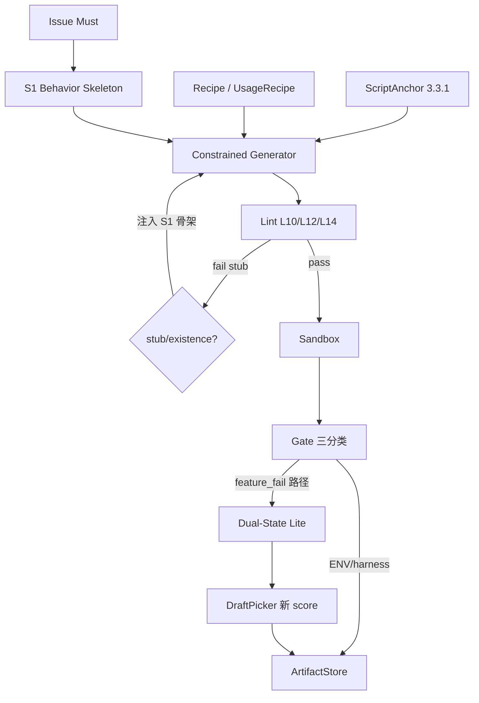
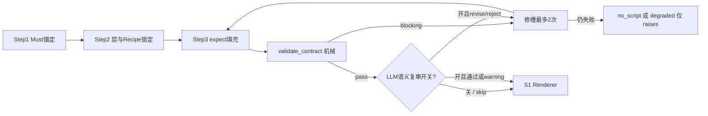

# Spec Parser ver3.4 设计计划文档（历史稿）

> **⚠️ 实现请以最终版为准**：[spec_parser_ver3.4_design_FINAL.md](./spec_parser_ver3.4_design_FINAL.md)（`3.4.0-FINAL.1`）  
> 本文档保留 α…α7 演进过程与 BehaviorContract 长文 Spec，**不再作为 Runtime 冲突仲裁源**。  
>  
> **项目**：AutoCodeRover — 规范解析智能体（Module 1）  
> **基座路径**：`/datadisk/pengxm/auto-code-rover`  
> **基线版本**：v3.3.1（ScriptAnchor Tier1/Tier2 + v3.3 证据/决策链）  
> **目标版本**：v3.4.0  
> **前置文档**：  
> - [spec_parser_ver3.3.1_design.md](./spec_parser_ver3.3.1_design.md)  
> - [spec_parser_ver3.3_design.md](./spec_parser_ver3.3_design.md)  
> - **探针实证**：[v3.3.1_test_results_summary.md](./v3.3.1_test_results_summary.md)  
> **文档性质**：历史设计计划（已由 FINAL 吸收 Preflight 冻结条款）  
> **状态**：Superseded for implementation — 见 FINAL  
> **题单**（回归）：`conf/deepswe_python_tasks_v3.1_probes.txt`（15 题）  
> **相关 prompt**：[prompts/prompt_optimize_contract_first_table.md](./prompts/prompt_optimize_contract_first_table.md) · [prompts/preflight/INDEX.md](./prompts/preflight/INDEX.md)

---

## 0. 元信息

| 项 | 值 |
|----|-----|
| 主矛盾（相对 3.3.1） | 管线能出卷；**复现脚本仍不能可靠当金标**。拒识器堆叠（L10/L12/L14/ENV）强于构造器；校准只验 buggy-fail，不验语义同构与 patched-pass 上界 |
| 3.4 一句话 | **拒识之外补构造：S1 降级交卷 + 用法配方（Recipe）+ Gate/产物纯化 + Dual-State Lite；契约优先（Contract-First）作主架构演进** |
| 相对 3.3.1 的战略转向 | 停止「再加一条 lint 指望对题」；改优化 **可当验收物的下界（S1）** 与 **假失败风险** |
| 硬约束不变 | 不注入 Harbor 隐藏测 / `solution.patch` / 官方测试断言意图；lint/Gate 仍为机器裁决；不以审视 LLM「完美」为毕业证 |
| 硬约束澄清 | 「不注入官方测」≠「不能从 README/docstring/examples 抽用法配方」；≠「不能做 Issue 明文期望方向检查」 |
| 审查预期 | Conditional Go：先过 §8 最小验证门禁（V1–V6），再开全量 15 题 LLM 跑批 |

### 0.1 一页纸：为什么要做 3.4

```text
v3.2  能交卷（11/15），卷面多数 PARTIAL
v3.3  证据链 + 决策链 + L14：拒假卷更强
v3.3.1 ScriptAnchor：消一类假 kwargs（adaptix）✅
        但仍：PERFECT=0，STRONG 1，INVALID 8，stub 四题空手
        calib 10→7（ENV/harness 更诚实暴露，不是卷面变好）

结论：锚定符号层有效，但「对题」需要：
  ① 具体期望值（语义层）
  ② 正确调用编排（用法层 / Recipe）
  ③ 拒 stub 后的替代产出（S1 构造器）
  ④ 纯化度量（ENV ≠ 功能失败；decision ↔ 磁盘一致）
  ⑤ 假失败防护（Dual-State Lite）
```

### 0.2 禁止再走的死胡同（设计红线）

| 红线 | 原因 |
|------|------|
| 再加 L15「语义同构」却仍无正向验向手段 | 负反馈加厚，正样本仍为零 |
| ScriptAnchor Tier3「更深全库 AST」指望消 WRONG_LAYER | 缺的是用法配方，不是更多符号名 |
| 把 `calibration_passed` 当版本主 KPI | 奖励「能挂」而非「测对」 |
| L12 拒绝后继续「自由 regen 三轮」无模板 | 同分布重采样；igel 已证明退步 |
| 为追 PERFECT 一次性大改 Contract-First 全链路 | 易再次设计空转；3.4 分期交付 |

---

## 1. 背景：v3.3.1 实证结论（设计输入）

依据：[v3.3.1_test_results_summary.md](./v3.3.1_test_results_summary.md)（审计 2026-07-19）。

### 1.1 双口径提醒

| 口径 | v3.3.1 | 含义 |
|------|--------|------|
| 管线 ok | 15/15 | 流程跑通 |
| 磁盘有脚本 | 11/15 | 有文件 ≠ 入选金标 |
| `calibration_passed` | 7/15 | buggy 上能挂 |
| 卷面 PERFECT / STRONG / PARTIAL / INVALID | 0 / 1 / 6 / 8 | **本版优化主口径** |

### 1.2 质量问题簇 → 3.4 工作包映射

| ID | 问题簇 | 代表题 | 3.4 工作包 |
|----|--------|--------|------------|
| **Q1** | 无可用脚本（L10/L12→no_script） | gql, igel, dateutil, psd | **WP-S1** + **WP-CF（§3.5）** |
| **Q2** | 正确实现假失败 | cattrs, aiomonitor | **WP-DSL** Dual-State Lite |
| **Q3** | WRONG_LAYER / 测错集成层 | adaptix, mashumaro, aiomonitor Web | **WP-RCP** Recipe Cards / UsageRecipe |
| **Q4** | ENV / harness 污染校准 | sqlite, sqlfmt, narwhals, bandit | **WP-GAT** Gate 三分类 + harness 适配 |
| **Q5** | 存在性 / 弱断言 | httpx-streaming, narwhals, … | **WP-S1** + score / 证据链约束 |
| **Q6** | 过窄 / 过宽 | multipart 边角；`_internal` | 分层交卷；禁止私有导入启发式 |
| **Q7** | decision 与落盘不一致 | bandit/sqlfmt 等残留稿 | **WP-ART** Artifact 事务一致性 |

### 1.3 根因定性（供后续改设计时对照）

```text
Issue Must
  ├─ 生成侧：偏好「能 import / 能挂 NOT_IMPLEMENTED」→ 弱断言 / 窄路径
  ├─ Anchor 侧：符号有了，编排（recipe）没有 → WRONG_LAYER
  ├─ Lint/Gate：擅长拒 stub，不验与 Issue 同构；无 patched-pass
  └─ 环境侧：依赖/CLI 格式污染 → 度量失真；no_script 与磁盘残留并存
```

**反常识判决**：主矛盾不是「模型不会写 pytest」，而是  
**没有把 Issue 编译成带具体期望的契约，却要求自由生成脚本在「只验 buggy 红」的环里自发变成金标。**

---

## 2. 目标与非目标

### 2.1 目标（可验收）

1. **分层交卷（S0–S3）**：定义脚本能力阶梯；`no_script` 仅在 S1 仍不可达时允许。
2. **S1 Skeleton / Contract MVP**：L10/L12/L14 命中后走 §3.5 契约流水并渲染 S1；禁止空想三轮。
3. **BehaviorContract Spec（切入点 α）**：落地 MVP 字段集、`validate_contract`、S1 Renderer；产物 `behavior_contract.json`。
4. **Library Recipe Cards（探针优先）**：至少覆盖 adaptix / mashumaro / httpx / aiohttp-TestClient；与契约 `recipe_id` / BC-08 联动。
5. **Gate 失败三分类**：`missing_third_party` | `missing_feature_module` | `harness_error` | `feature_fail`；仅后者计入脚本质量失败统计。
6. **Artifact 一致性**：`final_action=no_script` ⇒ 删除或隔离未入选 `test_feature.py`；run report 显式双口径。
7. **Dual-State Lite**：async loop / Issue-expect 冲突 / Web 无真实路由则删段；降低假失败。
8. **KPI 换锚**：主看 S1_coverage、INVALID↓、false_fail_risk、layer_hit_rate、artifact_consistency；`calibration_passed` 降为辅助。
9. **版本开关**：`V3_PARSER_VERSION = "3.4.0"`；`apply_spec_parser_version("3.4.0")` = 3.3.1 能力 + 本版 WP。

### 2.2 非目标（本版不做 / 明确推迟）

| 非目标 | 去向 |
|--------|------|
| PERFECT=0 → 清零 | P2；3.4 只逼近 STRONG↑、INVALID↓ |
| 注入 Harbor / solution / 官方测试正文 | 硬约束不变 |
| 全仓库调用图 / 完整框架路由图 | 可选 3.5+；本版用配方卡 + 轻量 UsageRecipe |
| 完整 Contract-First 全链路（所有题默认 LLM 只填槽、Renderer 出全 Must） | **3.4.1+**；**3.4.0 已定 MVP Schema（§3.5）并在 stub 路径强制走契约流水** |
| 以「有 solution 的 patched-pass」为默认校准 | 无 patch 时用 Dual-State Lite；完整双仓校准另立项 |
| 放宽 Gate 假装 calib↑ | 禁止；应用分类纯化，而非回退 ENV 检测 |

### 2.3 成功标准（15 题探针，相对 v3.3.1）

| 指标 | v3.3.1 | v3.4 目标 | 备注 |
|------|--------|-----------|------|
| PERFECT | 0 | 不强制 | 非本版 KPI |
| STRONG | 1 | **≥3** | 含 httpx-multipart 保底 + adaptix 升层 |
| INVALID | 8 | **≤4** | 假失败 / 无脚本 / harness 误杀下降 |
| 无脚本（accepted） | 4 | **≤2** | S1 降级后 igel/dateutil/psd 至少回「有行为脚本」 |
| `calibration_passed`（feature_fail 语义） | 7（含脏） | **可解释 ≥7** | 分母改为「进入 feature 校准的题」 |
| artifact_consistency | 差 | **15/15** | decision↔磁盘 |
| adaptix 卷面 | PARTIAL WRONG_LAYER | **≥STRONG 或明确 recipe 命中** | V1 门禁 |
| cattrs / aiomonitor 假失败 | INVALID | **不再因已知杀手模式 INVALID** | V2 门禁 |
| Gate 三分类落盘 | 无 | **相关失败题 100% 可分类** | WP-GAT |

---

## 3. 核心设计思想

### 3.1 三个维度转换（相对 3.3.x）

| 维度 | 3.3.x 默认 | 3.4 转向 |
|------|------------|----------|
| **α 契约优先** | LLM 自由生成整份 pytest → 事后 lint | **填 BehaviorContract → `validate_contract`（机械资格门）→ 可选 LLM 语义复审 → Renderer**（详 §3.5 / §3.5.8） |
| **β 双态验向** | 只跑 buggy，挂了 = calib_pass | Dual-State Lite：检查期望方向与脚手架自洽（无需 solution） |
| **γ 分层交付** | `有脚本/calib` vs `no_script` 二元 | S0→S1→S2→S3；拒 stub 后默认降级吐 S1 |

### 3.2 能力阶梯定义

| 阶 | 名称 | 最低要求 | 下游可用性 |
|----|------|----------|------------|
| **S0** | Env Ready | 目标包 / 声明的第三方可 import；harness 不崩 | 仅说明环境 |
| **S1** | Minimal Oracle | ≥1 条 Must 对应 **具体期望**（`==` / `raises` / 关键字段值），且调用落在允许层 | **可交卷底线**；F2P 弱可用 |
| **S2** | Must Coverage | 证据链 Must 无 critical missing；无 WRONG_LAYER blocking | 主路径验收 |
| **S3** | Edge Complete | 边角 / 多 backend；逼近 PERFECT | 人工 audit 冲刺 |

**决策规则（草案）**：

1. 达到 S1 + `feature_fail` 校准语义干净 → 允许 `calib_pass` 选稿。  
2. 仅 S0 或 existence-only → 不得 `calib_pass`。  
3. L10/L12/L14 连续命中 → 注入 S1 骨架；仍无 concrete expect → 才 `no_script`。  
4. 语义反 Issue（假失败风险高）→ **优先于无脚本拒绝**（比空手更危险）。

### 3.3 知识分层（修订 3.3.1 §1.2）

| 层 | 需要什么 | 失败模式 | 3.3.1 | **3.4** |
|----|----------|----------|-------|---------|
| 运行层 | 包名、依赖 | ImportError | RepoContext + ENV | **Gate 三分类 + 可选 EnvProvisioner** |
| 入口层 | CLI/HTTP/公开导出 | WRONG_LAYER | Anchor Tier1 | 保留 + Web/CLI 入口强化 |
| 契约层 | 签名 | OVER_SPEC | Tier1/2 | 保留；错签名仍不注入 |
| **用法层** | 符号共现 / recipe | WRONG_LAYER | **缺失** | **Recipe Cards + UsageRecipe（轻）** |
| 语义层 | Issue 期望值 | WEAK / 假失败 | 证据链标题对齐 | **S1 expect 槽 + Dual-State Lite** |

### 3.4 概念架构

```text
Issue 明文（行为 oracle）
    +
ScriptAnchor（符号 / 入口）          ← 3.3.1 保留
    +
UsageRecipe / Recipe Cards（编排）   ← 3.4 新增
    +
BehaviorContract-S1（§3.5 MVP 表）   ← 3.4 新增（Status: Spec）
    ↓
validate_contract →（可选）LLM 表语义复审 → S1 Renderer → SCC 脚本一致性（可回写契约）
    ↓
Lint / L14 / S1 门禁
    ↓
Gate（三分类）+ Dual-State Lite
    ↓
证据链 + 决策链（新 score / 新 KPI）
    ↓
ArtifactStore.commit(final_action)   ← 事务落盘
```



### 3.5 切入点 α 详细规格：BehaviorContract 表（Status: Spec）

> **来源**：[prompt_optimize_contract_first_table.md](./prompts/prompt_optimize_contract_first_table.md) 首轮落地；语义复审见 §3.5.8。  
> **原则**：字段能少则少；每个 MVP 字段必须能指出「删了会回到哪种失败」。**资格门以机器为准**；LLM 仅作可选语义复审，不得放行未过 BC 的表。  
> **分期**：3.4.0 只强制 **MVP 字段集 + `validate_contract` + S1 Renderer/注入**；**LLM 语义复审默认关（可开 ablation）**；完整字段集服务 S2/S3，进 3.4.1+。

#### 3.5.1 设计判决

1. **效果来自三道闸，不是来自「更结构化」四个字**：① `issue_quote` 绑定期望方向；② `oracle_kind + expect` 强制具体值；③ `layer/call_graph/recipe_id` 锁调用编排。  
2. **胜负手是 expect 子系统**：没有可判别的 concrete expect，一律不能出 S1；这比事后 L10/L12 更早、更硬。  
3. **填表必须分步**：Must 锚定 → 层/Recipe 锁定 → expect 填充；禁止一次 LLM 填完整表后空想三轮。  
4. **审核分层**：**BC 机械 = blocking 资格门**；**LLM 语义复审 = 可选、仅审机器已过的表**（打假失败/偏题/弱主 Must）。LLM 不能推翻「BC 未过」。  
5. **Renderer 默认只读槽位**：LLM 改数据不改骨架；骨架由 `oracle_kind`×`layer` 模板决定。  
6. **最大风险**：S1 期望填反（比无脚本更糟）→ quote 绑定 + BC-09 +（可选）LLM 复审 + Dual-State Lite（§4 WP-DSL）。  
7. **降级（Workaround）**：FEATURE 无示例数字时允许 `expect_confidence=low` + `oracle_kind=raises`（探测 API 可调用/约定异常），但仍禁止 existence-only。

#### 3.5.2 文档级 `BehaviorContract`

| 字段 | 类型 | S1 | S2/S3 | 来源 | 删了会怎样 |
|------|------|----|-------|------|------------|
| `contract_id` | str | 必填 | 必填 | 系统 | 无法审计/选稿 |
| `task_id` | str | 必填 | 必填 | 跑批 | 无法对齐探针 |
| `issue_kind` | `FEATURE` \| `BUG_FIX` | 必填 | 必填 | P1/启发式 | FEATURE/BUG expect 策略混淆 |
| `items` | list[`BehaviorContractItem`] | ≥1 | ≥Must 数 | 流水填充 | 空合同 → 回 stub/no_script |
| `script_tier` | `S1`\|`S2`\|`S3` | 必填 | 必填 | 校验器推导 | 分层交卷失效 |
| `degraded` | bool | 默认 false | — | 校验器 | 无法标记低置信交卷 |
| `degraded_reason` | str\|null | degraded 时必填 | — | 校验器 | 不可审计 |
| `recipe_ids_used` | list[str] | 可选 | 推荐 | Recipe 命中 | 编排审计缺失（WARNING） |
| `schema_version` | str | `"bc-1"` | `"bc-1"` | 常量 | 演进无法兼容 |
| `bc_validate` | object | 必填 | 必填 | `validate_contract` | 无机器审计迹 |
| `llm_review` | object\|null | 开关开则必填 | 同左 | LLM 语义复审 | 无法 ablation / 追责 |

#### 3.5.3 行级 `BehaviorContractItem` — MVP 字段集（3.4.0 必做）

> **论证**：下列 11 项为 S1「足够且必要」。再少会立刻回到 v3.3.1 失败簇；再多不阻塞 3.4.0。

| 字段 | 类型 / 枚举 | S1 | 来源 | 坏填写反例 | 防止的失败 |
|------|-------------|----|------|------------|------------|
| `must_id` | str | 必填 | Issue Must 编号/哈希 | 空、重复无含义 | NARROW 无锚 |
| `issue_quote` | str ≤200 | 必填 | **仅 Issue 原文截取** | 改写复述、空 | FALSE_FAIL / 无依据 expect |
| `layer` | `lib`\|`cli`\|`web`\|`async` | 必填 | Issue+Anchor；禁止瞎猜 web | 该 cli 却填 lib | WRONG_LAYER |
| `call_graph` | list[str] ≥1 | 必填 | Anchor 公开符号 / Recipe 展开 | `["hasattr"]`、私有 `_foo` | EXISTENCE / OVER_SPEC |
| `inputs` | object（JSON） | 必填 | quote 示例优先；否则 LLM 但须可序列化 | `"some data"` 散文 | WEAK / 不可渲染 |
| `oracle_kind` | 见 §3.5.5 | 必填 | 由 expect 形态决定 | `"should_work"` | WEAK_ASSERT |
| `expect` | object（见正规形式） | 必填 | quote 绑定；禁止空对象 | `{}` / `{"note":"ok"}` | WEAK / STUB |
| `fail_mode` | `attr_error`\|`assert`\|`raise`\|`not_implemented`\|`cli_nonzero` | 必填 | Issue 种类+层 | 空 | 校准语义不清 |
| `recipe_id` | str\|null | 有卡则必填 | Recipe Cards | 有 adaptix 卡却 null 且 call 违规 | WRONG_LAYER |
| `expect_confidence` | `high`\|`low` | 必填 | 有无数字/字面量示例 | 无 quote 却 high | 假高置信 |
| `tier` | `S1`\|`S2`\|`S3` | 必填 | 本行目标 | S3 却无边角依据 | 分层失控 |

**MVP 消融（删字段 → 预期回流）**：

| 删字段 | 立刻回流 |
|--------|----------|
| `issue_quote` | FALSE_FAIL（期望写反不可追责） |
| `oracle_kind` + `expect` | WEAK / STUB / EXISTENCE |
| `call_graph` | EXISTENCE / 测错符号 |
| `layer` / `recipe_id` | WRONG_LAYER |
| `fail_mode` | calib 解释混乱、harness 与 feature 难分 |
| `expect_confidence` | 低质 S1 被当成金标 |

#### 3.5.4 完整字段集（S2/S3 / 3.4.1+ 增量）

| 字段 | 类型 | 何时必填 | 作用 |
|------|------|----------|------|
| `priority` | `must`\|`should`\|`edge` | S2+ | 覆盖排序；edge 不挡 S1 |
| `setup` | list[str] | cli/web/async 推荐 | fixture/loop/client 脚手架 |
| `entrypoint` | str\|null | cli/web | console_script 或 HTTP path（来自 Anchor） |
| `forbidden_calls` | list[str] | 有 Recipe 时 | 机器禁止片段（可冗余卡内 forbidden） |
| `harness` | object | async/web/cli | `{loop:"asyncio.run", client:"TestClient", stdout:"json_slice"}` |
| `field_path` | str\|null | `oracle_kind=field_path` | 嵌套取值路径 |
| `assert_op` | `eq`\|`ne`\|`in`\|`regex`\|`isinstance` | 部分 kind | 运算子显式化 |
| `shadow_check` | bool | 可选 | 是否跑 pure-python shadow（DSL 增强） |
| `notes` | str | 禁止作 expect 替代 | 仅人读 |

#### 3.5.5 expect 正规形式与 `oracle_kind` 目录

**正规形式（所有 kind 共用信封）**：

```json
{
  "oracle_kind": "equality",
  "value": "<JSON-serializable>",
  "field_path": null,
  "exception": null,
  "regex": null,
  "http_status": null,
  "message_substr": null,
  "compare": "eq"
}
```

| oracle_kind | 必填子字段 | 适用 | 禁止 |
|-------------|------------|------|------|
| `equality` | `value` | 返回值/结构化对象整比 | value 为 `"ok"`/`true` 无语义 |
| `field_path` | `field_path` + `value` | 嵌套字段（cattrs partial 等） | path 空 |
| `raises` | `exception`（点分类型名） | API 缺失、约定异常 | 仅 `Exception` 过于宽（WARNING） |
| `stdout_regex` | `regex` | CLI | 无锚入口 |
| `http_status` | `http_status` + 可选 `field_path`/`value` | Web | 无真实 `entrypoint` path |
| `contains` | `value`（子串或子结构） | 流式片段/部分映射 | 空 value |
| `predicate_ref` | `value` 为预注册谓词 id | 极难表达时 **Workaround** | 自由 Python 代码字符串（禁止） |

**`expect_confidence` 策略**：

| 条件 | confidence | 可否交 S1 |
|------|------------|-----------|
| quote 含字面量数字/字符串/JSON 样例，且 expect.value 由其导出 | `high` | 是 |
| quote 仅定性（「应返回 None」）且 expect 与定性同向 | `high` | 是 |
| FEATURE 无样例，仅能 `raises`/`attr_error` 探测 | `low` | **是（degraded S1）** |
| expect 与 quote 关键词冲突（如 quote 说 None，value 要求 partial 对象） | — | **拒填（blocking）** |
| 无 quote | — | **拒填** |
| existence / hasattr 冒充 expect | — | **拒填** |

**FEATURE vs BUG_FIX**：

| | FEATURE | BUG_FIX |
|--|---------|---------|
| 典型 fail_mode | `attr_error` / `not_implemented` / `raises` | `assert`（行为偏离） |
| expect | 优先 quote 样例；否则 low+raises 探测 | 必须有「错误现状 vs 期望」可判别 value |
| call_graph | 允许 Anchor 未命中时用 Issue 点名符号（字符串） | 应尽量 Anchor 命中公开符号 |

**难测形态模板（摘要）**：

- **嵌套对象**：`oracle_kind=field_path`，如 `field_path="value"` + `value=null`（对齐 cattrs 类 Issue）。  
- **流式**：`contains` 或累计 list 后 `equality`；禁止只 assert 有 `aiter_*`。  
- **CLI**：`layer=cli` + `entrypoint` + `stdout_regex` 或 exit + 文件侧写。  
- **HTTP**：必须 `entrypoint` 来自 Anchor；`http_status` + 可选 JSON `field_path`。

#### 3.5.6 校验规则 `validate_contract`（机器可执行）

| rule_id | 条件 | blocking | 消除 |
|---------|------|----------|------|
| **BC-01** | `items` 为空 | 是 | STUB / no_script 空转 |
| **BC-02** | 任一行缺 `issue_quote` 或 quote 非 Issue 子串（启发式：归一化后 substring） | 是 | FALSE_FAIL 无锚 |
| **BC-03** | `oracle_kind` 非法或 `expect` 缺该 kind 必填子字段 | 是 | WEAK |
| **BC-04** | `expect` 空对象 / value∈{null 且 kind 非 field_path 允许 null, "", "ok", "works"} 黑名单 | 是 | WEAK / STUB |
| **BC-05** | `call_graph` 空，或全为 `hasattr`/`dir`/`getattr` 探测无调用 | 是 | EXISTENCE_ONLY（前置 L10） |
| **BC-06** | `call_graph` 含 `._` 私有路径且非 Issue 点名 | 是 | OVER_SPEC |
| **BC-07** | `layer∈{cli,web}` 但缺 `entrypoint`（完整集）或 call_graph 无入口符号 | 是（S2）；S1 warning→应补 | WRONG_LAYER |
| **BC-08** | Recipe 命中但 `recipe_id` 空，或 `call_graph` 命中卡 `forbidden_patterns` | 是 | WRONG_LAYER（前置层错） |
| **BC-09** | quote 与 expect 方向冲突（关键词表：None/null vs required object；true vs false 等） | 是 | FALSE_FAIL（前置 DSL） |
| **BC-10** | `layer=async` 且 `harness.loop` 缺失（完整集）；MVP：标记 `needs_async_harness=true` | S1 warning / S2 是 | FALSE_FAIL 脚手架 |
| **BC-11** | 无任何 `expect_confidence=high` 行且无 low+raises 降级行 | 是 | 假 S1 |
| **BC-12** | 重复 `must_id` | 是 | 覆盖审计乱 |
| **BC-W1** | `exception=Exception` 过宽 | 否 | 弱异常 |
| **BC-W2** | 仅 1 行 S1 而 Issue Must≥3 | 否 | NARROW（允许 degraded） |

**与 L10/L12/L14 关系**：BC-03/04/05 在契约层前置，lint 保留作**渲染后双保险**；若契约已 pass，L12 空壳应极少触发。目标是让 lint **变薄**，不是再加 L15。

#### 3.5.7 填表流水（禁止一次填完）



| 步 | 输入 | 输出 | 允许上下文 | 重试 |
|----|------|------|------------|------|
| **1 Must 锚定** | Issue | `must_id` + `issue_quote` 列表（可多行） | 仅 Issue | 启发式抽取；LLM 只许选原文片段 |
| **2 层/Recipe** | Step1 + Anchor + Recipe Cards | `layer` + `call_graph` + `recipe_id` +（完整集）`entrypoint`/`forbidden` | Anchor、Cards、examples 摘要 | 卡命中则 **禁止**自由改 call_graph 结构 |
| **3 expect** | Step1–2 | `oracle_kind` + `expect` + `fail_mode` + `confidence` | quote + 已锁 call_graph | 只修 expect/fail_mode；**不重写** layer/recipe |
| **机械校验** | 全表 | `bc_validate` Violations | **无 LLM** | blocking → 修表 Agent / 回 Step3，计入修槽次数 |
| **LLM 语义复审** | 仅 BC 已 pass 的表 | `llm_review`（§3.5.8） | Issue + 契约 JSON；**禁止**官方测 | → **TableGenFeedback** → **修表 Agent**（`contract_repair_prompts.py`，与首填 Prompt **分离**） |
| **渲染后 SCC** | 脚本+表 | patch / Feedback | §3.5.10 | 归一 Feedback → 同一修表 Agent；`render_error` 不改表 |
| **渲染** | BC pass 且（复审关 / pass / warning-only） | `test_feature.py` | Renderer | 默认不改骨架 |

> **生成 vs 修表**：  
> - **首填（已落地 MVP）**：[`contract_fill_prompts.py`](../../app/spec_parser/contract_fill_prompts.py)  
> - **修表（已落地 v2）**：[`contract_repair_prompts.py`](../../app/spec_parser/contract_repair_prompts.py) / [prompts/contract_repair_v1.md](./prompts/contract_repair_v1.md)  
> - **修表优化元 Prompt**：[prompts/prompt_optimize_contract_repair.md](./prompts/prompt_optimize_contract_repair.md)  
> 同模型可复用，**Prompt 必须分开**。

#### 3.5.8 BC 机械 + LLM 语义复审（可选开关）

> **Prompt 打磨**：[prompts/prompt_optimize_contract_llm_review.md](./prompts/prompt_optimize_contract_llm_review.md)  
> **双审视→回写表（元 Prompt）**：[prompts/prompt_design_dual_review_to_table_feedback.md](./prompts/prompt_design_dual_review_to_table_feedback.md)  
> **复审 Prompt v1（已落地）**：[prompts/contract_review_semantics_v1.md](./prompts/contract_review_semantics_v1.md) · 代码 [`app/spec_parser/contract_review_prompts.py`](../../app/spec_parser/contract_review_prompts.py)  
> **原则**：机械 BC = 资格门；LLM = 语义审计官 + **证据链强制**；无 span 不得 reject。

##### 定位与权限（硬规则）

| 层 | 职责 | 权限 |
|----|------|------|
| **`validate_contract`（机械）** | 形状 / 资格：空期望、existence、私有 API、recipe 禁式、粗粒度 quote 冲突等 | **Blocking 一票否决**；未过 → **禁止**进入 LLM 复审，更禁止渲染 |
| **`review_contract_semantics`（LLM）** | 意思 / 金标风险：与 quote 是否同向、是否打在主 Must、degraded 是否过弱、编排是否「合法但偏题」 | **不能放行 BC 未过的表**；输出结构化裁决；`reject_*` / `revise_*` 打回修槽 |

**反模式（禁止）**：

- LLM 写「整体不错」散文毕业  
- 填表模型与复审模型同一 prompt 套路无隔离时，仍以复审结果为唯一毕业条件  
- 用 LLM 复审绕过 BC-04/05/08 等机械规则  
- 复审失败后允许自由重写整表（只许改 expect/fail_mode，与 §3.5.7 一致）

##### 开关与触发策略

```text
spec_parser_enable_contract_llm_review: bool = False   # 3.4.0 默认关；探针 ablation 再开
spec_parser_contract_llm_review_mode: str = "high_risk_only"
  # off | always | high_risk_only
```

| `mode` | 行为 |
|--------|------|
| `off` | 等同总开关 False |
| `always` | 凡 BC pass 即复审（贵；适合小样本 ablation） |
| `high_risk_only` | **推荐默认**：仅当命中任一高风险条件时复审 |

**高风险条件（`high_risk_only`，满足其一即触发）**：

1. 任一行 `layer ∈ {web, async}`  
2. 任一行 `recipe_id` 非空（编排题）  
3. 任一行 `expect_confidence=low` 或文档 `degraded=true`  
4. Issue 抽取 Must 数 ≥3 且契约 `items` 仅 1 行 S1（易偏主 Must）  
5. 配置白名单 `task_id`（如 cattrs / aiomonitor 金标回归题）

##### LLM 输入 / 输出契约

**输入（最小化，防同谋与泄金标）**：

- Issue 原文（可截断至现有 script prompt 上限）  
- 已过 BC 的 `BehaviorContract` JSON（含各行 `issue_quote` / `expect` / `call_graph`）  
- Anchor/Recipe **摘要**（可选，只读）  
- **禁止**：官方测试正文、`solution.patch`、Harbor、上一轮「看起来像测试」的自由脚本

**输出（必须可解析 JSON，否则视为 `revise_expect` 并记 `llm_review_parse_error`）**：

> 以下为 **v1 证据链版**（相对初稿升级）。实现与 Prompt 以 `contract_review_prompts.py` 为准。

```json
{
  "verdict": "pass | warning | revise_expect | reject_false_fail | reject_off_must",
  "blocking": false,
  "item_findings": [
    {
      "finding_id": "F1",
      "must_id": "M1-...",
      "issue": "false_fail | off_must | weak_degraded | recipe_misaligned | quote_drift | multi_item_inconsistency | insufficient_evidence | ok",
      "severity": "blocking | warning | info",
      "claim": "<=200 chars",
      "evidence_chain": [
        {
          "step_id": "E1",
          "claim": "one-sentence",
          "source_type": "issue_span | contract_field | recipe_hint | anchor_entry | derived",
          "source_ref": "issue@... OR items[i].expect.value",
          "span_text": "<=120 chars verbatim from inputs",
          "support": "supports | contradicts | neutral"
        }
      ],
      "fix": "expect/fail_mode/confidence only",
      "confidence": "high | medium | low"
    }
  ],
  "must_coverage_notes": [
    {
      "must_candidate_span": "<=120 from Issue",
      "covered_by_must_id": "M1-...|null",
      "note": "covered|uncovered_primary|edge|uncertain"
    }
  ],
  "self_checks": {
    "all_spans_substring_verified": true,
    "no_external_oracle_used": true,
    "findings_complete": true
  },
  "summary": "<=200 chars"
}
```

**证据链硬约束（sanitize 必须执行）**：

| 规则 | 要求 |
|------|------|
| 非 ok finding | `evidence_chain` 非空；false_fail/off_must/… ≥2 步；`insufficient_evidence` ≥1 |
| `span_text` | 必须为 Issue / contract JSON / recipe_hints / anchor_summary 的子串（可空白归一化） |
| `derived` | 全链 ≤1 步，且不得单独成链 |
| 完整列点 | 禁止只报「最严重一条」；`findings_complete` 自检 |
| 无证据 | 不得 `reject_*`；用 `insufficient_evidence` + warning |
| BC 优先 | BC 未过禁止调用复审 |

| `verdict` | `blocking` | 后续 |
|-----------|------------|------|
| `pass` | false | 渲染 |
| `warning` | false | 渲染；写入 `llm_review`；score 可小扣 |
| `revise_expect` | true | 回 Step3；消耗 1 次修槽 |
| `reject_false_fail` | true | 回 Step3；若修槽耗尽 → **优先 no_script**（假金标差于空手） |
| `reject_off_must` | true | 回 Step3；提示换主 Must / 增行；耗尽 → no_script 或 degraded（可配置） |

**复审清单（已写入 `CONTRACT_REVIEW_SEMANTICS_SYSTEM`）**：

1. 每行 `expect` 是否与该行 `issue_quote` **同向**？（false_fail）  
2. 是否打在 Issue **主 Must**？（off_must + `must_coverage_notes`）  
3. `call_graph` 是否「BC 合法但明显测错集成意图」？（recipe_misaligned；仅当输入含 hint）  
4. `expect_confidence=low` 是否可升格？（weak_degraded）  
5. 不得发明 Issue 未出现的期望；不得建议官方测试；每条 finding 必须证据链。

**Prompt API**：

```python
from app.spec_parser.contract_review_prompts import (
    CONTRACT_REVIEW_SEMANTICS_SYSTEM,
    format_contract_review_user,
    MIN_EVIDENCE_STEPS,
)

user = format_contract_review_user(
    issue_text=...,
    contract_json=...,
    recipe_hints=...,
    anchor_summary=...,
    trigger_reasons=["layer_web", "recipe_present"],
)
# messages: system=CONTRACT_REVIEW_SEMANTICS_SYSTEM, user=user
```

##### 与填表 LLM 的隔离（降同谋）

| 手段 | 说明 |
|------|------|
| 角色分离 | 填表用 `contract_fill_*` prompt；复审用 `CONTRACT_REVIEW_SEMANTICS_*`（`contract_review_prompts.py`）；系统提示禁止「协助通过审核」 |
| 温度 | 复审建议 `temperature=0` / 最低 |
| 可选不同模型 | `spec_parser_contract_review_model` 可覆盖；默认可与主模型相同，但 prompt 必须分离 |
| 审计 | `script_decision_trace` 记 `D_contract_bc_validate`、`D_contract_llm_review`（含 verdict、是否触发 high_risk） |

##### 产物字段（写入 `behavior_contract.json`）

```json
{
  "bc_validate": {
    "ok": true,
    "blocking_rules": [],
    "warnings": ["BC-W2"]
  },
  "llm_review": {
    "enabled": true,
    "triggered": true,
    "mode": "high_risk_only",
    "trigger_reasons": ["layer_web", "recipe_present"],
    "verdict": "pass",
    "blocking": false,
    "raw_ref": "llm_review_round_1.json"
  }
}
```

开关关闭时：`llm_review: null` 或 `{ "enabled": false, "triggered": false }`。

##### Ablation 与预期收益

| 配置 | 用途 |
|------|------|
| 仅机械（默认） | 基线成本；消空壳/弱断言 |
| 机械 + `high_risk_only` | 主推实验臂；打假失败/偏题 |
| 机械 + `always` | 上界成本与收益 |

**预期**：空壳/假参数提升有限；**cattrs 类假失败、主 Must 偏题、编排似是而非** 更可能升。若 always 相对 high_risk 无显著卷面收益，保持 high_risk 或关。

##### 实现要点

- 模块建议：`behavior_contract.py`（机械）+ `contract_llm_review.py`（复审调用与 JSON sanitize）  
- sanitize：缺字段、非法 verdict → 当作 `revise_expect` + warning，**不得**当 `pass`  
- 复审与机械 **共享** `spec_parser_contract_max_expect_retries`（默认 2），避免「机械 2 次 + LLM 2 次」变相 4 轮空想  

#### 3.5.9 Renderer 映射与 S1 伪代码模板

| 契约字段 | 渲染目标 |
|----------|----------|
| `call_graph` + `recipe_id` | arrange 段调用（按卡展开模板） |
| `inputs` | 实参 / payload 字面量 |
| `oracle_kind` + `expect` | assert / raises / regex 分支 |
| `layer` + harness | `asyncio.run` / `TestClient` / `CliRunner` 外壳 |
| `fail_mode` | buggy 注释与校准预期（不生成「空 raise NotImplemented」冒充 AC） |

**规则**：默认 **LLM 不得改渲染后骨架**；若需修补，只许改 `inputs`/`expect` 槽位后重渲染。  
渲染后进入 **§3.5.10 脚本一致性复审**（机械对齐为主，可选 LLM）；发现问题只回写契约，禁止润色脚本。

**S1 伪代码（lib + equality）**：

```python
# AUTOGEN from BehaviorContract item={must_id} recipe={recipe_id}
def test_ac_{must_id}():
    # arrange — call_graph locked
    ...  # recipe template expansion
    result = <call_graph>(-inputs-)
    # assert — oracle_kind=equality
    assert result == <expect.value>
```

**S1 伪代码（async）**：

```python
def test_ac_{must_id}():
    async def _body():
        result = await <call_graph>(...)
        assert result == <expect.value>
    asyncio.run(_body())  # harness.loop locked; 禁止未 running loop + threadsafe
```

#### 3.5.10 脚本一致性复审 → 回写契约（Status: Spec）

> **定位**：表格语义复审（§3.5.8）管「Issue↔表」；本节管「**脚本↔表**」（兼带 Issue 残余），把误差变成**改表指令**，再重渲染。  
> **红线**：不得以「优化脚本」为主路径；不得绕过契约直接多轮改 pytest。  
> **分期**：3.4.0 先落地 **机械对齐（SCC-M）**；**可选 LLM（SCC-L）** 默认关，与表格复审一样可 ablation。  
> **双审视专门化 + 统一回写表反馈**：见 [prompts/prompt_design_dual_review_to_table_feedback.md](./prompts/prompt_design_dual_review_to_table_feedback.md)（`TableGenFeedback`）。

##### 为何还要这一层

| 层 | 已覆盖 | 仍可能漏 |
|----|--------|----------|
| §3.5.8 表语义复审 | 期望写反、偏 Must | 渲染映错、模板漏字段、脚本与表表面都「有」但对不齐 |
| 机械 lint L10/L14 | 空壳/弱形状 | 不查「assert 值是否等于 expect.value」 |
| 本节 | — | **脚本产物是否忠实编译了契约**；并把语义残留打回 Step3 |

##### 流水位置

```text
… → validate_contract →（可选）表 LLM 复审
  → render_s1_script
  → 薄 lint（L10/L12/L14 双保险）
  →【§3.5.10】脚本一致性复审 SCC
       ├─ blocking → 生成 contract_patch → 回 Step3 修槽（计入修槽预算）
       │              → re-validate → re-render
       └─ pass/warning → sandbox / Gate …
```

**共享预算**：与 §3.5.7 / §3.5.8 共用 `spec_parser_contract_max_expect_retries`（默认 2）。  
SCC 触发的修槽 **不得**再额外加 2 次（防「表审 2 + 脚本审 2」空想）。

##### 双通道：SCC-M（机械，默认开）+ SCC-L（LLM，可选）

| 通道 | 开关（草案） | 职责 |
|------|--------------|------|
| **SCC-M** | `spec_parser_enable_script_contract_align: bool = True` | AST/文本对齐：调用、断言值、oracle 形态、must_id 段是否存在 |
| **SCC-L** | `spec_parser_enable_script_contract_llm: bool = False`；`mode=high_risk_only\|always\|off` | 仅补机器说不清的语义残留；输出必须映射到契约字段 |

**优先级**：SCC-M blocking 未修复前，**不调用** SCC-L（省 token、免同谋）。  
**与旧 `script_reviewer` 关系**：契约路径上，旧「自由改脚本」审视 **降级或旁路**；其 Issue 覆盖能力由 §3.5.8 + 本节 `contract_patch` 承接。非契约路径可暂留旧审视（O8）。

##### SCC-M 检查规则（机器可执行）

对每个 `BehaviorContractItem`（`must_id`）：

| rule_id | 条件 | severity | 默认 patch 目标 |
|---------|------|----------|-----------------|
| **SCC-01** | 渲染脚本中无对应 `test_ac_{must_id}` / AC 锚注释 | blocking | 重渲染；若仍无 → renderer bug（记 `render_error`，不改表） |
| **SCC-02** | `call_graph` 中符号未出现在该 AC 段产品调用 | blocking | 优先 `render_error`；若模板按表展开却缺失 → 查 recipe 模板 |
| **SCC-03** | `oracle_kind=equality\|field_path\|contains` 且脚本中无与 `expect.value` 可匹配的字面量/常量 | blocking | **回写**确认 expect 是否被模板吞掉；若表有值脚本无 → `render_error`；若需改语义 → 不在此改 Issue |
| **SCC-04** | `oracle_kind=raises` 但 AC 段无 `pytest.raises` / 等价 | blocking | render_error 或补模板 |
| **SCC-05** | `oracle_kind=http_status` 但无 status 断言 / 无 `entrypoint` 路径字符串 | blocking | 同上 |
| **SCC-06** | 脚本 AC 段出现 `hasattr`/`in dir` 为主断言 | blocking | 不应出现；render_error |
| **SCC-07** | 脚本断言字面量 **无法** 从 `expect`+`inputs`+`issue_quote` 导出（多出「发明值」） | blocking | **contract_patch**：标 `script_invented_literal` → 强制回到表审；默认 **删脚本发明、以表为准重渲染**（表优先） |
| **SCC-W1** | 仅 warning：AC 段过长 / 重复 assert | warning | 不改表 |

**表优先原则**：脚本与表冲突时，**以表为准重渲染**；仅当 SCC-L/表复审同时认定表错时，才 `contract_patch` 改 expect。

##### `contract_patch` 输出契约（回写唯一通道）

```json
{
  "verdict": "pass | warning | patch_contract | render_error",
  "blocking": true,
  "findings": [
    {
      "finding_id": "S1",
      "rule_id": "SCC-03",
      "must_id": "M1-...",
      "channel": "machine | llm",
      "problem": "missing_expect_literal | call_graph_gap | invented_literal | semantic_mismatch | ...",
      "evidence_chain": [
        {
          "step_id": "E1",
          "source_type": "script_span | contract_field | issue_span | derived",
          "source_ref": "test_feature.py:L40-L48 OR items[0].expect.value",
          "span_text": "<=120 chars",
          "support": "supports | contradicts | neutral"
        }
      ],
      "patch": {
        "action": "update_expect | update_fail_mode | update_confidence | noop_rerender | mark_render_bug",
        "path": "items[must_id=M1].expect.value",
        "next_value": null,
        "rationale": "<=200 chars"
      }
    }
  ],
  "summary": "<=200 chars"
}
```

**回写执行器 `apply_contract_patch`**：

1. 只允许改：`expect` / `fail_mode` / `expect_confidence` /（可选）新增 must 行的 quote 绑定提示；**禁止** patch 直接改 `call_graph`/`recipe_id`（防脚本反向污染编排锁）。  
2. `action=noop_rerender` / `mark_render_bug`：不改表，修模板或重渲染。  
3. 应用后必须再跑 `validate_contract`；失败则回滚 patch。  
4. 成功 → `render_s1_script` → 再跑 SCC-M（同一次修槽计数 +1）。  
5. 决策链节点：`D_scc_machine`、`D_scc_llm`、`D_contract_patch_apply`。

##### SCC-L（可选 LLM）约束

与 §3.5.8 同级抗幻觉要求：

- 输入：Issue、契约 JSON、**脚本全文或按 must 切段**、SCC-M findings（只读）  
- 禁止：官方测 / patch；禁止输出「请改写整段 pytest」  
- 输出：必须落在 `contract_patch` schema；每条 finding 强制 `evidence_chain`（至少含 `script_span` + `contract_field`）  
- `high_risk_only` 触发：与表复审类似（web/async、recipe、degraded、SCC-M 有 warning、白名单题）  
- Prompt 落点（计划）：`script_contract_align_prompts.py`（可后补；初版可先只做 SCC-M）

##### 与表格 LLM 复审的分工

| | §3.5.8 表复审 | §3.5.10 脚本一致性 |
|--|----------------|-------------------|
| 主问题 | Issue↔表语义 | 脚本↔表忠实度 + 残余语义 |
| 默认 | 可选，默认关 | **SCC-M 默认开**；SCC-L 默认关 |
| 失败处置 | 改 expect 等 | patch 或 render_error |
| 禁止 | 放行 BC 脏表 | 直接润色脚本毕业 |

##### 配置（草案）

```python
spec_parser_enable_script_contract_align: bool = True   # SCC-M
spec_parser_enable_script_contract_llm: bool = False    # SCC-L
spec_parser_script_contract_llm_mode: str = "high_risk_only"
spec_parser_scc_share_expect_retries: bool = True       # 与表审共用修槽预算
```

##### 最小验收（V6）

| 用例 | 期望 |
|------|------|
| 表 expect.value=`None`，脚本 assert 为非 null 字面量 | SCC-M hit；表优先重渲染后对齐，或 patch 路径可测 |
| 故意改坏模板漏掉 equality 字面量 | `render_error` / SCC-03；不调用「改脚本 LLM」 |
| SCC-L 输出无 evidence_chain | sanitize 丢弃，不得 patch |
| 修槽耗尽仍 SCC blocking | `no_script` 或 degraded（与 C-O7 对齐；假对齐差于空手时优先 no_script） |

#### 3.5.11 三类题好/坏填表示例（思想实验）

**① 库编排（adaptix 类）— 合格 S1**

```json
{
  "must_id": "M1-name-mapping-alias",
  "issue_quote": "Use name_mapping in Retort recipe to load aliases",
  "layer": "lib",
  "call_graph": ["Retort", "name_mapping", "load"],
  "inputs": {"data": {"user_name": "a"}, "model": "User"},
  "oracle_kind": "field_path",
  "expect": {"oracle_kind": "field_path", "field_path": "name", "value": "a", "compare": "eq"},
  "fail_mode": "attr_error",
  "recipe_id": "adaptix.name_mapping",
  "expect_confidence": "high",
  "tier": "S1"
}
```

**① 坏行（应 BC-08 拒）**：`call_graph: ["name_mapping","load"]` 且无 Retort/recipe；或 `recipe_id: null`。  
**① LLM 复审补充**：BC 已过但 expect 与 alias 语义无关 → `reject_off_must` / `revise_expect`（仅开关开启时）。

**② FEATURE（dateutil/psd 类）— 合格 degraded S1**

```json
{
  "must_id": "M1-tz-interop",
  "issue_quote": "converting between RFC5545 and dateutil tzinfos should preserve offset",
  "layer": "lib",
  "call_graph": ["dateutil.tz", "gettz"],
  "inputs": {"ical_tzid": "America/New_York"},
  "oracle_kind": "raises",
  "expect": {"oracle_kind": "raises", "exception": "AttributeError"},
  "fail_mode": "attr_error",
  "recipe_id": null,
  "expect_confidence": "low",
  "tier": "S1"
}
```

（若 Issue 含具体 offset 样例，应升为 `equality` + `high`，并 `degraded=false`。）  
**② LLM 复审**：`low` 触发 high_risk；若 quote 已有 offset 样例却仍 raises → `revise_expect`；若确无样例 → `warning` 放行。

**② 坏行（应 BC-05 拒）**：`call_graph: ["hasattr"]`，`expect: {"value": true}`。（到不了 LLM 复审）

**③ async/Web（aiomonitor 类）— 合格 S1**

```json
{
  "must_id": "M1-snapshot-diff",
  "issue_quote": "task snapshot diff via /api/snapshot endpoints",
  "layer": "web",
  "call_graph": ["TestClient.get"],
  "inputs": {"path": "/api/snapshot/diff"},
  "oracle_kind": "http_status",
  "expect": {"oracle_kind": "http_status", "http_status": 200},
  "fail_mode": "assert",
  "recipe_id": "aiohttp.testclient",
  "expect_confidence": "high",
  "tier": "S1",
  "entrypoint": "/api/snapshot/diff",
  "harness": {"client": "TestClient", "loop": "asyncio.run"}
}
```

**③ 坏行（应拒）**：臆造 `MonitorWebHandler`；或 `layer=async` 且计划 `run_coroutine_threadsafe` 到未 running loop（BC-10 / DSL）。  
**③ LLM 复审**：web 层自动触发；检查 path 是否像主 Must，而非无关 200 探活。

#### 3.5.12 开放问题与 A/B（契约表专用）

| ID | 问题 | A/B | 建议 |
|----|------|-----|------|
| C-O1 | quote 子串校验过严（格式化/换行）？ | 精确子串 vs 空白归一化 | 先归一化 |
| C-O2 | FEATURE 无样例时默认 `raises` 是否过于弱？ | raises-only vs 强制人工样例槽 | 先 raises + degraded |
| C-O3 | MVP 是否包含 `entrypoint`？ | S1 就强制 vs S2 | **web/cli 的 S1 强制**（从完整集提前） |
| C-O4 | Renderer 是否允许 LLM 润色 assert 文案？ | 禁止 vs 允许 | **禁止** |
| C-O5 | LLM 语义复审默认 mode？ | off / high_risk_only / always | **off 合入；探针 ablation 用 high_risk_only** |
| C-O6 | 复审是否换独立模型？ | 同模 / 异模 | 先同模 + prompt 隔离；假阴性高再异模 |
| C-O7 | `reject_false_fail` 修槽耗尽后？ | no_script / 强制人工 | **no_script**（宁缺毋假） |
| C-O8 | SCC-L 默认何时开？ | 随 3.4.0 / 仅 ablation / 3.4.1 | **3.4.0 只 SCC-M；SCC-L ablation** |
| C-O9 | 脚本与表冲突时？ | 表优先重渲染 / 信脚本改表 | **表优先**（§3.5.10） |

#### 3.5.13 MVP 一周落地清单（实现）

1. 新增 `app/spec_parser/behavior_contract.py`：dataclass + `validate_contract`（BC-01…12）。  
2. 单测：§3.5.11 六条好/坏 JSON。  
3. Step1 抽取器（可先启发式 + LLM 只选 quote）。  
4. Step2 接 Recipe Cards / Anchor → 填 `layer`/`call_graph`/`recipe_id`。  
5. Step3 expect 填充 prompt（只输出 expect 信封）。  
6. **（可选开关）** `contract_llm_review.py` + sanitize（子串核验 + `MIN_EVIDENCE_STEPS`）；Prompt 已用 `contract_review_prompts.py`。单测：非法 verdict 不得当 pass；BC fail 不得调用复审；空 evidence_chain 不得维持 reject_*。  
7. `render_s1_script(contract) -> str` 最小 lib/async/web 三模板。  
8. **`script_contract_align.py`（SCC-M）** + `apply_contract_patch`；单测 V6。  
9. （可选）SCC-L prompts + 调用；默认关。  
10. 接入 agent：stub 命中时走契约流水（BC → 可选表 LLM 复审 → 渲染 → SCC → 可选 patch 回写），替代自由 regen。  
11. 产物落盘 `behavior_contract.json`（含 `bc_validate` / `llm_review` / `scc_report`）供审计。

---

## 4. 工作包详细设计（WP）

> 下列为计划级规格；字段名/文件路径在实现审查时可微调，但 **验收语义不可弱化**。

### WP-ART — Artifact 一致性（P0，纯工程）

**问题**：`final_action=no_script` 与磁盘残留 `test_feature.py` 双口径。

**设计**：

- 引入单一提交流水：`ArtifactStore.commit(action, script_path, meta)`。  
- `action=no_script`：unlink 或移入 `rejected/round_N_test_feature.py`，accepted 路径不得残留。  
- `spec_parser_run_report.json` 增加：
  - `disk_script_present: bool`
  - `accepted_script_present: bool`
  - `final_action`

**DoD**：15 题 `final_action` 与 accepted 路径 100% 一致；审计文档注明只评 accepted。

**涉及模块（预期）**：`agent.py`、decision/persist 路径、run report 写出逻辑。

---

### WP-GAT — Gate 三分类与 harness 纯化（P0）

**问题**：ImportError / CLI JSON 崩被当成脚本质量或粗暴 ENV，污染 KPI。

**分类枚举（草案）**：

| 码 | 含义 | 是否算脚本质量失败 | 后续动作 |
|----|------|-------------------|----------|
| `missing_third_party` | pandas/yaml 等传递依赖 | 否 | 记 ENV；可触发 provision 或跳过质量统计 |
| `missing_feature_module` | Issue 点名的新模块/符号（如 `sqlfmt.ddl`） | **是（FEATURE 信号）** | 可 calib 语义：预期 fail |
| `harness_error` | 脚本脚手架自崩（JSONDecode、未跑 loop） | 是（脚本缺陷） | regen / Dual-State 修脚手架 |
| `feature_fail` | AC 级功能未满足 | 是（期望的 buggy 红） | 正常 calib 路径 |

**bandit**：stdout 非纯 JSON → 适配器（截取 JSON 段 / 容错）或标 `harness_error`，禁止裸 `json.loads` 当成功能结论。

**DoD**：sqlite / narwhals / bandit / sqlfmt 失败均可归入上表；run report 与 decision trace 可见分类码。

**涉及模块（预期）**：`calibration_gate.py`、决策 trace、可选 `stdout_adapters.py`。

---

### WP-S1 — Skeleton Injector 与分层交卷（P0/P1）

**问题**：拒 stub 后无构造路径 → 4 题空手；igel 退步。

**设计（对齐 §3.5 MVP）**：

1. **骨架 = 契约行的渲染结果**，不再手写无 schema 的散文模板：
   - stub/existence 触发后进入 §3.5.7 填表流水（Must → 层/Recipe → expect）；
   - `validate_contract` 通过后调用 `render_s1_script`；
   - 禁止：仅 `hasattr` / `in dir(...)` / 空 `NotImplementedError`（由 BC-04/05 前置拒绝）。
2. 触发：同一 blocking（L10/L12/L14）且 `behavioral_ac_count==0` → **走契约流水**（计 `skeleton_round`，不计入自由空想）。
3. early_stop 修订：契约流水结束仍无合法 S1 行 → `no_script`。
4. 产出：`behavior_contract.json` + `test_feature.py`；`script_tier=S1|S2|S3`；允许 `degraded=true`（`expect_confidence=low`）。
5. **web/cli 的 S1**：按 C-O3 建议，MVP 即要求 `entrypoint`（从完整集提前）。

**FEATURE 特例**：Anchor 未命中时，`call_graph` 可用 Issue 点名符号字符串；`expect` 必须来自 `issue_quote`；无字面量样例 → `raises`/`attr_error` + `expect_confidence=low`。

**DoD**：V3 单测通过；§3.5.11 好/坏 JSON 单测全绿；igel/dateutil/psd 至少 2/3 有 accepted S1 脚本。

**涉及模块（预期）**：`behavior_contract.py`、`contract_llm_review.py`（可选）、`behavior_skeleton.py`（可合并为 render）、`script_contract_align.py`（§3.5.10）、`agent.py`、`script_prompts_v3.py`、`script_linter.py`（双保险）。

---

### WP-RCP — Recipe Cards / UsageRecipe（P1）

**问题**：符号锚定 ≠ 调用编排；adaptix 仍 WRONG_LAYER。

#### 4.A 探针期：Library Recipe Cards（优先）

静态/半静态卡（JSON 或 Python dict），示例：

```text
adaptix.name_mapping:
  required_pattern: "Retort(recipe=[name_mapping("
  forbidden_patterns: ["name_mapping(...)( ", "Retort(name_mapping="]
  hint: "Use Retort(recipe=[name_mapping(...)]).load / get_loader"

mashumaro.field_options:
  required_pattern: "field(metadata=field_options"
  ...

httpx / aiohttp web:
  prefer TestClient + real route from Anchor; forbid inventing Handler class names
```

- 命中卡 → Prompt 只许填槽；lint/机器检查 `recipe_compliance`。  
- Anchor 产物扩展：`recipes: list[{id, confidence, snippet}]`。

#### 4.B 演进：UsageRecipe 轻量挖掘（P2）

- 来源：**非测试文件** — README、docstring、`examples/`、`*.md`。  
- 方法：Issue/Anchor 符号的共现窗口（±N 行）抽取调用片段摘要。  
- 不读官方测试正文（硬约束）。

**DoD**：V1 通过；adaptix 探针卷面不再落在 Provider 直调层。

**涉及模块（预期）**：`script_anchor.py` 扩展或 `usage_recipe.py`、`script_linter` 增合规检查、prompts。

---

### WP-DSL — Dual-State Lite（P1）

**问题**：校准单态 → cattrs/aiomonitor 假失败破坏 F2P 上界。

**不做**：默认依赖 `solution.patch` 跑通。  
**要做**（机器启发式 + 模板）：

| 检查 | 规则 | 处置 |
|------|------|------|
| Async loop | 禁止 `run_coroutine_threadsafe` 投向未 running loop；优先 `asyncio.run` / 已有 running loop 模板 | blocking 或强制改写 |
| Issue-expect 冲突 | 如 nested required → value 期望与 Issue 原文相反 | reject AC 段 |
| Web 层 | 无 Anchor/入口中的真实 path 时，禁止臆造 `MonitorWebHandler` | 删段或降级 API AC |
| Concrete expect | Must 映射 AC 无具体期望 → 不可标 strong coverage | score 大额扣分 |

**可选增强（3.4.1）**：对纯数据变换类 Issue，用 Issue 示例跑 **pure-python shadow oracle**（不改产品代码）核对断言方向。

**DoD**：V2 通过；cattrs/aiomonitor 不再因已知模式稳杀正确实现。

**涉及模块（预期）**：新 `dual_state_lite.py`、linter、prompts、draft score。

---

### WP-SCR — Score / KPI / 证据链修订（P1，横切）

**旧 score 问题**：`calibration_passed * 100` 垄断，激励「能挂」。

**新 `draft_score_v34`（草案）**：

```text
score =
  + concrete_expect_ac_count * 12
  + recipe_compliance_bonus * 15          # 命中配方卡且无 forbidden
  + behavioral_ac_count * 6
  + (20 if feature_calib_ok else 0)       # 仅 feature_fail 路径的干净挂
  - existence_only_ac_count * 15
  - empty_fail_ac_count * 25
  - false_fail_risk_hits * 30             # Dual-State 命中
  - lint_violations * 10
  - coverage_missing_must * 6
  - wrong_layer * 10
  - harness_error * 20
```

**证据链**：Must 条目若无「具体期望值」断言 → 不得标 `covered=strong`；最多 `weak`。

**仪表盘字段**（run report / 合成报告）：

- `s1_coverage_rate`
- `invalid_rate`
- `false_fail_risk_count`
- `layer_hit_rate`（recipe）
- `artifact_consistency`
- `calibration_passed_feature_only`（辅助）

---

### WP-CF — Contract-First（切入点 α；Spec 见 §3.5）

**Status: Spec（MVP）** — 详细字段/校验/流水/示例子节 **以 §3.5 为准**；本节只定义工作包边界与版本分期。

| 分期 | 范围 | 说明 |
|------|------|------|
| **3.4.0** | MVP 字段 + `validate_contract` + S1 Renderer + stub 触发流水 | 与 WP-S1 **同一实现**；**LLM 语义复审默认关**（§3.5.8） |
| **3.4.0 ablation** | 打开 `high_risk_only` 复审 | 对照仅机械臂，看假失败/偏题 |
| **3.4.1** | 完整字段集；多 Must → S2；UsageRecipe 可写入 `recipe_id` | LLM 填槽为主，Renderer 出多 AC；复审可改默认 |
| **3.5?** | 自由生成默认关闭；全量 Contract-First | 需探针证明 S1/S2 稳定后再开关 |

**产物**：

- `behavior_contract.json`（每题；含 `bc_validate`，可选 `llm_review` / `scc_report`）  
- 决策链节点：`D_contract_step1|2|3`、`D_contract_bc_validate`、`D_contract_llm_review`、`D_contract_render`、`D_scc_machine`、`D_contract_patch_apply`  
- 与证据链：`must_id` ↔ `issue_coverage_chain` 对齐；无 concrete expect 不得 `covered=strong`
- 脚本路径与 WP-SCC 衔接：渲染后必须跑 SCC-M（默认）

**非目标（本 WP）**：不在契约层读官方测试；**不以 LLM 复审「完美」为毕业证**；机械 BC 未过不得渲染。

**DoD（3.4.0）**：§3.5.13 清单（不含强制开表/脚本 LLM 复审）完成；V3 + V4 + V6 单测绿；至少 1 题端到端契约→脚本可审计。复审模块有单测但默认配置表 LLM / SCC-L 为 `enable=False`；**SCC-M 默认 True**。

---

### WP-SCC — 脚本一致性复审 → 回写契约（P1；Spec 见 §3.5.10）

**问题**：渲染后脚本可能与契约不对齐（模板 bug、漏字面量）；或表复审漏网的语义问题在脚本侧才暴露。旧脚本 LLM 审视易导向「改 pytest」而非改表。

**设计**：

1. **SCC-M（默认开）**：机械对齐规则 SCC-01…07；产出 `contract_patch` 或 `render_error`。  
2. **SCC-L（默认关）**：可选 LLM，仅输出带证据链的 `contract_patch`；禁止润色脚本毕业。  
3. **`apply_contract_patch`**：只改 expect/fail_mode/confidence → `validate_contract` → 重渲染 → 再 SCC-M。  
4. **表优先**：脚本↔表冲突时以表为准重渲染，除非 patch 显式改表。  
5. 与 §3.5.8 **共用修槽预算**。  
6. 产物：`scc_report` 写入 `behavior_contract.json` 或并列 `script_contract_align.json`。

**DoD**：V6 全绿；故意漏渲染字面量能被 SCC-M 抓住并重渲染恢复；SCC-L 无证据链不得 patch。

**涉及模块**：`script_contract_align.py`、`apply_contract_patch`（可放 `behavior_contract.py`）、可选 `script_contract_align_prompts.py`、`agent.py`。

---

## 5. 与现有模块关系

| 模块 | 3.3.1 | 3.4 计划 |
|------|-------|----------|
| `script_anchor.py` / `script_anchor_inspect.py` | Tier1/2 | **保留**；扩展 `recipes[]` 钩子 |
| `script_linter.py` | L10/L12/L14 | 增 recipe_compliance、concrete_expect、DSL 规则 |
| `calibration_gate.py` | ENV 粗分 | **三分类** + feature_fail 纯度 |
| `evidence_chain` / coverage | 标题对齐 | 强制 concrete expect 才 strong |
| `decision_trace` / draft picker | calib 权重过高 | `draft_score_v34` |
| `script_prompts_v3.py` | Anchor 摘要 | + Recipe 块 + S1 槽位说明 |
| `agent.py` | gen→lint→sand→pick | + **契约三步流水**、render、**SCC 对齐/回写**、ArtifactStore、DSL 节点 |
| **新增** `behavior_contract.py` | — | **§3.5 Schema + validate_contract（切入点 α 核心）** |
| **新增** `contract_review_prompts.py` | — | **§3.5.8 语义复审 System/User（证据链 v1）** |
| **新增** `contract_llm_review.py` | — | **§3.5.8 可选语义复审调用 + sanitize**（默认关） |
| **新增** `contract_fill_prompts.py` | — | **首填 Agent Prompt（MVP v1；与修表分离）** |
| **新增** `contract_repair_prompts.py` | — | **修表 Agent Prompt（v2；吃 TableGenFeedback）** |
| **新增** `script_contract_align.py` | — | **§3.5.10 SCC-M + apply_contract_patch**（默认开） |
| **新增** `script_contract_align_prompts.py` | — | **§3.5.10 SCC-L**（可选，默认关） |
| **新增** `behavior_skeleton.py` | — | S1 Renderer（可与 contract 合并） |
| **新增** `usage_recipe.py` 或 `recipe_cards/` | — | 卡与轻量挖掘 |
| **新增** `dual_state_lite.py` | — | 假失败启发式 |
| **新增** `artifact_store.py`（可内联） | — | 落盘事务 |
| P1 extract / spec_refiner | 不动大结构 | 不改 |

---

## 6. 配置与版本开关（草案）

```python
# app/config.py（计划字段，名称可审）
spec_parser_version: str = "3.4.0"

# WP 开关（便于 ablation）
spec_parser_enable_s1_skeleton: bool = True
spec_parser_enable_behavior_contract: bool = True   # 切入点 α MVP
spec_parser_contract_schema_version: str = "bc-1"
spec_parser_contract_max_expect_retries: int = 2
# §3.5.8 LLM 语义复审（可选；不得绕过 BC）
spec_parser_enable_contract_llm_review: bool = False
spec_parser_contract_llm_review_mode: str = "high_risk_only"  # off|always|high_risk_only
spec_parser_contract_review_model: str | None = None  # None=主模型；可异模降同谋
spec_parser_contract_llm_review_task_allowlist: list[str] = []  # 额外强制复审的 task_id
# §3.5.10 脚本一致性 → 回写契约
spec_parser_enable_script_contract_align: bool = True    # SCC-M
spec_parser_enable_script_contract_llm: bool = False     # SCC-L
spec_parser_script_contract_llm_mode: str = "high_risk_only"
spec_parser_scc_share_expect_retries: bool = True
spec_parser_enable_recipe_cards: bool = True
spec_parser_enable_usage_recipe_mine: bool = False  # 默认关，P2 开
spec_parser_enable_dual_state_lite: bool = True
spec_parser_enable_gate_triage: bool = True
spec_parser_enable_artifact_store: bool = True

# 行为
spec_parser_s1_on_stub: bool = True
spec_parser_forbid_no_script_if_s1_ok: bool = True
spec_parser_delete_script_on_no_script: bool = True
spec_parser_s1_require_entrypoint_for_cli_web: bool = True  # C-O3
spec_parser_recipe_cards_path: str = "app/spec_parser/recipe_cards"
spec_parser_draft_score_version: str = "v34"
```

`apply_spec_parser_version("3.4.0")`：开启 3.3.1 全部 + 上表默认 True 项。

---

## 7. 分阶段落地计划

### Phase 依赖

```text
Phase 0  最小验证门禁 V1–V6（含契约表 + 表 LLM 门禁 + SCC）
    ↓
Phase A  WP-ART + WP-GAT          ← P0 纯化度量与产物
    ↓
Phase B  WP-S1 + WP-CF MVP + WP-SCC（SCC-M）← 契约流水 + 脚本对齐回写
    ↓
Phase C  WP-RCP（Cards）+ WP-DSL +（可选）表 LLM / SCC-L ablation
    ↓
Phase D  WP-SCR 积分与报告 + 15 题回归
    ↓
Phase E  完整字段集 + UsageRecipe 试点（可选 3.4.1）
```

### Phase 0 — 验证门禁（强制）

| ID | 验证 | 通过标准 |
|----|------|----------|
| **V1** | adaptix 配方 | 渲染/检查拒绝 Provider 直调；接受 `Retort(recipe=[name_mapping` |
| **V2** | cattrs 假失败 | 反 Issue 期望的 AC 被拒；同向 AC 通过 |
| **V3** | S1 降级 | 空壳稿触发后必有 concrete assert；不得直接 no_script |
| **V4** | BehaviorContract | §3.5.11 三组好行 pass、坏行 hit BC-05/08/10；`validate_contract` 单测绿 |
| **V5** | LLM 复审门禁（模块必测，开关可关） | BC fail 不调用复审；非法 verdict≠pass；`revise_expect` 计入修槽预算 |
| **V6** | 脚本一致性 SCC（§3.5.10） | 漏字面量/SCC-03 能捕获；patch 只改允许字段；无证据链 LLM patch 被拒；表优先重渲染 |

**规则**：V1–V6 未绿，禁止全量 15 题 LLM 跑批。（V5 / SCC-L 在开关默认关时仍须单测绿；SCC-M 默认开须集成可测。）

### Phase A — 纯化（约小 PR ×2）

| 项 | 内容 |
|----|------|
| 改动 | ArtifactStore；Gate 三分类；bandit stdout 适配；run report 双口径 |
| 冒烟 | bandit、sqlite-utils、narwhals |
| DoD | artifact_consistency=15/15（即使质量仍差）；失败可分类 |

### Phase B — S1 构造器 + Contract MVP + SCC-M

| 项 | 内容 |
|----|------|
| 改动 | `behavior_contract.py`（§3.5）；可选表 LLM 复审（默认关）；`render_s1_script`；**`script_contract_align.py`（SCC-M）+ `apply_contract_patch`**；agent 接三步填表→BC→渲染→SCC→可选回写；early_stop 修订；落盘 `behavior_contract.json` |
| 冒烟 | igel、dateutil、psd、gql |
| DoD | 无脚本 ≤2；至少 2 题从 no_script 回到 S1；V4 + V6 绿 |

### Phase C — 对题与假失败

| 项 | 内容 |
|----|------|
| 改动 | recipe cards；DSL 规则；prompts；linter 合规；契约 BC-08/09 与卡联动 |
| 冒烟 | adaptix、mashumaro、cattrs、aiomonitor、httpx-multipart |
| DoD | V1/V2 集成绿；adaptix 升层；假失败已知模式清除 |

### Phase D — 回归与文档

| 项 | 内容 |
|----|------|
| 跑批 | `deepswe-spec-parser-python-v3.4-probes`，`stop_after=calibration` |
| 产出 | `v3.4_test_results_summary.md` + AUDIT_INDEX |
| DoD | 达到 §2.3 成功标准；对照 v3.3.1 表 |

### Phase E — 演进（可选，3.4.1）

- 完整字段集（§3.5.4）+ 多 Must → S2 Renderer  
- UsageRecipe 挖掘试点（1～2 库族）  
- 金标集固化：httpx-multipart、adaptix recipe、cattrs 验向  
- 评估是否默认关闭自由生成（全量 Contract-First） 

---

## 8. 最小验证规格（实现前写测试）

建议路径：`test/spec_parser/test_v34_gates.py`（名称可调）。

### V1 — Recipe compliance

- Fixture：含错误调用的迷你脚本 vs 正确 Retort+recipe 脚本。  
- Assert：`check_recipe_compliance("adaptix", bad) == fail`；`good == pass`。

### V2 — False-fail heuristics

- Fixture：与 Issue quote「required → value=None」冲突的 AC 段。  
- Assert：DSL 标记 `false_fail_risk`；同向 AC 不标记。  
- Async：未 running loop + `run_coroutine_threadsafe` → hit。

### V3 — Skeleton / Contract inject

- Fixture：L12 空壳稿。  
- Assert：进入契约流水后产出含 `assert`/`pytest.raises` 的渲染脚本；决策不得在无注入尝试时直接 `no_script`。

### V4 — BehaviorContract validate（§3.5.11）

- Fixture：adaptix / FEATURE / async-web 各 1 好 1 坏 JSON。  
- Assert：好行 `validate_contract` 零 blocking；坏行分别命中 BC-08 / BC-05 / BC-10（或等价 rule_id）。

### V5 — Contract LLM review gates（§3.5.8）

- Fixture：BC 未过的合同 → mock 复审 **未被调用**。  
- Fixture：合法 JSON `verdict=pass` + 可选空 findings → 可渲染；缺字段 / 非法 verdict → 不得当 pass。  
- Fixture：`revise_expect` 消耗修槽计数；与机械 blocking 共享 `max_expect_retries`。  
- Fixture：非 ok finding **无 evidence_chain** 或 `span_text` 非输入子串 → sanitize 后不得维持 `reject_*`。  
- Smoke：`format_contract_review_user` + `CONTRACT_REVIEW_SEMANTICS_SYSTEM` 可导入。

### V6 — Script↔Contract align + patch（§3.5.10 / WP-SCC）

- Fixture：契约 expect 有字面量，故意残缺渲染脚本缺该字面量 → SCC-03 blocking。  
- Fixture：`apply_contract_patch` 只允许改 expect/fail_mode/confidence；改 `call_graph` 被拒。  
- Fixture：表优先——脚本多出发明字面量 → 重渲染以表为准，而非改表迁就脚本。  
- Fixture：SCC-L 输出无 `evidence_chain` → 不得 apply patch。  
- Assert：SCC 与表审 **共享**修槽计数，总次数不超过 `max_expect_retries`。

---

## 9. 风险与开放问题

### 9.1 风险

| 风险 | 影响 | 缓解 |
|------|------|------|
| 配方卡过拟合 15 题 | 换题 WRONG_LAYER 回流 | 卡写「族模式」；预留 UsageRecipe |
| S1 期望填错（方向反） | 比无脚本更糟 | DSL 优先拒；`expect_confidence`；Issue quote 绑定 |
| 预装第三方抹掉 FEATURE 信号 | `missing_feature_module` 变绿 | 白名单：Issue 点名新模块禁止 provision |
| score 调参震荡 | best-of 选偏 | 冻结 v34 权重直至探针；只允许开关 ablation |
| Contract-First 范围膨胀 | 文档空转 | **§3.5 已冻结 MVP**；完整集仅 3.4.1；禁止未过 V4 开全量填表 |
| 团队仍追 calib↑ | 走回死胡同 | §2.3 KPI 写进跑批报告必填栏 |
| 契约 expect 填反 | 假金标 | BC-09 + quote 子串 + WP-DSL；degraded 行限制进 F2P 权重 |
| 脚本 LLM 又改回自由润色 | 架空契约 | §3.5.10 红线：只输出 contract_patch；SCC-L 默认关 |
| SCC 与表审抢修槽 | 预算翻倍空想 | 强制 `scc_share_expect_retries=True` |

### 9.2 开放问题（审查时拍板）

| # | 问题 | 选项 | 建议默认 |
|---|------|------|----------|
| O1 | S1 `degraded` 脚本是否写入下游 F2P 主路径？ | 主路径 / 仅 artifact 旁路 | 写入但标 `tier=S1` |
| O2 | `missing_feature_module` 是否算 `calibration_passed`？ | 算 / 不算 / 单独计数 | **单独计数** `feature_signal_ok` |
| O3 | Recipe 违规默认 blocking 还是 warning？ | blocking / 高权重 warning | 探针卡 **blocking**；通用 warning |
| O4 | UsageRecipe 是否允许 `examples/` 下准测试脚本？ | 允许 / 禁止 | 允许非 `test_*.py`；禁止 pytest 金标目录 |
| O5 | 3.4.0 是否默认开 UsageRecipe 挖掘？ | 开 / 关 | **关**（先 Cards） |
| O6 | web/cli 的 S1 是否强制 `entrypoint`？（§3.5 C-O3） | 强制 / 延后 S2 | **强制** |
| O7 | quote 校验精确子串还是空白归一化？（C-O1） | 精确 / 归一化 | **归一化** |
| O8 | 非 stub 题 3.4.0 是否也强制先填契约？ | 全强制 / 仅 stub 路径 | **仅 stub + 可选开关**；3.4.1 再扩 |
| O9 | 契约 LLM 语义复审默认？（§3.5.8 / C-O5） | 关 / high_risk_only / always | **合入默认关**；探针 ablation 开 `high_risk_only` |
| O10 | 复审 `reject_false_fail` 耗尽修槽后？ | no_script / 降级放行 | **no_script**（C-O7） |
| O11 | SCC-M 默认开、SCC-L 默认关？（§3.5.10 / C-O8） | 是 / 双开 / 双关 | **是** |
| O12 | 脚本↔表冲突默认？（C-O9） | 表优先 / 信脚本 | **表优先重渲染** |

---

## 10. 审查清单（Go / No-Go）

- [ ] 同意 §0.2 红线（不再堆纯拒识 lint 当主线）  
- [ ] 同意 §2.3 KPI 换锚（不以 calib 为版本胜负）  
- [ ] 确认硬约束澄清（README/examples 配方合法）  
- [ ] **同意 §3.5 BehaviorContract MVP（切入点 α Spec）**  
- [ ] **同意 §3.5.8：机械 BC 一票否决 + LLM 复审可选且不可放行脏表**  
- [ ] **同意 §3.5.10 / WP-SCC：脚本一致性以回写契约为准，禁止润色脚本毕业**  
- [ ] 拍板开放问题 O1–O12  
- [ ] Phase 0 V1–V6 有人认领实现  
- [ ] Conditional Go → 按 Phase A→D 施工  

**No-Go 条件**：若坚持「3.4 = 再加 L15 + 更深 AST」且不接受 S1/Recipe/DSL/Contract — 则本文档目标无法达成，应另立版本号，避免名实不符。若坚持「LLM 复审可绕过 BC」——否决 §3.5.8，保持仅机械。若坚持「脚本 LLM 直接改 pytest 毕业」——否决 §3.5.10。

---

## 11. 运行与目录约定（落地后）

```bash
# conf 复制自 3.3.1 probes，改 id
# deepswe-spec-parser-python-v3.4-probes

PYTHONPATH=. python scripts/run_deepswe_spec_parser.py \
  --conf-file conf/deepseek-deepswe-spec-parser-v3.4-probes.conf \
  --spec-parser-version 3.4.0 \
  --use-v3-prompts \
  --stop-after calibration
```

| 产物 | 路径约定 |
|------|----------|
| 跑批根 | `.../deepswe-spec-parser-python-v3.4-probes/` |
| 汇总 | `document/model1/v3.4_test_results_summary.md` |
| 设计（本文） | `document/model1/spec_parser_ver3.4_design.md` |
| 审查记录 | `document/model1/spec_parser_ver3.4_design_review.md`（待建） |

---

## 12. 文档维护说明（方便后续改设计思路）

后续优化设计时，建议按下列方式改本文，避免讨论散落在聊天记录：

| 变更类型 | 改哪里 |
|----------|--------|
| 战略转向 / 红线 | §0、§3 |
| **切入点 α / 契约表** | **§3.5**（Spec）；WP-S1 / WP-CF / **WP-SCC** 只留边界，避免双源真相 |
| 某卡点新解法 | §1.2 映射表 + 对应 WP（§4） |
| 分期顺序 | §7；同步改依赖图 |
| KPI / 验收 | §2.3、§10 |
| 实现细节（字段名、API） | §3.5 已标 `Status: Spec`；大改先改 §3.5 再改代码 |
| 探针新发现 | 追加 §1 实证附录，**先改问题簇再改 WP**，禁止直接加 lint |

**修订记录**：

| 日期 | 版本 | 说明 |
|------|------|------|
| 2026-07-22 | 3.4-plan-draft | 初稿：基于 v3.3.1 汇总 + 破局分析（S1/Recipe/DSL/Gate/Artifact/Contract 演进） |
| 2026-07-22 | 3.4-plan-draft.α | 按 `prompt_optimize_contract_first_table.md` 升格切入点 α：新增 §3.5 BehaviorContract Spec（MVP/完整集、expect、校验、流水、Renderer、三类示例）；WP-S1/WP-CF/Phase/V4 对齐 |
| 2026-07-22 | 3.4-plan-draft.α2 | §3.5.8 增补「BC 机械 + LLM 语义复审（可选开关）」：权限分层、high_risk 触发、JSON verdict、同谋隔离、配置/V5/O9–O10 |
| 2026-07-22 | 3.4-plan-draft.α3 | 按 `prompt_optimize_contract_llm_review.md` 落地复审 Prompt v1：`contract_review_prompts.py` + 证据链 JSON Schema 回写 §3.5.8；文档 `contract_review_semantics_v1.md` |
| 2026-07-22 | 3.4-plan-draft.α4 | 新增 §3.5.10 / WP-SCC：脚本一致性复审（SCC-M 默认开 + SCC-L 可选）→ `contract_patch` 回写契约；V6/O11–O12；禁止润色脚本毕业 |
| 2026-07-22 | 3.4-plan-draft.α5 | 澄清首填/修表 Prompt 分离；落地 `contract_repair_prompts.py` + `contract_repair_v1.md`（吃 TableGenFeedback 的修表 Agent） |
| 2026-07-22 | 3.4-plan-draft.α6 | 落地首填 MVP `contract_fill_prompts.py`；按 `prompt_optimize_contract_repair.md` 将修表升至 v2（error_type 配方 + Feedback/表审/脚本审兼容） |
| 2026-07-22 | 3.4-plan-draft.α7 | 实现前 P0/P1 十点收口：`prompts/preflight/*` + `spec_parser_ver3.4_preflight_closure.md`；§13 摘要；文档状态 Conditional Go / Preflight executed |

---

## 附录 A — 与破局四阶段的对应

| 破局阶段 | 落入本文 |
|----------|----------|
| 逆向归因 | §0.1、§1.3、§0.2 |
| 维度转换 αβγ | §3.1–§3.2；**α 详规 §3.5** |
| 方案 A/B | 各 WP 内「探针优先 B → 演进 A」；WP-CF / §3.5 为契约主轨 |
| 执行流 | §3.5.7、§7–§8 |

## 附录 B — 术语表

| 术语 | 含义 |
|------|------|
| S1 | 最小可交卷行为 oracle（具体期望 + 合法调用） |
| BehaviorContract | 切入点 α 的结构化契约表（文档级 + 行级 Item） |
| oracle_kind | expect 判别类型（equality / field_path / raises / …） |
| BC-xx | `validate_contract` 规则编号（机械资格门） |
| SCC / contract_patch | §3.5.10 脚本↔表对齐后的回写补丁；只改 expect 等槽位 |
| LLM 语义复审 | §3.5.8 可选；仅审 BC 已过的表；不可放行脏表 |
| Recipe Card | 库族用法锁（必用/禁用调用模式） |
| UsageRecipe | 从非测试文档挖出的用法片段 |
| Dual-State Lite | 无 solution 前提下的期望方向与脚手架检查 |
| feature_fail | Gate：真正的功能未满足（相对 ENV/harness） |
| accepted script | 决策链最终采纳并允许下游使用的脚本 |

## 附录 C — 快速对照：3.3.1 → 3.4 该做什么 / 不该做什么

| 做 | 不做 |
|----|------|
| 拒 stub 后走契约流水渲染 S1 | 拒完就 no_script / 自由 regen 三轮 |
| 配方卡锁 Retort+recipe | 只加深符号 AST |
| Gate 三分类 | 为抬 calib 放宽 ENV |
| Dual-State Lite + BC-09 | 假装 buggy 红 = 金标 |
| decision 与磁盘事务一致 | 双口径并存 |
| KPI：S1 / INVALID / 假失败 | KPI：唯 calib_pass |
| 脚本问题回写契约再渲染 | LLM 直接润色 pytest 毕业 |

## 附录 D — 切入点 α 速查

| 要找 | 去哪 |
|------|------|
| MVP 字段与消融论证 | §3.5.3 |
| expect / oracle_kind | §3.5.5 |
| 校验规则 BC-xx | §3.5.6 |
| 三步填表 + 审核流水 | §3.5.7 |
| **BC + LLM 语义复审** | **§3.5.8** |
| 复审 Prompt 打磨（元） | [prompts/prompt_optimize_contract_llm_review.md](./prompts/prompt_optimize_contract_llm_review.md) |
| **复审 Prompt v1（证据链）** | [prompts/contract_review_semantics_v1.md](./prompts/contract_review_semantics_v1.md) · [`contract_review_prompts.py`](../../app/spec_parser/contract_review_prompts.py) |
| Renderer | §3.5.9 |
| **脚本一致性 → 回写契约** | **§3.5.10 / WP-SCC** |
| 双审视 Prompt 专门化（→表格反馈） | [prompts/prompt_design_dual_review_to_table_feedback.md](./prompts/prompt_design_dual_review_to_table_feedback.md) |
| **修表 Agent Prompt v1** | [prompts/contract_repair_v1.md](./prompts/contract_repair_v1.md) · [`contract_repair_prompts.py`](../../app/spec_parser/contract_repair_prompts.py) |
| 修表优化元 Prompt | [prompts/prompt_optimize_contract_repair.md](./prompts/prompt_optimize_contract_repair.md) |
| 首填 Agent Prompt MVP | [`contract_fill_prompts.py`](../../app/spec_parser/contract_fill_prompts.py) |
| 好/坏 JSON 例 | §3.5.11 |
| 一周实现清单 | §3.5.13 |
| **实现前设计收口（P0/P1 执行结果）** | [spec_parser_ver3.4_preflight_closure.md](./spec_parser_ver3.4_preflight_closure.md) · [prompts/preflight/INDEX.md](./prompts/preflight/INDEX.md) |
| 设计用 prompt | [prompts/prompt_optimize_contract_first_table.md](./prompts/prompt_optimize_contract_first_table.md) |

---

## 13. 实现前设计收口（摘要）

> **全文**：[spec_parser_ver3.4_preflight_closure.md](./spec_parser_ver3.4_preflight_closure.md)  
> **流程**：对 P0①–⑤、P1⑥–⑩ 分别编写 Agent Prompt → 对照本文审查 PASS → 执行入档。  
> **Prompt 目录**：[prompts/preflight/](./prompts/preflight/)

| ID | 主题 | 冻结要点 |
|----|------|----------|
| P0-1 | MVP 边界 | 必做 BC+Fill+Repair+Render+SCC-M+ART+GAT+Recipe×4+DSL最小+score；表审/SCC-L 默认关 |
| P0-2 | Agent 状态机 | S_FILL…S_PICK；共享 repair budget；禁自由改脚本边 |
| P0-3 | Feedback/apply | TableGenFeedback Schema；merge；apply 白名单；render_error 不改表 |
| P0-4 | Renderer | layer×oracle_kind 模板与 SCC 锚点 |
| P0-5 | 旧路径交接 | stub 触发契约；契约路径 skip 旧 ScriptReviewer 改脚本；persist 互斥 |
| P1-6 | O1–O12 | 全部 CONFIRMED（无 CHANGED） |
| P1-7 | Recipe 四卡 | schema + adaptix/mashumaro/httpx/TestClient |
| P1-8 | DSL-01…05 | 渲染前后分工；无 solution |
| P1-9 | Gate 四类 | 计入规则对齐 O2；bandit JSON 适配 |
| P1-10 | score_v34 | 公式冻结含 scc/contract bonus；禁 calib 垄断 |

实现启动前请勾选收口文 §11 检查单。

**修订记录补**：

| 日期 | 版本 | 说明 |
|------|------|------|
| 2026-07-22 | 3.4-plan-draft.α7 | 实现前 P0/P1 十点：preflight prompts + 审查 PASS + 执行产出 `spec_parser_ver3.4_preflight_closure.md`；本文 §13 摘要 |
