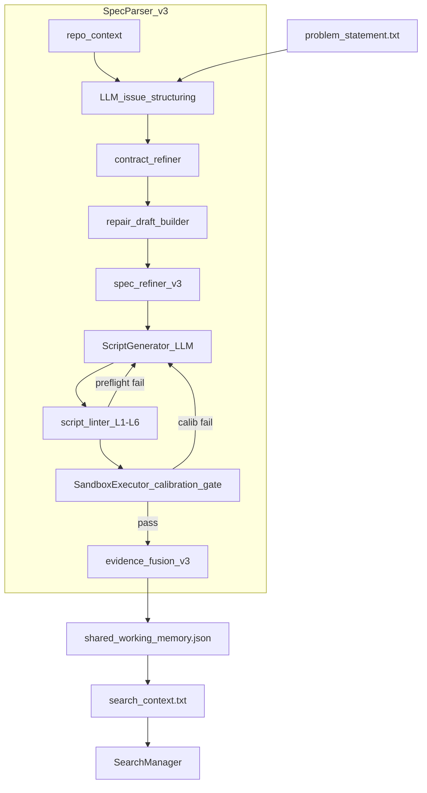
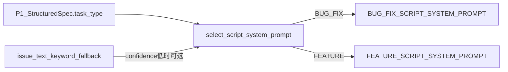

# Spec Parser ver3.0 设计计划

> **项目**：AutoCodeRover — 规范解析智能体（Module 1）  
> **基座路径**：`/datadisk/pengxm/auto-code-rover`  
> **当前版本**：v2.2.0（`parser_version = "2.2.0"`，见 `app/spec_parser/agent.py`）  
> **目标版本**：v3.0.0  
> **前置文档**：[spec_parser_dev_plan.md](./spec_parser_dev_plan.md)（v2.2）  
> **文档版本**：v3.0-plan-draft（v3.0.1 审计落地：Prompt↔Runtime 对齐）  
> **状态**：设计阶段（M16 起实施）

---

## 目录

1. [ver3.0 目标与 v2.2 差异对照](#第-1-章ver30-目标与-v22-差异对照)
2. [ver3.0 核心流程设计](#第-2-章ver30-核心流程设计)
3. [文献调研 — BUG 复现脚本生成](#第-3-章文献调研--bug-复现脚本生成)
4. [文献调研 — FEATURE 验证脚本设计](#第-4-章文献调研--feature-issue-的验证脚本设计)
5. [ver3.0 实施路线](#第-5-章ver30-实施路线)
6. [风险与未决问题](#第-6-章风险与未决问题)
7. [附录 A：BUG_FIX 端到端示例](#附录-abug_fix-端到端示例)
8. [附录 B：FEATURE 端到端示例](#附录-bfeature-端到端示例)
9. [参考文献](#参考文献)

---

## 第 1 章：ver3.0 目标与 v2.2 差异对照

### 1.1 ver3.0 要解决的痛点

| 痛点 | v2.2 表现 | ver3.0 方向 |
|------|-----------|-------------|
| **静态分析成本高** | P2 需 `symbol_index` + `scope_compiler` + 多 Visitor；SymPy 五探针调参周期长 | 移除 P2 全链路，以 LLM + 执行反馈替代 |
| **维护复杂** | `entity_extraction`、`target_resolution`、`generic_enrichment` 等 10+ 文件强耦合 | 保留 P0/P1/P4/P5 骨架，删除 AST 专用逻辑 |
| **非 Python / 非 AST 扩展差** | Visitor 仅覆盖 Python AST 模式（guard_raise、for_loop 等） | 复现脚本范式与语言无关（仍跑 Python sandbox，但生成逻辑不依赖 AST） |
| **co_fix 误报/漏报** | 静态 hessenberg / Relational 推断依赖 SymPy 领域规则 | 改由 P1 契约 + LLM 脚本 + 执行校准确认 |
| **Token 与延迟** | P2 索引 + ScopePlan LLM + P4 宽脚本 LLM 叠加 | 去掉 P2；P4 输入更聚焦（Issue + RepairDraft） |

**设计原则（继承 v2.2，强化 ver3.0）**：

1. **最小侵入** `inference.py`：SWM / `search_context.txt` 字段向后兼容，仅弱化静态 enrichment 段落。
2. **简化而非堆功能**：去掉 P2 后若无等价能力，必须在第 6 章显式标注风险。
3. **执行证据优先**：动态校准（P5）+ execution feedback 闭环是 ver3.0 核心质量门禁。
4. **宽验收保留**：AC 分段脚本、`calibration_gate` F2P 逻辑沿用 v2.2 成果。

### 1.2 模块保留 / 移除 / 新增 / 改造清单

| 模块 | v2.2 | ver3.0 | 说明 |
|------|------|--------|------|
| `repo_context.py` (P0) | 保留 | **保留** | 轻量：repo 名、test framework、sample test excerpt |
| `parser_prompts.py` + P1 LLM | 保留 | **保留** | Issue → `StructuredSpecification` |
| `contract_refiner.py` (P1.5) | 保留 | **保留并增强** | 承担原 P2 部分语义推断（prerequisite、architecture_hint） |
| `repo_enrichment.py` 及 P2 全套 | 核心 | **移除（默认关闭）** | `symbol_index`、`entity_extraction`、`scope_compiler`、`generic_enrichment`、`visitors/*` |
| `spec_refiner.py` (P3) | 合并 enrichment | **改造** | 仅合并 P1 契约；可选 LLM 轻量 co_fix 推断 |
| `script_generator.py` (P4) | 保留 | **改造** | 输入增加 `RepairDraft`；prompt 强调逆向 TDD |
| `script_prompts.py` | 保留 | **保留（v2.2）** | v2.2 路径不变，便于 ablation |
| **新增** `script_prompts_v3.py` | — | **新增** | 双 System Prompt + 共享 User/Feedback；`spec_parser_use_v3_prompts` 开关 |
| `script_linter.py` | L1–L9 | **保留简化版 L1–L6** | 去掉 SymPy 专用 L3/L7；保留 AC 结构、弱断言、吞异常 |
| `sandbox_executor.py` (P5) | 保留 | **保留** | `execute_with_ac_breakdown` / `execute_per_ac` |
| `calibration_gate.py` | 保留 | **增强** | 增加 fail 语义对齐检查（可选 LLM judge） |
| `evidence_fusion.py` (P6) | 静态+动态 | **改造** | 仅动态证据 + P1 契约；去掉 enrichment 分支 |
| `validators.py` | 保留 | **改造** | 接入语义对齐 scorer |
| `shared_memory.py` | 保留 | **微调** | `search_context` 去掉 P2 段落；新增 `repair_draft` 摘要 |
| `agent.py` | 编排 | **改造** | 新流水线；`parser_version = "3.0.0"` |
| **新增** `repair_draft.py` | — | **新增** | 从 P1 spec 构建 `RepairDraft` schema |
| **新增** `symptom_aligner.py` | — | **新增（可选）** | fail stderr 与 issue symptom 对齐打分 |
| **新增** `feature_calibrator.py` | — | **新增** | FEATURE 双态校准（未实现 fail / 占位 pass 检测） |

**配置变更（`app/config.py`）**：

```python
# ver3.0 新增/变更
spec_parser_version: str = "3.0.0"           # 或通过 agent 写 parser_version
spec_parser_enable_repo_enrichment: bool = False  # v3 默认关闭 P2
spec_parser_enable_symptom_alignment: bool = True
spec_parser_symptom_alignment_threshold: float = 0.5
spec_parser_max_script_gen_rounds: int = 3     # 复用 spec_parser_max_calibration_rounds
spec_parser_use_repair_draft: bool = True
spec_parser_use_v3_prompts: bool = False  # M17 开发期 False；M20 默认 True
spec_parser_block_search_on_calib_fail: bool = False  # 默认不阻断，见 §2.4
```

### 1.3 ver3.0 新流水线

```ascii
┌─────────────────────────────────────────────────────────────────────────┐
│                    Spec Parser v3.0 Pipeline                             │
├─────────────────────────────────────────────────────────────────────────┤
│  P0  repo_context          轻量仓库上下文（test excerpt, packages）        │
│       ↓                                                                  │
│  P1  LLM issue structuring → draft StructuredSpecification             │
│       ↓                                                                  │
│  P1.5 contract_refiner.refine()  契约后处理（prerequisite, arch hint）    │
│       ↓                                                                  │
│  P1.6 repair_draft.build()  Issue + draft spec → RepairDraft             │
│       ↓                                                                  │
│  P3' spec_refiner.merge_v3()  无 enrichment；可选 LLM co_fix 补全         │
│       ↓                                                                  │
│  P4  ScriptGenerator (LLM | template)                                    │
│       输入: RepairDraft + repo_context + execution feedback              │
│       ↓                                                                  │
│  P4.5 script_linter.preflight (L1–L6 简化版)                             │
│       ↓                                                                  │
│  P5  SandboxExecutor + calibration_gate (+ symptom_aligner)            │
│       最多 N 轮 iteration refine                                         │
│       ↓                                                                  │
│  P6  evidence_fusion_v3 → SharedMemoryStore → search_context.txt         │
└─────────────────────────────────────────────────────────────────────────┘
                              ↓
                    inference.py Search / Patch
```



**与 v2.2 对比**：删除 P2 菱形分支；P1.6 为新增；P5 增加可选 symptom alignment；P6 不再读取 `RepoEnrichment`。

---

## 第 2 章：ver3.0 核心流程设计

### 2.1 输入定义

#### 2.1.1 Issue 原文

- **来源**：`problem_statement.txt`（与 v2.2 相同，经 `SpecParsingAgent.run(issue_text)` 传入）。
- **用途**：P1 结构化、P1.5 契约推断、`symptom_aligner` 对齐参照。

#### 2.1.2 初步修复草案（RepairDraft）

**定义**：在 Search/Patch **之前**、由规范解析阶段产出的「行为级修复意图」，用于逆向 TDD 生成可观测验收脚本。ver3.0 **不假设**已有真实 code patch。

| 来源 | 优先级 | 可用阶段 | 说明 |
|------|--------|----------|------|
| **A. P1 结构化 spec** | 主路径（默认） | Module 1 内 | `repair_goals`、`acceptance_criteria`、`fix_scope`、`architecture_hint` |
| **B. Issue reporter_drafts** | 辅助 | P1.5 / RepairDraft | 非权威；仅作 symptom 与 API 用法 hint |
| **C. 用户/外部 draft patch** | 可选扩展 | 未来 M20+ | 若 CLI 传入 `--repair-draft-patch`，解析 diff 摘要写入 `RepairDraft.patch_hints` |
| **D. Search 前草稿** | **不在 v3.0 主路径** | — | 当前 `inference.py` 顺序为 SpecParser → Search；D 留作 v3.1 预搜索模式 |

**依据**：代码现状 — `inference.py` L279–282 先跑 SpecParser 再 Search；RepairDraft 主来源必须是 P1 输出。

**RepairDraft Schema（新增，`app/spec_parser/repair_draft.py`）**：

```python
class RepairDraft(BaseModel):
    """Behavioral repair intent for reverse-TDD script generation."""
    task_type: TaskType
    summary: str
    symptom_summary: str          # 从 symptom_goals 合并
    expected_behavior: list[str]  # repair_goals
    observable_checks: list[AcceptanceCriterion]  # 来自 spec AC
    fix_scope: FixScope
    architecture_hint: ArchitectureHint
    negative_constraints: list[NegativeConstraint]
    reporter_hints: list[str]     # issue_completeness.reporter_drafts
    patch_hints: list[str] = []   # 可选：外部 patch 摘要行
    inverse_tdd_notes: str = ""   # LLM 可选：从草案反推的可观测行为说明
    draft_source: Literal["p1_spec", "user_patch", "hybrid"] = "p1_spec"
    confidence: float = 0.0
```

**构建逻辑（P1.6）**：

```python
def build_repair_draft(spec: StructuredSpecification, issue_text: str) -> RepairDraft:
    return RepairDraft(
        task_type=spec.task_type,
        summary=spec.summary,
        symptom_summary="; ".join(spec.symptom_goals) or spec.summary[:300],
        expected_behavior=list(spec.repair_goals),
        observable_checks=list(spec.acceptance_criteria),
        fix_scope=spec.fix_scope,
        architecture_hint=spec.architecture_hint,
        negative_constraints=list(spec.negative_constraints),
        reporter_hints=list(spec.issue_completeness.reporter_drafts),
        draft_source="p1_spec",
        confidence=spec.confidence,
    )
```

#### 2.1.3 轻量 Repo 上下文（不含 AST enrichment）

沿用 `RepoContext`（`app/spec_parser/repo_context.py`）：

| 字段 | 用途 |
|------|------|
| `repo_name` | Prompt 仓库识别 |
| `test_framework` | 脚本风格对齐（pytest 惯例） |
| `sample_test_files` / `sample_test_excerpt` | 测试风格 few-shot（借鉴 Auto-TDD, Ahmed et al. 2024） |
| `top_level_packages` | import 路径 hint |

**ver3.0 不新增** symbol index、AST snippet、target_files 静态排名。

**可选轻量扩展（M18，非 AST）**：对 Issue 中提到的符号做 `rg`/文件名 grep，取 Top-3 文件 **文本片段**（≤400 字符）注入 prompt；不编译 AST。依据：iCoRe 检索思想，但降级为 keyword retrieval。

---

### 2.2 LLM 直接生成复现脚本

#### 2.2.0 Prompt 设计前提：P1 Entity 不可靠

**核心假设**：P1 结构化阶段抽取的 `covers_entity`、`failure_anchor.named_entities`、以及部分 `co_fix_required` **不一定可靠**（漏抽、过拟合 reporter draft、SymPy 领域偏差）。Prompt 设计 **不得** 将其作为硬约束或 symbol 白名单。

**Grounding 优先级（高 → 低）**：

```text
Issue 原文（含 reporter 代码块） > AC.observable > repair_goals
  > reporter_drafts > covers_entity / named_entities（弱 hint，不可单独作 assert 依据）
```

**推论**：

| 策略 | 说明 |
|------|------|
| 不做硬白名单 | 避免 P1 漏抽导致合法 API 被禁 |
| Import 靠运行时契约 | Issue 内 import 样例 + `sample_test_excerpt` + `top_level_packages` |
| INSUFFICIENT_SPEC 退路 | 无法从 Issue/AC 落地时：`AssertionError("AC-XXX FAIL: INSUFFICIENT_SPEC")`，禁止编造 module/fixture |
| **co_fix 两档化（v3.0.2）** | `grounded_co_fix`（Issue/AC echo）→ 脚本硬约束；`co_fix hints`（P1 猜测）→ 仅 Search 种子，脚本不测 |
| 宽 AC 靠 Issue 原文 | 12454 类 hessenberg 若 Issue 无 echo，由 Search sibling_scan 补宽，不由脚本幻觉 import |

**依据**：Prompt 工程审计（2026-07）；Issue2Test fail 语义对齐；Auto-TDD 测试风格对齐。

#### 2.2.1 Prompt 设计：双 System Prompt + 选择逻辑

**实现文件**：[`app/spec_parser/script_prompts_v3.py`](../../app/spec_parser/script_prompts_v3.py)（v2.2 保留 [`script_prompts.py`](../../app/spec_parser/script_prompts.py)）

**Prompt 选择流程**：



**选择规则**：

1. **主路径**：`StructuredSpecification.task_type`（P1 Issue structuring 分类结果）
2. **不新增 LLM 分类调用**
3. **可选 fallback（M17+）**：当 `spec.confidence < 0.5` 时，deterministic keyword：`feature request` / `add support` / `new flag` → FEATURE；`bug` / `error` / `fail` / `incorrect` → BUG_FIX

**双 System Prompt 差异对照**：

| 维度 | BUG_FIX_SYSTEM | FEATURE_SYSTEM |
|------|----------------|----------------|
| 目标 | 复现 **symptom**，buggy fail | 验收 **新行为**，未实现 fail |
| fail 形态 | 必须 `AssertionError` 或 stderr `AC-XXX FAIL`；**禁止**无关 ImportError | 未实现可捕获 `AttributeError`/`ImportError` 后 **转** `AssertionError("AC-XXX FAIL: NOT_IMPLEMENTED")` |
| regression | `negative_constraints` → sentinel AC，**buggy 也必须 pass**，放末尾 | `criterion_role=no_regression_sentinel` 段 **buggy 也必须 pass** |
| grounding | Issue-first；**Grounded co_fix** 才写 AC | 同左 + 禁止仅 `hasattr` |
| co_fix | 仅 **Grounded co_fix**（User 区块）需独立 AC + assert；hints 不测 | 同左 |
| import | 见共享 User Template Import Contract | 同左 |
| 脚手架 | **不在 Prompt 写 print_stacktrace**；由代码后处理（§2.2.6） | 同左 |

**BUG_FIX System Prompt 全文**（`BUG_FIX_SCRIPT_SYSTEM_PROMPT`）：

```text
You are an expert test engineer practicing reverse test-driven development (reverse-TDD)
for BUG REPRODUCTION.

Write ONLY the acceptance-test body (AC sections). A runtime scaffold (print_stacktrace,
main guard) will be injected automatically — do NOT include them.

Goal: script MUST fail on the current buggy codebase and pass after the correct fix.

Rules:
0. Do NOT define main(), if __name__, or print_stacktrace — the runtime adds them.
1. Output exactly ONE ```python ... ``` block containing AC test logic only.
2. Structure by AC: `# --- AC-XXX: description ---` for each must-level criterion (exact id from spec).
3. Reverse-TDD: derive assertions from Issue text first; use AC.observable only when it quotes Issue.
4. Grounding & scope: hard anchor is Issue text (incl. code blocks). Every assert must trace to Issue
   or to AC.observable that quotes Issue. Do NOT rely on covers_entity alone.
   "Grounded co_fix" in User: each gets `# --- AC-XXX ---` + ≥1 executable assert (comments do not count).
   "co_fix hints" in User: do NOT assert; do not import symbols only mentioned there.
   If a must AC cannot be grounded: AssertionError("AC-XXX FAIL: INSUFFICIENT_SPEC").
   Never invent modules, APIs, or fixtures not evidenced in Issue.
5. Symptom reproduction: failure on buggy code must match the issue symptom (exception type/message/output).
   ImportError/SyntaxError are script errors unless the issue is explicitly about imports.
6. On each AC failure: print `AC-XXX FAIL` to stderr, then raise AssertionError.
   If the issue expects ValueError/TypeError/etc., catch it and re-raise AssertionError
   embedding the original message (do not let raw ImportError reach stderr).
7. Use smallest input from the issue; no large loops or full-repo scans.
8. No network, no file writes, read-only imports.
9. No weak checks (existence-only, "not in output" without behavioral assertion).
10. negative_constraints / no_regression: MUST pass on the current buggy codebase; place LAST.
```

**FEATURE System Prompt 全文**（`FEATURE_SCRIPT_SYSTEM_PROMPT`）：

```text
You are an expert test engineer practicing reverse test-driven development (reverse-TDD)
for FEATURE ACCEPTANCE verification.

Write ONLY the acceptance-test body (AC sections). A runtime scaffold will be injected automatically.

Goal: script MUST fail when the feature is not implemented and pass when correctly implemented.

Rules:
0. Do NOT define main(), if __name__, or print_stacktrace — the runtime adds them.
1. Output exactly ONE ```python ... ``` block containing AC test logic only.
2. Structure by AC: `# --- AC-XXX: description ---` for each must-level criterion (exact id from spec).
3. Reverse-TDD: derive behavioral assertions from Issue text first; use AC.observable only when it quotes Issue.
4. Grounding & scope: hard anchor is Issue text (incl. code blocks). Every assert must trace to Issue
   or to AC.observable that quotes Issue. covers_entity is a hint only.
   "Grounded co_fix" in User: each gets own AC section + ≥1 executable assert.
   "co_fix hints" in User: do NOT assert; do not import symbols only mentioned there.
   Ungrounded must AC → AssertionError("AC-XXX FAIL: INSUFFICIENT_SPEC").
   Never invent modules, APIs, or fixtures not evidenced in Issue.
5. Not-implemented detection: catch AttributeError/ImportError silently, then raise ONLY:
   AssertionError("AC-XXX FAIL: NOT_IMPLEMENTED"). Do NOT let ImportError appear in stderr.
6. no_regression_sentinel ACs (criterion_role): MUST pass on the current codebase — place them LAST;
   use behavioral asserts that verify existing behavior still works.
7. Include happy-path, negative, and edge behavioral asserts (not hasattr-only).
8. Use smallest input from the issue; no large loops or full-repo scans.
9. No network, no file writes, read-only imports.
10. On each AC failure: print `AC-XXX FAIL` to stderr, then raise AssertionError.
```

**User Template 全文**（`format_script_user_v3`）：

```text
## Task Type
{task_type}

## Import Contract
- Cwd = repo root; import only from: {top_level_packages}
- Copy import style from sample_test_excerpt when present
- Do NOT invent modules, paths, fixtures, or data files

## Grounding Policy (P1 entities are hints only)
- Hard anchor: Issue text (incl. reporter code blocks)
- AC.observable / repair_goals: use only when consistent with Issue; if they contradict Issue, prefer Issue
- Grounded co_fix (below): MUST cover in script; co_fix hints: do NOT assert unless echoed in Issue

## Issue (original — authoritative for symptoms)
{issue_text_excerpt}

## Repair Draft (expected behavior after fix)
{repair_draft_json}

## Observable Acceptance Criteria
{ac_table}

## Fix Scope
{fix_scope_json}

## Negative Constraints
{negative_constraints_json}

## Grounded co_fix (MUST cover — each own AC section with executable assert)
{grounded_co_fix_list}

## co_fix hints (NOT in Issue — do NOT assert; downstream search seeds only)
{co_fix_hints_list}

## Regression AC ids (FEATURE no_regression_sentinel)
{regression_ac_ids}

## Repository Context
repo={repo_name}, framework={test_framework}

## Sample test excerpt (style reference)
{sample_test_excerpt}

## Task
Write {script_filename} AC test body only. Round {round_no}.
{feedback_section}
```

**依据**：
- v2.2 宽 AC 规则保留；Prompt 审计优化（双 System、Import Contract、软 grounding）；
- Otter / TDD-Bench 逆向 TDD（Ahmed et al., ICML 2025 / arXiv 2024）；
- Issue2Test fail 语义对齐（Nashid et al., 2025）。

#### 2.2.2 BUG_FIX vs FEATURE 分支策略

| 维度 | BUG_FIX | FEATURE |
|------|---------|---------|
| 脚本文件名 | `reproduce_issue.py` | `test_feature.py` |
| System Prompt | `BUG_FIX_SCRIPT_SYSTEM_PROMPT` | `FEATURE_SCRIPT_SYSTEM_PROMPT` |
| 校准主指标 | F2P：buggy fail → patched pass | F2P（未实现 fail → 实现 pass） |
| AC `criterion_role` 默认 | `fail_to_pass` | `fail_to_pass` + `no_regression_sentinel` |
| Prompt 强调 | 复现 **symptom**；禁止无关 ImportError | NOT_IMPLEMENTED 包装；regression AC 末尾 pass |
| 失败语义对齐 | **必须**（symptom_aligner） | NOT_IMPLEMENTED vs REGRESSION_FAIL 区分 |
| 额外负例 AC | 来自 `negative_constraints` | happy + negative + edge 三段 |

**分支入口**：`select_script_system_prompt(spec.task_type)` + `ScriptGenerator.generate()`（`spec_parser_use_v3_prompts=True` 时）。

#### 2.2.3 逆向 TDD：从修复草案反推可观测验收行为

**方法（P4 内置，非独立 LLM 步）**：

1. **Goal → Observable**：对每条 `repair_goals[i]`，映射到至少一条 AC（P1 已产出；若缺失则 P3' 补 `behavioral` AC）。映射依据 **AC.observable + Issue 代码块**，不依赖 `covers_entity`。
2. **Symptom → Failure mode**：Issue 原文中的 exception/output → 期望 stderr 含 `AssertionError` 或 issue 提及的 exception 类型。
3. **Scope → Coverage**：`co_fix_required` / `prerequisite`（仅当 Issue/AC 有 echo）→ 独立 AC 段 + 可执行 assert。
4. **Negative → Sentinel**：`negative_constraints` → `no_regression_sentinel` AC（FEATURE 放脚本末尾，buggy 也 pass）。

**Prompt 显式指令（已写入双 System Prompt Rule 3–4）**：

```text
For each repair_goal, ask: "What assertion would PASS after fix and FAIL now?"
Ground only on Issue text and AC.observable — not covers_entity alone.
Prefer public API / CLI / printed output from the issue reproduction steps.
```

**依据**：TDD-Bench Verified failToPass × adequacy（Ahmed et al., 2024）；Issue2Test fail 对齐（Nashid et al., 2025）。

#### 2.2.4 迭代 Refine 机制

沿用 v2.2 agent 循环（`agent.py` L76–146），最多 `spec_parser_max_calibration_rounds`（默认 3）轮：

```ascii
Round k:
  select_system_prompt(task_type)
  → generate(script body, feedback_{k-1})
  → wrap_generated_body(scaffold)
  → preflight (L1-L6, L10)
  → sandbox execute
  → calibration_gate + symptom_aligner
  → if fail: format_feedback_v3 → Round k+1
```

**Feedback 模板**（`format_feedback_v3`）：

```text
## Calibration Failure (round {round_no})
- task_type: {task_type}
- stage: {preflight|sandbox|gate|symptom_alignment|grounding_violation}
- validation_reason: {reason}
- failed AC ids: {failed_criteria_ids}
- symptom_alignment_score: {score}
stderr:
{stderr_truncated}

Fix (BUG_FIX): ensure AC-XXX fails for the issue symptom; wrap ValueError/TypeError into AssertionError with AC-XXX FAIL.
Fix (BUG_FIX): fix unrelated ImportError unless the issue is about imports.
Fix (FEATURE): distinguish NOT_IMPLEMENTED (missing API) from REGRESSION_FAIL (broken existing behavior).
Fix (FEATURE): ImportError must not appear in stderr — only AssertionError with NOT_IMPLEMENTED.
Fix (grounding): do not assert on symbols not in Issue text; prefer Issue over AC.observable when they conflict.
```

**依据**：AEGIS FSM 迭代（Wang et al., FSE 2025）；e-Otter++ execution feedback（Ahmed et al., 2025）。

#### 2.2.6 脚手架与后处理（非 Prompt）

LLM **只生成 AC 测试体**；运行时脚手架由代码注入，不写入 System Prompt。

**后处理流程**（`script_templates.sanitize_generated_body` + `wrap_generated_body`）：

```python
# 1. LLM 输出 → extract code block
# 2. sanitize_generated_body(body)  # 剥离 LLM 误生成的 main/if __name__/print_stacktrace
# 3. wrap_generated_body(body, summary=spec.summary)
#    → docstring + print_stacktrace + def main(): indent(body) + if __name__ guard
# 4. preflight + sandbox 运行完整脚本
```

**repo 特化禁令**（numpy lambdify、future import、fake import）保留在 **linter L7/L8/L9**，不写进通用 System Prompt。

**依据**：Prompt 审计 — 脚手架代码注入比 Prompt 写 helper 更可靠；v2.2 `script_templates.py` 已有 `_PRINT_STACKTRACE` 模式。

#### 2.2.7 Prompt ↔ Runtime 对齐（审计落地 v3.0.1）

**问题**：v3.0 初版 Prompt 与 `calibration_gate` 存在语义不一致（FEATURE ImportError、BUG 原生 Exception）。

**落地改动**（`calibration_gate.classify_stderr_script_error` + `strict_legacy_ok`）：

| 场景 | 门禁行为 |
|------|----------|
| **SyntaxError** | 一律 reject |
| **FEATURE + NOT_IMPLEMENTED** | stderr 含 `AssertionError` 且 blob 含 `NOT_IMPLEMENTED` 时，**允许** traceback 中出现 ImportError |
| **BUG + issue 关于 import** | Issue 含 import/importerror 关键词时，**允许** ImportError |
| **BUG 其他 ImportError** | reject |
| **BUG fail 语义** | 接受 stderr 中 `AssertionError` / `AC-XXX FAIL` / **symptom exception**（ValueError、TypeError 等） |

**Linter 增强**（`spec_parser_use_v3_prompts=True` 时）：

| 规则 | 说明 |
|------|------|
| **L2-COFIX-WEAK** | co_fix 名在脚本中但无 AC 段含 `assert`/`raise` → blocking |
| **L10-EXISTENCE-ONLY** | AC 段仅 `hasattr`/`callable` 无行为 assert → blocking |

**issue_text 传参**：`SandboxExecutor` / `build_execution_evidence_from_result` / `strict_legacy_ok` / `preflight` / `evaluate_calibration` 增加 `issue_text` 参数（`agent.py` 传入），用于 import 相关 issue 判定与 co_fix grounding。

#### 2.2.8 co_fix Grounding 两档化（审计落地 v3.0.2）

**问题**：v3.0.1 System Prompt Rule 4（Issue-only）与 Rule 7（强制覆盖全部 `co_fix_required`）及 gate L2 **逻辑不可满足**——P1 猜的 co_fix（如 hessenberg）常不在 Issue 原文，模型只能幻觉 import 或滥用 INSUFFICIENT_SPEC。

**解法**：[`app/spec_parser/grounding.py`](../../app/spec_parser/grounding.py) 在 Prompt / Linter / Gate 入口统一拆分：

```python
def split_grounded_scope_items(items, issue_text, acceptance_criteria) -> tuple[grounded, hints]:
    # echo 判定：name.lower() in issue_text + AC.observable + covers_entity + description
```

| 档位 | 来源 | 脚本 Prompt | L2 / Gate | 下游 |
|------|------|-------------|-----------|------|
| **grounded_co_fix** | Issue 或 AC 含子串 echo | User「Grounded co_fix」；Rule 4 要求独立 AC + assert | `enforceable_co_fix()` 覆盖检查 | — |
| **co_fix hints** | P1 / P2 猜测、Issue 无 echo | User「co_fix hints」；**禁止 assert** | **不检查**（v3 prompts 开启时） | SWM `fix_scope.co_fix_required` 全量保留 → Search sibling_scan |

**v2.2 兼容**：`spec_parser_use_v3_prompts=False` 时 `enforceable_co_fix` 仍返回完整 `co_fix_required` 列表（行为与 v2.2 一致）。

**12454 类宽验收**：Issue 无 hessenberg echo 时 Module 1 脚本不测 hessenberg；宽化依赖 Search co_fix 种子或 M18 keyword grep 升格为 grounded。

**测试**：[`test/app/spec_parser/test_grounding.py`](../../test/app/spec_parser/test_grounding.py)

#### 2.2.5 script_linter 保留与简化

| 规则 | v2.2 | v3.0 | 动作 |
|------|------|------|------|
| L1-MISSING-AC | 保留 | 保留 | blocking |
| L2-COFIX-COVERAGE | 保留 | 保留 | blocking（**v3：仅 grounded_co_fix** 子串缺失） |
| **L2-COFIX-WEAK** | — | **新增（v3 prompts）** | blocking：grounded co_fix 段无 assert/raise |
| L3-WEAK-ASSERT-SINC | SymPy 专用 | **删除** | — |
| L3-WEAK-ASSERT-PREREQ | 保留 | **泛化为 L3-WEAK-ASSERT** | blocking if prereq in spec but no probe |
| L4-SWALLOW-EXCEPTION | 保留 | 保留 | blocking |
| L5-EXIT-PATH | warning | warning | |
| L6-UNKNOWN-AC | warning | warning | |
| L7-NUMPY-LAMBDA | SymPy 专用 | **降为 warning** | 非 SymPy repo 忽略 |
| L8-FUTURE-IMPORT | 保留 | 保留 | blocking |
| L9-FAKE-IMPORT | 保留 | 保留 | blocking |
| **L10-EXISTENCE-ONLY** | — | **新增（v3 prompts）** | blocking：`hasattr`/`callable` 且无行为断言 |

**依据**：Wermelinger et al. 工业验收测试需行为断言（2025）；v2.2 `script_linter.py` 现有结构可扩展。

---

### 2.3 脚本运行与验证门禁

#### 2.3.1 BUG_FIX 完美复现判定标准

**Tier 1 — 结构性（沿用 v2.2 `calibration_gate.py`）**：

1. Preflight L1–L6 pass。
2. 所有 `must` AC 在 buggy codebase 上 **expected_failure=True** 且 `passed_on_buggy_code=False`。
3. **`grounded_co_fix`**（`enforceable_co_fix(spec, issue_text)`）均在脚本中有覆盖；`co_fix hints` 不强制。
4. 整体 `exit_code != 0`；stderr 含以下任一（`strict_legacy_ok`，v3.0.1）：
   - `AssertionError` 或 `AC-XXX FAIL`
   - **symptom exception**（ValueError、TypeError、KeyError 等，见 `calibration_gate._SYMPTOM_EXCEPTIONS`）

**Tier 2 — 失败语义对齐（ver3.0 新增，M18 `symptom_aligner`）**：

```python
def score_symptom_alignment(issue_text: str, symptom_summary: str, stderr: str) -> float:
    """
    Returns 0.0-1.0. Combines:
    - keyword overlap (issue entities vs stderr)
    - exception type match (if issue mentions ValueError etc.)
    - optional LLM judge (binary relevant/irrelevant fail)
    """
```

- **阈值**：`spec_parser_symptom_alignment_threshold = 0.5`（可配置）。
- **假阳 fail 检测**：
  - SyntaxError → 一律 reject。
  - ImportError → BUG 默认 reject；**例外**：Issue 明确关于 import；FEATURE 且 NOT_IMPLEMENTED 已包装为 AssertionError（见 §2.2.7）。
  - 失败与 issue 关键词 Jaccard < 0.15 且 exception 类型不匹配 → reject（M18 symptom_aligner）。
  - 脚本 pass on buggy（exit 0）→ reject。

**Tier 3 — Patch 后 Pass（评测 / 可选 M19）**：

- 评测流水线：对 golden patch 再跑脚本，要求 exit 0（SWT-Bench F→P 定义，Mündler et al., NeurIPS 2024）。
- Module 1 运行时 **无 golden patch**；该层仅用于 `scripts/eval_spec_parser.py` 与 Review 阶段二次验证。

**Tier 4 — 覆盖率 ΔC（评测专用）**：

- 参照 SWT-Bench：生成测试对 golden patch 修改行的覆盖比例。
- ver3.0 在线流水线 **不强制**（无 patch 上下文）；评测报告输出 ΔC 作消融指标。

#### 2.3.2 FEATURE 完美验证判定标准

**问题**：feature issue 无「buggy 行为」；传统窄 repro 易写成「接口存在即 pass」。

**ver3.0 操作化定义**：

| 检查项 | 未实现态（buggy） | 实现态（golden patch） |
|--------|-------------------|------------------------|
| 脚本 exit code | != 0 | 0 |
| 失败类型 | AssertionError / `AC-XXX FAIL: NOT_IMPLEMENTED` | — |
| 禁止假阴 | traceback 可含 ImportError，但 stderr **最终**须为 AssertionError（`classify_stderr_script_error`） | 全部 AC pass |
| 行为深度 | 至少 1 条 `behavioral` AC 含输入→输出断言 | 同左 |
| 负例 | 至少 1 条 negative AC（非法输入仍稳定） | pass |
| 回归哨兵 | optional `no_regression_sentinel` | pass |

**P2P vs F2P 选择**：

- **主路径：F2P**（与 TDD-Bench / SWT-Bench 统一，Ahmed et al. 2024; Mündler et al. 2024）。
- **P2P 哨兵**：已有 API 的 feature 扩展（如 CLI 新参数默认值不变）→ 增加 `criterion_role=no_regression_sentinel`，buggy 与 fixed 均应 pass；若 buggy fail 说明脚本有误。

**FEATURE 校准门禁伪代码**：

```python
def evaluate_feature_calibration(spec, evidence, script, stderr) -> CalibrationVerdict:
    # 1. Structural gate (same as BUG_FIX)
    verdict = evaluate_calibration(spec, evidence, script, lint_report)
    if not verdict.passed:
        return verdict

    # 2. Reject existence-only scripts
    if linter.has_existence_only_ac(script):
        return CalibrationVerdict(passed=False, reason="existence-only AC", ...)

    # 3. Require at least one behavioral AC with input/output assert
    if not _has_behavioral_assert(script, spec):
        return CalibrationVerdict(passed=False, reason="no behavioral AC", ...)

    # 4. Unimplemented-state failure must be intentional
    if evidence.overall_exit_code == 0:
        return CalibrationVerdict(passed=False, reason="FEATURE must fail before implementation", ...)

    # 5. Optional: negative AC must fail independently on buggy
    return CalibrationVerdict(passed=True, ...)
```

**AC 抽取（happy / negative / edge）**：

- P1 prompt 要求 FEATURE issue 产出 ≥3 AC：`AC-HAPPY`、`AC-NEG`、`AC-EDGE`（可合并进现有 AC id 命名）。
- BDD 模板（见第 4 章）：Given-When-Then → pytest assert 段。

#### 2.3.3 下游 Search/Patch 接口

**最小侵入原则**：`SharedMemoryStore.to_search_context_from_spec()` 签名不变；内容调整如下。

**继续写入 `search_context.txt`**：

| 段落 | v2.2 | v3.0 |
|------|------|------|
| Repair Goals | ✓ | ✓ |
| Fix Scope / co_fix / prerequisite | ✓ | ✓（来源 P1+P1.5，非 P2） |
| Architecture Hint | ✓ | ✓（P1.5 推断） |
| Acceptance Criteria | ✓ | ✓ |
| Execution Evidence | ✓ | ✓ |
| Failure Anchor | ✓ | ✓ |
| Target Files (P2) | ✓ | **删除或标注 deprecated** |
| Static: Missing Handlers | ✓ | **删除** |
| Static Evidence snippet | ✓ | **删除** |
| **Repair Draft Summary** | — | **新增** 2–3 行 expected_behavior |
| **Symptom Alignment Score** | — | **新增**（若启用） |

**`inference.py` 行为**（无需改代码路径，仅配置）：

- `spec_parser_skip_legacy_reproducer=True` 且 `calibration_passed=True` → 跳过 TestAgent（L294–311，已有）。
- `calibration_passed=False` → 回退 legacy reproducer 或空 repro_stderr（见 §2.4）。

**SWM JSON**：`structured_spec.parser_version = "3.0.0"`；`repo_enrichment` 字段为 `null`。

---

### 2.4 失败处理与降级

| 失败场景 | 策略 | 是否阻断 Search |
|----------|------|-----------------|
| P1 JSON 无效 | tenacity 5 次重试 → 抛错 | 是（agent 失败） |
| P4 LLM 无 code block | `script_templates.render_minimal_script()` | 否，继续校准 |
| Preflight 3 轮仍 fail | 取最后一轮脚本；`calibration_passed=false` | 默认 **否**（`block_search_on_calib_fail=false`） |
| Sandbox ImportError | 计入 feedback；3 轮后标记 `calibration_error` | 否 |
| Symptom alignment 持续 fail | 降 confidence；SWM 写 failure anchor | 否 |
| 全部轮次 fail | 写 **failure anchor** 格式见下 | 否 |

**Failure Anchor 格式（SWM / search_context）**：

```text
## Calibration Status
calibration_passed: false
reason: symptom_alignment_below_threshold
primary_failure_ac_id: AC-002
failure_anchor:
  anchor_type: assertion_error
  message_excerpt: "..."
  named_entities: [Permutation, has_dups]
parser_version: 3.0.0
```

**Template fallback**：保留 `script_templates.py` 最小模板（按 task_type 输出 AC 占位 assert）；依据 v2.2 降级路径（`script_generator.py` L56–59）。

**Product 决策点**：`spec_parser_block_search_on_calib_fail` 默认 false — Search 仍可用 Issue + 部分契约；Review 阶段可用 calibration 状态降权。

---

### 2.5 评测方案

#### 2.5.1 指标

| 指标 | 符号 | 定义 |
|------|------|------|
| 复现率 | **S** | 脚本在 buggy 上 fail 且 golden patch 后 pass 的比例（SWT-Bench） |
| AC 通过率 | **AC@buggy** | must AC 在 buggy 上按预期 fail 的比例 |
| F2P 率 | **F2P** | fail-to-pass 双态满足率 |
| P2P 哨兵率 | **P2P** | no_regression AC 在 buggy/fixed 均 pass 的比例 |
| 失败语义对齐率 | **Align** | symptom_aligner score ≥ threshold 的比例 |
| 覆盖率 | **ΔC** | 生成测试对 golden patch 修改行覆盖（评测专用） |
| 校准轮数 | **R̄** | 平均 iteration 轮数 |
| Token 成本 | **Tok** | P1+P4+可选 judge 总 tokens |

#### 2.5.2 数据集

| 数据集 | 规模 | 用途 |
|--------|------|------|
| SWE-bench Lite | 300 | 主评测（与 v2.2 对齐） |
| DeepSWE | 子集 | 长 issue / 复杂 repo |
| TDD-Bench-Verified | 449 | F2P + adequacy 对照（Ahmed et al., 2024） |
| SWT-Bench / Lite | 1900+ / 276 | S 与 ΔC 对照（Mündler et al., 2024） |

#### 2.5.3 消融实验

| 组 | 配置 |
|----|------|
| **B0** | 无 spec_parser（baseline） |
| **B1** | v2.2 完整（P2 开启） |
| **B2** | v3.0-no-static（P2 关，无 symptom_aligner） |
| **B3** | v3.0-full（P2 关 + symptom_aligner + 简化 linter） |
| **B4** | v3.0-full + keyword snippet retrieval（M18） |

**成功标准（初版）**：

- B3 相对 B1：五探针 AC@buggy ≥ B1；端到端 L3 resolve 率不下降 >2%。
- B3 相对 B2：Align 提升 ≥10%；假阳 fail 率下降。
- Tok：B3 相对 B1 token 总成本下降 ≥15%（去掉 P2 索引）。

---

## 第 3 章：文献调研 — BUG 复现脚本生成

> 本章仅引用已核实文献；无法二次核实的条目不纳入结论。

### 3.1 文献精读摘要

#### 3.1.1 LIBRO（Kang et al., ICSE 2023）

**链接**：https://doi.org/10.1109/icse48619.2023.00194

LIBRO 将 bug report 作为 prompt，让 LLM 采样 N 个测试用例，再通过编译/运行筛选「可执行且在 buggy 版本上 fail」的测试。核心思想是 **few-shot 测试合成 + 执行过滤**，而非深度理解整个仓库。在 Defects4J 上 pass@50 复现率显著高于单次生成。

**对 ver3.0 的借鉴**：保留「生成 → 运行 → 筛选」闭环；ver3.0 用 calibration 3 轮替代 pass@50 以控制 token（见 §3.4 明确不采纳 pass@50 ensemble）。

#### 3.1.2 LLM Bug Reproduction 系统评估（Zhao et al., IEEE TSE 2024）

**链接**：https://doi.org/10.1109/tse.2024.3450837

该文系统评估 15 个 LLM 在 Defects4J 上复现 bug 的能力，发现开源模型可达闭源模型 70–90% 效果，但 pass@1 仍远低于 pass@N。说明 **模型选择 + 采样策略** 对复现率影响大于单一 prompt 技巧。

**对 ver3.0 的借鉴**：评测需报告 pass@1 与 pass@3（对应 3 轮 refine）；配置层保留 `use_llm_for_script` 开关做模型消融。

#### 3.1.3 AEGIS（Wang et al., FSE 2025）

**链接**：https://doi.org/10.1145/3696630.3728557

AEGIS 使用上下文摘要 + 有限状态机（FSM）引导 agent 迭代修改复现脚本，在 SWE-Bench 上复现率较 baseline 提升约 19%。FSM 区分「理解 issue → 写脚本 → 执行 → 诊断 → 重写」状态，避免 agent 盲目编辑。

**对 ver3.0 的借鉴**：v3.0 的 round-based feedback 是 AEGIS FSM 的轻量变体（无全功能 ACI）；`format_feedback` 即 FSM 转移条件。

#### 3.1.4 Issue2Test（Nashid et al., 2025）

**链接**：https://arxiv.org/html/2503.16320v4

三阶段流水线：理解 issue → 生成测试 → 编译/运行反馈迭代。特别强调 **fail 原因必须与 issue 描述对齐**，避免测试因环境或无关 API 错误而 fail。

**对 ver3.0 的借鉴**：直接支撑 `symptom_aligner` 设计（§2.3.1 Tier 2）；preflight 拒绝 ImportError 与 Issue2Test 一致。

#### 3.1.5 SWT-Bench（Mündler et al., NeurIPS 2024）

**链接**：https://arxiv.org/abs/2406.12952 ；官方：https://github.com/logic-star-ai/SWT-Bench

1900+ 实例，将 SWE-bench 转为测试生成任务。核心指标：**S（F2P 复现率）** 与 **ΔC（patch 行覆盖）**。发现 Code Agent（如 SWE-Agent）做测试生成优于专用工具 LIBRO；生成测试可过滤 patch，precision 翻倍。

**对 ver3.0 的借鉴**：在线门禁采用 S 的 buggy 侧（fail）；评测加 ΔC；`search_context` 中 Execution Evidence 格式与 SWT-Bench 诊断一致。

#### 3.1.6 Otter（Ahmed et al., ICML 2025）

**链接**：https://arxiv.org/abs/2502.05368

TDD 视角：patch 不存在时从 issue 生成 F2P 测试。采用 self-reflective planner + 规则修复；在 TDD-Bench-Verified 上表现优于 LIBRO。将测试生成分解为规划与代码生成，减少一步到位幻觉。

**对 ver3.0 的借鉴**：`RepairDraft` + 逆向 TDD prompt 等价于 Otter 的 planner 输出；规则修复对应 `script_linter` + template fallback。

#### 3.1.7 e-Otter++（Ahmed et al., 2025）

**链接**：https://arxiv.org/html/2508.06365v1

在 buggy code 上利用 **execution feedback** 迭代改进测试；TDD-Bench-Verified 上 F2P 约 63%。强调 stderr/trace 反馈比纯静态 lint 更有效。

**对 ver3.0 的借鉴**：支撑 §2.2.4 多轮 calibration；feedback 必含 stderr 截断与 failed AC id。

#### 3.1.8 BRT Agent（Cheng et al., 2025）

**链接**：https://arxiv.org/abs/2502.01821

Google 工业场景；fine-tuned LLM agent 做 bug reproduction，28% plausible BRT vs LIBRO 10%。提出 **EPR（Executed Patch Recall）** 指标选择最优 patch。说明工业级需高 precision 复现。

**对 ver3.0 的借鉴**：symptom alignment 降低「plausible 但无关」fail；EPR 思想可用于 Review 阶段（非 Module 1 范围）。

#### 3.1.9 iCoRe（FSE 2026）

**链接**：https://arxiv.org/html/2604.19224v2

迭代式 correlation-aware 检索：源码与测试分开检索 + 调用图 + 生成反馈。SWT-Bench Lite 42% / TDD-Bench 52.8% F2P。检索质量是生成质量上界。

**对 ver3.0 的借鉴**：M18 可选 keyword grep snippet 是 iCoRe 的轻量降级；**不采纳**完整 call-graph 检索（与去 AST 方向冲突）。

#### 3.1.10 SWE-bench（Jimenez et al., ICLR 2024）

**链接**：https://arxiv.org/abs/2310.06770

2294 真实 GitHub issue；**F2P 测试是评估 patch 的金标准**；issue 类型含 bug 与 feature request。Module 1 下游 Search/Patch 仍以此为准。

**对 ver3.0 的借鉴**：FEATURE 与 BUG_FIX 统一用 F2P 框架；Module 1 脚本为「代理 F2P 测试」而非替代官方 hidden test。

### 3.2 提高 issue 复现率的可落地策略（归纳 8 条）

| # | 策略 | 文献来源 | ver3.0 落点 |
|---|------|----------|-------------|
| 1 | **Execution feedback 闭环** | Issue2Test, e-Otter++, AEGIS | P4↔P5 最多 3 轮，`format_feedback` |
| 2 | **Fail 语义与 issue 对齐** | Issue2Test, BRT Agent | `symptom_aligner` Tier 2 |
| 3 | **逆向 TDD（从期望行为写 assert）** | Otter, TDD-Bench | `RepairDraft` + prompt §2.2.3 |
| 4 | **测试风格对齐现有 suite** | Auto-TDD (TDD-Bench 论文) | `sample_test_excerpt` 注入 |
| 5 | **覆盖率 / adequacy 约束** | SWT-Bench ΔC, TDD-Bench adequacy | 评测输出 ΔC；在线不强制 |
| 6 | **AC 分段宽验收** | v2.2 实践 + SWT-Bench | 保留 `# --- AC-XXX ---` |
| 7 | **Preflight 静态拒弱测试** | LIBRO 后处理思想 | 简化 `script_linter` L1–L6, L10 |
| 8 | **轻量上下文检索（非 AST）** | iCoRe（降级） | M18 可选 grep snippet |

### 3.3 v2.2 vs 文献 vs ver3.0 取舍

| 维度 | v2.2（AST + 宽 AC） | 文献主流 | ver3.0 选择 | 理由 |
|------|---------------------|----------|-------------|------|
| 定位线索 | P2 symbol index + Visitor | LLM + 检索（iCoRe）/ agent 探索 | P1 契约 + 可选 grep | 降维护成本；11400 类 prerequisite 由 contract_refiner 承担 |
| co_fix 发现 | AST for_loop visitor | 执行失败 + issue 推断 | P1 LLM + AC 覆盖 | 12454 hessenberg 靠 AC 宽脚本，不靠静态 co_fix |
| 复现验证 | calibration_gate | F2P + adequacy | F2P + symptom align | 对齐 SWT-Bench / TDD-Bench |
| 迭代次数 | 3 轮 | LIBRO pass@50 | 3 轮 | Token trade-off |
| Agent ACI | 无（Module 1 前置） | SWE-Agent, AEGIS | **不引入** | 最小侵入 inference |

### 3.4 推荐采纳与不采纳

**高 ROI 技术点（采纳 3 项）**：

1. **Execution feedback 闭环**（e-Otter++, Issue2Test）— 已有 v2.2 骨架，v3.0 增强 feedback 字段。
2. **Fail 语义对齐检查**（Issue2Test, BRT Agent）— 新增 `symptom_aligner`，直击假阳 fail。
3. **RepairDraft 逆向 TDD**（Otter, TDD-Bench）— 替代 P2 静态「猜测共修点」。

**明确不采纳（2 项）**：

1. **pass@50 多采样 ensemble**（LIBRO）— token 成本过高；3 轮 sequential refine 足够。
2. **完整 Code Agent ACI 写测试**（SWE-Agent on SWT-Bench）— Module 1 应保持前置、单次 LLM call 为主；Search 阶段已有 agent。

---

## 第 4 章：文献调研 — FEATURE Issue 的验证脚本设计

### 4.1 问题定义

Feature request 无「错误行为可复现」；需生成 **验收测试（acceptance test）** 满足：

- 功能 **未实现** → fail（或明确的 not-implemented 断言）
- 功能 **正确实现** → pass
- 覆盖 happy path / negative / edge cases

### 4.2 文献摘要

#### 4.2.1 TDD-Bench Verified（Ahmed et al., 2024）

**链接**：https://arxiv.org/abs/2412.02883 ；GitHub：https://github.com/IBM/TDD-Bench-Verified

449 个高质量实例，issue 含 **bug + feature**；统一 **failToPass × adequacy** 评估。Feature 与 bug 在同一 harness 下评测，说明 **F2P 是 feature 验收的可行统一框架**。

**对 ver3.0 的借鉴**：FEATURE 任务类型仍走 F2P 校准；评测用同一 `scripts/eval_spec_parser.py` 加 golden patch pass 阶段。

#### 4.2.2 SWT-Bench（Mündler et al., NeurIPS 2024）

**链接**：https://swtbench.com/

同一 F2P 框架覆盖 feature 类 issue；强调生成测试对 golden patch 的覆盖。

**对 ver3.0 的借鉴**：FEATURE 脚本也需 ΔC 评测；避免只测「函数存在」。

#### 4.2.3 Acceptance Test Generation 工业案例（Wermelinger et al., 2025）

**链接**：https://arxiv.org/html/2504.07244

User Story → Gherkin 场景 → Cypress 可执行测试；工业项目 92% 生成测试被认为有用。关键是 **Given-When-Then 结构化** 再落地为断言。

**对 ver3.0 的借鉴**：P1 对 FEATURE issue 产出 GWT 字段（可写入 AC description）；P4 转为 pytest assert。

#### 4.2.4 BDD 验收测试自动化综述（Karpurapu et al., IEEE Access 2024）

**链接**：https://doi.org/10.1109/access.2024.3391815

综述 LLM 在 BDD 验收测试 formulation 的能力与局限：语义 gap、过度依赖训练记忆、negative case 不足。

**对 ver3.0 的借鉴**：强制 FEATURE 必含 negative AC；linter L10 拦截 existence-only。

#### 4.2.5 SWE-bench（Jimenez et al., ICLR 2024）

Feature request 在数据集中占 significant 比例；开发者 PR 常附带 **新增测试** 作为验收。

**对 ver3.0 的借鉴**：生成脚本应对齐「新增测试文件」风格（standalone script，非必须 pytest collection）。

### 4.3 FEATURE Issue 分类与脚本结构

| 类型 | 识别特征 | 推荐脚本结构（伪代码） |
|------|----------|------------------------|
| **API 新增** | issue 描述新函数/新方法 | import → 调用新 API → assert 返回值/类型 |
| **CLI 新参数** | argparse/click 新 option | subprocess 或 API 层调用 → assert exit code + stdout |
| **行为变更** | 同一 API 不同输出语义 | 固定输入 → assert 新行为；`no_regression_sentinel` 测相邻用例 |
| **性能/规模** | 大数据/时间约束 | assert 完成时间上限或渐进输入 scale（M19 可选） |

**API 新增示例伪代码**：

```python
# --- AC-HAPPY: new_method returns expected value ---
from package.module import NewClass
result = NewClass().new_method(1, 2)
assert result == expected, f"AC-HAPPY FAIL: got {result}"

# --- AC-NEG: invalid input raises ---
try:
    NewClass().new_method(-1, None)
    raise AssertionError("AC-NEG FAIL: expected exception")
except (ValueError, TypeError):
    pass

# --- AC-EDGE: boundary case ---
assert NewClass().new_method(0, 0) == edge_expected
```

### 4.4 「完美验证」操作化定义

**Definition（ver3.0）**：脚本 `T` 对 feature issue `I` 完美验证，当且仅当：

1. **F2P**：`exec(T, codebase_pre) = F` ∧ `exec(T, codebase_post_patch) = P`
2. **Behavioral depth**：≥1 AC 含非 trivial 输入输出断言（非仅 `hasattr`）
3. **Negative coverage**：≥1 AC 验证非法/边界输入
4. **No false fail**：失败原因非无关 ImportError（除非标注为 implementation_probe 且 issue 明确新模块）

### 4.5 与 BUG_FIX 统一的 TaskType 分支

```python
# agent.py v3.0 伪代码
draft = contract_refiner.refine(draft, issue_text)
repair_draft = build_repair_draft(draft, issue_text)
spec = spec_refiner.merge_v3(draft, enrichment=None)

for rnd in range(1, max_rounds + 1):
    script = script_generator.generate_v3(repair_draft, repo_ctx, feedback, rnd)
    lint = script_linter.preflight(spec, script.content)
    if spec.task_type == TaskType.BUG_FIX:
        evidence = sandbox.execute_with_ac_breakdown(...)
        verdict = evaluate_calibration(...)  # + symptom_aligner
    else:  # FEATURE
        evidence = sandbox.execute_with_ac_breakdown(...)
        verdict = evaluate_feature_calibration(...)  # §2.3.2
```

### 4.6 BDD → pytest 的 AC 抽取模板

**P1 扩展 prompt 片段（FEATURE 专用）**：

```text
For FEATURE issues, emit acceptance_criteria with embedded GWT:
- given: preconditions
- when: action
- then: observable outcome
Map to AC-HAPPY (when/then), AC-NEG (invalid when), AC-EDGE (boundary when).
```

**转换规则（deterministic，P1.6）**：

| GWT 字段 | AC 字段 |
|----------|---------|
| then | `observable` |
| when | `description` 后半 |
| given | `covers_entity` / constraint |

---

## 第 5 章：ver3.0 实施路线

### 5.1 里程碑总览

| 阶段 | 名称 | 核心交付 | 预计风险 |
|------|------|----------|----------|
| **M16** | v3.0 骨架 + feature flag | agent 新流水线；P2 默认关 | inference 回归 |
| **M17** | RepairDraft + prompt v3 | `repair_draft.py`；`script_prompts_v3` | P1 AC 质量不足 |
| **M18** | 校准增强 | `symptom_aligner`；`feature_calibrator` | 阈值调参 |
| **M19** | 评测与消融 | `eval_spec_parser.py` v3 指标 S/ΔC/Align | 算力 |
| **M20** | 文档与默认切换 | `parser_version=3.0.0` 默认；迁移指南 | 五探针 co_fix 回归 |

### 5.2 分 milestone 详情

#### M16：v3.0 骨架（1–2 周）

**改动文件**：

- `app/spec_parser/agent.py` — 分支 `parser_version`；跳过 `repo_enrichment.run` when disabled
- `app/spec_parser/spec_refiner.py` — 新增 `merge_v3(draft, enrichment=None)`
- `app/spec_parser/evidence_fusion.py` — 新增 `merge_v3` 无 enrichment 分支
- `app/infrastructure/shared_memory.py` — 条件省略 P2 段落
- `app/config.py` — v3 配置项
- `test/app/spec_parser/test_agent_v3.py`

**验收标准**：

- `--enable-spec-parser` 且 `spec_parser_enable_repo_enrichment=false` 时无 `repo_enrichment.json` 产出
- 五探针 `spec-only` 模式仍可跑通并写 SWM
- v2.2 行为：`spec_parser_enable_repo_enrichment=true` 时不变

**风险**：Search 依赖 `target_files` 段落 → 缓解：P1.5 将 entity 写入 `failure_anchor.named_entities`

#### M17：RepairDraft + Prompt v3（1–2 周）

**改动文件**：

- `app/spec_parser/script_prompts_v3.py`（新）— 双 System Prompt + `format_script_user_v3` + `format_feedback_v3`
- `app/spec_parser/script_templates.py` — `wrap_generated_body`
- `app/spec_parser/script_generator.py` — v3 分支 + `issue_text` 传参
- `app/spec_parser/script_linter.py` — L10 existence-only（M18 前可并行）
- `app/config.py` — `spec_parser_use_v3_prompts`
- `test/app/spec_parser/test_script_prompts_v3.py`
- `test/app/spec_parser/test_calibration_gate_v3.py`

**验收标准**：

- 12481 BUG_FIX：启用 v3 prompts 后脚本仍 F2P 校准通过（无 P2）
- 附录 B FEATURE 伪例：`select_script_system_prompt(FEATURE)` 与文档 prompt 一致
- `format_script_user_v3` 含 Import Contract、Grounding Policy、Issue 原文
- `wrap_generated_body` / `sanitize_generated_body` 输出含 `print_stacktrace` 与 `main`
- `strict_legacy_ok`：ValueError stderr 通过；FEATURE NOT_IMPLEMENTED 包装允许 ImportError in traceback

#### M18：校准增强（1 周）

**改动文件**：

- `app/spec_parser/symptom_aligner.py`（新）
- `app/spec_parser/feature_calibrator.py`（新）
- `app/spec_parser/calibration_gate.py` — 挂钩 aligner
- `test/app/spec_parser/test_symptom_aligner.py`

**验收标准**：

- 人工构造「无关 ImportError fail」用例被拒绝
- FEATURE fixture：existence-only 脚本被 L10 拦截

#### M19：评测与消融（1–2 周）

**改动文件**：

- `scripts/eval_spec_parser.py` — S, F2P, ΔC, Align, Tok
- `document/model1/spec_parser_ver3_dev_plan.md` — 回填实测表

**验收标准**：

- SWE-bench Lite 30 实例 smoke：B1/B2/B3 报告可复现
- 相对 v2.2 token 下降可测量

#### M20：默认切换与迁移（1 周）

**改动文件**：

- `app/spec_parser/agent.py` — `parser_version = "3.0.0"`
- `document/model1/spec_parser_dev_plan.md` — 指向 v3 文档
- `app/main.py` — CLI `--spec-parser-version {2.2,3.0}`

**验收标准**：

- 默认 v3.0 五探针 L3 不劣于 v2.2 baseline 表格（见 spec_parser_dev_plan 探针表）
- 回滚：一行 config 恢复 v2.2

### 5.3 兼容与迁移策略

| 机制 | 说明 |
|------|------|
| **Feature flag** | `spec_parser_enable_repo_enrichment` 控制 P2 |
| **Version 字段** | `StructuredSpecification.parser_version` |
| **Schema 兼容** | `RepoEnrichment` 字段保留可 null；下游 read 用 optional |
| **并行运行** | eval 脚本 `--parser-version 2.2\|3.0` |
| **Deprecation** | v2.2 P2 模块标记 deprecated in v3.0.0，v3.2 删除 |

---

## 第 6 章：风险与未决问题

### 6.1 去掉静态分析后的能力缺口

| v2.2 能力 | 原 P2 来源 | ver3.0 替代 | 残余风险 |
|-----------|------------|-------------|----------|
| `co_fix_required` | for_loop visitor | P1 LLM + 宽 AC + linter L2 | 12454 hessenberg 可能漏 co_fix |
| `neighbor_reference` | sibling_patterns | P1.5 architecture_hint | 12171 邻居模板弱化 |
| `missing_handlers` | guard_raise visitor | contract_refiner prerequisite | 11400 Relational 依赖 P1.5 规则 |
| `target_files` 排名 | symbol_index | 无（或 M18 grep） | Search 冷启动略差 |
| `architecture_hint` 精度 | enrichment pattern_map | P1.5 + issue 关键词 | layer 准确率下降 |
| `evidence_snippets` | AST 片段 | sample_test_excerpt only | 无源码上下文 |

**缓解**：M18 轻量 grep；Search 仍可用 SBFL + issue text；Review 用 ExecutionEvidence。

### 6.2 LLM 幻觉与假阳复现

| 幻觉类型 | 检测手段 |
|----------|----------|
| 断言与 issue 无关 | symptom_aligner |
| 测错 API | 对比 `repair_goals` 实体与 import 符号 |
| 过窄 repro | AC 数量 + co_fix L2 |
| 过宽 repro（buggy 上 pass） | exit_code==0 reject |

**未决**：是否引入 **LLM-as-judge** 做 symptom 对齐（+token）→ Product 决策。

### 6.3 Token 成本 vs 复现率

| 配置 | 相对成本 | 预期 S |
|------|----------|--------|
| v2.2 full | 1.0× | baseline |
| v3.0 3-round | ~0.7–0.85× | 略降或持平（文献：feedback 可补） |
| v3.0 + LLM judge | ~1.1× | Align ↑ |

### 6.4 需 Product Owner 决策的开放问题

1. **校准失败是否阻断 Search？** 默认 false；若 true 可减无效 search token。
2. **FEATURE 未实现时 Accept ImportError 吗？** 建议仅当 AC 标注 `implementation_probe`。
3. **是否保留 P2 为可选 `--spec-parser-legacy-enrichment`？** 建议保留至 v3.2 作 ablation。
4. **symptom_aligner 用 heuristic 还是 LLM？** M18 先 heuristic，PO 决定是否升级。
5. **Draft patch 外部输入是否在 M20 范围？** 建议推迟 v3.1。
6. **ΔC 覆盖是否作为 online gate？** 建议仅 offline eval（需 golden patch）。

---

## 附录 A：BUG_FIX 端到端示例

### A.1 实例：sympy__sympy-12481（Permutation 非不交 cycles）

**Issue（节选）**：

```text
`Permutation` constructor fails with non-disjoint cycles
Calling `Permutation([[0,1],[0,1]])` raises ValueError instead of
constructing the identity permutation.
```

### A.2 ver3.0 流水线 trace（无 P2）

**P1 输出要点**：

- `task_type`: BUG_FIX
- `repair_goals`: ["Allow non-disjoint cycles in constructor", "Return identity for [[0,1],[0,1]]"]
- `architecture_hint`: guard / minimal_guard
- `negative_constraints`: 禁止重写 Cycle 合成逻辑
- AC-001: 非不交 cycles 构造 identity；AC-002: 泛化轮换仍正确

**P1.6 RepairDraft**：

```json
{
  "symptom_summary": "ValueError on Permutation([[0,1],[0,1]])",
  "expected_behavior": ["Construct identity permutation for overlapping cycles"],
  "draft_source": "p1_spec"
}
```

**P4 生成脚本（节选）**：

```python
# --- AC-001: non-disjoint cycles yield identity ---
from sympy.combinatorics import Permutation
p = Permutation([[0, 1], [0, 1]])
assert p.is_Identity, "AC-001 FAIL: expected identity"

# --- AC-002: generalization ---
p2 = Permutation([[0, 1], [0, 2]])
assert p2.size == 3
```

**P5 校准（buggy codebase）**：

- exit_code != 0；stderr 含 ValueError 或 AC-001 FAIL
- symptom_aligner: "ValueError"/"Permutation" 与 issue 对齐 → pass
- `calibration_passed: true`

**P6 search_context 片段**：

```text
=== Repair Contract (Specification Parsing Agent) ===
Task Type: BUG_FIX
parser_version: 3.0.0

## Repair Goals (authoritative)
- Construct identity for non-disjoint cycles without rewriting Cycle()

## Execution Evidence (buggy codebase)
primary_failure_ac_id: AC-001
- AC-001: passed_on_buggy=false

## Failure Anchor Entities
Permutation, has_dups
```

**与 v2.2 差异**：无 `## Target Files (P2 static scope)`；`co_fix_required` 为空（12481 无需 hessenberg 类 co_fix）。

---

## 附录 B：FEATURE 端到端示例

### B.1 实例：合成 — 「为 CLI 增加 `--verbose` 标志」

**Issue（节选）**：

```text
Feature request: Add --verbose flag to `mytool process` command.
When set, stdout should include "Processing: <filename>" for each file.
When not set, behavior unchanged (no extra lines).
Invalid files should still exit with code 2 and print to stderr.
```

### B.2 ver3.0 流水线 trace

**P1 输出要点**：

- `task_type`: FEATURE
- AC-HAPPY: `--verbose` 时 stdout 含 `Processing:` 行
- AC-NEG: 非法文件 exit 2 + stderr
- AC-EDGE: 空目录 verbose 不 crash
- AC-REG: 无 `--verbose` 时 stdout 与 baseline 一致（no_regression_sentinel）

**P4 脚本（节选）**：

```python
import subprocess, sys

# --- AC-HAPPY: verbose output ---
r = subprocess.run([sys.executable, "-m", "mytool", "process", "--verbose", "ok.txt"],
                   capture_output=True, text=True)
assert r.returncode == 0, "AC-HAPPY FAIL"
assert "Processing:" in r.stdout, "AC-HAPPY FAIL: missing verbose line"

# --- AC-NEG: invalid file ---
r2 = subprocess.run([sys.executable, "-m", "mytool", "process", "missing.xyz"],
                    capture_output=True, text=True)
assert r2.returncode == 2, "AC-NEG FAIL"

# --- AC-REG: no regression without flag ---
r3 = subprocess.run([sys.executable, "-m", "mytool", "process", "ok.txt"],
                    capture_output=True, text=True)
assert "Processing:" not in r3.stdout, "AC-REG FAIL"
```

**P5 FEATURE 校准（未实现 codebase）**：

- AC-HAPPY fail（无 --verbose 或 exit!=0）→ `calibration_passed: true`
- L10 检查：非 existence-only ✓
- `evaluate_feature_calibration` pass

**Golden patch 后（评测 harness）**：

- 全部 AC pass → F2P 满足；ΔC 衡量 `--verbose` 分支覆盖

---

## 参考文献

以下文献均经 arXiv / DOI / 官方 GitHub 核实，可直接访问。

1. Kang et al., "Large Language Models are Few-shot Testers: Exploring LLM-based General Bug Reproduction", ICSE 2023, https://doi.org/10.1109/icse48619.2023.00194

2. Zhao et al., "Evaluating Diverse Large Language Models for Automatic and General Bug Reproduction", IEEE TSE 2024, https://doi.org/10.1109/tse.2024.3450837

3. Wang et al., "AEGIS: An Agent-based Framework for Bug Reproduction from Issue Descriptions", FSE 2025, https://doi.org/10.1145/3696630.3728557

4. Nashid et al., "Issue2Test: Generating Reproducing Test Cases from Issue Reports", 2025, https://arxiv.org/html/2503.16320v4

5. Mündler et al., "SWT-Bench: Testing and Validating Real-World Bug-Fixes with Code Agents", NeurIPS 2024, https://arxiv.org/abs/2406.12952

6. Ahmed et al., "Otter: Generating Tests from Issues to Validate SWE Patches", ICML 2025, https://arxiv.org/abs/2502.05368

7. Ahmed et al., "Execution-Feedback Driven Test Generation from SWE Issues (e-Otter++)", 2025, https://arxiv.org/html/2508.06365v1

8. Cheng et al., "Agentic Bug Reproduction for Effective Automated Program Repair at Google (BRT Agent)", 2025, https://arxiv.org/abs/2502.01821

9. iCoRe authors, "An Iterative Correlation-Aware Retriever for Bug Reproduction Test Generation", FSE 2026, https://arxiv.org/html/2604.19224v2

10. Jimenez et al., "SWE-bench: Can Language Models Resolve Real-World GitHub Issues?", ICLR 2024, https://arxiv.org/abs/2310.06770

11. Ahmed et al., "TDD-Bench Verified: Can LLMs Generate Tests for Issues Before They Get Resolved?", 2024, https://arxiv.org/abs/2412.02883

12. IBM, TDD-Bench-Verified Repository, 2024, https://github.com/IBM/TDD-Bench-Verified

13. LogicStar AI, SWT-Bench Repository, 2024, https://github.com/logic-star-ai/SWT-Bench

14. Wermelinger et al., "Acceptance Test Generation with Large Language Models: An Industrial Case Study", 2025, https://arxiv.org/html/2504.07244

15. Karpurapu et al., "Comprehensive Evaluation of LLMs in the Automation of Behavior-Driven Development Acceptance Test Formulation", IEEE Access 2024, https://doi.org/10.1109/access.2024.3391815

---

*文档结束 — Spec Parser ver3.0 设计计划*
