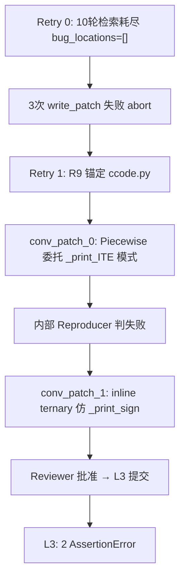
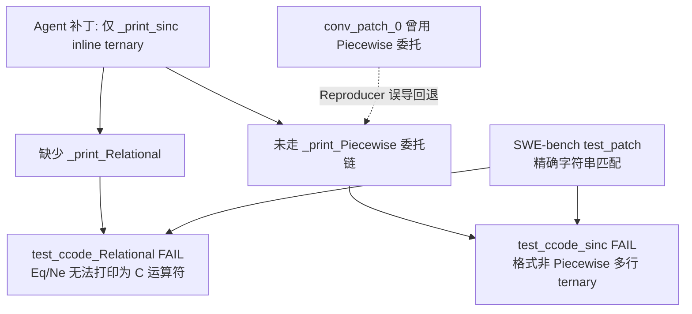
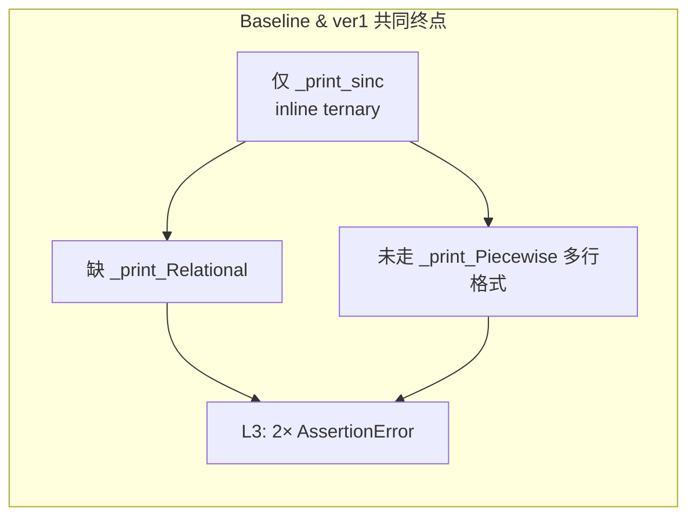
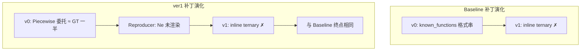

# 单案诊断临床报告：sympy__sympy-11400 (ver1)

> **分类**: C 类（Logic/Assertion Failure）  
> **模型**: deepseek-deepseek-chat  
> **Pipeline**: AutoCodeRover-ver1（含静态语义注入）  
> **任务目录**: `lite300_output_ver1/repos/sympy/applicable_patch/sympy__sympy-11400_2026-06-06_04-10-39/`  
> **评测结果**: L2 PASS → L3 FAIL（30 passed, 2 failed）  
> **语义注入**: 已生效（search + patch 阶段均注入三条规则）  
> **ver1 vs baseline**: 两边 L3 均失败；最终失败补丁语义相同，但 ver1 存在 **首轮正确补丁被内部 Reproducer 误导回退** 的关键演化链

---

## 1. 原始问题快照 (Issue Snapshot)

### 1.1 Issue 原文

````text
ccode(sinc(x)) doesn't work
```
In [30]: ccode(sinc(x))
Out[30]: '// Not supported in C:\n// sinc\nsinc(x)'
```

I don't think `math.h` has `sinc`, but it could print

```
In [38]: ccode(Piecewise((sin(theta)/theta, Ne(theta, 0)), (1, True)))
Out[38]: '((Ne(theta, 0)) ? (\n   sin(theta)/theta\n)\n: (\n   1\n))'
```

````

> 来源：[`problem_statement.txt`](../../../lite300_output_ver1/repos/sympy/applicable_patch/sympy__sympy-11400_2026-06-06_04-10-39/problem_statement.txt)

### 1.2 中文翻译

**标题**：`ccode(sinc(x))` 无法正常工作。

**现象 1**：在 IPython 中调用 `ccode(sinc(x))`，输出为：

```
// Not supported in C:
// sinc
sinc(x)
```

即 C 代码打印器（**ccode**，SymPy 将符号表达式转为 C 字符串的入口）认为 `sinc` 不受支持，只输出注释和原样函数名。

**Reporter 分析**：C 标准库 `math.h` 中没有 `sinc` 函数，但打印器**应该**能生成等价的分段表达式。

**现象 2（线索）**：Reporter 演示，若手动构造 **Piecewise**（分段函数 AST 节点）：

```python
Piecewise((sin(theta)/theta, Ne(theta, 0)), (1, True))
```

则 `ccode(...)` 能输出嵌套三元运算符形式：

```
((Ne(theta, 0)) ? (
   sin(theta)/theta
)
: (
   1
))
```

注意：此时条件 `Ne(theta, 0)`（**Ne** = Not Equal，表示 \(\theta \neq 0\)）尚未被渲染为 C 的 `!=`，而是以 SymPy 节点名原样出现——这暗示除了 `sinc` 本身，**Relational**（关系运算符）打印也可能需要补齐。

### 1.3 术语解释

| 术语 | 含义 |
|------|------|
| **ccode** | SymPy 的 C 代码打印函数，底层由 `CCodePrinter` 类实现 |
| **sinc(x)** | 归一化 sinc 函数：\(x = 0\) 时为 1，\(x \neq 0\) 时为 \(\sin(x)/x\) |
| **CCodePrinter** | 继承自 `CodePrinter` 的 C 语言专用打印器，通过 `_print_<TypeName>` 方法分发 |
| **Piecewise** | SymPy 分段条件表达式 AST，可映射为 C 三元运算符 `? :` |
| **Ne / Eq** | SymPy 关系节点（不等于 / 等于），需 `_print_Relational` 渲染为 `!=` / `==` |
| **Ground Truth (GT)** | SWE-bench 中人类开发者合并的正确补丁 |

### 1.4 核心诉求概括

| 维度 | 内容 |
|------|------|
| **报告了什么 Bug** | `ccode(sinc(x))` 输出 `// Not supported in C` 注释，而非可编译 C 表达式 |
| **数学/逻辑期望** | `sinc` 在 \(x \neq 0\) 时为 \(\sin(x)/x\)，在 \(x = 0\) 时为 1；应生成等价条件表达式 |
| **Issue 给出的线索** | Piecewise 范例暗示实现路径：**将 sinc 降维为 Piecewise + Ne，再委托已有打印链** |
| **实际输出** | `'// Not supported in C:\n// sinc\nsinc(x)'` — 完全未翻译 |

---

## 2. Agent 运行轨迹与思维链追踪 (Agent Trajectory & CoT Analysis)

### 2.1 整体运行概况

Agent 共经历 **2 次 overall retry**（retry 0 失败，retry 1 产出补丁并通过 reviewer）：

| Retry | 检索结果 | Patch 结果 |
|-------|----------|------------|
| 0 | 10 轮检索耗尽，`bug_locations: []` | 3 次 write_patch 均失败，abort |
| **1** | **9 轮检索后 R9 锚定 `ccode.py`** | conv_patch_0（Piecewise 委托）→ **Reproducer 拒绝** → conv_patch_1（inline ternary）→ **reviewer-approved** |

> 来源：[`info.log`](../../../lite300_output_ver1/repos/sympy/applicable_patch/sympy__sympy-11400_2026-06-06_04-10-39/info.log)

**ver1 语义注入状态**（[`semantic_injection_ver1.json`](../../../lite300_output_ver1/repos/sympy/applicable_patch/sympy__sympy-11400_2026-06-06_04-10-39/output_1/search/semantic_injection_ver1.json)）：

- `ISSUE_SKEPTICISM_AND_SCOPE`
- `SYMPY_ARCHITECTURE_RECON_AND_REUSE`
- `MINIMAL_CHANGE_AND_SIBLING_AUDIT`

### 2.2 Patch 演化链（ver1 关键增量）



**重要发现**：ver1 在 **conv_patch_0** 阶段已提出接近 GT 的 Piecewise 委托方案，但因内部 Reproducer 反馈「Ne 未正确渲染」而**回退**到 inline ternary。语义注入规则在首轮被遵循，却被弱验收标准覆盖。

### 2.3 Stage 1 工具调用时序（Retry 1，最终成功轮）

来源：[`output_1/search/tool_call_layers.json`](../../../lite300_output_ver1/repos/sympy/applicable_patch/sympy__sympy-11400_2026-06-06_04-10-39/output_1/search/tool_call_layers.json)

| 轮次 | Agent 思维摘要 | API 调用序列 |
|------|----------------|--------------|
| **R0** | 搜索 sinc 类与 CCodePrinter | `search_class("sinc")` · `search_class("CCodePrinter")` · `search_method_in_class("_print_sinc", "CCodePrinter")` |
| **R1** | 分析 CodePrinter 默认行为 | `search_method_in_class("_print_Function", "CodePrinter")` · `search_code_in_file("_print_sinc", "ccode.py")` · `search_code_in_file("sinc", "ccode.py")` · `search_code("_print_sinc")` |
| **R2** | 查其他 printer 的 sinc 实现 | `search_method_in_class("_print_Function", "CodePrinter")` · `search_code("def _print_sinc")` · `search_method_in_class("_print_sinc", "CodePrinter")` |
| **R3** | 查看 ccode.py 头部 known_functions | `get_code_around_line("sympy/printing/ccode.py", 1, 100)` |
| **R4** | 参考 Octave printer 与 sinc 定义 | `get_code_around_line("sympy/printing/octave.py", 395, 10)` · `get_code_around_line("sympy/functions/elementary/trigonometric.py", 1, 50)` |
| **R5** | 定位 sinc 类定义 | `search_code_in_file("class sinc", "sympy/functions/elementary/trigonometric.py")` |
| **R6** | 深入 trigonometric.py | `get_code_around_line("sympy/functions/elementary/trigonometric.py", 1100, 100)` |
| **R7** | 继续搜索 sinc 类 | `search_code("class sinc(")` |
| **R8** | 重复搜索 sinc 类 | `search_code_in_file("class sinc", "sympy/functions/elementary/trigonometric.py")` |
| **R9** | 判定上下文足够，输出 bug_locations | （无新 API 调用） |

### 2.4 最终锚定的 Fault Location

Agent 在 R9 输出 bug location（处理后写入 [`bug_locations_after_process.json`](../../../lite300_output_ver1/repos/sympy/applicable_patch/sympy__sympy-11400_2026-06-06_04-10-39/output_1/search/bug_locations_after_process.json)）：

| # | 文件 | 类/位置 | 锚定 intended_behavior |
|---|------|---------|------------------------|
| 1 | `sympy/printing/ccode.py` | `CCodePrinter`（L86–280 整段） | 添加 `_print_sinc` 方法，将 `sinc(x)` 打印为 `sin(x)/x` 并处理 `x=0`（如条件表达式） |

**文件级定位：正确**（与 Ground Truth 一致，均为 `sympy/printing/ccode.py`）。  
**方法级定位：部分正确** — 锚定 `_print_sinc` 缺失，但未识别 `_print_Relational` 前置依赖。

### 2.5 定位评估与认知偏差

**Agent 找对地方了吗？**

- **是**，在文件层面；SymPy 的 C 打印逻辑确实在 `CCodePrinter` 中缺少对 `sinc` 的处理。
- **否**，在修复策略与完整 scope 层面；Agent 最终补丁仅新增 `_print_sinc`，遗漏 `_print_Relational`。

**思维链中的关键认知偏差：**

1. **Reproducer 反馈覆盖语义注入（ver1 特有）**  
   `conv_patch_0` 已遵循 `SYMPY_ARCHITECTURE_RECON_AND_REUSE` 的「Piecewise 委托」规则（与 `_print_ITE` 同构），但 Reproducer 因 `Ne` 未渲染为 `!=` 而判失败。Agent 未诊断「缺 `_print_Relational`」，而是**放弃委托链**改走 inline ternary。

2. **Issue 范例误读**  
   Issue 中 `Ne(theta, 0)` 字面量出现在 Piecewise 输出里，Agent 将其解读为「Piecewise 路径本身有问题」，而非「Relational 打印器缺失、需同步补齐」。这与 `ISSUE_SKEPTICISM` 规则本意（Issue 范例是线索而非 ground truth）相矛盾——Agent 把范例中的**症状**当成了**方案错误**的证据。

3. **最小变更 vs 完整契约冲突**  
   `MINIMAL_CHANGE` 规则与「补 `_print_Relational` + Piecewise 委托」双方法修复产生张力。Agent 在 Reproducer 压力下选择了**更小但错误**的 inline 方案，而非扩展 scope 补 Relational。

4. **未识别 `_print_ITE` 邻居模式的全套依赖**  
   检索上下文已包含 `_print_ITE`（L216–219：构造 Piecewise → `self._print(_piecewise)`）和 `_print_Piecewise`（L184–214），Agent 在 conv_patch_0 曾正确模仿，但未意识到 GT 使用 `Ne(x, 0)` 而非 Python 的 `x != 0`，且 Ne 需要 `_print_Relational`。

5. **Reviewer / Reproducer 验收过窄**  
   [`reproducer_1.py`](../../../lite300_output_ver1/repos/sympy/applicable_patch/sympy__sympy-11400_2026-06-06_04-10-39/output_1/reproducer_1.py) 只检查：不含 `Not supported`、不含 `sinc`、含 `?`/`:`、含 `== 0`、`sin`、`/`。  
   [`conv_review_1_1.json`](../../../lite300_output_ver1/repos/sympy/applicable_patch/sympy__sympy-11400_2026-06-06_04-10-39/output_1/conv_review_1_1.json) 据此批准 inline ternary 补丁。这些标准与 SWE-bench 的精确多行格式、`test_ccode_Relational` 完全无关。

6. **与 baseline 的差异**  
   baseline 需 3 次 retry（retry 2 才锚定）；ver1 retry 1 即锚定且首轮补丁方向更正确，但 **Patch 演化回退** 使最终结果与 baseline 趋同。

---

## 3. 失败补丁解剖 (Failed Patch Dissection)

### 3.1 完整失败补丁（L3 提交版）

来源：[`output_1/extracted_patch_1.diff`](../../../lite300_output_ver1/repos/sympy/applicable_patch/sympy__sympy-11400_2026-06-06_04-10-39/output_1/extracted_patch_1.diff)

```diff
diff --git a/sympy/printing/ccode.py b/sympy/printing/ccode.py
index 30a07a7b59..07b08144c7 100644
--- a/sympy/printing/ccode.py
+++ b/sympy/printing/ccode.py
@@ -248,6 +248,10 @@ def _print_For(self, expr):
                 '{step}) {{\n{body}\n}}').format(target=target, start=start,
                 stop=stop, step=step, body=body)
 
+    def _print_sinc(self, expr):
+        x = self._print(expr.args[0])
+        return '(({0} == 0) ? 1 : sin({0})/{0})'.format(x)
+
     def _print_sign(self, func):
         return '((({0}) > 0) - (({0}) < 0))'.format(self._print(func.args[0]))
```

等价 Python 代码：

```python
def _print_sinc(self, expr):
    x = self._print(expr.args[0])
    return '(({0} == 0) ? 1 : sin({0})/{0})'.format(x)
```

### 3.2 逐行白话解释

| 行 | 代码 | 解释 |
|----|------|------|
| L1 | `def _print_sinc(self, expr):` | 为 SymPy 的 `sinc` 函数类注册专用打印方法；Printer 通过 `_print_<ClassName>` 分发，`sinc(x)` 会路由到此方法而非默认的 `_print_not_supported` 路径 |
| L2 | `x = self._print(expr.args[0])` | 取出 sinc 的唯一参数（如符号 `x`），并通过父类打印链递归渲染（复合表达式时会加括号） |
| L3 | `return '(({0} == 0) ? 1 : sin({0})/{0})'.format(x)` | **直接拼接** C 三元运算符字符串：若 `x == 0` 返回 1，否则返回 `sin(x)/x`；Agent 认为这实现了 sinc 的数学定义，且模仿了 `_print_sign` 的 inline 字符串模式 |
| — | 插入位置在 `_print_For` 与 `_print_sign` 之间 | 遵循 CCodePrinter 中其他 `_print_*` 方法的排列惯例 |

**Agent 的想当然逻辑：**  
C 没有 `sinc()` → 仿 `_print_sign` 手写最接近的 C 表达式 → 数学上对 → Reproducer 通过 → 问题解决。  
**遗漏：** 未走 Piecewise 委托链 → 输出格式与 Relational 打印均不符合 SWE-bench 契约。

### 3.3 Patch 演化链

| 版本 | 来源 | 策略 | 结果 |
|------|------|------|------|
| v0 | `extracted_patch_0.diff` / `conv_patch_0.json` | Piecewise 委托：`Piecewise((sin(x)/x, x != 0), (1, True))` → `self._print(piecewise)` | Reproducer 拒绝（Ne/`!=` 渲染问题误判为 Piecewise 路径错误） |
| **v1（最终）** | `extracted_patch_1.diff` / `conv_patch_1.json` | inline `((x == 0) ? 1 : sin(x)/x)` | Reviewer 批准，L3 评测 2 测失败 |

**v0 补丁全文（被放弃的中间版本）：**

```diff
+    def _print_sinc(self, expr):
+        from sympy.functions import Piecewise, sin
+        x = expr.args[0]
+        piecewise = Piecewise((sin(x)/x, x != 0), (1, True))
+        return self._print(piecewise)
```

**Agent 实际输出（v1）：**

```
((x == 0) ? 1 : sin(x)/x)
```

---

## 4. 黄金标准对比 (Ground Truth Alignment)

### 4.1 Ground Truth 补丁

来源：[`developer_patch.diff`](../../../lite300_output_ver1/repos/sympy/applicable_patch/sympy__sympy-11400_2026-06-06_04-10-39/developer_patch.diff)（与 [`meta.json`](../../../lite300_output_ver1/repos/sympy/applicable_patch/sympy__sympy-11400_2026-06-06_04-10-39/meta.json) 中 `task_info.patch` 一致）

```diff
diff --git a/sympy/printing/ccode.py b/sympy/printing/ccode.py
--- a/sympy/printing/ccode.py
+++ b/sympy/printing/ccode.py
@@ -231,6 +231,20 @@ def _print_Symbol(self, expr):
         else:
             return name
 
+    def _print_Relational(self, expr):
+        lhs_code = self._print(expr.lhs)
+        rhs_code = self._print(expr.rhs)
+        op = expr.rel_op
+        return ("{0} {1} {2}").format(lhs_code, op, rhs_code)
+
+    def _print_sinc(self, expr):
+        from sympy.functions.elementary.trigonometric import sin
+        from sympy.core.relational import Ne
+        from sympy.functions import Piecewise
+        _piecewise = Piecewise(
+            (sin(expr.args[0]) / expr.args[0], Ne(expr.args[0], 0)), (1, True))
+        return self._print(_piecewise)
+
     def _print_AugmentedAssignment(self, expr):
         lhs_code = self._print(expr.lhs)
         op = expr.rel_op
```

### 4.2 并排对比

#### Agent 失败补丁 vs Ground Truth

```python
# ── Agent v1 最终（仅 _print_sinc，inline ternary）────────────────
def _print_sinc(self, expr):
    x = self._print(expr.args[0])
    return '(({0} == 0) ? 1 : sin({0})/{0})'.format(x)

# ── Ground Truth（_print_Relational + _print_sinc）──────────────────
def _print_Relational(self, expr):
    lhs_code = self._print(expr.lhs)
    rhs_code = self._print(expr.rhs)
    op = expr.rel_op
    return ("{0} {1} {2}").format(lhs_code, op, rhs_code)

def _print_sinc(self, expr):
    from sympy.functions.elementary.trigonometric import sin
    from sympy.core.relational import Ne
    from sympy.functions import Piecewise
    _piecewise = Piecewise(
        (sin(expr.args[0]) / expr.args[0], Ne(expr.args[0], 0)), (1, True))
    return self._print(_piecewise)
```

#### 差异矩阵

| 维度 | Agent 失败补丁 | Ground Truth |
|------|----------------|--------------|
| **修改范围** | 仅 1 个方法 `_print_sinc` | 2 个方法：`_print_Relational` + `_print_sinc` |
| **实现策略** | 直接拼接 C 字符串（inline ternary） | 构造 SymPy AST（Piecewise + Ne），委托 `_print_Piecewise` |
| **条件形式** | `(x == 0) ? 1 : sin(x)/x` | `(x != 0) ? sin(x)/x : 1`（通过 `Ne(x, 0)`） |
| **输出格式** | 单行 | 多行嵌套三元（与 `_print_Piecewise` 一致） |
| **代码复用** | 独立实现，仿 `_print_sign` | 与 `_print_ITE` 同构：降维 → 委托已有 printer |
| **Relational 支持** | 无 | `Ne` → `x != 0`，`Eq` → `x == y` 等 |

#### 期望输出对比（`ccode(sinc(x))`）

```
# SWE-bench test_ccode_sinc 期望（Ground Truth 产出）:
((x != 0) ? (
   sin(x)/x
)
: (
   1
))

# Agent 失败补丁产出:
((x == 0) ? 1 : sin(x)/x)
```

### 4.3 核心分析：人类多考虑了什么？

1. **Printer 组合委托模式（Composition over String Hacking）**  
   人类开发者不在 `_print_sinc` 里拼 C 字符串，而是构造 `Piecewise((sin(x)/x, Ne(x,0)), (1, True))` 并调用 `self._print(_piecewise)`。这复用了 `_print_Piecewise` 的多行 ternary 格式化逻辑，与 `_print_ITE` 的处理方式完全一致。

2. **Relational 是 sinc 的前置依赖**  
   `Ne(x, 0)` 必须被 `_print_Relational` 渲染为 `x != 0` 而非 `(Ne(x, 0))`（Issue 原文中 Piecewise 范例在未修复时正是后者）。SWE-bench 的 `test_ccode_Relational` 独立测试 6 种关系运算符，说明 PR 作者有意将 Relational 支持与 sinc 支持 **打包提交**。

3. **输出格式精确契约**  
   测试使用 `assert ccode(expr) == (...)` 精确字符串匹配，包括换行与缩进。只有走 `_print_Piecewise` 路径才能得到 SWE-bench 期望的多行格式；inline 单行 ternary 即使数学等价也会失败。

4. **Issue 线索的完整解读**  
   Issue 不仅说「sinc 应能打印」，还通过 Piecewise 范例暗示 **实现路径**；人类补丁忠实地遵循了这一暗示。Agent 在 conv_patch_0 曾接近正确，却因 Reproducer 误导而偏离。

---

## 5. 评测报告与崩溃堆栈 (Evaluation Log & Traceback)

### 5.1 评测环境

| 项 | 值 |
|----|-----|
| 日志 | [`eval_logs/sympy__sympy-11400.deepseek-deepseek-chat.eval.log`](../../../lite300_output_ver1/repos/sympy/eval_logs/sympy__sympy-11400.deepseek-deepseek-chat.eval.log) |
| Patch apply | 成功（`sympy/printing/ccode.py` cleanly applied） |
| 测试命令 | `bin/test -C --verbose sympy/printing/tests/test_ccode.py` |
| 结果 | **30 passed, 2 failed**（0.19s） |
| FAIL_TO_PASS | `test_ccode_Relational`, `test_ccode_sinc`（来自 `meta.json`） |

### 5.2 失败测试详情

#### 失败 1：`test_ccode_Relational`

```
________________________________________________________________________________
___________ sympy/printing/tests/test_ccode.py:test_ccode_Relational ___________
  File "/home/swe-bench/sympy__sympy/sympy/printing/tests/test_ccode.py", line 125, in test_ccode_Relational
    assert ccode(Eq(x, y)) == "x == y"
AssertionError
```

- **断言内容**: `ccode(Eq(x, y)) == "x == y"`
- **根因**: Agent 补丁未实现 `_print_Relational`；`Eq(x,y)` 无法被渲染为标准 C 关系表达式 `"x == y"`

SWE-bench 对该测试的完整期望（来自 `meta.json` test_patch）：

```python
def test_ccode_Relational():
    from sympy import Eq, Ne, Le, Lt, Gt, Ge
    assert ccode(Eq(x, y)) == "x == y"
    assert ccode(Ne(x, y)) == "x != y"
    assert ccode(Le(x, y)) == "x <= y"
    assert ccode(Lt(x, y)) == "x < y"
    assert ccode(Gt(x, y)) == "x > y"
    assert ccode(Ge(x, y)) == "x >= y"
```

#### 失败 2：`test_ccode_sinc`

```
________________________________________________________________________________
______________ sympy/printing/tests/test_ccode.py:test_ccode_sinc ______________
  File "/home/swe-bench/sympy__sympy/sympy/printing/tests/test_ccode.py", line 179, in test_ccode_sinc
    "((x != 0) ? (\n"
AssertionError
```

- **断言内容**: `ccode(sinc(x))` 必须精确等于多行 Piecewise 格式
- **期望**:

```
((x != 0) ? (
   sin(x)/x
)
: (
   1
))
```

- **Agent 实际输出**: `((x == 0) ? 1 : sin(x)/x)` — 条件方向、分支顺序、换行格式均不匹配

### 5.3 失败因果链



### 5.4 根本原因总结

| 层次 | 原因 |
|------|------|
| **直接原因 1** | 缺少 `_print_Relational` → `test_ccode_Relational` 6 个断言全部失败 |
| **直接原因 2** | `_print_sinc` 输出格式为 inline 单行 ternary → `test_ccode_sinc` 字符串不匹配 |
| **深层原因** | Agent 将 Issue 理解为「数学翻译问题」而非「Printer 架构扩展问题」；未复用 Piecewise 委托链 |
| **ver1 系统性原因** | 语义注入使 conv_patch_0 方向正确，但 **Reproducer/Reviewer 验收过窄** 导致补丁回退；Patch 阶段不可见 SWE-bench test_patch |

---

## 6. 总结

**大模型在这个 Case 里之所以失败，是因为它缺乏关于 SymPy Printer 组合委托模式（将特殊函数降维为 Piecewise/Relational 等已有 AST 节点并复用 `_print_*` 链）、Relational 节点作为 Piecewise 条件的前置依赖、以及 C 代码生成输出格式精确契约（多行 ternary 非数学等价单行）的自然语义常识。** ver1 虽注入了「委托优于重实现」等规则且首轮补丁（conv_patch_0）已走 Piecewise 委托路径，但内部 Reproducer 将 `Ne` 未渲染误判为 Piecewise 方案失败，Agent 回退到 inline ternary 并通过弱 Reviewer，最终在 L3 仍因缺 `_print_Relational` 与格式不匹配而失败。

---

## 7. Prompt 静态语义注入建议

以下建议可泛化至 SymPy printing 模块及其他 CodePrinter 类任务，不仅限于本题。

### 7.1 Piecewise 条件未渲染诊断规则

**规则文本（建议注入 patch 阶段）：**

> 当 `_print(Piecewise(..., Ne(...), ...))` 或 `_print(Piecewise(..., Eq(...), ...))` 的输出中出现字面量 `Ne(`、`Eq(`、`Le(` 等 SymPy 节点名，说明 **Relational 打印器缺失**，而非 Piecewise 委托路径错误。  
> **正确响应**：补 `_print_Relational`（或检查父类是否已有），继续走 Piecewise 委托。  
> **禁止**：因条件未渲染而放弃 AST 委托、改拼 inline C 字符串。

### 7.2 Printer 邻居模式强制对照

**规则文本：**

> 在 CCodePrinter / 任意 CodePrinter 中新增 `_print_<Func>` 前，**必须**对照同文件中的 `_print_ITE`、`_print_Piecewise` 等同构方法。  
> 若邻居方法采用「构造等价 AST → `self._print(...)`」模式，新 handler 默认遵循同一模式；仅当目标语言有原生函数映射（如 `known_functions` 中的 `sin`）时才直接返回函数调用字符串。

### 7.3 Reproducer 反模式警示

**规则文本：**

> 内部 Reproducer 若只检查「不含 unsupported」「含 sin/问号/冒号」等弱条件，**不足以**证明 Printer 修复完整。  
> Patch 提交前自检（无需可见 hidden tests）：
> - `ccode(Eq(x, y))` 是否输出 `x == y`（而非 SymPy 节点名）？
> - `ccode(Ne(x, 0))` 是否输出 `x != 0`？
> - `ccode(sinc(x))` 的输出是否与 `ccode(Piecewise(...))` 走同一 `_print_Piecewise` 格式（多行 ternary）？  
> 若 Reproducer 反馈与上述自检结论冲突，**优先信任架构规则**，扩展补丁 scope 而非回退委托链。

### 7.4 隐藏测试不可见时的 Scope 推断

**规则文本：**

> 当 Issue 同时展示某 AST 节点（如 Piecewise）的打印范例 **且** 条件中出现 Relational 节点（Ne/Eq），从 codebase 结构推断：修复 scope 可能包含 **主函数 handler + Relational 打印器** 两类能力，即使 Issue 标题只点名一个函数。  
> 参照 `_print_ITE` → Piecewise 的依赖链，检查新 handler 的每个 AST 子节点是否都有对应 `_print_*`。

### 7.5 格式契约规则

**规则文本：**

> SymPy CodePrinter 的评测测试常用 `assert ccode(expr) == "..."` **精确字符串匹配**（含换行 `\n` 与缩进空格）。  
> 数学等价的 inline 单行 ternary（如 `(x==0)?1:sin(x)/x`）与 `_print_Piecewise` 产出的多行格式 **不等价于测试**。  
> 凡涉及条件分支的 C 代码生成，默认走 `_print_Piecewise` 路径以保证格式一致。

### 7.6 与现有 ver1 规则的关系

| 现有规则 | 本题暴露的缺口 |
|----------|----------------|
| `SYMPY_ARCHITECTURE_RECON_AND_REUSE` → DELEGATION OVER REIMPLEMENTATION | 规则被 conv_patch_0 遵循，但缺少「Ne 未渲染 → 补 Relational，禁止回退」的**诊断分支** |
| `ISSUE_SKEPTICISM_AND_SCOPE` | Agent 误将 Issue 中 Ne 字面量当作「范例方案错误」而非「缺 Relational 的症状」 |
| `MINIMAL_CHANGE_AND_SIBLING_AUDIT` | 「最小变更」与「补 Relational + sinc 双方法」产生错误权衡，需明确：**同一 bug class 的 sibling 依赖不算 scope creep** |

---

## 8. Baseline vs ver1 对比分析（语义注入效果评估）

> **对照文档**：[baseline 单案报告](../baseline/sympy/sympy__sympy-11400.md)  
> **注入规则源码**：[sympy_semantic_rules.py](../../../app/knowledge/sympy_semantic_rules.py)  
> **本节目的**：在相同模型、相同 Issue、相同 L3 评测的前提下，评估 ver1 静态语义注入是否带来实质优化，以及为何注入后仍失败。

### 8.1 实验设置对照

| 维度 | Baseline | ver1 |
|------|----------|------|
| Pipeline | AutoCodeRover 标准流程 | AutoCodeRover-ver1 + 静态语义注入 |
| 模型 | deepseek-deepseek-chat | deepseek-deepseek-chat（相同） |
| 任务目录 | `lite300_output/.../sympy__sympy-11400_2026-06-01_15-41-58/` | `lite300_output_ver1/.../sympy__sympy-11400_2026-06-06_04-10-39/` |
| 语义注入 | 无 | search + patch 阶段注入三条规则（见 §8.2） |
| Overall retry 次数 | **3**（retry 0/1 失败，retry 2 成功） | **2**（retry 0 失败，retry 1 成功） |
| 成功 retry 的检索轮数 | 5 轮（output_2） | 9 轮（output_1，R9 锚定） |
| L3 评测结果 | 30 passed / **2 failed** | 30 passed / **2 failed**（**无改善**） |
| 最终提交补丁 | 仅 `_print_sinc`，inline ternary | 仅 `_print_sinc`，inline ternary（**语义等价**） |

**结论（评测层）**：ver1 在 L3 **未 resolved**；与 baseline 一样仍为 C 类 Logic/Assertion Failure，失败测试完全相同（`test_ccode_Relational`、`test_ccode_sinc`）。

### 8.2 注入的三条语义规则及其设计意图

ver1 通过 [`sympy_semantic_rules.py`](../../../app/knowledge/sympy_semantic_rules.py) 在 search / patch 阶段注入以下规则（[`semantic_injection_ver1.json`](../../../lite300_output_ver1/repos/sympy/applicable_patch/sympy__sympy-11400_2026-06-06_04-10-39/output_1/search/semantic_injection_ver1.json) 可证已生效）：

| 规则名 | 核心意图 | 与本题的相关性 |
|--------|----------|----------------|
| **ISSUE_SKEPTICISM_AND_SCOPE** | Issue 是症状报告；从 codebase 推断完整 scope；邻居惯例优先于 Issue 草稿 | 应促使 Agent 读 `_print_ITE` 而非照搬 Issue；应从 Issue 中 Ne 范例推断 Relational 缺口 |
| **SYMPY_ARCHITECTURE_RECON_AND_REUSE** | 架构侦察 + **DELEGATION OVER REIMPLEMENTATION**（Piecewise/Relational AST → `self._print`） | 直接针对本题 GT 路径：Piecewise 委托而非拼 C 字符串 |
| **MINIMAL_CHANGE_AND_SIBLING_AUDIT** | 最小变更 + 兄弟方法完整性审计 | 应扫描同类 `_print_*`；但「最小变更」可能与「补 Relational + sinc 双方法」产生冲突 |

baseline 报告 §6 末尾的三条 Prompt 建议，正是 ver1 规则库的**原型来源**；11400 是这些规则设计时的**典型 motivating case** 之一。

### 8.3 两者的联系：不变的「失败骨架」

尽管 pipeline 不同，baseline 与 ver1 在本题上共享同一套 **L3 失败骨架**：



| 共性维度 | 具体表现 |
|----------|----------|
| **最终补丁** | `return '(({0} == 0) ? 1 : sin({0})/{0})'.format(x)`（变量名 `arg` vs `x` 仅风格差异） |
| **L3 失败 1** | `test_ccode_Relational`：`Eq(x,y)` 无法打印为 `"x == y"` |
| **L3 失败 2** | `test_ccode_sinc`：期望多行 `(x != 0) ? sin(x)/x : 1`，实际单行 `(x == 0) ? 1 : sin(x)/x` |
| **相对 GT 的缺口** | 缺 `_print_Relational`；`_print_sinc` 未用 Piecewise+Ne 委托 |
| **Pipeline 盲区** | Patch 阶段均不可见 SWE-bench `test_patch` / `FAIL_TO_PASS` |
| **内部验收** | Reproducer / Reviewer 均只验证「能打印、含 sin/三元运算符」，未覆盖 Relational 与精确格式 |

**联系总结**：ver1 的语义注入**没有改变**最终提交物与 L3 结果；两版报告描述的是同一道 SWE-bench 题、同一模型、同一 GT 契约下的两次独立运行，终点收敛到**相同的错误补丁类**。

### 8.4 两者的区别：过程优化 vs 结果未变

#### 8.4.1 Pipeline 效率

| 指标 | Baseline | ver1 | 是否优化 |
|------|----------|------|----------|
| 达到 applicable patch 的 retry 次数 | 3 | 2 | **是**（少 1 次 overall retry） |
| 首次成功 retry 的检索深度 | 5 轮即锚定 | 9 轮才锚定 | **否**（ver1 检索更冗长） |
| Retry 0 行为 | 10 轮空定位 + patch 失败 | 同左 | 相同 |

ver1 **在 pipeline 周转上略有优化**（2 retry vs 3 retry），但单次成功 retry 内检索轮数更多，整体 token / 时间未必更优。

#### 8.4.2 检索与定位策略

| 维度 | Baseline（retry 2） | ver1（retry 1） |
|------|---------------------|-----------------|
| 初始搜索焦点 | `ccode(sinc`、`known_functions`、`_print_Function` | `sinc` 类、`CCodePrinter`、跨 printer 查 `_print_sinc`（含 octave.py） |
| 锚定 intended_behavior | `known_functions` 映射 + `_print_Function` 机制 | 直接锚定 `CCodePrinter` 缺 `_print_sinc` |
| 对 `_print_ITE` / Piecewise 的关联 | 检索时**未充分关联** | 上下文含 `_print_ITE`；conv_patch_0 **显式引用** |

baseline 定位偏向 **known_functions 误路径**；ver1 定位更直接指向 **新增 `_print_sinc`**，与 GT 文件级意图更一致。

#### 8.4.3 Patch 演化路径（最关键差异）

| 阶段 | Baseline | ver1 |
|------|----------|------|
| **conv_patch_0** | `known_functions["sinc"] = "((%s == 0) ? ...)"` → 格式串误解，Reviewer 拒绝 | **Piecewise 委托**：`Piecewise((sin(x)/x, x!=0), (1, True))` → `self._print(piecewise)` → **架构方向正确** |
| **conv_patch_1（最终）** | 手写 `_print_sinc` inline ternary | Reproducer 拒绝 v0 后，**回退**为 inline ternary |
| **与 GT 的距离** | 从未接近 GT 双方法补丁 | **v0 距 GT 仅差 `_print_Relational` + 使用 `Ne` 而非 `x!=0`** |



**区别总结**：ver1 的语义注入在 **conv_patch_0 阶段产生了 baseline 从未达到的中间态**——Piecewise 委托补丁。这是 ver1 相对 baseline **最实质的过程优化**；但该优化在 Reproducer 反馈后被**主动撤销**，未进入 L3。

#### 8.4.4 认知偏差谱系

| 偏差类型 | Baseline | ver1 |
|----------|----------|------|
| 忽略 Piecewise 线索 | 从始至终走 known_functions / inline 路径 | conv_patch_0 曾遵循，conv_patch_1 放弃 |
| 误解 Ne / Relational | 全程未检索 `_print_Relational` | 将 Issue 中 `Ne(theta,0)` 字面量误判为「Piecewise 方案错误」 |
| Reproducer 过窄 | 宽松 reproducer 放行错误补丁 | **Reproducer 不仅过窄，且给出错误修复方向**（建议 inline ternary） |
| 规则间冲突 | 无注入，纯模型先验不足 | `MINIMAL_CHANGE` 与「补 Relational」冲突；`ISSUE_SKEPTICISM` 被误用于否定 Issue 范例 |

### 8.5 ver1 是否有优化？

采用分层评估：

| 评估层 | 是否有优化 | 说明 |
|--------|------------|------|
| **L3 resolved** | **否** | 30/32，与 baseline 完全相同 |
| **最终补丁质量** | **否** | 提交物与 baseline 语义等价 |
| **Pipeline retry 次数** | **是（弱）** | 2 vs 3 次 overall retry |
| **首轮补丁架构方向** | **是（强）** | conv_patch_0 的 Piecewise 委托接近 GT，baseline 无此中间态 |
| **定位精确度** | **是（中）** | 未走 known_functions 弯路，直接锚定 `_print_sinc` |
| **规则→行为的可持续转化** | **否** | 正确方向被 Reproducer 覆盖，未转化为最终提交 |

**综合判断**：ver1 在本题上是 **「过程有亮点、结果零改善」** 的典型案例。语义注入**部分生效**（conv_patch_0），但**未改变最终失败结局**；若只读 L3 指标，ver1 与 baseline **无差别**。

### 8.6 为什么注入语义信息后仍然失败？

失败可分解为 **四层机制**，由外到内：

#### 层 1：下游验收链覆盖上游规则（直接触发）

| 环节 | 行为 | 与规则的关系 |
|------|------|--------------|
| conv_patch_0 | 遵循 `DELEGATION OVER REIMPLEMENTATION`，产出 Piecewise 委托补丁 | **规则生效** |
| Reproducer | 判失败，建议改 inline ternary（见 `conv_patch_1.json` 中 engineer advice） | **覆盖规则** |
| conv_patch_1 | Agent 采纳 Reproducer 建议，放弃委托链 | **规则被违背** |
| Reviewer | 批准 inline ternary（`conv_review_1_1.json`：patch-correct=yes） | **巩固错误路径** |

语义规则写在 patch prompt 中，但 **Reproducer 反馈作为更高优先级 user message 插入后**，模型将「通过 Reproducer」置于「遵循架构规则」之上。这是 ver1 相对 baseline **特有的失败放大器**：baseline 从未生成正确 v0，故不存在「正确补丁被撤销」；ver1 则 **生成过正确方向又主动回退**。

#### 层 2：规则文本存在可操作的缺口（规则设计层）

对照 [`sympy_semantic_rules.py`](../../../app/knowledge/sympy_semantic_rules.py) 与本题失败点：

| 已有规则表述 | 本题暴露的缺口 |
|--------------|----------------|
| 「build Piecewise/Relational AST then self._print」 | 未说明：**输出含字面量 `Ne(` 时 = 缺 `_print_Relational`，禁止放弃 Piecewise** |
| 「Issue examples are draft hints only」 | Agent 误读为「Issue 中 Piecewise 范例是错误方案」，而非「范例揭示缺 Relational 的症状」 |
| 「infer FULL fix scope from codebase structure」 | 未将「Issue 同时出现 Piecewise + Ne」列为 **Relational + handler 双修复** 的 trigger |
| 「SIBLING-METHOD COMPLETENESS AUDIT」 | `_print_Relational` 未被 Agent 视为 `_print_sinc` 的 **AST 依赖 sibling** |
| 「Prefer smallest diff」 | 与「补第二个方法 `_print_Relational`」冲突；Agent 在压力下选更小 diff |

baseline 报告 §6 的三条建议已纳入 ver1 规则库，但 **§7 中 5 条增量建议**（尤其 7.1 Ne 诊断、7.3 Reproducer 反模式）尚未写入 `sympy_semantic_rules.py`——这解释了「注入了仍不够」的 gap。

#### 层 3：缺失的方法与格式契约（技术根因，两版共有）

无论 baseline 还是 ver1，最终补丁均缺少：

1. **`_print_Relational`** → `test_ccode_Relational` 失败  
2. **Piecewise 多行格式** → `test_ccode_sinc` 失败  

语义规则指向了正确方向，但 **未强制产出 GT 的双方法补丁**；在 Reproducer 误导下，ver1 连 conv_patch_0 的单方法 Piecewise 委托都未保留。

#### 层 4：隐藏测试不可见（环境约束，两版共有）

`meta.json` 中 `FAIL_TO_PASS = [test_ccode_Relational, test_ccode_sinc]` 对 Agent 不可见。规则虽要求「从 codebase 推断 scope」，但 Agent 无法验证「是否还需独立 Relational 测试」——除非从 Issue 中 Ne 范例 **正确** 推断出 `_print_Relational`。

### 8.7 规则—行为映射表（本题实测）

| 规则 | 预期行为 | ver1 实际行为 | 生效？ |
|------|----------|---------------|--------|
| ISSUE_SKEPTICISM：邻居惯例 > Issue 草稿 | 仿 `_print_ITE`，非 Issue 中未修复的 Ne 输出 | conv_patch_0 仿 `_print_ITE`；conv_patch_1 仿 `_print_sign` | **部分**（后被覆盖） |
| ARCHITECTURE：DELEGATION OVER REIMPLEMENTATION | Piecewise AST → `self._print` | conv_patch_0 是；conv_patch_1 否 | **部分** |
| MINIMAL_CHANGE | 最小 diff | 选 inline ternary 而非 +`_print_Relational` | **误用** |
| SIBLING_AUDIT | 扫描相关 `_print_*` | 未补 `_print_Relational` | **未生效** |
| SCOPE：infer from codebase | 从 Ne 推断 Relational | 将 Ne 当作 Piecewise 失败证据 | **反向生效** |

### 8.8 对 ver1 实验的结论与启示

1. **11400 不适合作为「ver1 整体优于 baseline」的 resolved 例证**，但适合作为 **「语义注入改变中间推理、未改变终点」** 的过程分析样本。  
2. **ver1 的优化是局部的**：更少 retry、更准定位、首轮架构正确；**未转化为 L3 指标**。  
3. **失败主因从「模型不懂 Printer」演变为「模型懂但被 Reproducer 拉回去」**——这是 ver1 相对 baseline **最重要的诊断增量**。  
4. **规则库需补全 §7.1–7.5 的 операtional 分支**，并考虑 **Reproducer 反馈与语义规则的优先级**（例如：Reproducer 建议 inline 字符串时，先检查是否缺 `_print_Relational`）。  
5. **baseline 与 ver1 的共同系统性缺陷**仍在于：内部 Reproducer/Reviewer 与 SWE-bench  hidden tests 的 **验收不对齐**；语义注入 alone 无法闭合此 gap。

### 8.9 若 conv_patch_0 未被撤销，距 GT 还差什么？

conv_patch_0 使用 `Piecewise((sin(x)/x, x != 0), (1, True))`（Python 关系式），GT 使用 `Ne(expr.args[0], 0)`。即使保留 v0 并假设 Reproducer 通过，L3 仍可能因以下原因失败：

| 缺口 | 影响 |
|------|------|
| 仍缺 `_print_Relational` | `test_ccode_Relational` 仍失败（与 v1 最终相同） |
| 条件为 `x != 0` 而非 `Ne(x,0)` | `_print_Piecewise` 对 Python `Relational` 与 SymPy `Ne` 的渲染路径可能不同；GT 明确要求 `Ne` → `x != 0` 格式 |
| 格式可能更接近 GT | `test_ccode_sinc` **有可能**通过或部分通过（取决于 `x!=0` 的打印形式） |

因此，ver1 conv_patch_0 是 **向 GT 迈出了一半步**；完整修复仍需 **+`_print_Relational` + 将条件改为 `Ne(...)`**，这与 baseline 报告及 GT 分析一致。语义注入的价值在于 **让 Agent 走到了这半步**；失败在于 **未走完另外半步，且半步被撤销**。

---

## 附录：关键源文件索引

| 用途 | 相对路径（自 `auto-code-rover/`） |
|------|-----------------------------------|
| Issue 原文 | `lite300_output_ver1/repos/sympy/applicable_patch/sympy__sympy-11400_2026-06-06_04-10-39/problem_statement.txt` |
| Agent 运行日志 | `.../info.log` |
| 检索轨迹 | `.../output_1/search/tool_call_layers.json`, `search_round_*.json` |
| 定位结果 | `.../output_1/search/bug_locations_after_process.json` |
| 语义注入 | `.../output_1/search/semantic_injection_ver1.json` |
| Patch 思维链 | `.../output_1/conv_patch_0.json`, `conv_patch_1.json` |
| 中间补丁（更接近 GT） | `.../output_1/extracted_patch_0.diff` |
| 失败补丁（L3 提交） | `.../output_1/extracted_patch_1.diff` |
| Reproducer / Review | `.../output_1/reproducer_1.py`, `conv_review_1_1.json` |
| 选中记录 | `.../selected_patch.json` |
| Ground Truth | `.../developer_patch.diff`, `.../meta.json` |
| 预测提交 | `lite300_output_ver1/repos/sympy/predictions_sympy__sympy-11400.json` |
| L3 评测日志 | `lite300_output_ver1/repos/sympy/eval_logs/sympy__sympy-11400.deepseek-deepseek-chat.eval.log` |
| 失败分类 | `lite300_output_ver1/repos/sympy/sympy_failure_analysis.json` |
| 语义规则源码 | `app/knowledge/sympy_semantic_rules.py` |
| Baseline 对照报告 | `document/baseline/sympy/sympy__sympy-11400.md` |

---

## 自审记录

| 检查项 | 状态 | 说明 |
|--------|------|------|
| Issue 原文完整未篡改 | ✅ | 与 `problem_statement.txt` 逐字一致 |
| 引用路径可访问 | ✅ | 均位于 `lite300_output_ver1/` 或 `document/ver1/` 下 |
| Agent 失败补丁全文 | ✅ | 含完整 diff 与等价 Python |
| GT 补丁全文 | ✅ | 含 `_print_Relational` + `_print_sinc` |
| 两个失败测试期望/实际 | ✅ | 与 eval_log 及 meta.json test_patch 一致 |
| Retry 1 工具时序 | ✅ | 与 `tool_call_layers.json` R0–R9 一致 |
| conv_patch_0 → conv_patch_1 回退链 | ✅ | §2.2 / §3.3 已记录 |
| 语义注入三条规则名称 | ✅ | 与 `semantic_injection_ver1.json` 一致 |
| ver1 vs baseline 差异 | ✅ | §2.1 / §2.5 已标注 retry 次数与 Patch 演化 |
| Baseline vs ver1 对比分析 | ✅ | §8 已追加：联系/区别/优化评估/失败机制 |
| 总结句反映根因 | ✅ | Printer 委托 + Relational + 格式契约 + Reproducer 误导 |
| 目录已创建 | ✅ | `document/ver1/sympy/` |
