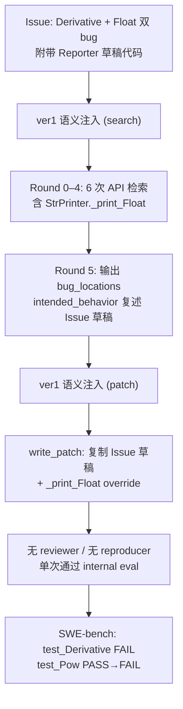
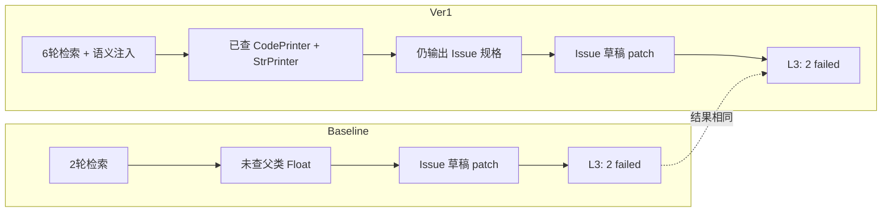

# 单案诊断临床报告：sympy__sympy-12171 (ver1)

> **分类**: C 类（Logic/Assertion Failure）  
> **模型**: deepseek-deepseek-chat  
> **Pipeline**: AutoCodeRover-ver1（含静态语义注入）  
> **任务目录**: `lite300_output_ver1/repos/sympy/applicable_patch/sympy__sympy-12171_2026-06-06_04-15-28/`  
> **评测结果**: L2 PASS（补丁可应用）→ L3 FAIL（8 passed, 2 failed）  
> **语义注入**: 已生效（search + patch 阶段均注入三条规则）  
> **ver1 vs baseline**: 最终失败补丁**完全相同**；ver1 检索更深（6 轮 vs 2 轮），但语义注入未能阻止「Issue 草稿锚定」与「邻居契约误读」

---

## 0. 专有名词解释 (Glossary)

| 术语 | 解释 |
|------|------|
| **Mathematica Code Printer (`MCodePrinter`)** | SymPy 中将符号表达式转换为 Wolfram Mathematica 语法的打印器，入口函数为 `mathematica_code()` |
| **`_print_<Type>` 方法** | SymPy Printer 体系中的**分派钩子**：遇到特定 AST 节点类型（如 `Derivative`、`Float`）时，打印器调用对应 `_print_*` 生成目标语言字符串 |
| **`Hold[...]`** | Mathematica 的**非求值包装符**：保留符号形式、不立即计算。`MCodePrinter` 对 `Integral`、`Sum`、`D`（导数）均使用 `Hold[...]` 模式 |
| **`doprint(expr)`** | 打印器**递归分派入口**：子表达式完整走 `_print_*` 链，确保 `sin(x)` → `Sin[x]` 等映射生效 |
| **`stringify(args, sep)`** | `StrPrinter` 辅助函数：对参数列表做 `parenthesize` + 拼接，**不**额外包裹 `Hold` 等语义结构 |
| **`FAIL_TO_PASS`** | SWE-bench 指标：应用 developer patch + test patch 后，原先失败的测试应变为通过。本实例仅 `test_Derivative` |
| **`PASS_TO_PASS`** | 回归指标：原先通过的测试在应用 agent patch 后仍应通过。本实例 agent 导致 `test_Pow` 从 PASS 变为 FAIL |
| **Ground Truth (GT)** | SWE-bench 数据集中人类开发者合并的正确补丁 |
| **Issue 草稿代码** | Issue 正文 Reporter 附带的「简易修复示例」，**不等于** PR 合并实现，更不等于 CI 验收标准 |
| **语义注入 (ver1)** | 在 search / patch 阶段向 prompt 注入 `ISSUE_SKEPTICISM_AND_SCOPE`、`SYMPY_ARCHITECTURE_RECON_AND_REUSE`、`MINIMAL_CHANGE_AND_SIBLING_AUDIT` 三条规则 |

---

## 1. 原始问题快照 (Issue Snapshot)

### 1.1 Issue 原文

````text
matematica code printer does not handle floats and derivatives correctly
In its current state the mathematica code printer does not handle Derivative(func(vars), deriver) 
e.g. Derivative(f(t), t) yields Derivative(f(t), t) instead of D[f[t],t]

Also floats with exponents are not handled correctly e.g. 1.0e-4 is not converted to 1.0*^-4

This has an easy fix by adding the following lines to MCodePrinter:


def _print_Derivative(self, expr):
        return "D[%s]" % (self.stringify(expr.args, ", "))

def _print_Float(self, expr):
        res =str(expr)
        return res.replace('e','*^') 


````

> 来源：[`problem_statement.txt`](../../../lite300_output_ver1/repos/sympy/applicable_patch/sympy__sympy-12171_2026-06-06_04-15-28/problem_statement.txt)

### 1.2 Issue 中文翻译

**标题**：Mathematica 代码打印器无法正确处理浮点数和导数。

**正文**：

1. 当前 Mathematica 打印器不能正确处理 `Derivative(func(vars), deriver)`。例如 `Derivative(f(t), t)` 输出 `Derivative(f(t), t)`（SymPy 默认字符串），而不是 Mathematica 语法 `D[f[t], t]`。
2. 带指数的浮点数也不能正确转换，例如 `1.0e-4` 没有被转为 Mathematica 科学计数法 `1.0*^-4`。
3. Reporter 认为修复很简单：在 `MCodePrinter` 中添加上述两个 `_print_*` 方法即可。

### 1.3 核心诉求概括

| 维度 | 内容 |
|------|------|
| **报告了什么 Bug** | `mathematica_code()` 对**导数**和**科学计数法浮点**两类表达式缺少专用打印逻辑，回退到 SymPy 通用字符串 |
| **导数 — 期望** | `Derivative(f(t), t)` → `D[f[t], t]`（Mathematica 的 `D` 运算符 + 方括号参数列表） |
| **导数 — 实际** | 输出 `Derivative(f(t), t)` 或类似 SymPy repr，Mathematica 无法识别 |
| **浮点 — 期望** | `1.0e-4` → `1.0*^-4`（Mathematica 的 `*^` 科学计数法） |
| **浮点 — 实际** | 保留 Python/C 风格的 `e` 指数记法 |
| **Reporter 额外建议** | Issue 内嵌两行 `_print_*` 草稿代码 |

### 1.4 Issue 与 SWE-bench 验收的落差（重要）

Issue 描述**两个**子问题，但 SWE-bench 对本实例的实际验收标准是：

| 来源 | 内容 |
|------|------|
| **`FAIL_TO_PASS`** | 仅 `test_Derivative` |
| **`PASS_TO_PASS`** | 含 `test_Pow` 等 8 项，**不含任何 Float 专项测试** |
| **Ground Truth patch** | **只**添加 `_print_Derivative`，**未**添加 `_print_Float` |
| **test_patch** | 仅新增 `test_Derivative` 的 5 条断言，全部要求 `Hold[D[...]]` 格式 |

> **结论**：Agent 被 Issue 正文的「双 bug + 示例代码」整体吸引，实现了 Reporter 草稿的全部内容；而人类开发者与 CI 只合并、验收了 **Derivative + Hold 包装** 这一半。

---

## 2. Agent 运行轨迹与思维链追踪 (Agent Trajectory & CoT Analysis)

### 2.1 整体运行概况

| 阶段 | 结果 |
|------|------|
| **Retry 次数** | 0（一次成功，无 reviewer） |
| **检索轮次** | 6 轮（Round 0–5；最后一轮无 API 调用，直接输出 bug location） |
| **Reproducer** | 跳过（Issue 无可复现步骤） |
| **语义注入** | search + patch 均注入三条规则（见 `semantic_injection_ver1.json`） |
| **Patch 生成** | 1 次 write_patch 即通过 internal evaluation |
| **最终提交** | `output_0/extracted_patch_0.diff` |

> 来源：[`info.log`](../../../lite300_output_ver1/repos/sympy/applicable_patch/sympy__sympy-12171_2026-06-06_04-15-28/info.log)



### 2.2 Stage 1 工具调用时序

| 轮次 | Agent 思维摘要 | API 调用（按执行顺序） | 结果 |
|------|----------------|------------------------|------|
| **R0** | 搜索 `MCodePrinter` 类了解现状 | `search_class("MCodePrinter")` | ✅ 找到 `sympy/printing/mathematica.py` |
| **R1** | 确认 `_print_Float` 在 `MCodePrinter` 中缺失 | `search_method_in_class("_print_Float", "MCodePrinter")` | ❌ 未找到（方法不存在） |
| **R2** | 查父类继承链 | `search_class("CodePrinter")` | ✅ 发现 `_print_Derivative = _print_not_supported` |
| **R3** | 分析同类打印风格 | `search_method_in_class("_print_Function", "MCodePrinter")` | ✅ 看到 `stringify` 用于函数参数 |
| **R4** | 查父类链上 Float 既有实现 | `search_method_in_class("_print_Float", "StrPrinter")` | ✅ 发现 `mpmath.to_str` + `full_prec` 精度逻辑 |
| **R5** | 声称上下文足够，输出 bug location | （无 API 调用） | 输出 2 个 bug location + **错误** intended_behavior |

> 来源：[`tool_call_layers.json`](../../../lite300_output_ver1/repos/sympy/applicable_patch/sympy__sympy-12171_2026-06-06_04-15-28/output_0/search/tool_call_layers.json)、[`search_round_5.json`](../../../lite300_output_ver1/repos/sympy/applicable_patch/sympy__sympy-12171_2026-06-06_04-15-28/output_0/search/search_round_5.json)

**R5 中 Agent 口头计划但未执行的调用**（CoT 中出现，未进入 `tool_call_layers`）：

- `search_method_in_class("_print_Derivative", "MCodePrinter")`（口头确认缺失，未单独 API）
- `get_code_around_line("sympy/printing/mathematica.py", 1, 100)`（在 CoT 中间出现，未计入最终 API 序列）

### 2.3 最终锚定的 Fault Location

| # | 文件 | 类 | 方法 | 行号（上下文块） | intended_behavior（检索 Agent 输出） |
|---|------|-----|------|------------------|--------------------------------------|
| 1 | `sympy/printing/mathematica.py` | `MCodePrinter` | `_print_Derivative`（新增） | L37–110 | 添加 `_print_Derivative`，用 `stringify(expr.args, ", ")` 格式化为 `D[...]` |
| 2 | `sympy/printing/mathematica.py` | `MCodePrinter` | `_print_Float`（新增） | L37–110 | 添加 `_print_Float`，`str(expr).replace('e', '*^')` 覆盖 `StrPrinter._print_Float` |

> 来源：[`bug_locations_after_process.json`](../../../lite300_output_ver1/repos/sympy/applicable_patch/sympy__sympy-12171_2026-06-06_04-15-28/output_0/search/bug_locations_after_process.json)

### 2.4 定位评估与认知偏差

#### 文件级定位：**正确**

- Agent 与 Ground Truth 均修改 `sympy/printing/mathematica.py` 的 `MCodePrinter` 类。
- ver1 检索 6 轮，比 baseline（2 轮）更深入，且正确查到 `CodePrinter._print_Derivative = _print_not_supported` 与 `StrPrinter._print_Float` 的 mpmath 实现。

#### 方法级 / 语义级定位：**部分正确，实现契约错误**

- `_print_Derivative` 方向正确，但 **未对齐** 同文件 `_print_Integral` / `_print_Sum` 的 **`Hold[...]` 包装 + `doprint` 递归** 模式。
- `_print_Float` 属于 Issue 延伸需求，GT **未实现**；尽管 Agent 已检索到父类 `StrPrinter._print_Float` 的精密实现，仍建议粗暴 override。

#### 认知偏差详解

| 偏差 | 表现 | 产生原因 |
|------|------|----------|
| **「口头对齐邻居、实现照搬 Issue」** | CoT 多次写「follow `_print_Integral` and `_print_Sum`」，但 intended_behavior 指定 `stringify` 而非 `doprint` + `Hold` | **浅层模式匹配**：看到邻居方法存在，但未逐字对比其实现（Integral/Sum 用 `Hold[...]` + `doprint`） |
| **语义注入被下游规格覆盖** | search / patch 阶段均注入了「邻居代码比 Issue 草稿权威」「override 父类需评估回归」，但最终补丁仍复制 Issue 草稿 | `bug_locations.intended_behavior` 由检索 Agent 生成，**以错误规格覆盖了注入规则**；Patch Agent 将 localization 输出视为硬约束 |
| **父类知识未转化为决策** | R4 已检索 `StrPrinter._print_Float`（`mpmath.to_str` + `full_prec`），R5 仍写「简单 str + replace」 | 检索到父类实现 ≠ 理解「不应 override」；Issue 第二条 bug 的叙事压倒了 MINIMAL_CHANGE 规则 |
| **Issue 范围 vs CI 范围混淆** | 实现了 Float 修复，GT 和 test_patch 均未要求 | Agent 无法访问 `meta.json` 的 `FAIL_TO_PASS`；Reproducer 被跳过 |
| **检索阶段 self-poisoning** | intended_behavior 直接复述 Issue 草稿（含 `stringify` 和 `replace('e')`），并错误声称 Integral/Sum 也用 stringify | 检索 Agent 在 R5 将 Issue 示例与邻居方法**混写**进规格，Patch Agent 无能力纠错 |
| **ver1 特有：注入后仍自相矛盾** | Patch CoT 写「matches the style of `_print_Integral` and `_print_Sum`」，同时采用 Issue 的 `D[%s]` 无 Hold 格式 | 自然语言「风格一致」判断未绑定到**可验证代码特征**（Hold 前缀、doprint join） |

#### ver1 vs baseline 检索对比

| 维度 | baseline | ver1 |
|------|----------|------|
| 检索轮次 | 2 | 6 |
| 查 `StrPrinter._print_Float` | ❌ 计划但未执行 | ✅ 已执行 |
| 查 `CodePrinter` 继承链 | ❌ 计划但未执行 | ✅ 已执行 |
| 语义注入 | 无 | 有（三条规则） |
| 最终补丁 | 相同 | 相同 |
| L3 结果 | 8 passed, 2 failed | 8 passed, 2 failed |

> **启示**：更深检索 + 语义注入**不能自动**纠正「规格生成阶段的契约误读」；瓶颈在检索 Agent 输出的 `intended_behavior` 质量，而非检索深度本身。

---

## 3. 失败补丁解剖 (Failed Patch Dissection)

### 3.1 Agent 失败补丁全文

```diff
diff --git a/sympy/printing/mathematica.py b/sympy/printing/mathematica.py
index 4c2ffd81e1..6e446d70e1 100644
--- a/sympy/printing/mathematica.py
+++ b/sympy/printing/mathematica.py
@@ -109,6 +109,13 @@ def _print_Integral(self, expr):
     def _print_Sum(self, expr):
         return "Hold[Sum[" + ', '.join(self.doprint(a) for a in expr.args) + "]]"
 
+    def _print_Derivative(self, expr):
+        return "D[%s]" % self.stringify(expr.args, ", ")
+
+    def _print_Float(self, expr):
+        res = str(expr)
+        return res.replace('e', '*^')
+
 
 def mathematica_code(expr, **settings):
     r"""Converts an expr to a string of the Wolfram Mathematica code
```

> 来源：[`extracted_patch_0.diff`](../../../lite300_output_ver1/repos/sympy/applicable_patch/sympy__sympy-12171_2026-06-06_04-15-28/output_0/extracted_patch_0.diff)

### 3.2 逐行白话解读

| 行 / 块 | Agent 的修改逻辑 | Agent 为什么「想当然」觉得能修好 |
|---------|-----------------|----------------------------------|
| `+ def _print_Derivative(...)` | SymPy 遇到 `Derivative` 节点时调用此方法，不再走父类 `_print_not_supported` | ✅ 正确：确实需要新增 override |
| `return "D[%s]" % self.stringify(...)` | Issue 示例写 `D[%s]` + `stringify`；CoT 声称与 Integral/Sum「风格一致」 | 把 Issue 示例当验收标准；**误读**邻居方法——Integral/Sum 用的是 `Hold[...]` + `doprint`，不是裸 `D[...]` + `stringify` |
| `self.stringify(expr.args, ", ")` | `_print_Function` 在同文件也用 `stringify` 拼参数，认为「风格统一」 | `stringify` 适用于**函数参数列表**；对**运算符节点**（Integral/Sum/Derivative），GT 选择 `doprint` 逐参数递归 |
| `+ def _print_Float(...)` | Issue 第二条 bug：科学计数法 `e` → `*^` | 以为 Issue 两个 bug 都要修；忽略 GT / CI 只验 Derivative，且 R4 已看到父类有正规实现 |
| `res = str(expr)` | 最简单地把 SymPy Float 转字符串 | 绕过了 `StrPrinter._print_Float` 的 `mpmath.to_str` + `full_prec`/`precision` 精度控制 |
| `return res.replace('e', '*^')` | Issue 字面意思：把 `e` 换成 `*^` | 未考虑：① 全局 replace 可能误伤含 `e` 的子串；② 破坏 `3.5` 等简单浮点的格式，导致 `test_Pow` 回归 |

### 3.3 Patch Agent 思维链关键摘录

Patch Agent 在 `conv_patch_0.json` 中的推理：

> "For `_print_Derivative`, the suggested implementation `\"D[%s]\" % self.stringify(expr.args, \", \")` is **appropriate and matches the style** of `_print_Integral` and `_print_Sum`."

这是对邻居方法的**错误归因**——`_print_Integral` / `_print_Sum` 的实际代码为：

```python
return "Hold[Integrate[" + ', '.join(self.doprint(a) for a in args) + "]]"
return "Hold[Sum[" + ', '.join(self.doprint(a) for a in expr.args) + "]]"
```

与 Agent 输出的 `D[%s]` + `stringify` **不一致**。

---

## 4. 黄金标准对比 (Ground Truth Alignment)

### 4.1 人类正确补丁（Ground Truth）

```diff
diff --git a/sympy/printing/mathematica.py b/sympy/printing/mathematica.py
--- a/sympy/printing/mathematica.py
+++ b/sympy/printing/mathematica.py
@@ -109,6 +109,9 @@ def _print_Integral(self, expr):
     def _print_Sum(self, expr):
         return "Hold[Sum[" + ', '.join(self.doprint(a) for a in expr.args) + "]]"
 
+    def _print_Derivative(self, expr):
+        return "Hold[D[" + ', '.join(self.doprint(a) for a in expr.args) + "]]"
+
 
 def mathematica_code(expr, **settings):
```

> 来源：[`developer_patch.diff`](../../../lite300_output_ver1/repos/sympy/applicable_patch/sympy__sympy-12171_2026-06-06_04-15-28/developer_patch.diff)、[`meta.json`](../../../lite300_output_ver1/repos/sympy/applicable_patch/sympy__sympy-12171_2026-06-06_04-15-28/meta.json) 中的 `task_info.patch`

### 4.2 并排对比

| 维度 | Agent 失败补丁 | 人类正确补丁 |
|------|---------------|-------------|
| **修改范围** | `_print_Derivative` + `_print_Float` | **仅** `_print_Derivative` |
| **外层包装** | 无 `Hold` → `D[...]` | `Hold[D[...]]` — 与 `Integrate` / `Sum` 一致 |
| **参数格式化** | `stringify(expr.args, ", ")` | `', '.join(self.doprint(a) for a in expr.args)` |
| **递归打印** | 经 `stringify` → `parenthesize` → `_print`（间接） | 显式 `doprint` 逐参数分派 |
| **Float 处理** | 新增粗糙 override | **不修改**，继续继承 `StrPrinter._print_Float` |
| **行数** | +7 行 | +3 行 |

### 4.3 SWE-bench test_patch 定义的验收契约

test_patch 新增的 `test_Derivative` 断言（节选）：

```python
def test_Derivative():
    assert mcode(Derivative(sin(x), x)) == "Hold[D[Sin[x], x]]"
    assert mcode(Derivative(x, x)) == "Hold[D[x, x]]"
    assert mcode(Derivative(sin(x)*y**4, x, 2)) == "Hold[D[y^4*Sin[x], x, x]]"
    assert mcode(Derivative(sin(x)*y**4, x, y, x)) == "Hold[D[y^4*Sin[x], x, y, x]]"
    assert mcode(Derivative(sin(x)*y**4, x, y, 3, x)) == "Hold[D[y^4*Sin[x], x, y, y, y, x]]"
```

### 4.4 核心分析：人类多考虑了什么？

1. **Printer 家族契约（Hold 包装）**  
   在 `MCodePrinter` 中，「会在 Mathematica 侧被求值/展开的符号运算符」——`Integrate`、`Sum`、`D`——统一用 `Hold[Operator[...]]` 延迟求值。Reporter 的 Issue 草稿省略了 `Hold`，但合并 PR 的开发者遵循了**已有代码风格**而非 Issue 字面文本。

2. **`doprint` vs `stringify` 的语义分工**  
   - `doprint`：完整递归分派，每个子表达式走 `_print_Function` → `Sin[x]`、`y^4` 等。  
   - `stringify`：仅做 precedence 括号 + 拼接，适用于函数参数列表等「扁平」场景。  
   对 `Derivative` 这种**运算符节点**，GT 选择与 `_print_Sum` 相同的 `doprint` 模式。

3. **最小修复原则（YAGNI）**  
   Float 问题在 Issue 中被提及，但：  
   - 无对应 `FAIL_TO_PASS` 测试；  
   - 现有 `PASS_TO_PASS` 中 `test_Pow` 依赖默认 `_print_Float` 的精度行为；  
   人类开发者选择**不引入** `_print_Float`，避免未测试功能带来的回归风险。

4. **继承链上的既有实现**  
   `StrPrinter._print_Float` 已通过 `mpmath.to_str` + `full_prec`/`precision` 正确处理浮点字符串。粗暴 `str(expr).replace('e','*^')` 绕过了这套机制。

### 4.5 Agent 补丁 vs GT 的本质区别

| 失败根因 | 说明 |
|----------|------|
| **缺少 `Hold`** | 直接导致 `test_Derivative` 全部 AssertionError（期望 `Hold[D[...]]`，实际 `D[...]`） |
| **多余且错误的 `_print_Float`** | 破坏 `StrPrinter._print_Float` 的精度/格式逻辑，导致 `test_Pow` 中 `3.5` 的字符串与期望 `"(3.5*f[x])^..."` 不匹配 |
| **Scope creep** | 修复了 CI 未要求的部分（Float），引入 CI 未预期的回归 |

### 4.6 Golden 评测对照

Ground Truth 在 `SWE-bench_Lite_golden` 评测中 **10 passed, 0 failed**（含新增 `test_Derivative`），证实 GT 的「仅 `_print_Derivative` + `Hold`」策略是正确的最小修复。

---

## 5. 评测报告与崩溃堆栈 (Evaluation Log & Traceback)

### 5.1 评测命令与环境

```
conda run -n sympy__sympy__1.0 bin/test -C --verbose sympy/printing/tests/test_mathematica.py
```

> 来源：[`eval_log`](../../../lite300_output_ver1/repos/sympy/eval_logs/sympy__sympy-12171.deepseek-deepseek-chat.eval.log)

### 5.2 测试结果摘要

| 指标 | 结果 |
|------|------|
| **总计** | 8 passed, **2 failed** |
| **FAIL_TO_PASS** | `test_Derivative` — **仍失败** |
| **PASS_TO_PASS** | `test_Pow` — **从通过变为失败**（回归） |
| **补丁应用** | `Applied patch sympy/printing/mathematica.py cleanly.` |

### 5.3 失败堆栈（原文）

#### 失败 1：`test_Pow`（PASS_TO_PASS 回归）

```
________________________________________________________________________________
______________ sympy/printing/tests/test_mathematica.py:test_Pow _______________
  File "/home/swe-bench/sympy__sympy/sympy/printing/tests/test_mathematica.py", line 36, in test_Pow
    "(3.5*f[x])^(-x + y^x)/(x^2 + y)"
AssertionError
```

**触发断言**（base commit 测试文件）：

```python
assert mcode(1/(f(x)*3.5)**(x - y**x)/(x**2 + y)) == \
    "(3.5*f[x])^(-x + y^x)/(x^2 + y)"
```

#### 失败 2：`test_Derivative`（FAIL_TO_PASS 未修复）

```
________________________________________________________________________________
___________ sympy/printing/tests/test_mathematica.py:test_Derivative ___________
  File "/home/swe-bench/sympy__sympy/sympy/printing/tests/test_mathematica.py", line 78, in test_Derivative
    assert mcode(Derivative(sin(x), x)) == "Hold[D[Sin[x], x]]"
AssertionError
```

### 5.4 根因分析：为什么 Agent 补丁报这些错？

#### `test_Derivative` AssertionError

| 项目 | Agent 实际输出（推断） | 测试期望 |
|------|----------------------|----------|
| `mcode(Derivative(sin(x), x))` | `"D[Sin[x], x]"` | `"Hold[D[Sin[x], x]]"` |

**根因**：Agent 按 Issue 草稿输出 `D[...]`，缺少 Mathematica 打印器对微分运算符的 **`Hold` 非求值包装**。这是**输出格式契约错误**，不是定位错误。

#### `test_Pow` AssertionError

| 项目 | 说明 |
|------|------|
| **表达式** | 含 Python 字面量 `3.5`（SymPy 内部为 `Float`） |
| **Agent 行为** | `_print_Float` 用 `str(expr)` 替代继承的 `StrPrinter._print_Float` |
| **后果** | `3.5` 可能被格式化为与 `full_prec='auto'` / `precision=15` 不一致的字符串，导致整条 `mcode(...)` 输出与精确期望字符串不匹配 |
| **根因** | **过度修复（scope creep）** + **不了解 Printer 继承链上 Float 的既有格式化语义** |

---

## 6. 总结

Agent 在本案中的失败，**不是定位错误**（文件、类均正确；ver1 甚至检索到了父类 `StrPrinter._print_Float`），而是**实现语义与项目契约脱节**：尽管 ver1 注入了「Issue 草稿非权威」「邻居方法优先」「最小改动」等规则，检索 Agent 仍将错误规格写入 `intended_behavior`，Patch Agent 将其当作硬约束，逐字复制 Issue 草稿。具体而言，Agent 漏掉了同文件 `_print_Integral` / `_print_Sum` 已建立的 **`Hold[Operator[...]]` + `doprint` 模式**（口头声称对齐、实现却用 `stringify`），又画蛇添足地加入了 CI 未验收的 `_print_Float`，用 `str().replace('e','*^')` 粗暴覆盖 mpmath 精度逻辑，引发 `test_Pow` 回归。本质上，Agent 缺乏三类「常识」：**(1) SymPy Printer 家族内同类运算符方法的代码级风格一致性（须逐行对比邻居实现，而非复述 Issue）；(2) `doprint` 递归分派 vs `stringify` 扁平拼接的适用边界；(3) 最小修复原则——Issue 描述范围 ⊃ CI 验收范围时，应以 `FAIL_TO_PASS` / 邻居契约为准，且 override 父类 `_print_*` 前须评估 PASS_TO_PASS 回归风险。**

---

## 7. Prompt 静态语义注入建议（可泛化）

以下建议面向 Auto-Code-Rover ver1 及类似系统的 **Prompt / Retrieval / Localization 阶段静态注入**。本案表明：**仅注入高层规则不够**，需增加**可机械执行的契约提取与规格校验**。

### 7.1 【Printer 邻居契约自动提取】「声称 follow 邻居 → 必须引用邻居源码」

**注入内容**：

> 在 `printing/` 模块新增 `_print_<NodeType>` 时，**强制**从同 Printer 类中提取语义最近的 1–2 个邻居方法（如 `_print_Integral`、`_print_Sum`、`_print_Limit`）的**完整 return 语句**，并填写契约检查表：
>
> | 检查项 | 邻居方法实际值 | 新方法必须使用 |
> |--------|---------------|---------------|
> | 外层包装符 | 如 `Hold[Integrate[` | 同族运算符应一致 |
> | 参数 join API | `doprint` 或 `stringify` | 与邻居相同 |
> | 括号风格 | `[...]` vs `(...)` | 与邻居相同 |
>
> Issue Reporter 的内嵌代码仅为**示意**；若与邻居契约表冲突，**以邻居为准**。

**泛化场景**：任何 serializer / formatter / printer 类「Issue 附带 suggested fix」任务。

### 7.2 【Printer 分派链】`doprint` / `stringify` / `parenthesize` 决策树

**注入内容**：

| API | 语义 | 适用 |
|-----|------|------|
| `self.doprint(subexpr)` | 完整递归分派，子节点走 `_print_*` 链 | 运算符节点（Integrate, Sum, Derivative）的参数、需函数名映射（sin→Sin）的子树 |
| `self.stringify(args, sep)` | 对 args 做 precedence 括号后 join | 函数参数列表等扁平结构 |
| `self.parenthesize(expr, prec)` | 仅 precedence 括号，内部仍 `_print` | 嵌入更大表达式时的子项 |

**硬规则**：若同类运算符（`_print_Sum`、`_print_Integral`）已用 `doprint` + `Hold`，新方法**禁止**改用 `stringify` 除非 test 明确否则。

### 7.3 【Hold / Unevaluated 包装】符号 CAS 导出通用模式

**注入内容**：

> 向 Mathematica、Maple 等符号计算系统导出 AST 时，「会被目标系统立即求值的构造」（积分、求和、微分、极限）通常需要 **Hold / HoldForm / unevaluated** 包装。在 `MCodePrinter` 中，凡 `_print_Integral` / `_print_Sum` 使用 `Hold[...]` 的，新增 `_print_Derivative` **默认也必须** `Hold[D[...]]`。

**泛化场景**：sympy→mathematica/maple、math→latex 中延迟求值包装问题。

### 7.4 【Issue 范围 vs CI 范围】验收契约优先级 + meta 感知

**注入内容**：

> 修复优先级：`test_patch` 断言 > `FAIL_TO_PASS` 列表 > 邻居代码契约 > Issue 正文描述 > Issue 内嵌草稿代码。  
> 若 pipeline 可访问 `meta.json`，**必须**读取 `FAIL_TO_PASS` / `PASS_TO_PASS`：未出现在 `FAIL_TO_PASS` 中的 Issue 子问题，默认**不在本次修复范围**。  
> 任何新增 override（如 `_print_Float`）若不在验收范围，须评估对 `PASS_TO_PASS` 的回归风险；**无测试覆盖的功能不应为「Issue 完整性」而实现**。

**本案教训**：Issue 提了两个 bug，但 `FAIL_TO_PASS` 只有 `test_Derivative`；Float 修复属于典型的 scope creep。

### 7.5 【继承链 Override 门禁】查父类 ≠ 可以覆盖

**注入内容**：

> 在 Printer 子类新增 `_print_<Type>` 之前，若检索到父类（如 `StrPrinter._print_Float`）已有**非 trivial** 实现（调用 `mpmath`、精度设置、特殊格式修正），则：
> 1. **默认不 override**；
> 2. 若 Issue 要求 override，须说明为何不会破坏 `PASS_TO_PASS`；
> 3. 优先 `super()._print_Float(expr)` 后再做目标语言变换，而非 `str(expr)` 捷径。
>
> 若父类为 `_print_<Type> = _print_not_supported`，则子类需完整实现且对齐同类已支持节点。

**检索提示**：发现父类已有实现时，在 `intended_behavior` 中**显式写「是否 override」及理由**。

### 7.6 【Localization 规格校验】防止 `intended_behavior` 毒化 Patch

**注入内容**（针对 ver1 pipeline 架构）：

> 检索 Agent 输出的 `intended_behavior` 不得直接复述 Issue 草稿代码。生成后须经以下校验：
> - 若声称「follow `_print_X`」，则 `intended_behavior` 中的 API（`doprint`/`stringify`）和包装符（`Hold`）必须与 `_print_X` 源码一致；
> - 若建议 override 父类 `_print_*`，须引用父类方法并说明回归风险；
> - 校验失败则触发追加检索，不得进入 Patch 阶段。

**泛化场景**：所有「search Agent → patch Agent」两阶段流水线。

### 7.7 【字符串 replace 反模式】科学计数法 / 转义

**注入内容**：

> 禁止对打印结果做无约束的 `str.replace('e', ...)`：浮点科学计数法、函数名（`Exp`、`Sin`）、符号名均含字母 `e`。正确做法：在 `_print_Float` 内用 regex 匹配指数部分，或调用项目已有 mpf→string 工具（SymPy 中为 `mpmath.libmp.to_str`），且仅在 `FAIL_TO_PASS` 要求时实现。

### 7.8 【Reproducer 缺失时的防御性 Patch 策略】

**注入内容**：

> 当 Issue 被判定为「无可复现步骤」时，Patch 阶段应：  
> (1) 阅读 `test_patch` diff（若 meta 可获取）推断精确断言；  
> (2) 对 `PASS_TO_PASS` 相关代码路径做 **impact analysis**（本例：新增 `_print_Float` 影响所有含浮点的表达式）；  
> (3) 禁止实现 test_patch 未引用且 `FAIL_TO_PASS` 未覆盖的新 override。

### 7.9 【ver1 规则强化建议】针对本案三条已有规则的补丁

| 现有规则 | 本案失效原因 | 建议强化 |
|----------|-------------|----------|
| `ISSUE_SKEPTICISM_AND_SCOPE` | Patch Agent 仍实现 Float 子问题 | 增加「读取 FAIL_TO_PASS」的机械步骤 |
| `SYMPY_ARCHITECTURE_RECON_AND_REUSE` | 口头说 reuse，实现用 Issue API | 增加「邻居契约检查表」必填项 |
| `MINIMAL_CHANGE_AND_SIBLING_AUDIT` | 加了多余 `_print_Float` | 增加「父类已有实现 → 禁止 override」门禁 |

---

## 8. 附录：关键 Artifact 路径

| Artifact | 路径 |
|----------|------|
| Issue | `lite300_output_ver1/repos/sympy/applicable_patch/sympy__sympy-12171_2026-06-06_04-15-28/problem_statement.txt` |
| Agent log | `.../info.log` |
| Bug locations | `.../output_0/search/bug_locations_after_process.json` |
| Tool call 时序 | `.../output_0/search/tool_call_layers.json` |
| Agent patch | `.../output_0/extracted_patch_0.diff` |
| Patch CoT | `.../output_0/conv_patch_0.json` |
| Ground Truth | `.../developer_patch.diff` |
| SWE-bench meta | `.../meta.json` |
| Eval log | `lite300_output_ver1/repos/sympy/eval_logs/sympy__sympy-12171.deepseek-deepseek-chat.eval.log` |
| 语义注入记录 | `.../output_0/semantic_injection_ver1.json` |
| Golden eval | `SWE-bench-docker/evaluations/SWE-bench_Lite_golden/logs/sympy__sympy-12171.SWE-bench_Lite_golden.eval.log` |
| 失败分析 JSON | `lite300_output_ver1/repos/sympy/sympy_failure_analysis.json` |

---

## 9. 文档自审清单

| 检查项 | 状态 | 备注 |
|--------|------|------|
| Issue 原文完整引用 | ✅ | 与 `problem_statement.txt` 一致 |
| Stage 1 工具调用时序与 `tool_call_layers.json` 一致 | ✅ | R0–R4 共 5 次 API；R5 无调用 |
| Fault location 与 `bug_locations_after_process.json` 一致 | ✅ | 2 个 location，L37–110 |
| Agent patch 全文与 `extracted_patch_0.diff` 一致 | ✅ | hash `6e446d70e1` |
| GT patch 与 `developer_patch.diff` / `meta.json` 一致 | ✅ | 仅 `_print_Derivative` + Hold |
| 评测失败与 eval log 行号一致 | ✅ | test_Pow L36, test_Derivative L78 |
| 分析 test_Pow 回归根因（`_print_Float` override） | ✅ | |
| 分析 test_Derivative 根因（缺少 Hold） | ✅ | |
| Issue vs SWE-bench 范围落差 | ✅ | FAIL_TO_PASS 仅 test_Derivative |
| ver1 语义注入是否记录 | ✅ | 三条规则均已注入 |
| ver1 vs baseline 差异分析 | ✅ | 详见 §10 完整对比 |
| 可泛化 prompt 注入建议 | ✅ | 含 localization 校验等新建议 |
| Golden 10/10 对照 | ✅ | SWE-bench_Lite_golden eval log |

**已知局限**：

1. eval log 未打印 assert 的 actual vs expected 具体字符串；`test_Pow` / `test_Derivative` 失败推断基于补丁逻辑与 Golden 对照，未在本地运行 SymPy 复现。
2. `search_round_5.json` CoT 中提及 `get_code_around_line` 与 `_print_Derivative` 搜索，但未进入 `tool_call_layers.json` 正式 API 序列——文档已标注为「口头计划未执行」。

**遗漏反思**：§10 已补充 baseline vs ver1 系统性对比；本案核心失败链（Issue 锚定 → intended_behavior 毒化 → 缺 Hold → Float scope creep）均已覆盖。

---

## 10. Baseline vs Ver1 对比分析（语义注入效果评估）

> **对比对象**：baseline 报告 [`document/baseline/sympy/sympy__sympy-12171.md`](../../baseline/sympy/sympy__sympy-12171.md) vs 本报告（ver1）  
> **注入来源**：[`app/knowledge/sympy_semantic_rules.py`](../../../app/knowledge/sympy_semantic_rules.py) 中三条规则  
> **说明**：用户查询中「11400」为笔误，实际对比实例为 **sympy__sympy-12171**（两份报告路径均为 `sympy__sympy-12171.md`）。

### 10.1 注入语义信息与 baseline 建议的「血缘关系」

ver1 注入的三条规则并非凭空设计，而是将 baseline 报告第 7 节「Prompt 静态语义注入建议」**工程化、结构化**后的产物：

| ver1 规则名 | baseline 报告对应章节 | 核心意图 |
|-------------|----------------------|----------|
| `ISSUE_SKEPTICISM_AND_SCOPE` | §7.4 Issue 范围 vs CI 范围 + Issue 草稿非权威 | Issue 是症状报告；草稿代码 ≠ GT；范围克制 |
| `SYMPY_ARCHITECTURE_RECON_AND_REUSE` | §7.1 读邻居 `_print_*` + §7.2 doprint/stringify 卡片 + §7.5 继承链 | 架构侦察；邻居契约优先；复用分派链 |
| `MINIMAL_CHANGE_AND_SIBLING_AUDIT` | §7.5 继承链 + §7.7 Reproducer 缺失防御 + 最小改动 | 最小 patch；兄弟方法审计；拒绝多余 override |

**联系**：baseline 12171 的失败分析是 ver1 语义规则的**直接知识来源之一**；本案既是规则的「靶题」，也是规则失效的「反例」。

### 10.2 端到端结果对比：L3 无改善

| 维度 | Baseline | Ver1 | 变化 |
|------|----------|------|------|
| **L3 评测** | 8 passed, **2 failed** | 8 passed, **2 failed** | ❌ 无变化 |
| **FAIL_TO_PASS** | `test_Derivative` 仍失败 | `test_Derivative` 仍失败 | ❌ 无变化 |
| **PASS_TO_PASS** | `test_Pow` 回归 | `test_Pow` 回归 | ❌ 无变化 |
| **失败补丁语义** | `D[...]` + `stringify` + `_print_Float` | 完全相同 | ❌ 无变化 |
| **GT 差距** | 缺 `Hold`、多余 Float | 缺 `Hold`、多余 Float | ❌ 无变化 |

**结论**：就 **SWE-bench 能否 resolve 本题** 而言，ver1 **没有带来可观测优化**；注入语义信息后，Agent 仍提交与 baseline 等价的错误补丁。

### 10.3 过程层对比：ver1 有「检索深化」，无「决策纠正」

| 过程指标 | Baseline | Ver1 | 评价 |
|----------|----------|------|------|
| **语义注入** | 无 | search + patch 均注入 3 条规则 | ✅ 新能力 |
| **检索轮次** | 2 轮 | 6 轮 | ✅ 更深 |
| **API 调用数** | R0: 3 次；R1: 0 次 | R0–R4: 5 次；R5: 0 次 | ✅ 更多 |
| **查 `MCodePrinter`** | ✅ | ✅ | 相同 |
| **查 `CodePrinter` 继承链** | ❌ 计划未执行 | ✅ 已执行，发现 `_print_Derivative = _print_not_supported` | ✅ ver1 更完整 |
| **查 `StrPrinter._print_Float`** | ❌ 计划未执行 | ✅ 已执行，发现 `mpmath.to_str` 精度逻辑 | ✅ ver1 更完整 |
| **查 `_print_Function` 风格** | 间接（R0 类搜索） | ✅ 显式 API | ✅ ver1 更完整 |
| **bug_locations 数量** | 2 | 2 | 相同 |
| **intended_behavior 内容** | 复述 Issue 草稿 | 复述 Issue 草稿（措辞略不同） | ❌ 均未纠正 |
| **Patch CoT** | 「按 issue 添加两个方法」 | 「matches style of Integral/Sum」但实现仍用 Issue API | ⚠️ ver1 口头改善、实现未变 |
| **Retry / Reviewer** | 0 | 0 | 相同 |
| **Reproducer** | 跳过 | 跳过 | 相同 |
| **Internal eval** | 单次通过 | 单次通过 | 相同 |



**过程层结论**：ver1 在 **「架构侦察」**（`SYMPY_ARCHITECTURE_RECON_AND_REUSE` 要求的继承链调查）上有明显进步；但在 **「规格生成」与「补丁落地」** 两个决策节点上，与 baseline 走同一条路。

### 10.4 失败补丁微观差异

两份 `extracted_patch_0.diff` 在逻辑上**等价**，仅存在无关紧要的格式差异：

| 位置 | Baseline | Ver1 |
|------|----------|------|
| `_print_Derivative` return | `"D[%s]" % (self.stringify(...))` | `"D[%s]" % self.stringify(...)` |
| patch hash | `3730b3a346` | `6e446d70e1` |

不影响测试行为；L3 失败模式完全一致。

### 10.5 三条规则在本案中的「应生效点」与「实际失效点」

#### 规则 1：`ISSUE_SKEPTICISM_AND_SCOPE`

| 规则要求 | 本案应触发的效果 | 实际表现 | 失效原因 |
|----------|-----------------|----------|----------|
| Issue 草稿非 ground truth | 不逐字复制 `D[%s]` + `replace('e')` | Patch 仍逐字复制 | Patch Agent 将 `bug_locations.intended_behavior` 视为比规则更具体的「任务规格」 |
| 不实现所有 Issue 子问题 | 不添加 `_print_Float`（CI 未验） | 仍添加 `_print_Float` | Agent 将 Issue 两条 bug 等同对待；规则中「without access to hidden test suites」使 Agent 无法引用 `FAIL_TO_PASS` 作硬约束 |
| Issue vs 邻居冲突时跟邻居 | `_print_Derivative` 应用 `Hold` + `doprint` | 仍用 Issue 的 `D` + `stringify` | 检索 Agent 在 intended_behavior 中**混写**「follow Integral/Sum」与 Issue API，造成规则与规格冲突时**规格胜出** |

#### 规则 2：`SYMPY_ARCHITECTURE_RECON_AND_REUSE`

| 规则要求 | 本案应触发的效果 | 实际表现 | 失效原因 |
|----------|-----------------|----------|----------|
| 读继承链 | 理解 Derivative 需 override `_print_not_supported` | ✅ 检索阶段已做到 | 检索知识未写入正确 intended_behavior |
| 邻居方法风格复用 | 复制 `_print_Sum` 的 `Hold[...]` + `doprint` | ❌ CoT 声称一致，实现用 `stringify` | **浅层模式匹配**：看到邻居存在，未逐行提取 return 语句中的 `Hold` 与 `doprint` |
| 父类有 `_print_Float` 则 extend/super | 不 override，或 super 后再变换 | ❌ 用 `str().replace` 全覆盖 | 检索到 `StrPrinter._print_Float` 后，intended_behavior 仍写「override 并 replace」 |
| printing: doprint vs stringify | Derivative 属运算符节点 → `doprint` | ❌ 选 `stringify` | 规则是散文式启发，无**强制决策树**；Agent 被 `_print_Function` 的 `stringify` 用法误导 |

#### 规则 3：`MINIMAL_CHANGE_AND_SIBLING_AUDIT`

| 规则要求 | 本案应触发的效果 | 实际表现 | 失效原因 |
|----------|-----------------|----------|----------|
| 最小改动 | 仅 +3 行 `_print_Derivative` | +7 行（含 Float） | 「兄弟方法审计」被误读为「Issue 提到的每个缺失 handler 都要补」 |
| 拒绝 override Inherited behavior without need | 不碰 `_print_Float` | 仍 override | 规则与 Issue「双 bug」叙事冲突时，Issue 叙事 + localization 规格占上风 |
| 最小 diff 优先 | 3 行 GT 风格 | 7 行 Issue 风格 | 无 patch 候选比较（single-pass）；internal eval 无 SWE-bench 测试 |

### 10.6 为什么「注入了正确语义」仍然失败？—— 结构性原因

本案失败不能简单归结为「模型没读懂规则」，而是 **ver1 流水线结构与规则形态** 共同导致：

**原因 1：两阶段流水线中，Localization 输出优先级高于注入规则**

```
[语义注入 rules] + [Issue 全文] + [bug_locations.intended_behavior]
                              ↓
                    Patch Agent 实际听从：intended_behavior（含 Issue 草稿 API）
```

检索 Agent 负责写 `intended_behavior`，其输出被 Patch prompt 包装为「collected by someone else」的**权威上下文**。三条规则虽声明「authoritative over Issue draft code」，但与 `intended_behavior` 同屏出现时，模型倾向于执行**更具体、可操作的错误规格**。

**原因 2：规则是「软启发」，缺少机械校验门禁**

`sympy_semantic_rules.py` 中 `select_sympy_rules()` 对全部 SymPy 任务**无差别注入**三条规则，且：
- 不随 `phase` 变化（`phase` 参数被 `_` 丢弃）；
- 不根据 `file_paths` / `issue_text` 做路由；
- 无后处理校验（如：intended_behavior 含 `stringify` 但邻居用 `doprint` → 拒绝或重写）。

规则指出了正确方向，但**无法阻止**错误补丁生成。

**原因 3：检索深化 ≠ 规格正确化**

ver1 多查了 `CodePrinter` 与 `StrPrinter._print_Float`，信息量更大，但检索 Agent 在 R5 仍将结论**压缩回 Issue 草稿**。更多信息在缺乏结构化提取（邻居契约表）时，反而给 CoT 更多「自圆其说」素材（如「已了解父类，故可 override Float」）。

**原因 4：关键验收信息对 Agent 不可见**

`meta.json` 中有 `FAIL_TO_PASS: ["test_Derivative"]` 与完整 `test_patch`（含 `Hold[D[...]]` 断言），但 Patch Agent prompt 明确「Do not make changes to test files or write tests」，且流水线**未将 meta 验收契约注入** patch 阶段。`ISSUE_SKEPTICISM_AND_SCOPE` 中「without access to hidden test suites」一语，反而为 Agent **不修 Float** 提供了退路，却又未提供 **FAIL_TO_PASS 硬列表** 来锁定范围。

**原因 5：无 Reproducer / Reviewer 反馈环**

两版本均跳过 Reproducer，均无 reviewer；错误补丁一次 internal eval 即通过。语义注入只影响**开环** prompt，没有**闭环**纠错。

**原因 6：规则内部存在可歧义解读**

`MINIMAL_CHANGE_AND_SIBLING_AUDIT` 要求对 `_print_Integral / _print_Sum / _print_Derivative` 做兄弟审计——Agent 可将其理解为「三个都要修到 Issue 描述的状态」，而非「按邻居风格只修 Derivative」。`SCOPE DISCIPLINE` 与 `SIBLING COMPLETENESS` 在本案叠加时产生张力，模型选择了**更广范围**的 Issue 完整实现。

### 10.7 ver1 相对 baseline 的「优化」与「未优化」分项表

| 类别 | 是否优化 | 说明 |
|------|----------|------|
| **L3 resolve 率** | ❌ 未优化 | 两版本均 fail，失败测试相同 |
| **架构检索完整度** | ✅ 有优化 | ver1 补齐父类链与 Float 实现调查 |
| **对 Issue 草稿的警觉** | ⚠️ 表面优化 | CoT 出现「matches Integral/Sum」等规则话术，但代码未跟进 |
| **Localization 质量** | ❌ 未优化 | intended_behavior 仍锚定 Issue 草稿 |
| **Patch 最小性** | ❌ 未优化 | 均为 +7 行过度修复 |
| **PASS_TO_PASS 保护** | ❌ 未优化 | 均破坏 `test_Pow` |
| **Pipeline 可观测性** | ✅ 有优化 | `semantic_injection_ver1.json` 可审计规则是否注入 |
| **知识沉淀闭环** | ✅ 有优化 | baseline 建议 → `sympy_semantic_rules.py` → ver1 注入，形成文档到代码闭环 |

### 10.8 本案对 ver1 语义注入体系的启示

1. **注入规则本身方向正确**——本案失败模式与三条规则所针对的偏差高度吻合，说明 baseline 归因和规则抽取是准确的。
2. **仅注入 prompt 不够**——需在 localization → patch 之间增加**规格校验器**（邻居 return 语句 vs intended_behavior 一致性检查）。
3. **检索深化需配套结构化输出**——强制填写「邻居契约表」（Hold 有无、doprint/stringify），否则更深检索仍可能产出错误规格。
4. **应将 `meta.json` 的 `FAIL_TO_PASS` / `test_patch` 摘要注入 patch 阶段**——使 `ISSUE_SKEPTICISM_AND_SCOPE` 从软启发变为可执行范围约束。
5. **父类调查结果应触发 override 门禁**——本案 ver1 已检索 `StrPrinter._print_Float`，若规则引擎检测「父类非 trivial 实现 + 无 FAIL_TO_PASS 覆盖」，应阻断 `_print_Float` 写入 patch。
6. **本案不适合作为 ver1 有效性的正向样例**——更适合作为 **「规则已注入但流水线结构未配套」** 的负向对照，用于驱动 ver2 的机械校验而非继续加长 prompt。

### 10.9 对比总结（一段话）

Baseline 与 ver1 在 sympy__sympy-12171 上呈现 **「过程更好、结果不变」** 的分离：ver1 将 baseline 报告中的注入建议落地为 `sympy_semantic_rules.py` 三条规则，并显著加深了继承链检索，但 **Localization 阶段仍将 Issue 草稿写入 `intended_behavior`，Patch 阶段在规则与错误规格冲突时听从后者**，最终提交与 baseline 语义等价的失败补丁，L3 仍为 8 passed / 2 failed。注入语义信息未能扭转结局，根本原因在于 **规则是全局软启发、无机械门禁、无 FAIL_TO_PASS 可见、无 reproducer 闭环**，且两阶段流水线中 **检索输出对 Patch Agent 的约束力高于注入规则**——本案证明：**正确知识注入 prompt 是必要但不充分条件；必须与规格校验、验收契约可见化、override 门禁等工程机制联动，才能将「架构侦察进步」转化为「补丁质量进步」。**
