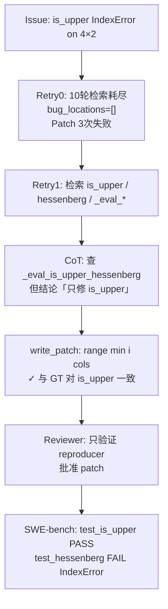

# 单案诊断临床报告：sympy__sympy-12454 (ver1)

> **分类**: C 类（Logic/Assertion Failure）  
> **模型**: deepseek-deepseek-chat  
> **Pipeline**: AutoCodeRover-ver1（含静态语义注入）  
> **任务目录**: `lite300_output_ver1/repos/sympy/applicable_patch/sympy__sympy-12454_2026-06-06_04-23-21/`  
> **评测结果**: L2 PASS（补丁可应用）→ L3 FAIL（`test_is_upper` ✅ · `test_hessenberg` ❌ · PASS_TO_PASS 153/153 ✅）  
> **语义注入**: 已生效（search + patch 阶段均注入三条规则）  
> **特殊性质**: **「主 Bug 修对、兄弟 Bug 漏修」** 型 C 类失败——Agent 对 `is_upper` 的修复与人类补丁完全一致，但因遗漏同文件内结构对称的 `_eval_is_upper_hessenberg`，未通过 SWE-bench 完整验收  
> **ver1 vs baseline**: 最终失败补丁**完全相同**；ver1 检索更深（Retry 1 共 4 轮、7 次 API），且已注入 sibling audit 规则，但 Agent 仍得出「只需修 `is_upper`」的错误结论

---

## 0. 专有名词解释 (Glossary)

| 术语 | 解释 |
|------|------|
| **Upper Triangular Matrix（上三角矩阵）** | 主对角线**以下**的元素全为零的矩阵。对非方阵同样可定义：只检查「行号 > 列号」且**实际存在**的条目 |
| **Upper Hessenberg Matrix（上 Hessenberg 矩阵）** | 主对角线**下方第一条次对角线以下**的元素全为零。比上三角「宽松」一步：允许紧邻主对角线下方的非零元素 |
| **Tall Matrix（高矩阵）** | 行数 > 列数的矩阵（如 4×2、5×2）。此时某些行的「理论列索引」会超出 `self.cols - 1`，若循环上界未截断会触发 `IndexError` |
| **`_eval_is_*` 内部实现** | SymPy `MatrixProperties` 中 property 背后的实际逻辑。例如 `is_upper_hessenberg` property 调用 `_eval_is_upper_hessenberg()` |
| **`range(i)` vs `range(i+1, self.cols)`** | 前者从 0 遍历到 i-1，**不感知列数**；后者从 i+1 遍历到 cols-1，**天然以 `self.cols` 为上界**——这是 `is_lower` 安全而 `is_upper` / `_eval_is_upper_hessenberg` 不安全的根本原因 |
| **`FAIL_TO_PASS`** | SWE-bench 指标：应用补丁 + test patch 后，原先失败的测试应变为通过。本实例为 `test_is_upper` 与 **`test_hessenberg`**（两项都必须通过） |
| **`PASS_TO_PASS`** | 回归指标：原先通过的测试在应用 agent patch 后仍应通过。本实例 agent **未引入回归**（全部 153 项保持 success） |
| **Vacuous Truth（空真）** | 对高矩阵，主对角线以下「不存在」的格子无需检查；`all([])` 为 `True`，数学上这些位置视为自动满足 |
| **Ground Truth (GT)** | SWE-bench 数据集中人类开发者合并的正确补丁 |
| **语义注入 (ver1)** | 在 search / patch 阶段向 prompt 注入 `ISSUE_SKEPTICISM_AND_SCOPE`、`SYMPY_ARCHITECTURE_RECON_AND_REUSE`、`MINIMAL_CHANGE_AND_SIBLING_AUDIT` 三条规则 |
| **Sibling Audit（兄弟方法审计）** | 修复一个方法后，扫描同 class 内对称/同模式方法是否共享同一 bug class；本题核心遗漏点 |

---

## 1. 原始问题快照 (Issue Snapshot)

### 1.1 Issue 原文

````text
is_upper() raises IndexError for tall matrices
The function Matrix.is_upper raises an IndexError for a 4x2 matrix of zeros.
```
>>> sympy.zeros(4,2).is_upper
Traceback (most recent call last):
  File "<stdin>", line 1, in <module>
  File "sympy/matrices/matrices.py", line 1112, in is_upper
    for i in range(1, self.rows)
  File "sympy/matrices/matrices.py", line 1113, in <genexpr>
    for j in range(i))
  File "sympy/matrices/dense.py", line 119, in __getitem__
    return self.extract(i, j)
  File "sympy/matrices/matrices.py", line 352, in extract
    colsList = [a2idx(k, self.cols) for k in colsList]
  File "sympy/matrices/matrices.py", line 5261, in a2idx
    raise IndexError("Index out of range: a[%s]" % (j,))
IndexError: Index out of range: a[2]
```
The code for is_upper() is
```
        return all(self[i, j].is_zero
                   for i in range(1, self.rows)
                   for j in range(i))
```
For a 4x2 matrix, is_upper iterates over the indices:
```
>>> A = sympy.zeros(4, 2)
>>> print tuple([i, j] for i in range(1, A.rows) for j in range(i))
([1, 0], [2, 0], [2, 1], [3, 0], [3, 1], [3, 2])
```
The attempt to index the (3,2) entry appears to be the source of the error. 
````

> 来源：[`problem_statement.txt`](../../../lite300_output_ver1/repos/sympy/applicable_patch/sympy__sympy-12454_2026-06-06_04-23-21/problem_statement.txt)

### 1.2 Issue 中文翻译

**标题**：`is_upper()` 对高矩阵（行数 > 列数）抛出 `IndexError`

**正文**：

- `Matrix.is_upper` 在 4×2 全零矩阵上访问时崩溃。
- 堆栈显示：在 `is_upper` 的双重循环中，`j` 取到 2，但矩阵只有 2 列（合法列索引为 0、1），`a2idx` 抛出 `IndexError: Index out of range: a[2]`。
- 问题代码：`for j in range(i)` 在 `i=3` 时产生 `j=0,1,2`，其中 `j=2` 越界。
- Reporter 已列出 4×2 矩阵上实际遍历的 `(i,j)` 对，并指出 `(3,2)` 是崩溃点。

### 1.3 核心诉求概括

| 维度 | 内容 |
|------|------|
| **报告了什么 Bug** | 非方阵（尤其高矩阵）调用 `Matrix.is_upper` 时，内层列循环未受 `self.cols` 约束，访问不存在的列索引 |
| **期望行为** | `sympy.zeros(4, 2).is_upper` 应返回 `True`（全零矩阵自然是上三角），且**不抛异常** |
| **实际行为** | 抛出 `IndexError: Index out of range: a[2]` |
| **Reporter 给出的修复方向** | 限制 `j` 的循环上界，使列索引不超过 `self.cols - 1` |

### 1.4 Issue 与 SWE-bench 验收的落差（重要）

Issue **只描述** `is_upper`，但 SWE-bench 对本实例的完整验收标准是：

| 来源 | 内容 |
|------|------|
| **`FAIL_TO_PASS`** | `test_is_upper` **和** `test_hessenberg`（两项都必须通过） |
| **`test_patch`** | 除在 `test_is_upper` 增加 `zeros(4,2)` 外，还在 `test_hessenberg` 增加 `zeros(5,2).is_upper_hessenberg` |
| **Ground Truth patch** | 同时修复 `is_upper` **与** `_eval_is_upper_hessenberg`（后者存在**完全相同**的越界模式） |
| **Issue hints** | 维护者评论「worth checking if `is_lower()` has a similar issue」——但 `is_lower` 实际已用 `range(i+1, self.cols)` 安全实现；真正需要同步修复的是 **`is_upper_hessenberg`** |

> **结论**：Agent 若只读 Issue 正文，会以为「修 `is_upper` 一行就够」；SWE-bench 通过 test patch 隐式要求修复**同族矩阵性质检测**中的全部越界循环。

---

## 2. Agent 运行轨迹与思维链追踪 (Agent Trajectory & CoT Analysis)

### 2.1 整体运行概况

| 阶段 | Retry 0 (`output_0`) | Retry 1 (`output_1`，最终提交) |
|------|----------------------|----------------------------------|
| **检索轮次** | 10 轮（触达上限） | 4 轮 |
| **API 调用次数** | 15 次 | 7 次 |
| **最终 bug_locations** | `[]`（空，因轮次耗尽） | `is_upper` + 整类上下文块 |
| **Patch 生成** | 3 次尝试均失败（无有效 bug location） | 1 次成功，Reviewer 批准 |
| **语义注入** | search ✅ · patch ✅（但 `no bug_locs`） | search ✅ · patch ✅ |
| **L3 评测** | — | `test_is_upper` ✅ · `test_hessenberg` ❌ |

> 来源：[`info.log`](../../../lite300_output_ver1/repos/sympy/applicable_patch/sympy__sympy-12454_2026-06-06_04-23-21/info.log)、[`semantic_injection_ver1.json`](../../../lite300_output_ver1/repos/sympy/applicable_patch/sympy__sympy-12454_2026-06-06_04-23-21/output_1/search/semantic_injection_ver1.json)



### 2.2 Stage 1 工具调用时序（Retry 1，最终成功路径）

| 序号 | 轮次 | Agent 思维摘要 | 实际 API 调用 |
|------|------|----------------|---------------|
| 1 | **R0** | 「检查 `is_upper` 及兄弟方法 `is_lower`、`is_upper_hessenberg`」 | `search_method_in_file("is_upper", ...)` · `search_method_in_file("is_lower", ...)` · `search_method_in_file("is_upper_hessenberg", ...)` |
| 2 | **R1** | 「看 `_eval_is_lower` 和 `_eval_is_upper_hessenberg` 如何处理边界」 | `search_code_in_file("def _eval_is_lower", ...)` · `search_code_in_file("def _eval_is_upper_hessenberg", ...)` |
| 3 | **R2** | 「验证 `_eval_is_lower` 是否安全；列出 is_upper 为 bug location」 | `search_method("_eval_is_lower")`（附带 bug_locations：`is_upper` + `is_lower` 待验证） |
| 4 | **R3** | 「`_eval_is_lower` 用 `range(i+1, self.cols)` 安全 → **只需修 is_upper**」 | **（无 API 调用）** — 输出最终 bug location |

> 来源：[`output_1/search/tool_call_layers.json`](../../../lite300_output_ver1/repos/sympy/applicable_patch/sympy__sympy-12454_2026-06-06_04-23-21/output_1/search/tool_call_layers.json)、[`search_round_*.json`](../../../lite300_output_ver1/repos/sympy/applicable_patch/sympy__sympy-12454_2026-06-06_04-23-21/output_1/search/)

**Retry 0 额外行为（失败路径）**：Agent 在 10 轮内反复搜索 `is_lower` / `is_upper_hessenberg` / `is_diagonal` / `get_code_around_line` / `_eval_is_*`，最终触发 `Too many rounds. Try writing patch anyway`，但 `bug_locations` 为空，Patch 阶段 3 次均无法生成可应用补丁。

### 2.3 最终锚定的 Fault Location

| # | 文件 | 类 | 方法 | 行号 | intended_behavior |
|---|------|-----|------|------|-------------------|
| 1 | `sympy/matrices/matrices.py` | `MatrixProperties` | `is_upper` | L1113–1115 | 将 `for j in range(i)` 改为 `for j in range(min(i, self.cols))` |
| 2 | `sympy/matrices/matrices.py` | `MatrixProperties` | （整类上下文块） | L577–1150 | 仅作附加背景，**含 `_eval_is_upper_hessenberg`（L641–644）但未标记为需修复** |

> 来源：[`output_1/search/bug_locations_after_process.json`](../../../lite300_output_ver1/repos/sympy/applicable_patch/sympy__sympy-12454_2026-06-06_04-23-21/output_1/search/bug_locations_after_process.json)

**关键遗漏**：Agent 在 R1 已发起 `search_code_in_file("def _eval_is_upper_hessenberg", ...)`，上下文块中可见：

```python
def _eval_is_upper_hessenberg(self):
    return all(self[i, j].is_zero
               for i in range(2, self.rows)
               for j in range(i - 1))   # ← 与 is_upper 同构的越界模式
```

但 R3 最终结论写：**「So the only fix needed is in `is_upper`.」** — 未将 `_eval_is_upper_hessenberg` 列为第二 bug location。

### 2.4 定位评估与认知偏差

#### 对 `is_upper`：**定位正确，修复逻辑正确**

- Agent 准确识别「`range(i)` 未截断列上界」是根因。
- 生成的 `range(min(i, self.cols))` 与 Ground Truth **逐字一致**。
- Reproducer 只覆盖 `is_upper`，内部 Reviewer 据此批准——**局部闭环自洽**。

#### 对完整任务：**定位不完整（漏掉兄弟方法）**

- `_eval_is_upper_hessenberg` 使用 `for j in range(i - 1)`，在 5×2 矩阵、i=3 时同样访问 `j=2` 越界。
- ver1 检索**比 baseline 更深**（实际搜索了 `_eval_is_upper_hessenberg`），但**分析链断裂**：只完成了「证明 is_lower 安全」，未完成「证明 _eval_is_upper_hessenberg 是否也有 bug」。

#### 认知偏差详解

| 偏差 | 表现 | 产生原因 |
|------|------|----------|
| **Issue 隧道视野（Issue Tunnel Vision）** | 全程以 `is_upper` 为唯一修复目标；SWE-bench 要求的 `test_hessenberg` 完全未进入思维链 | Issue 标题/正文/堆栈均只指向 `is_upper`；Agent 未读取 `meta.json` 的 `FAIL_TO_PASS` / `test_patch` |
| **Hint 误导（is_lower 红鲱鱼）** | Issue hints 建议查 `is_lower`；Agent 花费大量 token 验证 `_eval_is_lower` 安全后，过早宣布「排查完毕」 | 维护者 hint 指向错误方向；Agent 将「is_lower 无 bug」错误泛化为「所有兄弟方法无 bug」 |
| **不对称分析（Asymmetric Sibling Analysis）** | 主动搜索了 `_eval_is_upper_hessenberg`，却只分析 `_eval_is_lower` 的安全性，**从未对 hessenberg 做 tall matrix 边界推导** | CoT 中「check hessenberg」停留在 API 调用层，未执行与 is_upper 相同的 `i >= cols` 反例推演 |
| **语义规则内化失败** | ver1 已注入 `MINIMAL_CHANGE_AND_SIBLING_AUDIT`（明确要求 fix ALL `_eval_is_upper*` 实例），Agent 仍输出「only fix is_upper」 | 「最小修改」与「兄弟审计」规则冲突时，Agent 优先选择了更小 diff，忽略了 sibling audit 的硬性要求 |
| **上下文块 ≠ 修复清单** | Location #2 整块 `MatrixProperties` 代码含 `_eval_is_upper_hessenberg`，Patch Agent 仍只改一处 | Patch prompt 的「only necessary changes」与 semantic 规则未形成强制 checklist |
| **Reviewer 验收范围过窄** | Reviewer 只对照 reproducer（4×2 `is_upper`）给出 patch-correct: yes | 内部评测未模拟 `zeros(5,2).is_upper_hessenberg` 用例 |

#### ver1 语义注入为何未能阻止失败？

| 注入规则 | 本题相关条款 | Agent 实际行为 | 差距 |
|----------|-------------|----------------|------|
| `ISSUE_SKEPTICISM_AND_SCOPE` | Issue 可能 under-specify sibling methods | ✅ 搜索了 hessenberg | ❌ 未将 hessenberg 纳入 fix scope |
| `SYMPY_ARCHITECTURE_RECON_AND_REUSE` | matrices: `_eval_is_*` 对称 upper/lower 变体 | ✅ 读了 `_eval_is_lower` 安全模式 | ❌ 未将 lower 的安全模式反推 upper 侧的不安全 |
| `MINIMAL_CHANGE_AND_SIBLING_AUDIT` | fix ALL `_eval_is_upper*` 同 anti-pattern | ✅ 看到了 `range(i-1)` 代码 | ❌ 结论仍为「only is_upper」 |

> **核心教训**：规则「写进了 prompt」≠ Agent「执行了审计」；需要**可执行的强制步骤**（如 tall matrix 边界推演模板、Reviewer hessenberg smoke test），而非仅靠自然语言提醒。

---

## 3. 失败补丁解剖 (Failed Patch Dissection)

### 3.1 Agent 失败补丁全文

> 说明：该补丁对 `is_upper` **本身是正确的**，但相对 SWE-bench 完整验收而言**不完整**，故仍归类为 C 类失败补丁。

```diff
diff --git a/sympy/matrices/matrices.py b/sympy/matrices/matrices.py
index 90ea232faf..c600fe88e2 100644
--- a/sympy/matrices/matrices.py
+++ b/sympy/matrices/matrices.py
@@ -1112,7 +1112,7 @@ def is_upper(self):
         """
         return all(self[i, j].is_zero
                    for i in range(1, self.rows)
-                   for j in range(i))
+                   for j in range(min(i, self.cols)))
 
     @property
     def is_zero(self):
```

> 来源：[`output_1/extracted_patch_0.diff`](../../../lite300_output_ver1/repos/sympy/applicable_patch/sympy__sympy-12454_2026-06-06_04-23-21/output_1/extracted_patch_0.diff)

### 3.2 逐行白话解释

| 行 | 内容 | 白话解释 |
|----|------|----------|
| `--- a/...` / `+++ b/...` | 标准 diff 头 | 声明只改 `sympy/matrices/matrices.py` 一个文件 |
| `@@ -1112,7 +1112,7 @@ def is_upper(self):` | hunk 定位 | 修改点落在 `is_upper` property 的 return 语句 |
| `return all(self[i, j].is_zero` | 不变 | 仍检查「某些 `(i,j)` 位置元素是否全为零」 |
| `for i in range(1, self.rows)` | 不变 | 从第 2 行起检查（第 0 行以下无元素） |
| `- for j in range(i))` | **删除** | 旧逻辑：对第 i 行，检查列 0…i-1。**当 i ≥ cols 时会访问 ghost 列** |
| `+ for j in range(min(i, self.cols)))` | **新增** | 新逻辑：列上界 = min(行号, 总列数)。4×2 矩阵 i=3 时只查 j∈{0,1}，不再碰 j=2 |
| （无其他 hunk） | — | **未触及** L641–644 的 `_eval_is_upper_hessenberg`，后者仍用 `range(i-1)` |

### 3.3 Agent 为什么以为这样够用了？

1. **Issue 复现路径闭合**：Reporter 的 4×2 例子 + Reproducer 均只调用 `is_upper`；改完即可通过内部复现。
2. **数学推理自洽**：对高矩阵，主对角线以下「不存在」的列无需检查；`min(i, cols)` 精确对应「只查存在的、且位于对角线下方的格子」。
3. **错误的兄弟排查结论**：Agent 在 CoT 中正确识别 `_eval_is_lower` 用 `range(i+1, self.cols)` 天然安全，但**未对 `_eval_is_upper_hessenberg` 的 `range(i-1)` 做同样的 tall matrix 分析**，直接断言「only fix is_upper」。
4. **Reviewer 正反馈强化**：「patch correctly limits inner loop to min(i, self.cols)」——Agent 收到错误信号，认为任务完成。
5. **Patch CoT 只引用 lower 侧安全模式**：Patch Agent 写道「`_eval_is_lower_hessenberg` 和 `_eval_is_lower` already handle this correctly」，却**未提及同块中可见的 `_eval_is_upper_hessenberg` 仍不安全**。

---

## 4. 黄金标准对比 (Ground Truth Alignment)

### 4.1 人类正确补丁（Ground Truth）

> 来源：[`developer_patch.diff`](../../../lite300_output_ver1/repos/sympy/applicable_patch/sympy__sympy-12454_2026-06-06_04-23-21/developer_patch.diff)、[`meta.json`](../../../lite300_output_ver1/repos/sympy/applicable_patch/sympy__sympy-12454_2026-06-06_04-23-21/meta.json) 中 `task_info.patch`

```diff
diff --git a/sympy/matrices/matrices.py b/sympy/matrices/matrices.py
--- a/sympy/matrices/matrices.py
+++ b/sympy/matrices/matrices.py
@@ -641,7 +641,7 @@ def _eval_is_zero(self):
     def _eval_is_upper_hessenberg(self):
         return all(self[i, j].is_zero
                    for i in range(2, self.rows)
-                   for j in range(i - 1))
+                   for j in range(min(self.cols, (i - 1))))

     def _eval_values(self):
         return [i for i in self if not i.is_zero]
@@ -1112,7 +1112,7 @@ def is_upper(self):
         """
         return all(self[i, j].is_zero
                    for i in range(1, self.rows)
-                   for j in range(i))
+                   for j in range(min(i, self.cols)))
```

### 4.2 SWE-bench Test Patch（验收用例扩展）

```diff
--- a/sympy/matrices/tests/test_matrices.py
+++ b/sympy/matrices/tests/test_matrices.py
@@ -1225,6 +1225,8 @@ def test_is_upper():
     assert a.is_upper is True
     a = Matrix([[1], [2], [3]])
     assert a.is_upper is False
+    a = zeros(4, 2)
+    assert a.is_upper is True
 
@@ -1880,6 +1882,9 @@ def test_hessenberg():
     A = Matrix([[3, 4, 1], [2, 4, 5], [3, 1, 2]])
     assert not A.is_upper_hessenberg
 
+    A = zeros(5, 2)
+    assert A.is_upper_hessenberg
```

### 4.3 并排对比

| 维度 | Agent 失败补丁 | 人类正确补丁 |
|------|----------------|--------------|
| **修改处数** | 1 处（`is_upper`） | 2 处（`is_upper` + `_eval_is_upper_hessenberg`） |
| **`is_upper` 修复** | `range(min(i, self.cols))` | **相同** |
| **`_eval_is_upper_hessenberg`** | 未修改 | `range(min(self.cols, (i - 1)))` |
| **`is_lower` / `_eval_is_lower`** | 未修改（本身已安全） | 未修改 |
| **能否通过 `test_is_upper`** | ✅ | ✅ |
| **能否通过 `test_hessenberg`** | ❌ IndexError | ✅ |

### 4.4 核心分析：人类多考虑了什么？

#### 数学边界条件

1. **非方阵索引契约**：任何 `(i, j)` 访问必须满足 `0 ≤ j < self.cols`。上三角与上 Hessenberg 检查都违反此契约，只是 Hessenberg 的循环上界是 `i-1` 而非 `i`。
2. **Hessenberg 的有效检查区域**：对 5×2 矩阵，`_eval_is_upper_hessenberg` 在 i=3 时试图读 `(3,0),(3,1),(3,2)`——`(3,2)` 不存在。正确上界为 `min(cols, i-1) = min(2, 2) = 2`，即 `range(2)` → j∈{0,1}。
3. **Vacuous / 隐式真**：对 tall matrix，越界位置在数学上不属于矩阵，应视为「无需检验」而非「访问后报错」。

#### 设计契约（代码库内对照）

| 方法 | 列循环写法 | 对 tall matrix |
|------|-----------|----------------|
| `_eval_is_lower` | `range(i + 1, self.cols)` | ✅ 安全（上界为 cols） |
| `_eval_is_lower_hessenberg` | `range(i + 2, self.cols)` | ✅ 安全 |
| `is_upper`（修复前） | `range(i)` | ❌ 越界 |
| `_eval_is_upper_hessenberg`（修复前） | `range(i - 1)` | ❌ 越界 |
| `_eval_is_diagonal` | `range(self.cols)` 内层 | ✅ 安全 |

人类开发者在 PR 中**系统性地**修复了所有「列上界绑定行号、未绑定 cols」的 `_eval_is_upper*` 方法，而非只改 Issue 点名的一处。

#### Agent 失败补丁 vs 人类补丁的核心区别

- **不是算法错误**，而是**修复范围不足**：Agent 完成了 Issue 描述的 50%，未完成 SWE-bench test patch 隐含的另外 50%。
- ver1 Agent **已搜索并看到** `_eval_is_upper_hessenberg` 源码，但在分析阶段**只完成了 is_lower 侧的安全性证明**，未对 upper_hessenberg 执行同构的边界推导。
- 人类补丁的第二处修改 `min(self.cols, (i - 1))` 与 `min(i, self.cols)` 在多数情况下等价；当 `i-1 ≥ cols` 时前者更直观地表达「最多检查 cols 个列索引」。

---

## 5. 评测报告与崩溃堆栈 (Evaluation Log & Traceback)

### 5.1 评测环境摘要

| 项目 | 值 |
|------|-----|
| **Eval log** | [`sympy__sympy-12454.deepseek-deepseek-chat.eval.log`](../../../lite300_output_ver1/repos/sympy/eval_logs/sympy__sympy-12454.deepseek-deepseek-chat.eval.log) |
| **测试命令** | `bin/test -C --verbose sympy/matrices/tests/test_matrices.py` |
| **补丁应用** | ✅ Apply patch successful |
| **SWE-bench 判定** | 未 resolved — FAIL_TO_PASS 2 项中 1 成功 1 失败 |
| **PASS_TO_PASS** | 153/153 success（无回归） |

### 5.2 SWE-bench 关键测试结果

| 测试 | Agent 补丁 | Golden 补丁 | 说明 |
|------|-----------|-------------|------|
| `test_is_upper` | ✅ ok | ✅ ok | Agent 修复生效 |
| `test_hessenberg` | ❌ **E**（Exception） | ✅ ok | **决定性失败项** |
| PASS_TO_PASS（153 项） | ✅ 全部 success | ✅ | 无回归 |

### 5.3 决定性失败：`test_hessenberg` 完整堆栈

````text
____________ sympy/matrices/tests/test_matrices.py:test_hessenberg _____________
  File ".../sympy/matrices/tests/test_matrices.py", line 1886, in test_hessenberg
    assert A.is_upper_hessenberg
  File ".../sympy/matrices/matrices.py", line 1069, in is_upper_hessenberg
    return self._eval_is_upper_hessenberg()
  File ".../sympy/matrices/matrices.py", line 643, in _eval_is_upper_hessenberg
    for i in range(2, self.rows)
  File ".../sympy/matrices/matrices.py", line 644, in <genexpr>
    for j in range(i - 1))
  File ".../sympy/matrices/dense.py", line 111, in __getitem__
    return self.extract(i, j)
  File ".../sympy/matrices/matrices.py", line 354, in extract
    colsList = [a2idx(k, self.cols) for k in colsList]
  File ".../sympy/matrices/matrices.py", line 5348, in a2idx
    raise IndexError("Index out of range: a[%s]" % (j,)
IndexError: Index out of range: a[2]
````

**触发路径**：

1. test patch 新增 `A = zeros(5, 2); assert A.is_upper_hessenberg`
2. `is_upper_hessenberg` property → `_eval_is_upper_hessenberg()`
3. i=3 时 `range(i-1) = range(2)` → j=0,1,**2**；j=2 对 2 列矩阵越界
4. 与 Issue 中 `is_upper` 的崩溃模式**同构**，只是循环上界差 1

### 5.4 其他异常（非 SWE-bench 判定项）

全文件运行还出现多个 `E`（如 `test_refine`、`test_eigen`、`test_matrix_norm` 等 `RecursionError`）。Golden eval 亦有类似 exception——属于 **SymPy 1.0 testbed 环境固有噪声**，不计入 FAIL_TO_PASS / PASS_TO_PASS。SWE-bench 对本实例的**唯一判定失败**是 `test_hessenberg`。

### 5.5 根本原因（Why Agent Patch Fails）

| 层次 | 原因 |
|------|------|
| **直接原因** | `_eval_is_upper_hessenberg` 仍使用未截断的 `range(i-1)`，test patch 的 5×2 用例触发 IndexError |
| **逻辑原因** | Agent 将 bug 等同于「`is_upper` 一个函数的问题」，未抽象为「凡 `range(行号)` 作列上界的 `_eval_is_upper*` 均需 `min(..., self.cols)`」 |
| **流程原因** | 检索/Review/Patch 三阶段均未接入 `FAIL_TO_PASS` 或 `test_patch`；Reviewer 只验证 Issue reproducer |
| **ver1 特有问题** | 语义注入已明确要求 sibling audit，但 Agent 在分析 `_eval_is_upper_hessenberg` 时**未完成边界推导**就提前结案 |
| **为何不是 A 类定位失败** | `sympy_failure_analysis.json` 标记 `localization_ok`——文件级定位正确，属 **C 类逻辑/范围不完整** |

---

## 6. 总结

Agent 在 **Issue 描述的局部范围内** 做出了**数学上正确**的修复：`is_upper` 的 `range(min(i, self.cols))` 与 Ground Truth 完全一致，`test_is_upper` accordingly 通过。失败的根本原因在于 Agent **缺乏将「索引边界契约」从单个函数泛化到同 class 内所有 `_eval_is_upper*` 兄弟方法的系统性排查能力**——尽管 ver1 已注入 sibling audit 规则，且 Agent 在检索阶段**已经看到** `_eval_is_upper_hessenberg` 的 `range(i-1)` 代码，它仍将被 Issue hints 误导的 `is_lower` 排查当作「兄弟方法已全部审计」的证据，并错误得出「only fix is_upper」。本质上，Agent 理解「非方阵列索引不能越界」这一语义，但**未将其应用于已检索到手的 `_eval_is_upper_hessenberg`**，也**未将 SWE-bench test patch 视为隐式需求规格**。

---

## 7. Prompt 静态语义注入建议（可泛化）

以下建议面向「矩阵/数组索引类 Bug」及更一般的「Issue 范围小于 CI 验收范围」场景，并针对 ver1 本题暴露的**「规则已注入但未执行」**问题提出强化方案。

### 7.1 非方阵矩阵性质检测 — 索引边界契约（可执行版）

```text
【矩阵性质检测 — 非方阵索引契约】
在 SymPy MatrixProperties（及类似矩阵库）中，任何通过 self[i,j] 遍历元素的性质检测，
内层列循环上界 MUST 满足 j < self.cols。

危险模式（对 tall matrix 会 IndexError）：
  - for j in range(i)              # is_upper
  - for j in range(i - 1)          # _eval_is_upper_hessenberg
  - for j in range(row_index)        # 任意以行号作列上界

安全模式（可参考对照）：
  - for j in range(i + 1, self.cols)   # _eval_is_lower — 上界天然为 cols
  - for j in range(min(i, self.cols))  # is_upper 修复后

【强制推演步骤 — 每个 _eval_is_upper* 方法必须完成】
对矩阵 zeros(R, C) 其中 R > C（如 R=5, C=2）：
  1. 写出 (i, j) 迭代对
  2. 检查是否存在 j >= C
  3. 若存在 → 该方法 MUST 列入 bug_locations

修复 checklist：
  1. 定位 Issue 指出的方法
  2. search_code_in_file("for j in range(i", file) 扫描同文件所有实例
  3. 对每个 _eval_is_* / is_* 方法完成上述 tall matrix 推演
  4. 禁止在未完成推演前输出「only fix X」
```

### 7.2 Upper/Lower 不对称 — 反推规则

```text
【矩阵性质 — Upper/Lower 不对称审计】
当 Issue 涉及 is_upper 类索引 bug 时：

- is_lower / _eval_is_lower 使用 range(i+1, self.cols) 天然安全 → 这不能证明 upper 侧安全
- 必须单独审计 ALL _eval_is_upper* 方法（is_upper, _eval_is_upper_hessenberg 等）
- 规则：lower 侧安全 ⊄ upper 侧安全；两者循环方向不同，不能互相类推

Issue hint「check is_lower」→ 应解读为「排查兄弟方法的模式」，而非「只需验证 is_lower」
```

### 7.3 Issue 范围 vs CI 验收 — test_patch 优先

```text
【SWE-bench 验收对齐】
Issue 正文描述 ⊆ 实际 FAIL_TO_PASS 测试范围 的情况很常见。

在 write_patch 之前 MUST 知晓（若 meta/task_info 可用）：
  - FAIL_TO_PASS 列表中的每个 test 函数名
  - test_patch 新增的具体断言（如 test_hessenberg 中的 zeros(5,2)）

规则：补丁 MUST 使 FAIL_TO_PASS 中每一项对应的代码路径均可执行且不抛异常。
不能仅因 Issue reproducer 通过即宣告完成。

【test 名 ↔ API 映射（SymPy matrices）】
  test_is_upper      → is_upper
  test_hessenberg    → is_upper_hessenberg / is_lower_hessenberg / _eval_is_*_hessenberg
当 FAIL_TO_PASS 含 test_hessenberg 且 Issue 只提 is_upper 时，MUST 审计 hessenberg 路径。
```

### 7.4 检索阶段 — 反模式扫描 + 强制 bug location 输出

```text
【检索完成条件 — 反模式扩展】
当 Issue 涉及「循环索引越界」时，检索阶段 bug_locations 输出前 MUST：

1. 对触发 bug 的循环模式做 codebase 级 search_code（如 "range(i)" 在 matrices.py）
2. 列出所有匹配方法，标注 safe / unsafe
3. 每个 unsafe 方法 MUST 成为独立 bug location（不可只附在 class 上下文块中）

禁止：
  - CoT 中提到「还要查 X」但未分析 X 的 tall matrix 边界即输出 bug_locations
  - 搜索了 _eval_is_upper_hessenberg 但 bug_locations 中无对应条目
```

### 7.5 Patch 阶段 — 上下文块「可见未改」强制审计

```text
【Patch 审计 — 兄弟方法】
当 bug_locations 附带整个 class 的代码块时，Patch Agent MUST：

1. 扫描块内所有 _eval_is_* 方法
2. 对每个使用 range(行号) 或 range(行号±k) 作列上界的方法，执行 7.1 的 tall matrix 推演
3. 若推演发现 j >= cols，MUST 生成对应 modification hunk

「You do not have to modify every location」≠「忽略上下文中已可见的相同 bug class」

【Patch 完成条件】
若上下文块中存在未修复的 unsafe _eval_is_upper* 且 FAIL_TO_PASS 含 test_hessenberg，
patch 判定为 INCOMPLETE，即使 Issue reproducer 已通过。
```

### 7.6 Reviewer — 扩展验收用例

```text
【Reviewer 语义 — 超越 Reproducer】
内部 Reviewer 除对照 reproducer 外，MUST：

1. 对非方阵代码路径构造至少一个 rows > cols 的 smoke test
2. 若 fix 涉及 is_upper，自动追加：
     zeros(5, 2).is_upper_hessenberg  # 与 test_patch 对齐
3. 若 patch 只改一处但上下文存在相同 range 模式，判定 patch-incomplete 而非 patch-correct

【Reviewer checklist 模板】
□ reproducer (Issue) 通过
□ 所有 visible unsafe sibling 已修复或已说明为何不修
□ FAIL_TO_PASS 隐含路径 smoke test（若 meta 可用）
```

### 7.7 数学语义 — Tall/Wide 矩阵空真

```text
【非方阵结构性质 — 空真语义】
上三角 / Hessenberg 等性质定义在「矩阵存在的元素」上。

对 tall matrix（rows > cols）：
  - 主对角线以下、列号 ≥ cols 的「虚拟位置」不属于矩阵
  - 正确实现：只 iterate 0 ≤ j < min(理论上界, self.cols)
  - all([]) 为 True — 无需访问 ghost cells

此语义适用于任何「按 (i,j) 几何位置定义、但矩阵非方阵」的判定函数。
```

### 7.8 ver1 规则冲突消解

```text
【MINIMAL_CHANGE vs SIBLING_AUDIT 优先级】
当两者冲突时：
  - SIBLING_AUDIT 优先于「最小行数 diff」
  - 同一 bug class 的 N 处 clamp 仍属 minimal change（每处 1 行）
  - 「只改 Issue 点名的一处」在 sibling 存在相同 anti-pattern 时违反 MINIMAL_CHANGE 的本意
    （因为未消除整个 bug class）
```

---

## 8. 文档审查反思

| 检查项 | 结论 |
|--------|------|
| Issue 原文是否完整引用 | ✅ 与 `problem_statement.txt` 一致 |
| Agent 工具调用时序是否准确 | ✅ 与 `output_1/search/tool_call_layers.json` 及 `info.log` 一致 |
| Retry 0 失败路径是否记录 | ✅ 「10 轮耗尽 + bug_locations 空 + patch 3 次失败」 |
| 失败补丁是否完整 | ✅ 与 `output_1/extracted_patch_0.diff` 一致 |
| Ground Truth 是否准确 | ✅ 与 `developer_patch.diff` / `meta.json` 一致 |
| 失败根因是否为 `test_hessenberg` | ✅ 与 eval log L10169–10186 一致 |
| Agent `is_upper` 修复是否正确 | ✅ 已明确说明「局部正确、全局不完整」 |
| ver1 语义注入是否记录 | ✅ 已说明注入生效但仍失败及原因 |
| 9 个 RecursionError 是否误判 | ✅ 已说明为环境噪声 |
| 认知偏差是否有轨迹证据 | ✅ 引用 search_round_3「only fix is_upper」及 hessenberg 搜索未分析 |
| Prompt 建议是否可泛化 | ✅ 含可执行推演步骤、Reviewer checklist、规则优先级 |
| Baseline vs Ver1 对比是否完整 | ✅ 见 §9（过程/结果、规则逐条对照、规则迭代启示） |

**无重大遗漏。** 本案例的核心教训是：C 类失败并不总是「修错了」，而常常是「修对了但没修全」；ver1 语义注入证明了**仅靠自然语言规则不足以保证 sibling audit 被执行**，需要**可执行的推演模板、test 名映射和 Reviewer 强制 smoke test**。§9 进一步说明：本题与 baseline **同补丁、同 L3 失败**，语义注入仅改善检索深度而未改善最终输出。

---

## 附录：关键文件索引

| 用途 | 路径 |
|------|------|
| Issue | `lite300_output_ver1/repos/sympy/applicable_patch/sympy__sympy-12454_2026-06-06_04-23-21/problem_statement.txt` |
| Agent log | `.../info.log` |
| 检索结果 | `.../output_1/search/bug_locations_after_process.json` |
| 工具调用 | `.../output_1/search/tool_call_layers.json` |
| Agent 补丁 | `.../output_1/extracted_patch_0.diff` |
| 人类补丁 | `.../developer_patch.diff` |
| SWE 元数据 | `.../meta.json` |
| 语义注入 | `.../output_1/search/semantic_injection_ver1.json` |
| Eval log | `lite300_output_ver1/repos/sympy/eval_logs/sympy__sympy-12454.deepseek-deepseek-chat.eval.log` |
| 失败分析 JSON | `lite300_output_ver1/repos/sympy/sympy_failure_analysis.json` |
| Baseline 同类报告 | [`document/baseline/sympy/sympy__sympy-12454.md`](../../baseline/sympy/sympy__sympy-12454.md) |
| 语义规则源码 | [`app/knowledge/sympy_semantic_rules.py`](../../../app/knowledge/sympy_semantic_rules.py) |

---

## 9. Baseline vs Ver1 对比分析（语义注入效果评估）

> **对比对象**：同一 Instance `sympy__sympy-12454`、同一模型 `deepseek-deepseek-chat`、同一 Ground Truth、同一 SWE-bench 验收标准。  
> **Baseline 报告**：[`document/baseline/sympy/sympy__sympy-12454.md`](../../baseline/sympy/sympy__sympy-12454.md)  
> **Ver1 报告**：本文档  
> **注入规则**：[`app/knowledge/sympy_semantic_rules.py`](../../../app/knowledge/sympy_semantic_rules.py) 中三条 `SemanticRule`

### 9.1 两者的联系：同一失败模式，同一根因

Baseline 与 Ver1 在本题上属于**同构失败**——不是「修错了」，而是「修对了一半」：

| 维度 | Baseline | Ver1 (Retry 1) | 是否相同 |
|------|----------|----------------|----------|
| **L3 最终结果** | FAIL | FAIL | ✅ |
| **失败测试** | `test_hessenberg` → `IndexError: a[2]` | 同左 | ✅ |
| **通过测试** | `test_is_upper` ✅ · PASS_TO_PASS 153/153 ✅ | 同左 | ✅ |
| **Agent 补丁** | 仅改 `is_upper` → `range(min(i, self.cols))` | **逐字相同** | ✅ |
| **GT 差距** | 漏修 `_eval_is_upper_hessenberg` | 同左 | ✅ |
| **失败类型** | C 类 · Logic/Assertion · 修复范围不足 | 同左 | ✅ |

**联系总结**：两版 Agent 都准确理解了「非方阵上三角检测需 clamp 列索引」这一局部语义，并写出了与 GT 第一处 hunk **完全一致**的代码；两者也都在 SWE-bench 隐式要求的第二处（`_eval_is_upper_hessenberg`）上失败。语义注入**没有改变最终补丁内容，也没有改变 L3 判定**。

从规则设计溯源看，[`sympy_semantic_rules.py`](../../../app/knowledge/sympy_semantic_rules.py) 中的 `MINIMAL_CHANGE_AND_SIBLING_AUDIT` 正是从「12454 类 incomplete fix」抽象而来（规则内示例即 `is_upper / is_upper_hessenberg / _eval_is_upper*`）。本题因此成为**规则来源案例 ↔ 规则应用案例**的自指检验：规则写对了题面模式，但注入后仍未能扭转结局。

---

### 9.2 两者的区别：过程有优化，结果无优化

#### 9.2.1 运行路径对比

| 指标 | Baseline | Ver1 |
|------|----------|------|
| **任务目录** | `.../12454_2026-06-02_12-39-35/` | `.../12454_2026-06-06_04-23-21/` |
| **Overall Retry** | 0（一次成功） | 0 失败 → 1 成功 |
| **检索轮次（成功路径）** | 3 轮 | 4 轮 |
| **API 调用（成功路径）** | 2 次 | 7 次 |
| **Retry 0 额外成本** | 无 | 10 轮 / 15 次 API · `bug_locations=[]` · Patch 3 次失败 |
| **语义注入** | 无 | search + patch 均注入 3 条规则 |
| **Reproducer** | 有 | 有 |
| **Reviewer** | 只验 `zeros(4,2).is_upper` → 批准 | 同左 |

Baseline 路径更短、更「高效地失败」：3 轮检索、2 次 API、一次出 patch。Ver1 在 Retry 0 因**过度检索**触达轮次上限且未收敛 bug location，反而先经历了一轮 L2 级失败；Retry 1 虽成功出 patch，但总 token / 延迟显著高于 baseline。

#### 9.2.2 检索行为对比（语义注入的部分成效）

| 行为 | Baseline | Ver1 |
|------|----------|------|
| 搜索 `is_upper` | ✅ R0 | ✅ R0 |
| 搜索 `is_lower` | ✅ R1 | ✅ R0/R1 多次 |
| 搜索 `is_upper_hessenberg` | ❌ CoT 计划但未执行 | ✅ R0 已执行 |
| 搜索 `_eval_is_upper_hessenberg` | ❌ 未执行 | ✅ R1 `search_code_in_file` |
| 搜索 `_eval_is_lower` | ❌ 未单独查实现 | ✅ R2–R3 并分析其安全性 |
| 输出 bug location 数量 | 1（`is_upper`）+ 上下文块 | 同左 |
| 最终 CoT 结论 | 隐含「只改 is_upper」 | 显式写 **「So the only fix needed is in is_upper」** |

**区别要点**：

1. **Ver1 检索更深、更贴近规则意图**：`SYMPY_ARCHITECTURE_RECON_AND_REUSE` 要求的「读 `_eval_is_*` 家族、对照 upper/lower 变体」在 Ver1 中**部分被执行**——Baseline 停留在「口头说要查 hessenberg、实际只查 is_lower」的计划-执行断裂。
2. **Ver1 分析更详但仍结论错误**：Ver1 完成了对 `_eval_is_lower` 的 tall matrix 安全性证明（`range(i+1, self.cols)` 天然安全），却**未对 `_eval_is_upper_hessenberg` 的 `range(i-1)` 做同样推演**，直接跳到「only is_upper」。
3. **Ver1 Retry 0 出现「分析瘫痪」**：语义规则强调 skepticism + 架构侦察 + sibling 扫描，Agent 在 Retry 0 中反复搜索 `is_diagonal`、`get_code_around_line`、多种 `_eval_is_*`，10 轮后 `bug_locations` 仍为空——说明**规则提升了探索广度，但未提升收敛与决策质量**。

#### 9.2.3 补丁与 Patch CoT 对比

两版 `extracted_patch_0.diff` **字节级相同**。Patch 阶段 CoT 差异：

| Patch Agent 表述 | Baseline | Ver1 |
|------------------|----------|------|
| 识别 `is_upper` 越界根因 | ✅ | ✅ |
| 引用 lower 侧安全模式 | 未明确 | ✅ 提到 `_eval_is_lower` / `_eval_is_lower_hessenberg` 已安全 |
| 提及 `_eval_is_upper_hessenberg` 需修 | ❌ | ❌（上下文块可见但未改） |
| 语义规则在 patch prompt 中 | 无 | 有（含 sibling audit 明文） |

Ver1 Patch Agent **更接近** `SYMPY_ARCHITECTURE_RECON_AND_REUSE` 的「对照邻居循环模式」，但仍选择性忽略 upper 侧的不安全邻居——说明 patch 阶段「看见代码」≠「纳入修改集」。

---

### 9.3 Ver1 是否有优化？

分维度回答：

| 维度 | 是否优化 | 说明 |
|------|----------|------|
| **L3 通过率** | ❌ 无 | 与 baseline 同为 FAIL |
| **补丁正确性（完整）** | ❌ 无 | 同一 incomplete patch |
| **检索覆盖** | ✅ 有 | 实际触及 hessenberg / `_eval_is_upper_hessenberg` |
| **架构理解 CoT** | ✅ 有 | 能解释 lower 为何安全、upper 为何不安全 |
| **Pipeline 效率** | ❌ 退化 | Retry 0 失败 + 总 API 调用更多 |
| **规则-行为对齐** | △ 部分 | 探索行为改善，决策/output 未改善 |

**结论**：Ver1 在本题上是 **「过程性优化、结果性无优化」**。语义注入让 Agent **更像**一个会做架构侦察的工程师（多搜、多看、多推理），但没有让它 **多修一行** `_eval_is_upper_hessenberg`。从 SWE-bench 指标看，Ver1 对 12454 **零增益**；从可解释性看，Ver1 失败原因更清晰（有显式错误结论可追溯），有利于后续改规则而非改模型。

---

### 9.4 注入语义信息后仍失败：机制拆解

以下按 [`sympy_semantic_rules.py`](../../../app/knowledge/sympy_semantic_rules.py) 三条规则逐条对照 Ver1 实际行为，解释「规则生效但未救命」的原因。

#### 规则 1：`ISSUE_SKEPTICISM_AND_SCOPE`

| 规则要求 | Ver1 表现 | 为何仍失败 |
|----------|-----------|------------|
| Issue 可能 under-specify sibling methods | ✅ Agent 主动搜 hessenberg | 搜到了但未列入 fix scope |
| 不能仅 reproducer 通过就宣告完成 | ❌ Reviewer 仍只验 reproducer | 规则未绑定 Reviewer 流程 |
| 「若调查表明只有一处坏则不修其他」 | ⚠️ **被误用** | Agent 错误「调查结论」：认为只有 `is_upper` 坏，未验证 hessenberg |

**关键矛盾**：规则同时包含「expand scope from codebase」和「Do NOT implement every sub-problem **if your investigation shows only one is broken**」。Agent 对 `_eval_is_upper_hessenberg` **未完成调查**（未做 tall matrix 推演），却提前写入「only one is broken」——**用半完成调查满足了「不修其他」的豁免条款**。

#### 规则 2：`SYMPY_ARCHITECTURE_RECON_AND_REUSE`

| 规则要求 | Ver1 表现 | 为何仍失败 |
|----------|-----------|------------|
| matrices: `_eval_is_*` 对称 upper/lower；index bounds tied to cols | ✅ 读了 `_eval_is_lower` | 只完成 lower 侧对照 |
| Fix at owning layer (`_eval_is_upper_hessenberg`) | ❌ 只改 property 层 `is_upper` | `is_upper` 逻辑 inline 在 property 内，Agent 未下沉到 `_eval_is_upper_hessenberg` |
| clamp loop bounds **consistently across sibling properties** | ❌ 只 clamp 一处 | 规则为自然语言，无强制 second hunk |

规则正确指出了架构模式，但 Agent 将「架构侦察」等同于「证明 is_lower 安全」就结束，**未完成 upper 侧对称审计**。

#### 规则 3：`MINIMAL_CHANGE_AND_SIBLING_AUDIT`

| 规则要求 | Ver1 表现 | 为何仍失败 |
|----------|-----------|------------|
| 扫描同 class 相同 anti-pattern | ✅ 看到 `range(i-1)` | 未标记为需修 |
| fix ALL `_eval_is_upper*` 实例 | ❌ 只修 `is_upper` | 与 MINIMAL CHANGE 字面冲突时被后者压倒 |
| incomplete = reproducer 过、sibling 仍留 bug | ❌ Reviewer 未检查 | 无自动 enforcement |
| PATCH SELECTION: prefer smallest diff | ✅ Agent 选 1 hunk | **与 sibling audit 冲突时 Agent 选了更小 diff** |

**规则内部张力**（规则文件尚未消解，本文档 §7.8 已建议补丁）：

- `MINIMAL CHANGE` → 「adding a **single** handler / clamping a loop bound」→ 鼓励 1 行 diff  
- `SIBLING AUDIT` → fix **ALL** instances → 本题需 2 行 diff  

DeepSeek Agent 在 prompt 内**优先满足「最小 diff + Issue reproducer」**，将 sibling audit 降级为「建议阅读」而非「必须输出的第二 modification」。

#### 系统层因素（规则文件外、但决定结局）

| 因素 | 影响 |
|------|------|
| **Agent 不可见 `FAIL_TO_PASS` / `test_patch`** | 无法从 `test_hessenberg` + `zeros(5,2)` 反推必修 hessenberg |
| **Reproducer 仅覆盖 `is_upper`** | 内部闭环与 SWE-bench 闭环不一致 |
| **bug location 只锚定 `is_upper`** | Patch prompt 的 intended_behavior 未要求修 hessenberg |
| **Reviewer 无 sibling smoke test** | 批准 incomplete patch |
| **Retry 0 失败** | 语义规则 + 宽搜索 → 轮次耗尽；Retry 1 在压力下仍走最小 patch 捷径 |

---

### 9.5 对照总结表

```
                    Baseline                    Ver1 (+ semantic rules)
                    ────────                    ───────────────────────
Issue / GT / 评测    相同                        相同
最终补丁             1 hunk (is_upper)           1 hunk (is_upper) — 相同
L3 结果              FAIL                        FAIL
检索深度             浅（未搜 hessenberg）        深（已搜 _eval_is_upper_hessenberg）
CoT 质量             计划-执行断裂               显式错误结论「only is_upper」
Pipeline 成本        低                          高（Retry0 失败）
语义规则             无                          3 条已注入
规则目标             —                           本应防止本题失败模式
实际效果             —                           探索↑ 决策/output 不变
```

**一句话**：Baseline 与 Ver1 在 12454 上**失败方式相同**；Ver1 语义注入**改善了「看代码」未改善「改代码」**，根本原因是规则缺乏可执行 enforcement，且与 MINIMAL CHANGE、窄 Reproducer、不可见 test_patch 叠加后，Agent 用「半完成 sibling 调查」自我豁免，仍提交与 baseline 相同的 incomplete patch。

---

### 9.6 对 `sympy_semantic_rules.py` 的迭代启示（基于本题 A/B）

| 现状 | 建议 |
|------|------|
| 三条规则全文注入、无 phase 差异 | search 阶段强制输出 sibling safe/unsafe 表；patch 阶段强制每个 unsafe 对应 hunk |
| `ISSUE_SKEPTICISM` 含「only one broken 则不修其他」 | 增加前置条件：**必须**对 each `_eval_is_upper*` 完成 tall-matrix 推演后才允许该豁免 |
| `MINIMAL_CHANGE` 与 `SIBLING_AUDIT` 并列 | 在规则源码中写明 **SIBLING_AUDIT 优先级更高**（本文档 §7.8） |
| 规则示例已含 12454 模式 | 增加 **executable checklist**（写 dead code 也行）：`zeros(5,2).is_upper_hessenberg`  mental run |
| Reviewer 不在规则范围 | 扩展第四条规则或 pipeline：`is_upper` fix → 必测 `is_upper_hessenberg` |
| Retry 0  over-search | search 阶段 max-round 后应 **保留已识别 unsafe sibling** 写入 bug_locations，而非清空 |

本题说明：**从失败案例抽象出的语义规则，回灌到同源案例时不能假设必然生效**——必须配套 pipeline 约束（Reviewer、bug_location schema、FAIL_TO_PASS 可见性）才能闭合 loop。
