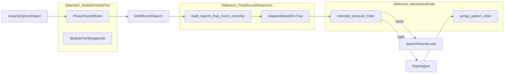
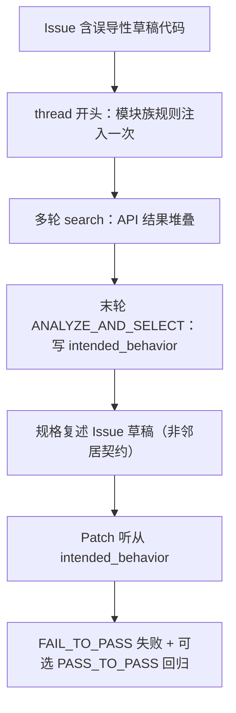
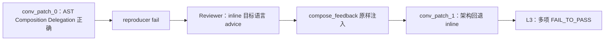
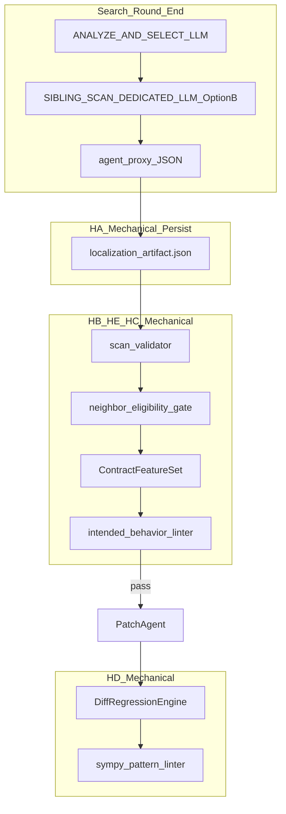
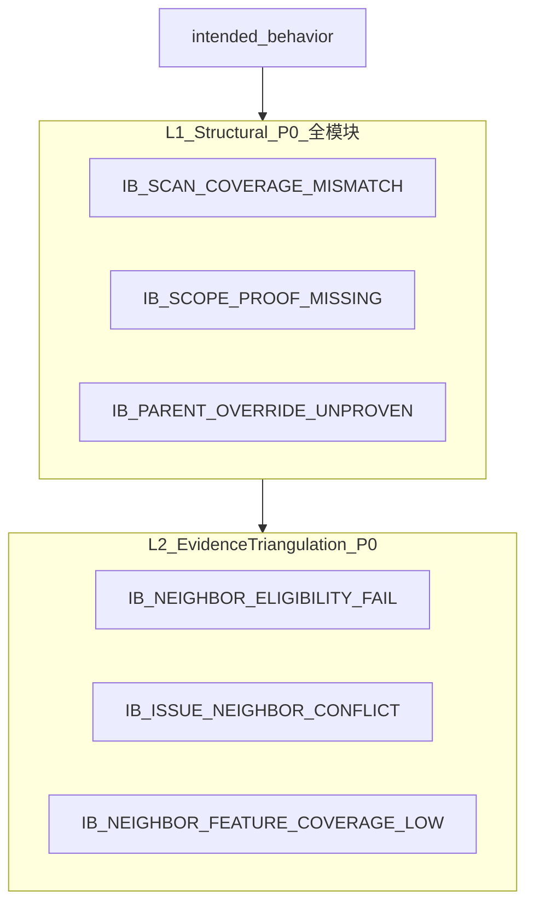
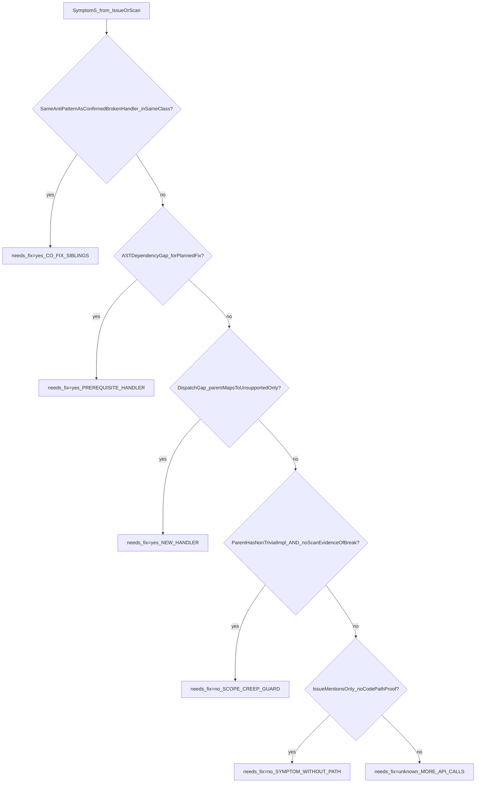
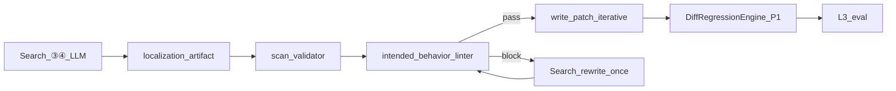

# SymPy 库自适应语义注入与机械校验流水线（Pipeline）泛化重构方案

> **目标**：解决 C 类「局部修对、全局契约失败」及「规则已注入但行为不变」失败，避免语义规则在多轮 search / patch feedback 中被淹没。  
> **设计原则**：Prompt、规则与 Linter 均使用 **Bug Class / Anti-Pattern / 模块族** 表述；**禁止**在规则条件中写具体 instance ID、具体 handler 名或具体类名。  
> **适用**：SymPy ver1 pipeline（全量 **77** 题）；其他 repo 可复用架构，替换模块附录即可。  
> **状态**：**已落地 v2.2（代码实现）**——P0+P1+P2 已写入 pipeline；门控 `config.enable_sympy_pipeline_v2`（环境变量 `ACR_SYMPY_PIPELINE_V2=0` 可关闭）。契约特征仍为 v1 五字段规格，待 lite300 标定后评估插件化。  
> **关联代码（计划改动）**：`app/knowledge/sympy_semantic_rules.py`、`app/knowledge/semantic_injection.py`、`app/knowledge/contract_features.py`（新建）、`app/knowledge/scan_validator.py`（新建）、`app/knowledge/intended_behavior_linter.py`（新建）、`app/knowledge/sympy_pattern_linter.py`（新建）、`app/agents/agent_search.py`、`app/agents/agent_proxy.py`、`app/agents/agent_write_patch.py`、`app/agents/agent_reviewer.py`、`app/agents/agent_reproducer.py`、`app/api/review_manage.py`、`app/api/validation.py`（复用）、`app/search/search_manage.py`、`app/search/search_backend.py`、`app/data_structures.py`

---

## 泛化设计原则说明

### 通俗导读：优化思路一览

SymPy 修复失败，往往不是 Agent「不会写代码」，而是 **在错误时机相信了错误规格**。Issue 里的草稿代码、多轮检索堆叠的上下文、以及 Reproducer 的窄通过标准，会把 Agent 从「读仓库邻居契约」拉向「复述症状」。本方案用三道防线打断这条链：

1. **模块族先验知识**：在 Search/Patch 开头按 `sympy/printing`、`sympy/matrices` 等模块族注入抽象规则与附录，让 Agent 先建立「这类模块通常怎么修」的框架，而不是逐题记症状。
2. **状态机末轮强化**：在每一轮 `ANALYZE_AND_SELECT` 决策前，用 ≤15 行的短 Checklist 重复可执行约束，对抗多轮上下文淹没（BC-RULE-DROWNED）。
3. **机械门禁拦截（三层）**：L1 结构性一致性（scan 表 ↔ bug_locations，全模块 P0）→ L2 证据三角（Issue / 合格邻居 / scan 交叉验证，冲突才 block）→ L3 diff 架构回归（Patch / Feedback，P1）。**block 仅用确定性机械检查，不用 LLM 作唯一门卫。**

**一句话**：先按模块族想清楚修什么层、修哪些兄弟方法，末轮再核对一遍，最后用机器门禁拦住「表格自相矛盾」和「Issue 与已验证邻居打架」的规格——**不盲信 Issue，也不盲信邻居**；全程不依赖 hidden test 答案。

### 评审用技术阐述

本方案的泛化力不来自记忆具体题目，而来自三类可复用信号：

- **AST 拓扑检查**：dispatch handler 是否存在、父类是否已有 Non-Trivial Implementation、计划修复是否依赖未实现的 Prerequisite Handler。
- **同族兄弟 Sibling Scan**：在同一 class 内枚举共享 `anti_pattern_id` 的 handler，自动区分 **CO_FIX（齐修）** 与 **SCOPE_CREEP（范围蔓延）**。
- **证据三角（Issue × 合格邻居 × scan）**：Issue 是重要线索源，非默认错误；仅当 `intended_behavior` 与**资格校验通过的** Semantic Sibling / 父类契约**冲突**时才 block。契约特征从合格邻居源码自动抽取，**禁止**从无关方法套模板。



---

## 0. 问题定义与优化目标

### 0.1 目标失败模式（Bug Class）

| Bug Class ID | 描述 | 典型表现 | 典型模块族 / Anti-Pattern ID |
|--------------|------|----------|------------------------------|
| **BC-INCOMPLETE-SIBLING** | Issue 只点名一处，同 class 存在相同 anti-pattern 的兄弟 handler 未修 | L2 可应用，L3 部分 FAIL_TO_PASS 失败 | `sympy/matrices` · `AP-MATRIX-SYMMETRIC-SIBLING-OMIT` |
| **BC-ISSUE-TUNNEL** | Agent 以 Issue reproducer 通过为完成标准 | Reviewer 批准，SWE-bench 仍 fail | 全模块 · reproducer 验收过窄 |
| **BC-RULE-DROWNED** | 语义规则在 thread **开头注入一次**，末轮决策时被 Issue/检索结果覆盖 | 规则 metadata 存在，行为与 baseline 相同 | 全模块 · 多轮 search 后规格漂移 |
| **BC-ISSUE-DRAFT-ANCHOR** | Reporter 内嵌草稿被写入 `intended_behavior` 并当作 Patch 硬规格 | `intended_behavior` 复述 Issue API（Alternate Join API、粗暴字符串替换） | `sympy/printing` · `AP-PRINT-WRAPPER-JOIN-MISMATCH` |
| **BC-INTENDED-BEHAVIOR-POISON** | Search 阶段规格错误，Patch 阶段无法纠正 | 检索已见邻居契约，规格仍与合格邻居冲突 | `sympy/printing` · `IB_ISSUE_NEIGHBOR_CONFLICT` |
| **BC-ARCHITECTURE-ROLLBACK** | Reproducer fail → Reviewer patch-advice → feedback 原样注入 → Agent 放弃正确架构 | conv_patch_0 委托正确 → conv_patch_1 回退 inline | `sympy/printing` · `AP-PRINT-INLINE-BYPASS-DELEGATION` |
| **BC-SCOPE-CREEP** | Issue 多症状，Agent 实现 scan 未证明的子问题并 override 父类 | PASS_TO_PASS 回归 | 全模块 · Parent Inheritance Path 误判 |
| **BC-WRONG-ABSTRACTION-LAYER** | 在错误抽象层打补丁 | RecursionError 或格式仍错 | `sympy/printing` · `AP-PRINT-LAYER-CONFUSION` |

**关键澄清（审阅结论）**：

- ver1 **已在 Localization（search）阶段注入全部三条旧规则**（见 `agent_search.py` L110–116、`semantic_injection_ver1.json`）。
- 典型 Localization 失败**不是因为**「规则未注入」，而是 **注入形态为开头长文软启发 + 无 `intended_behavior` 约束 + 无末轮强化**，末轮规格仍被 Issue 草稿锚定。
- 本方案重点不是「再把规则抄进 localization」，而是 **改写规则、末轮再注入、结构化 `intended_behavior`、机械校验**。

#### Chain-A：Localization Spec Poison（泛化失败链）



#### Chain-B：Reviewer Feedback Amplification（泛化失败链）



### 0.2 优化成功标准

对任一 SymPy C 类 unresolved instance，优化后应观察到：

1. **Localization**：`intended_behavior` 与**邻居 handler return 契约**一致（printing：Outer Wrapper Contract、Primary Join API）；**不**复述 Issue 草稿 API。
   - **New Handler Path**：`needs_fix=yes` 仅覆盖缺失/破损的 **Printing Operator Node Handler** 或等价 dispatch gap。
   - **Parent Inheritance Path**：对 **Existing Non-Trivial Parent Implementation** 必须为 `needs_fix=no`，且 `intended_behavior` 写明继承策略。
2. **Sibling scan**：区分「同 `anti_pattern_id` 兄弟须齐修」（CO_FIX）与「Issue 提及但 scan 证明无需 override 父类」（SCOPE_CREEP → `needs_fix=no`）。
3. **Patch**：diff 覆盖 bug class 全部 `needs_fix=yes` 位置；或 Reviewer 判 `incomplete` 并打回。
4. **Reviewer**（有 reproducer 时）：不出现 reproducer 过即 `yes` 而 L3 仍 fail；不出现委托回退 advice 被 feedback 放大。
5. **No-Reproducer 路径**（多数 C 类题）：Localization 规格正确 + optional L2 validation / intended_behavior linter 拦截，**不依赖** Reviewer。

### 0.3 预期效果（修订估测，基于 ver1 62 题 L3 / 23 resolved）

| 优化包 | 预期 L3 增量 | 主要受益 Bug Class × 模块族 |
|--------|--------------|----------------------------|
| **P0 Localization**：末轮 checklist + `LOCALIZATION_INTENDED_BEHAVIOR_CONTRACT` + intended_behavior linter | **+2～4** | BC-ISSUE-DRAFT-ANCHOR、BC-INTENDED-BEHAVIOR-POISON · `sympy/printing` |
| P0 规则 phase 路由 + scope 证明 + Reviewer incomplete + §4.5 护栏 | +2～4 | BC-ARCHITECTURE-ROLLBACK、BC-INCOMPLETE-SIBLING · printing / matrices |
| P1 Pattern linter（patch 侧） | +1～2 | AP-PRINT-INLINE-BYPASS-DELEGATION、AP-MATRIX-DIM-UNCLAMPED |
| P1 Reproducer printing sniff（仅 reproducer 可用题） | +0～2 | BC-ISSUE-TUNNEL · printing（对 No-Reproducer 路径无直接帮助） |
| **合计（务实）** | **+4～8 / 62** | 非乐观 +10 |

**附录覆盖缺口（诚实估测）**：

| 范围 | 说明 |
|------|------|
| **L1 结构性 linter** | 覆盖全部 77 题（与模块族无关） |
| **L2 契约抽取 + MODULE_PATTERN_SCAN 附录** | 当前种子覆盖 printing（C 类未 resolved 约 14/32）、matrices（约 4/32）、combinatorics；`solvers`/`physics`/`integrals` 等约 12 题主要靠 L1 + 决策树，边际收益有限 |
| **扩展路径** | 按同样范式追加模块族特征抽取器（非 case 硬编码）；见 §2.3.0、§10 |

**按 Bug Class × 模块族受益矩阵**：

| Bug Class | 模块族 | 主要依赖模块 | 受益条件 |
|-----------|--------|--------------|----------|
| BC-INTENDED-BEHAVIOR-POISON | printing | §2 P0 三角 | checklist + linter 落地 |
| BC-ISSUE-DRAFT-ANCHOR | printing | §1.3 + §2.3 | 邻居契约规则 + Schema 阻断 |
| BC-SCOPE-CREEP | 全模块 | §2.4 决策树 | Parent Inheritance Path 判定 |
| BC-INCOMPLETE-SIBLING | matrices | §2.1 scan + Reviewer | CO_FIX 齐修 |
| BC-ARCHITECTURE-ROLLBACK | printing | §4.5 护栏 | reproduce_and_review 路径 |
| BC-WRONG-ABSTRACTION-LAYER | printing | §1.5 分层附录 | Policy Layer vs Formatting Layer |

### 0.4 审阅结论摘要（相对初稿 v1.1 的修正）

| 审阅项 | 初稿问题 | 本版修正 |
|--------|----------|----------|
| Localization | 仅改 `ANALYZE_AND_SELECT` + sibling scan | **新增**末轮语义再注入、`intended_behavior` 专用规则、机械校验门禁 |
| Printing 契约类失败 | 列为不受益 | 列为 **Localization P0 代表性模式**；仅重复现有三条规则注入 **无效**（ver1 已证） |
| Sibling scan | 凡 needs_fix 必报 location | **新增 scope 证明**：父类已有 Non-Trivial Implementation + scan 无破损证据 → 不得 needs_fix |
| 规则冲突 | 部分消解 | 明确 **CO_FIX** vs **SCOPE_CREEP** 自适应决策树 |
| Reproducer | P0 并列 | 降为 **条件路径**；No-Reproducer 题走模块二 + L2 validation |
| meta.json | 未提及 | pipeline 已复制 `meta.json`；**可选**注入 `FAIL_TO_PASS` **测试名列表**（非 assert 全文） |

### 0.5 五个实施隐患与工程解法（v2.2 新增）

方案 v2.1 在规则与 linter 语义上已泛化，但对照**当前 pipeline 代码**（`agent_search.py` 每轮 3 次 LLM + `agent_proxy` 抽 JSON；`search_manage.py` 仅持久化 `bug_locations`）仍存在五条**落地阻断隐患**。本节给出与仓库已有 AST/diff/索引能力挂钩的工程解法；**LLM 负责填表与写规格，机械校验负责 block**。

| 隐患 ID | 问题摘要 | 核心解法 | 主要复用代码 | 文档落点 |
|---------|----------|----------|--------------|----------|
| **HA** | `sibling_scan` 无数据通路，Patch/Linter 读不到 scan 表 | **持久化 `localization_artifact.json`** + Proxy schema 扩展 + Patch/Linter 统一读取；scan **生成**采用同 thread **第二次 LLM**（方案 B，不替代持久化） | `search_manage.py`、`agent_proxy.py`、`agent_write_patch.py` | §2.1.1–2.1.2 |
| **HB** | scan 表纯 LLM 填写，垃圾进垃圾出 | `scan_validator.py`：存在性校验 + `evidence_snippet` 子串核对 + 可选 AST 半自动补全建议 | `SearchBackend.class_func_index`、`search_utils.get_code_snippets` | §2.3.6 |
| **HC** | `contracts()` 未定义，L2 冲突检测不可执行 | `contract_features.py`：`ContractFeatureSet` AST 抽取（**v1 规格先行测试**，暂不插件化） | `validation.MethodDefCollector`、`ast.unparse` | §2.3.5 |
| **HD** | No-Reproducer 单轮 patch 无 `conv_patch_{n-1}`，L3 回归失效 | `DiffRegressionEngine`：首轮 **diff vs scan + vs IB/邻居特征**；多轮保留相邻 diff 对比 | `validation.get_changed_methods`、`unidiff.PatchSet` | §3.3.1、§6.3 |
| **HE** | 邻居资格难全自动，无关邻居套模板风险 | **硬规则 gate**（存在性/同 class/修复路径）+ LLM 软字段 `neighbor_eligibility`（仅 warn）+ `suggest_semantic_siblings()` | `_get_inherited_methods`、`class_relation_index` | §2.3.7 |



**分工原则（全文统一）**：

| 环节 | LLM | 机械 |
|------|-----|------|
| scan 表 / `intended_behavior` / patch diff | ✅ 生成 | — |
| JSON schema / artifact 读写 / diff touch | — | ✅ |
| L1/L2/L3 **block** | — | ✅（LLM 仅 P2 可选 warn，不作唯一门卫） |
| `neighbor_eligibility` 自然语言 | ✅ 填写 | 硬规则 gate；与硬规则矛盾仅 **warn** |

**实施顺序（依赖关系）**：HA（artifact 通路）→ HC（契约特征）+ HE（邻居 gate）→ HB（scan 校验）→ IBL L1/L2 → HD（Pattern Linter / Feedback 共用 `DiffRegressionEngine`）。

---

## 1. 模块一：语义规则重写（`sympy_semantic_rules.py`）

### 1.1 现状问题

- 三条规则全文、全 phase 注入；`select_sympy_rules(phase=...)` **未使用** `phase`。
- `ISSUE_SKEPTICISM` 与 `SIBLING_AUDIT` 冲突 → Agent 误读为「Issue 提到的 handler 都要补」（SCOPE_CREEP）。
- 规则措辞面向 **patch**（*"Before writing any patch"*），Search 写 `intended_behavior` 时约束弱。
- 缺 **printing 邻居契约**（Outer Wrapper、Primary vs Alternate Join API）与 **委托/依赖** 规则。
- 仅 thread **开头**注入一次 → 多轮 search 后 **BC-RULE-DROWNED**。

### 1.2 规则集（6 条 + phase 路由）

| 规则名 | phase | 职责 |
|--------|-------|------|
| `ISSUE_SCOPE_AND_COMPLETENESS` | search, patch, review, reproducer | Issue≠完整 spec；scope 证明后才加 handler |
| `LOCALIZATION_INTENDED_BEHAVIOR_CONTRACT` | **search only** | 约束 `intended_behavior` 字段；邻居契约优先 |
| `MODULE_PATTERN_SCAN` | search, patch | anti-pattern 扫描表；**非** Issue 症状清单 |
| `MINIMAL_COMPLETE_PATCH` | patch, review | 齐修 bug class vs 最小 diff 的平衡 |
| `REVIEWER_COMPLETENESS_GATE` | review only | incomplete 门禁 |
| `PRINTING_DELEGATION_AND_DEPENDENCY` | patch, review, reproducer（printing 路径） | 委托 vs inline；Dispatch Dependency Prerequisite |

```python
def select_sympy_rules(*, file_paths=None, issue_text="", phase="patch"):
    """Route rules by pipeline phase and detected module family."""
    printing = any("printing" in p.replace("\\", "/") for p in (file_paths or []))
    if phase == "search":
        rules = [
            ISSUE_SCOPE_AND_COMPLETENESS,
            LOCALIZATION_INTENDED_BEHAVIOR_CONTRACT,
            MODULE_PATTERN_SCAN,
        ]
    elif phase == "patch":
        rules = [ISSUE_SCOPE_AND_COMPLETENESS, MODULE_PATTERN_SCAN, MINIMAL_COMPLETE_PATCH]
    elif phase == "review":
        rules = [ISSUE_SCOPE_AND_COMPLETENESS, REVIEWER_COMPLETENESS_GATE]
    elif phase == "reproducer":
        rules = [ISSUE_SCOPE_AND_COMPLETENESS]
    else:
        rules = list(ALL_SYMPY_RULES)
    if printing and phase in ("search", "patch", "review", "reproducer"):
        if phase == "search":
            pass  # 邻居契约已在 LOCALIZATION_INTENDED_BEHAVIOR_CONTRACT
        else:
            rules.append(PRINTING_DELEGATION_AND_DEPENDENCY)
    return rules
```

### 1.3 新增 `LOCALIZATION_INTENDED_BEHAVIOR_CONTRACT`（**P0**）

```text
[LOCALIZATION_INTENDED_BEHAVIOR_CONTRACT]

Applies when writing bug_locations[].intended_behavior (NOT when writing patch code).

MANDATORY — Neighbor Contract Extraction:
Before finalizing intended_behavior for a NEW or OVERRIDE dispatch handler:
1. Identify the nearest Semantic Sibling Reference Handler in the SAME class (same operator family).
2. Quote its return-structure: Outer Wrapper Contract, Primary Join API, Alternate Join API, Bracket Policy.
3. intended_behavior MUST specify the SAME contracts as the sibling source — NOT Issue draft code.

REQUIRED metadata per bug_location:
- spec_source: issue_example | neighbor_contract | scan_inferred | mixed
- spec_rationale: one sentence explaining why this source was chosen
- neighbor_reference: required when spec_source involves neighbor_contract
- neighbor_eligibility: why this handler is a semantic sibling / parent (same class, category, layer, anti_pattern family)

FORBIDDEN in intended_behavior:
- Following Issue example when it CONFLICTS with an eligible neighbor/parent contract (see §2.3.3 证据三角 + §2.3.5 `contracts_conflict`).
- Claiming "follow sibling" while specifying contracts that contradict eligible sibling source.
- Adding a bug location to override an Existing Non-Trivial Parent Handler
  UNLESS sibling scan documents proven broken behavior with scope_proof.

NOTE: Following Issue example is ALLOWED when Issue aligns with eligible neighbor OR when no eligible neighbor exists and scan_inferred/issue_example is documented in spec_rationale.

PRINTING appendix — Handler Category taxonomy:
- Operator Node Handlers (integrate/sum/derivative-like families):
  mirror sibling Outer Wrapper + Primary Join API when any semantic sibling uses them.
- Function Argument Handlers:
  Alternate Join API acceptable ONLY when sibling handlers for functions consistently use it.
- Numeric Literal / Parent-Inherited Handlers:
  if parent provides Non-Trivial Implementation (precision logic, special-case branches),
  default intended_behavior = "inherit parent; needs_fix=no" unless scan proves break.
```

### 1.4 重写 `ISSUE_SCOPE_AND_COMPLETENESS`

```text
[ISSUE_SCOPE_AND_COMPLETENESS]

- Issue = symptom report; Reporter code blocks = drafts to VERIFY, not implement.
- Add a new handler/location ONLY when sibling scan or AST dependency chain proves needs_fix=yes.
- Issue listing multiple symptoms ≠ all symptoms need code changes in this patch.
  Second symptom without executable repro / without failing behavior in scan → needs_fix=no.
- Do NOT skip a sibling with the SAME anti_pattern_id as an already-identified fix (CO_FIX).
- Do NOT add handlers merely because Issue mentions them (SCOPE_CREEP guard).
```

**删除**无条件 *「only one broken → do not fix other Issue sub-problems」*；改为 **scan 证明** 决策树（见 §2.4）。

### 1.5 重写 `MODULE_PATTERN_SCAN`

```text
[MODULE_PATTERN_SCAN]

Purpose: find SAME anti-pattern across siblings — NOT list every Issue-mentioned symptom.

=== Scan table (required before bug_locations in final search round) ===
| method_or_handler | anti_pattern_id | safe? | needs_fix? | scope_proof |

needs_fix=yes ONLY IF:
  (A) Same anti_pattern_id as a confirmed broken handler in this class/file (CO_FIX), OR
  (B) AST dependency gap — planned fix requires Dispatch Dependency Prerequisite, OR
  (C) Missing dispatch override where parent maps type to unsupported-only handler.

needs_fix=no IF:
  (D) Parent provides Existing Non-Trivial Parent Implementation AND scan shows no
      broken behavior in retrieved context (Parent Inheritance Path), OR
  (E) Issue mentions symptom but no code path in scan proves override needed.

=== Anti-Pattern ID registry (module-family level) ===
- AP-PRINT-WRAPPER-JOIN-MISMATCH
- AP-PRINT-INLINE-BYPASS-DELEGATION
- AP-PRINT-LAYER-CONFUSION
- AP-MATRIX-DIM-UNCLAMPED
- AP-MATRIX-SYMMETRIC-SIBLING-OMIT
- AP-COMB-GUARD-CORE-CONFLATION
- AP-DISPATCH-MISSING-PREREQUISITE

=== Module appendix: printing ===
- Layer split: Precedence/Bracket Policy Layer vs Formatting Handler Layer.
- Operator Node family: check Outer Wrapper + Primary Join API across semantic siblings.
- Delegation: prefer AST Composition Delegation Target + self._print over inline target-language strings.

=== Module appendix: matrices ===
- Loop bound vs self.cols/self.rows; Symmetric Property Sibling families (upper/lower/hessenberg).

=== Module appendix: combinatorics / core ===
- Guard layer vs core composition layer separation.
```

### 1.6 `MINIMAL_COMPLETE_PATCH`

```text
[MINIMAL_COMPLETE_PATCH]

- Fix the entire bug CLASS (all scan needs_fix=yes rows), not Issue bullet list length.
- Smallest diff that achieves completeness — omit scan-marked-safe locations.
- Override Existing Non-Trivial Parent Handler only when scan scope_proof is documented.
- Prefer one delegation path over multiple inline string templates.
```

### 1.7 `REVIEWER_COMPLETENESS_GATE`

```text
[REVIEWER_COMPLETENESS_GATE]

Applies when reproduce_and_review is enabled and a reproducer result exists.

- Do NOT approve when patch fixes only the reproducer-narrow symptom but scan table
  shows additional needs_fix=yes siblings with the same anti_pattern_id.
- Decision INCOMPLETE when: sibling CO_FIX rows uncovered, Dispatch Dependency Prerequisite
  missing, or patch reverts from delegation to inline target-language strings.
- Reproducer pass is necessary but NOT sufficient for approval when hidden suite may cover
  broader bug class (BC-ISSUE-TUNNEL guard).
```

### 1.8 `PRINTING_DELEGATION_AND_DEPENDENCY`

```text
[PRINTING_DELEGATION_AND_DEPENDENCY]

- Prefer AST Composition Delegation Target (build internal AST subtree, route via self._print)
  over inline target-language string templates.
- When a planned fix uses conditional rendering, check whether Dispatch Dependency Prerequisite
  handlers exist; add them in the same patch if scan marks needs_fix=yes.
- Do NOT replace delegation chains with inline ternary strings when neighbors use compose+print.
- Trace mutual recursion risk before adding peer handler cross-calls.
```

### 1.9 `semantic_injection.py` 扩展

- 新增 `build_search_final_round_checklist()`：短文案，在 search 每轮 `ANALYZE_AND_SELECT` 前注入（见 §2.2）。
- 支持 `module_families_detected` 动态裁剪（printing / matrices / combinatorics）。
- `phase=review|reproducer` 注入（当前未实现）。
- **可选 P1**：从 `output_dir/meta.json` 读取 `FAIL_TO_PASS` **测试名列表**（非 assert 全文）注入 search/patch，辅助 scope 判断。

### 1.10 测试

- `test_semantic_injection.py`：phase 路由；search 含 `LOCALIZATION_INTENDED_BEHAVIOR_CONTRACT`；printing search 不含 `PRINTING_DELEGATION`（避免重复）。
- `test_intended_behavior_linter.py`：Schema 规则触发与 block/rewrite 路径。

---

## 2. 模块二：Localization / Search（本方案核心）

### 2.1 现状问题（含 ver1 已注入仍失败的原因）

| 问题 | 代码/证据 |
|------|-----------|
| 规则仅在 thread **开头**注入一次 | `agent_search.py` L110–116；`semantic_injection_ver1.json` 存在仍 fail |
| 每轮 Search **3 次 LLM**，Proxy 再抽 JSON；**无** `sibling_scan` 字段 | `agent_search.py` L137–183；`agent_proxy.py` L38–41 仅 `API_calls` + `bug_locations` |
| `ANALYZE_AND_SELECT` 写 *「Only necessary locations」* | 与 sibling 齐修冲突；与「多 location」也冲突——语义混乱 |
| `intended_behavior` 无 schema，后端原样传递 | `search_backend.py` L768–867；`BugLocation.to_dict()` 无 `spec_source` 等 |
| 末轮无规则 **再强化** | 末轮输出仍复述 Issue 草稿 |
| 无机械校验 | 错误规格直达 Patch Agent |
| scan 表未持久化，Patch/Linter 不可见 | `search_manage.py` L97–145 仅写 `bug_locations_*.json`（**HA**） |
| 轮次耗尽返回 `[]` | `search_manage.py` L197–200 |

#### 2.1.1 `sibling_scan` 生成策略：同 thread 第二次 LLM（方案 B，**P0**）

**决策**：`sibling_scan` **不与** `bug_locations` 挤在同一次 `ANALYZE_AND_SELECT` 输出中，而在同 thread、同轮末尾**追加专用 LLM 调用**，降低「一次生成过多字段」导致的遗漏与幻觉（**HB** 的前置缓解）。

**挂接位置**：[`app/agents/agent_search.py`](app/agents/agent_search.py)，在现有第 ③ 步 `ANALYZE_AND_SELECT`（L180–183）**之后**、向 `search_manage` yield 之前。

| 步骤 | 调用 | 输入上下文 | 输出（自然语言） |
|------|------|------------|------------------|
| ③（现有） | `ANALYZE_AND_SELECT` | 检索结果 + 末轮 checklist | 是否继续搜 + `bug_locations` + `spec_*` 字段 |
| ④（**新增**） | `SIBLING_SCAN_PROMPT` | **同 thread** 已含 ③ 结论与检索上下文 | **仅** MODULE_PATTERN_SCAN 表 + `scope_proof` |

**`SIBLING_SCAN_PROMPT` 要点**（写入 `agent_search.py` 或 `semantic_injection.py`）：

```text
You have already decided bug_locations. Now fill ONLY the sibling scan table per MODULE_PATTERN_SCAN.
Do NOT change bug_locations. Apply needs_fix decision tree (§2.4).
Output markdown table: method_or_handler | anti_pattern_id | safe | needs_fix | scope_proof | evidence_snippet
```

**Proxy 抽取**：[`app/agents/agent_proxy.py`](app/agents/agent_proxy.py) 对 ③④ 回复**分两次**调用 `run_with_retries`（或一次合并 prompt 要求两段 JSON），合并为单一 JSON（§2.5 schema）。**结构校验为机械**；表格内容为 **LLM**。

**与 HA 关系**：方案 B 解决「**怎么生成**」；`localization_artifact.json` 解决「**生成后谁读**」——**二者均必需**，不可只做 B。

#### 2.1.2 Localization Artifact 数据通路（隐患 **HA**，**P0**）

**目标**：Search 成功轮次的完整定位 JSON 对 Patch、`intended_behavior_linter`、`sympy_pattern_linter`、`review_manage` **只读同一份 artifact**。

**Step 1 — 扩展 Proxy schema**（[`agent_proxy.py`](app/agents/agent_proxy.py)）

- `PROXY_PROMPT`（L16–41）：增加 `sibling_scan` 与 `bug_locations` 扩展字段（§2.5）。
- `is_valid_response()`（L90+）：`bug_locations` 非空 ⇒ 必须有非空 `sibling_scan`；每行含 `method_or_handler`、`needs_fix`；`needs_fix=no` 且 Issue 提及 ⇒ 需 `scope_proof`。

**Step 2 — 持久化 artifact**（[`search_manage.py`](app/search/search_manage.py) L97–151）

在解析 `selected_apis_json` 后、进入 `get_bug_loc_snippets_new` 之前写入：

```text
{output_dir}/search/localization_artifact.json
```

```json
{
  "round": 3,
  "sibling_scan": [...],
  "bug_locations_raw": [...],
  "module_families_detected": ["printing"],
  "checklist_injected": true
}
```

优先取当轮 `agent_proxy_{round}.json` 已解析的 dict，避免重复 LLM。现有 `search_round_{n}.json`、`agent_proxy_{n}.json`（L71–84）保留作调试轨迹。

**Step 3 — 扩展定位上下文对象**（[`data_structures.py`](app/data_structures.py)）

- **推荐**：新增 `LocalizationContext`（`sibling_scan` + `bug_locations` + `spec` 字段），由 `inference.py` / `search_manage` 返回给 Patch。
- **轻量备选**：`BugLocation` 增加 `spec_source`、`neighbor_reference` 等；`search_manage` 从 raw dict 灌入。

**Step 4 — 下游读取**（机械）

| 消费者 | 读取方式 |
|--------|----------|
| `intended_behavior_linter` | `localization_artifact.json` + `bug_locations_after_process.json` |
| `sympy_pattern_linter` / `DiffRegressionEngine` | artifact + `extracted_patch_*.diff` |
| `review_manage` §4.5 | artifact + `conv_patch_{n-1}`（若存在） |
| `PatchAgent` | artifact 注入 prompt（scan 表摘要，非全文规则重复） |

```text
Search(③④) → agent_proxy → localization_artifact.json → IBL → Patch → DiffRegressionEngine → L3
```

### 2.2 末轮语义再注入（P0，对抗 BC-RULE-DROWNED）

#### Step 2.1 — 修改 `ANALYZE_AND_SELECT_PROMPT`（替换「Only necessary」歧义表述）

```text
1. More context? → API_calls or EMPTY.

2. Sibling Pattern Scan (MANDATORY before bug_locations):
   Fill scan table per MODULE_PATTERN_SCAN.
   Apply needs_fix decision tree (§2.4).

3. bug_locations:
   - One entry per needs_fix=yes row ONLY.
   - Each intended_behavior MUST satisfy LOCALIZATION_INTENDED_BEHAVIOR_CONTRACT.
   - If any needs_fix=yes, bug_locations MUST NOT be empty.
   - If more context needed: API_calls non-empty, bug_locations EMPTY, but scan table still required.
```

#### Step 2.2 — `build_search_final_round_checklist`（P0）

**文件**：`semantic_injection.py`（生成）+ `agent_search.py`（挂接，在 `msg_thread.add_user(analyze_and_select_prompt)` **之前**）

```python
final_checklist = build_search_final_round_checklist(
    task,
    bug_loc_paths=...,
    module_families_detected=...,  # from file_paths / issue heuristics
)
if final_checklist:
    msg_thread.add_user(final_checklist)
msg_thread.add_user(analyze_and_select_prompt)
```

**完整 Checklist 文本（方法论级，适用全部 77 题）**：

```text
=== Final Localization Checklist (authoritative over Issue draft) ===

A. Module & Layer
□ Identified owning module family (printing/matrices/combinatorics/core/...)?
□ Fix layer = dispatch / policy / formatting / guard — not misaligned?

B. Sibling Scan (MODULE_PATTERN_SCAN table complete)
□ Every same-class handler with shared anti_pattern_id marked needs_fix=yes?
□ Issue-mentioned but scan-unproven symptoms marked needs_fix=no with scope_proof?

C. Neighbor Contract (for NEW or OVERRIDE handlers)
□ neighbor_reference passes eligibility (semantic sibling / parent, same category + layer)?
□ Quoted eligible reference: outer wrapper + join API + bracket policy (if applicable)?
□ spec_source + spec_rationale filled? If issue_example: Issue aligns with neighbor OR no eligible neighbor?

D. Parent Inheritance Guard
□ Parent Non-Trivial Implementation → default needs_fix=no unless scope_proof documents break?

E. bug_locations Emission
□ One entry per needs_fix=yes only; empty if more context needed but scan table still filled?
□ neighbor_reference field set when module_family=printing?
```

**动态裁剪逻辑**（`build_search_final_round_checklist` 实现规格）：

| 条件 | 注入行为 |
|------|----------|
| 始终 | A、B、E 全文 |
| `printing` ∈ families | C 全文；E 追加 `neighbor_reference` 必填提示 |
| `matrices` ∈ families | B 追加一行：「Symmetric Property Siblings share dimension-clamp anti-pattern — CO_FIX if same AP-*」 |
| `combinatorics` ∈ families | D 追加一行：「Guard-only fix vs core rewrite — prefer guard narrowing when scan proves downstream OK」 |

**说明**：全文规则保留在 thread 开头；末轮 checklist **重复关键可执行项**，对抗多轮淹没，而非再贴 500 字 prose。

### 2.3 `intended_behavior` 机械校验门禁（P0）

**文件**：新建 `app/knowledge/intended_behavior_linter.py`；挂接 `search_manage.py` 在 `get_bug_loc_snippets_new` **之后**、返回 Patch 之前。

**设计原则（修订）**：

- **不盲信 Issue，也不盲杀 Issue**：Issue 是重要信息源；仅当 Issue 与**合格参照源码**冲突时才 block。
- **不从未知邻居套模板**：契约抽取仅对**资格校验通过**的 semantic sibling / 父类 handler 执行。
- **block 必须机械、可复现**；LLM 仅可作 warn 升级（P2 可选），不作唯一 block 手段。

#### 2.3.0 三层门禁架构



| 层级 | 职责 | 模块依赖 |
|------|------|----------|
| **L1 结构性** | scan 表 ↔ bug_locations 自洽；scope_proof；父类 override 证据 | 无（全 77 题） |
| **L2 证据三角** | 合格邻居资格 → 特征覆盖；Issue 仅在与邻居**冲突**时触发 block | 需 `neighbor_reference` 合格或显式 `spec_source` |
| **L3 diff 回归** | Patch / Feedback 架构倒退（见 §3.3、§4.5、§6） | P1 |

#### 2.3.1 Linter Rule Schema Dictionary

**顶层 Schema 规格**：

```python
LINTER_RULE = {
    "rule_id": str,
    "layer": "L1_structural" | "L2_evidence" | "L3_regression",
    "module_family": str,        # "printing" | "matrices" | ... | "*"
    "trigger": {
        "requires_scan_table": bool,
        "requires_eligible_neighbor": bool,
        "requires_issue_text": bool,
    },
    "signals": {
        "structural_predicate": str | None,   # e.g. scan_row_missing_in_locations
        "conflict_predicate": str | None,   # issue_vs_neighbor_contract_conflict
        "feature_coverage_min": float | None,
    },
    "severity": "warn" | "block",
    "remediation": str,
}
```

#### 2.3.2 L1 结构性规则（P0，全模块）

| rule_id | 检测逻辑 | severity | 说明 |
|---------|----------|----------|------|
| `IB_SCAN_COVERAGE_MISMATCH` | `sibling_scan` 中每个 `needs_fix=yes` 必须在 `bug_locations` 有对应项 | block | 齐修完整性；替代 case 级 `IB_DIMENSION_CLAMP_OMIT` |
| `IB_SCAN_EMPTY_WITH_LOCATIONS` | `bug_locations` 非空但无 `sibling_scan` | block | 强制先扫后报 |
| `IB_SCOPE_PROOF_MISSING` | `needs_fix=no` 且 Issue 提及该症状 → 缺 `scope_proof` | block | SCOPE_CREEP 守卫 |
| `IB_PARENT_OVERRIDE_UNPROVEN` | 建议 override 父类 handler；父类 AST 体复杂度 > 阈值且无 `scope_proof` | block | 不靠具体类名；用 Non-Trivial 启发 |

#### 2.3.3 L2 证据三角与邻居资格（P0）

**邻居资格校验**（`IB_NEIGHBOR_ELIGIBILITY_FAIL`，warn→block）——参照对象必须满足：

| 条件 | 要求 |
|------|------|
| 同 class | `neighbor_reference` 与目标 handler 在同一类 |
| 同 handler_category | operator_node / property_eval / guard 等一致 |
| 同抽象层 | dispatch / policy / formatting / guard 层对齐 |
| 与修复路径匹配 | NEW_HANDLER→同族兄弟；CO_FIX→同 anti_pattern 兄弟；Parent Inheritance→**父类**方法；PREREQUISITE→依赖链 handler |
| scan 有据 | `sibling_scan` 或 `neighbor_eligibility` 字段有依据 |

**不合格时**：跳过契约特征抽取与模板 fallback；允许 `spec_source=issue_example|scan_inferred` + `spec_rationale`（warn，不 block）。

**证据三角 block 规则**：

| rule_id | 触发条件 | severity | 说明 |
|---------|----------|----------|------|
| `IB_ISSUE_NEIGHBOR_CONFLICT` | `sim(IB, Issue)` 高 **且** 合格邻居存在 **且** `contracts_conflict(issue_fs, neighbor_fs, ib_fs)`（§2.3.5） | block | **替代** `IB_VERBATIM_ISSUE_CODE`（单独像 Issue 就拦） |
| — pass path — | `sim(IB, Issue)` 高 **且** `contracts(Issue) ≈ contracts(neighbor)` | pass | Issue 示例正确时允许跟 Issue |
| — pass path — | 无合格邻居 **且** `spec_source∈{issue_example,scan_inferred}` **且** `spec_rationale` 非空 | pass/warn | 不误杀 Issue 准确场景 |
| `IB_NEIGHBOR_FEATURE_COVERAGE_LOW` | 合格邻居特征集（自动从 return AST 抽 callee、wrapper、delegation）在 IB 中覆盖度 < 阈值 | warn→block | **替代** `IB_WRAPPER_CONTRACT_DRIFT` / `IB_JOIN_API_DRIFT` 等 API 词表 |

**已删除 / 降级的旧规则**：

| 旧 rule_id | 处置 |
|------------|------|
| `IB_VERBATIM_ISSUE_CODE` | 删除独立 block；并入 `IB_ISSUE_NEIGHBOR_CONFLICT` |
| `IB_ISSUE_DRAFT_API` / `IB_JOIN_API_DRIFT` / `IB_WRAPPER_CONTRACT_DRIFT` | 由 `IB_NEIGHBOR_FEATURE_COVERAGE_LOW` + 冲突检测替代 |
| `IB_DIMENSION_CLAMP_OMIT` | 并入 `IB_SCAN_COVERAGE_MISMATCH` |
| `IB_GUARD_CORE_REWRITE` | 降为 L2 warn：`IB_INTENT_LAYER_MISMATCH`（scan 定位 guard 层，IB 含 core-rewrite 动词） |

#### 2.3.4 block 与 fallback 策略

1. 写入 `bug_locations_validation.json`（`rule_id`、`layer`、`remediation`）；
2. Search 注入 `intended_behavior rejected: {rule_id}: {remediation}`，要求重写——**不**进入 Patch；
3. 最多 1 次 rewrite；
4. **Deterministic Neighbor Template Fallback**（P1）：**仅**当 `neighbor_reference` 通过资格校验（§2.3.7）时，从该 handler 的 return AST 自动合成 IB 骨架；不合格则要求补 API 检索或修正 `neighbor_reference`，**禁止**从无关方法套模板。

#### 2.3.5 契约特征 `ContractFeatureSet`（隐患 **HC**，**P0**）

**定位**：L2 `IB_ISSUE_NEIGHBOR_CONFLICT` / `IB_NEIGHBOR_FEATURE_COVERAGE_LOW` 的**可执行** `contracts()` 实现；**非** LLM 判断，**非** case 级 API 词表 block。

**策略（评审确认）**：**先采用下列 v1 规格完成 lite300 子集测试**；模块族插件化（Matrix/GuardCore 等）**推迟**至评测后再决定是否扩展（见 §0.3 缺口表）。

**新建文件**：`app/knowledge/contract_features.py`

```python
@dataclass(frozen=True)
class ContractFeatureSet:
    callees: frozenset[str]              # e.g. "_print", "doprint", "stringify"
    string_literal_prefixes: frozenset[str]
    has_self_print: bool
    has_ast_compose: bool                # 非 trivial 的 AST 构造 Call（Piecewise/Relational 等）
    return_expr_unparsed: str | None     # ast.unparse(return) 摘要
```

**抽取来源与方式**（均 **机械**）：

| 来源 | 方法 | 失败处理 |
|------|------|----------|
| 合格邻居 / 父类 handler 源码 | `get_code_snippets` → `ast.parse` → `ReturnFeatureVisitor`；复用 `validation.MethodDefCollector` 定位方法体 | 无法解析 ⇒ 跳过 L2 契约比对（warn） |
| Issue fenced code | 对 `issue_statement` 切 markdown code block → `extract_from_source()` | `issue_fs=None` ⇒ 不触发 `IB_ISSUE_NEIGHBOR_CONFLICT` |
| `intended_behavior` 文本 | 弱匹配：引号片段 + callee 关键词集合 | 仅用于 coverage ratio，不作单独 block |

**冲突与覆盖判定**（替代「像 Issue 就拦」）：

```python
def contracts_conflict(issue_fs, neighbor_fs, ib_fs) -> bool:
    if issue_fs is None or neighbor_fs is None:
        return False
    if callee_jaccard(issue_fs, neighbor_fs) < 0.3:      # Issue 与邻居结构差异大
        if callee_jaccard(ib_fs, issue_fs) > 0.6:        # IB 跟 Issue
            if callee_jaccard(ib_fs, neighbor_fs) < 0.3:
                return True   # IB_ISSUE_NEIGHBOR_CONFLICT
    return False

def feature_coverage(ib_fs, neighbor_fs) -> float:
    return len(ib_fs.callees & neighbor_fs.callees) / max(len(neighbor_fs.callees), 1)
```

**Pass 路径（防误杀）**：

- `callee_jaccard(issue_fs, neighbor_fs) > 0.6` ⇒ Issue 与邻居一致，允许 `spec_source=issue_example`。
- 无合格邻居 + `spec_rationale` 非空 ⇒ warn，不 block。
- 动态 dispatch（`getattr(self, '_print_' + typ)`）⇒ `has_self_print` 可能低估，**降级为 warn** 而非 block。

**阈值标定**：`jaccard` / `coverage` 初值（0.3 / 0.6 / 0.5）在 lite300 子集 offline 调参；**禁止**按单题硬编码。

**泛化边界（诚实披露）**：v1 特征对 printing 委托/拼接类 C 类题收益最高；对 solvers/integrals **算法语义**类题 L2 边际有限，仍靠 L1 + scan 齐修（§0.3）。

#### 2.3.6 Scan 表机械校验（隐患 **HB**，**P0**）

**新建文件**：`app/knowledge/scan_validator.py`  
**挂接**：`search_manage.py` 写入 artifact **之前**；校验失败 ⇒ 注入 rewrite 消息，**不**进入 Patch（与 IBL 共用最多 1 次 rewrite 预算或独立计数，实现时二选一并在代码注释标明）。

| 校验 ID | 逻辑 | severity | LLM/机械 |
|---------|------|----------|----------|
| `SCAN_ROW_NOT_FOUND` | `method_or_handler` 在 `class_func_index` / `_search_func_in_class` 中不存在 | block | 机械 |
| `SCAN_EVIDENCE_MISMATCH` | 行含 `evidence_snippet` 但非 `get_code_snippets` 子串 | warn→block | 机械 |
| `SCAN_SUGGEST_CO_FIX` | 同 class 内 AST 循环结构同构（如 matrices `For` bound 差异）⇒ 建议补 `needs_fix=yes` | warn only | 机械建议，LLM 确认 |

**`sibling_scan` 扩展字段**（Proxy + schema）：

```json
{
  "method_or_handler": "_eval_is_upper_hessenberg",
  "class": "Matrix",
  "file": "sympy/matrices/...",
  "anti_pattern_id": "AP-MATRIX-DIM-UNCLAMPED",
  "needs_fix": "yes",
  "scope_proof": "",
  "evidence_snippet": "range(..., i) 未 clamp 到 self.cols",
  "evidence_line_range": [120, 135]
}
```

**可选 P1 — `scan_enricher`**：机械追加 `machine_suggested_rows` 至 `scan_suggestions.json`，Agent 须确认或写 `scope_proof` 驳回。

#### 2.3.7 邻居资格机械判定（隐患 **HE**，**P0**）

**原则**：**硬规则 gate** 决定是否进入 L2 契约抽取；LLM 填写的 `neighbor_eligibility` 自然语言仅作 **warn** 对照，**不作唯一 block 依据**。

**硬规则 gate**（全部 **机械**，复用 `SearchBackend`）：

| 修复路径 | 合格 `neighbor_reference` 条件 |
|----------|-------------------------------|
| NEW_HANDLER / CO_FIX | 与 target **同 class**；方法在 index 中存在；`infer_layer(neighbor) == infer_layer(target)` 或同为 `formatting` 族 `_print_*` |
| Parent Inheritance | 邻居为**祖先类**方法：`_get_inherited_methods` + `class_relation_index` |
| PREREQUISITE | scan 行显式 `dependency_for` 指向 target（schema 扩展，P1） |
| CO_FIX 强化 | `neighbor` 与 `target` 在 `sibling_scan` 共享同一 `anti_pattern_id` |

**`infer_layer(method_name)`**（泛化启发式，非 case 类名）：

```python
def infer_layer(method_name: str) -> str:
    if method_name.startswith("_needs_"):
        return "policy"
    if method_name.startswith("_eval_is_"):
        return "property_eval"
    if method_name.startswith("_print_"):
        return "formatting"
    if method_name == "__new__":
        return "guard"
    return "unknown"
```

**软规则**（仅 warn）：

- `IB_NEIGHBOR_ELIGIBILITY_SOFT_MISMATCH`：LLM `neighbor_eligibility` 文本与硬规则结论矛盾。
- 无合格邻居 ⇒ 跳过 L2；允许 `spec_source ∈ {issue_example, scan_inferred}` + `spec_rationale`（§2.3.3）。

**降低 Agent 选错率 — `suggest_semantic_siblings()`**（挂 `search_backend.py`，**机械**排序推荐）：

```python
def suggest_semantic_siblings(class_name, target_method, fix_path) -> list[str]:
    siblings = list(backend.class_func_index[class_name].keys())
    # 按 layer、前缀、scan anti_pattern 过滤排序；写入检索结果消息供 Agent 选用
```

### 2.4 自适应 needs_fix 决策树（P0）



**文字版（写入规则与 prompt）**：

```text
For each symptom S (from Issue or scan):
    │
    ├─ Same anti_pattern_id as confirmed-broken handler H in same class? ──YES──► needs_fix=yes (CO_FIX)
    │
    ├─ AST dependency required for planned fix? ──YES──► needs_fix=yes (PREREQUISITE_HANDLER)
    │
    ├─ Dispatch gap: parent maps to unsupported-only? ──YES──► needs_fix=yes (NEW_HANDLER)
    │
    ├─ Parent Non-Trivial Implementation AND no scan evidence of break? ──YES──► needs_fix=no (SCOPE_CREEP)
    │
    ├─ Issue mentions only, no code path proof? ──YES──► needs_fix=no (SYMPTOM_WITHOUT_PATH)
    │
    └─ Else ──► needs_fix=unknown → more API calls; do NOT emit bug_location yet
```

#### 2.4.1 Sibling Scan 规律表（齐修 vs 范围蔓延）

| Scan 信号 | 判定 | 动作 |
|----------|------|------|
| 同 class 内 ≥2 个 handler 共享同一 `anti_pattern_id` | **CO_FIX** | 全部 `needs_fix=yes`；bug_locations 一一对应 |
| Issue 列举第二症状，但 scan 显示父类/邻居已满足契约 | **SCOPE_CREEP** | `needs_fix=no`；`scope_proof` 必填 |
| 计划修复依赖另一 dispatch handler 尚未存在 | **PREREQUISITE** | 依赖项 `needs_fix=yes`；与主修复同 patch |
| 症状在 Formatting Layer，根因在 Policy Layer | **LAYER_MISALIGN** | 回退 scan；改定位到 Precedence/Bracket Policy Layer |

**写入**：`MODULE_PATTERN_SCAN` + `ANALYZE_AND_SELECT_PROMPT` + 末轮 checklist 三处一致引用。

### 2.5 `agent_proxy.py` schema 扩展（**P0**，与 HA / linter 互补）

```json
{
  "API_calls": [],
  "sibling_scan": [
    {
      "method_or_handler": "...",
      "class": "...",
      "file": "...",
      "anti_pattern_id": "AP-MATRIX-DIM-UNCLAMPED",
      "safe": "yes|no|unknown",
      "needs_fix": "yes|no|unknown",
      "scope_proof": "...",
      "evidence_snippet": "...",
      "evidence_line_range": [0, 0]
    }
  ],
  "bug_locations": [
    {
      "file": "...",
      "class": "...",
      "method": "...",
      "intended_behavior": "...",
      "spec_source": "issue_example|neighbor_contract|scan_inferred|mixed",
      "spec_rationale": "why this source was chosen",
      "neighbor_reference": "<eligible_semantic_sibling_or_parent>",
      "neighbor_eligibility": "same class/category/layer; fix-path match",
      "handler_category": "operator_node|function_arg|parent_inherited|property_eval|guard"
    }
  ]
}
```

`is_valid_response` 增加：`bug_locations` 非空时必须有 `sibling_scan` + `spec_source` + `spec_rationale`；`spec_source=neighbor_contract` 时 `neighbor_reference` + `neighbor_eligibility` 必填。

### 2.6 轮次耗尽保留 partial locations（P1）

`search_manage.py` L197–200：轮次耗尽时保留最后一轮非空 `bug_locations`（含 scan 表），而非返回 `[]`，避免 Patch 阶段完全无定位。

### 2.7 评估方法（artifact 可观测指标）

| 检查项 | 通过标准 |
|--------|----------|
| `localization_artifact.json`（**HA**） | 含完整 `sibling_scan` + `bug_locations_raw`；与当轮 `agent_proxy_*.json` 一致 |
| 末轮 `search_round_*.json` | 含 ③ `ANALYZE_AND_SELECT` + ④ `SIBLING_SCAN` 调用记录 + checklist 注入 |
| `scan_validation.json`（**HB**） | 无 `SCAN_ROW_NOT_FOUND` block；或 rewrite 后通过 |
| `bug_locations_after_process.json` | 含 `spec_source`/`spec_rationale`；合格邻居时特征覆盖达标；无 spurious parent override |
| `bug_locations_validation.json` | 无 block；或 block 后 rewrite 通过；`IB_ISSUE_NEIGHBOR_CONFLICT` 不误拦 Issue≈neighbor 案例 |
| Patch `extracted_patch_*.diff` | `PL_INCOMPLETE_COVERAGE` 通过；无 scan-marked-safe 的 parent override |
| 过程指标 | `sibling_scan` 完整率 ≥ 95%；`IB_NEIGHBOR_ELIGIBILITY_FAIL` warn 率；L1 block 率；artifact 写入率 100% |

---

## 3. 模块三：Patch 生成（`agent_write_patch.py`）

### 3.1 现状问题

- `USER_PROMPT_INIT`：*「do not have to modify every location」* 与齐修冲突；且 **过度鼓励** 忽略 localization 提供的错误多 location。
- Patch 将 `intended_behavior` 视为「同事权威规格」→ BC-INTENDED-BEHAVIOR-POISON 放大器。
- 无 **Issue draft vs intended_behavior 冲突** 时的 Patch 侧二次校验。

### 3.2 实施步骤

#### Step 3.1 — 修改 `SYSTEM_PROMPT` / `USER_PROMPT_INIT`

```text
- Fix all needs_fix=yes locations from localization; skip scan-marked-safe only.
- Trust hierarchy: eligible neighbor/parent source > Issue when they CONFLICT;
  when Issue aligns with eligible neighbor OR spec_source=issue_example with rationale, following Issue is OK.
- If intended_behavior conflicts with visible eligible neighbor code, follow NEIGHBOR SOURCE
  and report conflict; do not blindly discard Issue when scan/spec_source documents it as authoritative.
- Smallest patch that fixes the bug class (not every Issue symptom).
```

#### Step 3.2 — Patch 阶段注入

`phase="patch"` → `ISSUE_SCOPE_AND_COMPLETENESS` + `MODULE_PATTERN_SCAN` + `MINIMAL_COMPLETE_PATCH` +（printing）`PRINTING_DELEGATION_AND_DEPENDENCY`。

**不再**注入 `LOCALIZATION_INTENDED_BEHAVIOR_CONTRACT`（避免重复；规格应在 search 已收敛）。

#### Step 3.3 — Patch 侧二次 linter（P1，机械检查，非 LLM）

**原则**：block 仅用 **diff / AST 机械分析**；LLM 不作唯一门卫（可选 P2 advisory warn）。

与 §6 `sympy_pattern_linter` 统一为两类泛化检查：

| rule_id | 层级 | 检测逻辑 | 动作 |
|---------|------|----------|------|
| `PL_INCOMPLETE_COVERAGE` | L1 | scan 表每个 `needs_fix=yes` 的 handler 必须被 diff touch（`get_changed_methods`） | pre-submit **block** |
| `PL_DELEGATION_REGRESSION` | L3 | 相对 `conv_patch_{n-1}`：`self._print(` 调用净减少且 inline 字面量净增 | **block** |
| `PL_INTENDED_DELEGATION_DRIFT` | L3 | **无上一轮**时：patch 后 `ContractFeatureSet` vs IB/邻居特征背离（见 §3.3.1） | **block** |
| `PL_INLINE_SURGE` | L3 | diff 新增大量 f-string/拼接，同时删除 AST 构造（**不绑定**具体 Piecewise/Relational 关键词） | block |
| `PL_PARENT_OVERRIDE_IN_DIFF` | L1 | diff 新增覆盖父类 Non-Trivial handler 的 `def` | warn→block |
| `PL_LAYER_MISMATCH` | L2 | localization 指定 policy/guard 层，diff 仅改 formatting handler | warn |

**已合并删除的 case 级规则**：`PL_PRINT_WRAPPER_MISSING`、`PL_PRINT_INLINE_BYPASS`、`PL_MATRIX_UNCLAMPED` → 由上行覆盖。

#### 3.3.1 `DiffRegressionEngine`（隐患 **HD**，P1）

**问题**：多数 No-Reproducer 题仅 `conv_patch_1`，`PL_DELEGATION_REGRESSION` 无可比上一轮（**HD**）。

**新建**：`app/knowledge/sympy_pattern_linter.py` 内 `DiffRegressionEngine`（§6.3 与 §4.5 共用，避免重复实现）。

| 模式 | 输入 | 检查 |
|------|------|------|
| **首轮**（`prev_diff=None`） | `localization_artifact.json` + `extracted_patch_*.diff` + `bug_locations` | `PL_INCOMPLETE_COVERAGE`；`PL_INTENDED_DELEGATION_DRIFT`（IB/邻居 `has_self_print=True` 但 patch 特征相反） |
| **多轮** | `extracted_patch_{n-1}.diff` + 当前 diff | `PL_DELEGATION_REGRESSION`；`PL_INLINE_SURGE` |

**`PL_INCOMPLETE_COVERAGE` 实现要点**（复用 [`validation.get_changed_methods`](app/api/validation.py)）：

```python
changed = get_changed_methods(diff_path, project_path)  # dict[file, set[MethodId]]
for row in artifact["sibling_scan"]:
    if row["needs_fix"] != "yes":
        continue
    mid = MethodId(row["class"], row["method_or_handler"])
    if mid not in changed.get(normalized_file(row["file"]), set()):
        block("PL_INCOMPLETE_COVERAGE")
```

**首轮架构检查**：对 patched 文件 apply diff 后 AST，抽 `ContractFeatureSet`，与 `BugLocation.intended_behavior` + 邻居 `code` 特征比对——**全部机械**。

#### Step 3.4 — 与 §4.5 Feedback 护栏联动

Patch feedback 注入前运行 **架构回归检测**（见 §4.5），非关键词毒句过滤。

---

## 4. 模块四：Reviewer（条件路径）

> **适用条件**：`config.reproduce_and_review and reproduced`（`inference.py`）。  
> **No-Reproducer 路径不走此模块**——勿将 Reviewer 作为 Localization 失败的主修复依赖。

### 4.1 Reviewer incomplete 门禁

- 新增 `ReviewDecision.INCOMPLETE`：当 patch 未覆盖 scan 表全部 `needs_fix=yes` 行时，不得 `yes`。
- Reviewer prompt 注入 `REVIEWER_COMPLETENESS_GATE` + `ISSUE_SCOPE_AND_COMPLETENESS`。

### 4.2 Reviewer schema 扩展

```json
{
  "decision": "yes|no|incomplete",
  "uncovered_siblings": ["..."],
  "architecture_concern": "delegation_reverted|prerequisite_missing|none"
}
```

### 4.3 patch-advice 约束

- Reviewer 输出的 patch-advice **不得**建议从 AST Composition Delegation 回退为 inline 目标语言字符串，除非明确标注「仅 reproducer 窄测例 workaround」且标记 `incomplete`。
- advice 须引用 scan 表或可见邻居源码，而非 Issue 草稿。

### 4.4 与 Reproducer 的分工

| 信号 | Reviewer 行为 |
|------|---------------|
| reproducer pass + scan 有 uncovered siblings | `incomplete` |
| reproducer fail + patch 使用 delegation | 检查 advice 是否触发 BC-ARCHITECTURE-ROLLBACK |
| reproducer unavailable | 跳过本模块；依赖 §7 |

---

## 4.5 模块 4.5：Feedback 护栏（P0，BC-ARCHITECTURE-ROLLBACK）

**文件**：`review_manage.py`（`compose_feedback` 路径）

**设计修订**：从「过滤有毒**关键词**」（过窄、仅覆盖样板 case）改为「检测采纳 advice 是否导致**架构倒退或与 scan 矛盾**」（全模块可复用）。

| rule_id | 检测逻辑（机械） | 动作 |
|---------|------------------|------|
| `FB_SCAN_CONTRADICTION` | advice 暗示「只修一处」，但 `sibling_scan` 有多行 `needs_fix=yes` | 过滤/改写 + 附加 incomplete 提示 |
| `FB_RULE_CONTRADICTION` | advice 与已注入 `MINIMAL_COMPLETE_PATCH` / `ISSUE_SCOPE` 方向相反（e.g. skip siblings） | 追加 counter-advice |
| `FB_DELEGATION_REGRESSION` | 上轮 patch 含 delegation 特征（`self._print(` 等），advice 倾向 inline-only 改写且无 compose 替代 | 过滤或降级为「保留 delegation，补 Prerequisite」 |
| `FB_LAYER_DOWNGRADE` | localization 定位 policy/guard 层，advice 指向 formatting 层 | warn + counter-advice |

**实现要点**：调用 **`DiffRegressionEngine`**（§3.3.1）对比 `conv_patch_{n-1}` 与 advice 采纳后的预期 diff 特征 + `localization_artifact.json` 中 `sibling_scan` 一致性；**非** printing 专用 Regex 词表。printing 模块族可作为 L2 加权特征，不作全局 block 唯一条件。

**依赖 HA**：`FB_SCAN_CONTRADICTION` 需从 `localization_artifact.json` 读取 scan 表；无 artifact 时降级为 warn-only。

---

## 5. 模块五：Reproducer（条件路径 + advisory）

### 5.1 分工说明

| 路径 | 占比（SymPy C 类） | 本模块作用 |
|------|-------------------|------------|
| `NoReproductionStep` | 多数 C 类题 | **无**；靠模块二 P0 三角 + §7 |
| `reproduced=True` | 少数题 | mandatory 验收 + advisory sniff |

### 5.2 phase=reproducer 注入

`phase="reproducer"` → `ISSUE_SCOPE_AND_COMPLETENESS` +（printing）`PRINTING_DELEGATION_AND_DEPENDENCY`。

### 5.3 Relational 弱代理 sniff（P1，advisory only）

对 printing 模块：Reproducer 生成的断言若仅检查「不含 Not supported」而未覆盖 Dispatch Dependency Prerequisite，在 reproducer 输出附加 advisory 警告——**不 block**，供 Reviewer 参考。

---

## 6. 模块六：Deterministic Pattern Linter（Patch 侧，P1）

### 6.1 与 intended_behavior_linter 分工

| Linter | 阶段 | 层级 | 职责 |
|--------|------|------|------|
| **intended_behavior_linter** | search 后 | L1 + L2 | 结构性自洽；Issue×合格邻居证据三角 |
| **sympy_pattern_linter** | patch 后 / review 前 | L1 + L3 | scan 驱动完整性；diff 架构回归 |

**检查方式**：**确定性机械**（diff parse、符号 touch、特征向量对比）。LLM 仅可选 P2 advisory，**不作 block 唯一手段**。

### 6.2 sympy_pattern_linter 规则表（与 §3.3 统一）

| rule_id | 层级 | 检测逻辑 | severity |
|---------|------|----------|----------|
| `PL_INCOMPLETE_COVERAGE` | L1 | ∀ scan `needs_fix=yes` → `get_changed_methods` touches symbol | block |
| `PL_DELEGATION_REGRESSION` | L3 | `self._print(` 净减 + inline 净增 vs 上轮 | block |
| `PL_INTENDED_DELEGATION_DRIFT` | L3 | 首轮：patch 特征 vs IB/邻居 `ContractFeatureSet` | block |
| `PL_INLINE_SURGE` | L3 | AST 构造删除 + 目标语言字面量拼接激增 | block |
| `PL_PARENT_OVERRIDE_IN_DIFF` | L1 | 新增父类 handler override | warn→block |
| `PL_LAYER_MISMATCH` | L2 | localization 层 vs diff 层不一致 | warn |

**已废弃 case 级规则**：`MATRIX_UNCLAMPED`、`PRINT_RELATIONAL_LITERAL`、`PRINT_INLINE_TERNARY_BYPASS`、`PRINT_WRAPPER_MISSING`——由 scan 完整性 + 架构回归覆盖。

**插入点**：`agent_write_patch.py` pre-submit；或 `review_manage.py` review 前。

### 6.3 `DiffRegressionEngine` 统一入口（隐患 **HD**）

**职责**：§3.3、§4.5、§6.2 **共用**同一 diff 回归引擎，避免 Feedback 护栏与 Pattern Linter 重复实现或判定不一致。

```python
class DiffRegressionEngine:
    def check(
        self,
        diff_path: str,
        project_path: str,
        artifact: dict,           # localization_artifact.json
        bug_locs: list[BugLocation],
        prev_diff_path: str | None = None,
    ) -> list[LintFinding]: ...
```

| 调用方 | 时机 | `prev_diff_path` |
|--------|------|------------------|
| `sympy_pattern_linter` | patch pre-submit | 多轮时 `extracted_patch_{n-1}.diff`；首轮 `None` |
| `review_manage` §4.5 | compose_feedback 前 | `conv_patch_{n-1}` 对应 diff |
| `agent_write_patch` | 可选内联 | 同上 |

**读取依赖**：必须先有 **HA** `localization_artifact.json`；否则 `PL_INCOMPLETE_COVERAGE` 跳过并写 warn 日志（防止 silent pass）。

### 6.4 仓库复用索引（实现对照）

| 能力 | 文件 | 函数/类 |
|------|------|---------|
| Python AST / 代码片段 | `app/search/search_utils.py` | `parse_python_file`, `get_code_snippets` |
| class/func 索引与继承 | `app/search/search_backend.py` | `class_func_index`, `_search_func_in_class`, `_get_inherited_methods`, `class_relation_index` |
| diff 变更方法集合 | `app/api/validation.py` | `get_changed_methods`, `collect_method_definitions`, `MethodDefCollector` |
| diff 解析 | `app/api/validation.py` | `unidiff.PatchSet` |
| Search 轮次落盘 | `app/search/search_manage.py` | `search_round_*.json`, `agent_proxy_*.json`, **`localization_artifact.json`** |
| Patch diff 落盘 | `app/agents/agent_write_patch.py` | `extracted_patch_*.diff`, `conv_patch_*.json` |

---

## 7. No-Reproducer 闭环

多数 SymPy C 类题在 `inference.py` 走：

```text
NoReproductionStep → search → write_patch_iterative (no reviewer) → enable_validation=False → L3
```

本方案在该路径上的 **最小闭环**：

1. **模块二 P0** 保证 `intended_behavior` 正确（规则 + checklist + `localization_artifact.json` + scan_validator + linter 三角）。
2. **P1**：`DiffRegressionEngine` 首轮 `PL_INCOMPLETE_COVERAGE` / `PL_INTENDED_DELEGATION_DRIFT`（**HD**，不依赖 Reviewer）。
3. **可选 P1**：`enable_validation=True` 对 SweTask 跑 PASS_TO_PASS 回归（可拦 SCOPE_CREEP 类回归，**不可**拦 FAIL_TO_PASS 新增测例）。
4. **不假设** Reviewer/Reproducer 可用。



---

## 8. 实施路线图

| 阶段 | 内容 | 优先级 | 隐患/BC-* |
|------|------|--------|-----------|
| **P0** | **HA**：`localization_artifact.json` + `LocalizationContext` + 下游读取 | 必做 | HA；BC-INCOMPLETE-SIBLING |
| **P0** | **HA**：`agent_proxy` schema + `SIBLING_SCAN` 同 thread 第 ④ 次 LLM（方案 B） | 必做 | HA、HB 缓解 |
| **P0** | `LOCALIZATION_INTENDED_BEHAVIOR_CONTRACT` + phase 路由 | 必做 | BC-ISSUE-DRAFT-ANCHOR |
| **P0** | 末轮 `build_search_final_round_checklist` + 动态裁剪 | 必做 | BC-RULE-DROWNED |
| **P0** | **HC**：`contract_features.py` v1 规格 + **HE**：邻居硬规则 gate | 必做 | HC、HE |
| **P0** | **HB**：`scan_validator.py` 存在性 + `evidence_snippet` | 必做 | HB |
| **P0** | `intended_behavior_linter` L1+L2 + search 重写循环 | 必做 | BC-INTENDED-BEHAVIOR-POISON |
| **P0** | `ANALYZE_AND_SELECT` 改写 + needs_fix 决策树 | 必做 | BC-SCOPE-CREEP |
| **P0** | Reviewer + §4.5 架构回归护栏（依赖 HA artifact） | 必做 | BC-ARCHITECTURE-ROLLBACK |
| **P1** | **HD**：`DiffRegressionEngine` + `sympy_pattern_linter` | 强烈建议 | HD；BC-ARCHITECTURE-ROLLBACK |
| **P1** | Patch prompt 改写 | 强烈建议 | BC-INTENDED-BEHAVIOR-POISON |
| **P1** | `suggest_semantic_siblings` + `scan_enricher` | 建议 | HE、HB |
| **P1** | search partial fallback（轮次耗尽） | 建议 | empty bug_locations |
| **P1** | Reproducer sniff | 可选 | BC-ISSUE-TUNNEL |
| **P2** | meta.json FAIL_TO_PASS 名列表；契约特征模块族插件 | 可选 | scope；HC 扩展 |

**建议实施顺序**（含隐患依赖）：

```text
① 规则 + phase 路由
② HA：agent_search ④ sibling_scan LLM + agent_proxy schema + localization_artifact.json
③ HB scan_validator + HC contract_features v1 + HE neighbor gate
④ 末轮 checklist + ANALYZE_AND_SELECT 改写 + intended_behavior_linter (L1/L2)
⑤ Patch prompt + HD DiffRegressionEngine + sympy_pattern_linter
⑥ Reviewer + §4.5（读 artifact）
⑦ 五探针 + lite300 子集（契约特征 v1 标定阈值）→ 全量 77 题
```

**勿**：在未完成 Localization P0 前全量跑 62 题 unresolved 子集（无法验证 Localization 规格假设）。

---

## 9. 效果评估框架

### 9.1 Bug Class → 模块映射

| Bug Class | 主修复模块 | No-Reproducer 路径 |
|-----------|------------|-------------------|
| BC-INTENDED-BEHAVIOR-POISON | **§2.2–2.3** | ✅ |
| BC-ISSUE-DRAFT-ANCHOR | **§1.3 + §2.3** | ✅ |
| BC-SCOPE-CREEP | **§2.4 决策树** | ✅ |
| BC-RULE-DROWNED | **§2.2 末轮 checklist** | ✅ |
| BC-INCOMPLETE-SIBLING | §2.1 scan + Reviewer | 部分（无 Reviewer 时靠 scan） |
| BC-ARCHITECTURE-ROLLBACK | §4.5 | ❌（需 reproducer 路径） |
| BC-WRONG-ABSTRACTION-LAYER | §1.5 分层附录 | ✅ |
| BC-ISSUE-TUNNEL | §4 + §5 | ❌（需 reproducer 路径） |

### 9.2 Representative Pattern Probes（实施前后必跑）

用 **Bug Class + 模块族** 描述探针，不出现 instance ID：

| 探针 ID | Bug Class | 模块族 | 验证点 | 通过标准 |
|---------|-----------|--------|--------|----------|
| **PROBE-LOC-CONTRACT** | BC-INTENDED-BEHAVIOR-POISON | printing | Localization 规格 | 合格邻居特征覆盖达标；`IB_ISSUE_NEIGHBOR_CONFLICT` 未误拦 |
| **PROBE-ISSUE-VALID** | BC-ISSUE-DRAFT-ANCHOR | 全模块 | Issue 正确场景 | Issue≈neighbor 时 `spec_source=issue_example` 通过；不误 block |
| **PROBE-SCOPE-GUARD** | BC-SCOPE-CREEP | printing | Parent Inheritance | 无 spurious parent override；`IB_PARENT_OVERRIDE_UNPROVEN` 未误拦 |
| **PROBE-CO-FIX** | BC-INCOMPLETE-SIBLING | matrices | Sibling 齐修 | patch 覆盖全部同 `anti_pattern_id` handler 或 Reviewer `incomplete` |
| **PROBE-DELEGATION** | BC-ARCHITECTURE-ROLLBACK | printing | 委托不回退 | conv_patch 保留 AST Composition Delegation + Prerequisite Handler |

### 9.3 回归指标

- `Resolved@L3`（主指标，77 题全量 / 62 题 unresolved 子集）
- `intended_behavior_linter block rate`（过程指标）
- `IB_ISSUE_NEIGHBOR_CONFLICT block rate`（真冲突拦截）
- `IB_ISSUE_NEIGHBOR_CONFLICT false-positive rate`（Issue 正确场景误拦，应 → 0）
- `IB_NEIGHBOR_ELIGIBILITY_FAIL rate`（邻居选错 warn）
- `sibling_scan completeness rate`（应 → ≥ 95%）
- `PL_INCOMPLETE_COVERAGE catch rate`（齐修遗漏）
- `FB_DELEGATION_REGRESSION filter rate`

---

## 10. 风险与缓解

| 风险 | 缓解 |
|------|------|
| artifact 未写入导致 Linter silent pass | **HA** 强制写 `localization_artifact.json`；无 artifact 时 PL/FB **warn-only**（§6.3） |
| 同 thread 第 ④ 次 LLM 增加延迟/成本 | 仅末轮或 `bug_locations` 非空时触发；与 ③ 拆分降低字段遗漏 |
| scan_validator 误拦合法 handler 名 | `SCAN_ROW_NOT_FOUND` 前尝试 `search_method` 回退；block 附 remediation |
| ContractFeatureSet v1 对非 printing 题无效 | §0.3 缺口表；L1 全模块兜底；lite300 后再决定是否插件化 |
| `get_changed_methods` patch 失败抛错 | try/except → `PL_DIFF_APPLY_FAIL` warn，不 crash pipeline |
| jaccard 阈值误杀/漏杀 | lite300 offline 标定；`PROBE-ISSUE-VALID` 监控 false-positive |
| Sibling scan 导致 Parent Inheritance Path over-fix | **§2.4 决策树** + `IB_PARENT_OVERRIDE_UNPROVEN` |
| Issue 正确却被「像 Issue 就拦」误杀 | **`IB_ISSUE_NEIGHBOR_CONFLICT`** 冲突才 block；`spec_source` + `PROBE-ISSUE-VALID` |
| 无关邻居套模板导致修偏 | **`IB_NEIGHBOR_ELIGIBILITY_FAIL`**；不合格不 fallback |
| 末轮 checklist 仍被忽略 | L1 block + 合格邻居才 Template Fallback |
| Linter 过拟合 case 症状 Regex | **L1 结构性优先**；L2 特征抽取；删除 API 词表 block |
| Patch/Feedback linter 过窄 | **PL_INCOMPLETE_COVERAGE** + 架构回归；机械非 LLM block |
| incomplete 过严永不 approve | 仅 reproducer 路径；No-Reproducer 不依赖 |
| 附录未覆盖模块（~12 C 类） | L1 全模块兜底；§0.3 缺口表；迭代扩展特征抽取器 |
| meta FAIL_TO_PASS 泄露 | 只注入**测试名**，不注入 assert 正文 |
| 与 baseline 对比不公平 | 固定模型、五探针先验后再扩全量 |

---

## 11. 附录

### 11.1 文件改动索引

| 文件 | 改动 | 优先级 |
|------|------|--------|
| `sympy_semantic_rules.py` | 6 条规则 + phase 路由 | P0 |
| `semantic_injection.py` | `build_search_final_round_checklist` + `SIBLING_SCAN_PROMPT` | P0 |
| `contract_features.py` | **新建**；`ContractFeatureSet` v1（§2.3.5） | P0 |
| `scan_validator.py` | **新建**；HB 存在性/evidence 校验 | P0 |
| `intended_behavior_linter.py` | **新建**；L1/L2 + 调用 HC/HE | P0 |
| `sympy_pattern_linter.py` | **新建**；`DiffRegressionEngine` + PL 规则 | P1 |
| `agent_search.py` | ④ sibling_scan LLM + checklist 挂接 + ANALYZE_AND_SELECT 改写 | P0 |
| `agent_proxy.py` | sibling_scan + spec schema + `is_valid_response` | P0 |
| `search_manage.py` | `localization_artifact.json` + scan_validator + IBL 挂接 | P0 |
| `search_backend.py` | `suggest_semantic_siblings` + Neighbor Template Fallback | P0/P1 |
| `data_structures.py` | `LocalizationContext` 或扩展 `BugLocation` | P0 |
| `agent_write_patch.py` | 读 artifact + prompt + linter 挂接 | P1 |
| `review_manage.py` + `agent_reviewer.py` | §4、§4.5（读 artifact + DiffRegressionEngine） | P0/P1 |
| `validation.py` | **复用** `get_changed_methods`（不修改逻辑） | — |
| `test_semantic_injection.py` + `test_intended_behavior_linter.py` + `test_scan_validator.py` + `test_contract_features.py` | 测试 | P0 |

### 11.2 当前 pipeline vs 本方案

| 能力 | 现状 | 本方案 P0 后 |
|------|------|--------------|
| search 注入三条旧规则（全文一次） | ✅ | phase 路由 + 末轮 checklist |
| `sibling_scan` 生成与持久化 | ❌ | ✅ ④ 专用 LLM + `localization_artifact.json`（HA） |
| scan 表机械校验 | ❌ | ✅ `scan_validator.py`（HB） |
| `ContractFeatureSet` / `contracts()` | ❌ | ✅ v1 规格 + lite300 标定（HC） |
| `intended_behavior` 校验 | ❌ | ✅ L1 结构性 + L2 证据三角 linter |
| Issue 正确场景保护 | ❌ | ✅ 冲突才 block；`spec_source`/`spec_rationale` |
| 合格邻居资格校验 | ❌ | ✅ 硬规则 gate + `neighbor_eligibility` warn（HE） |
| Reviewer/架构回归护栏 | ❌ | ✅ §4.5 + `DiffRegressionEngine`（HD，P1） |
| Patch scan 完整性 linter | ❌ | ✅ `PL_INCOMPLETE_COVERAGE`（P1，依赖 HA） |
| No-Reproducer 闭环 | ❌ | ✅ 模块二 + §7 |
| 自适应 needs_fix 决策树 | ❌ | ✅ §2.4 + §2.4.1 |

### 11.3 术语表（泛化抽象映射）

| 泛化术语 | 含义 | 典型模块族 |
|----------|------|------------|
| **Printing Operator Node Handler** | 打印积分/求和/微分等算子节点的 dispatch handler | printing |
| **Existing Non-Trivial Parent Handler** | 父类已有复杂实现（精度逻辑、多分支），不应轻易 override | printing, core |
| **Semantic Sibling Reference Handler** | 同 class 内语义最接近的已存在 handler，用作契约参照 | 全模块 |
| **Outer Wrapper Contract** | 返回值外层包装结构（如目标语言的 Hold/括号包裹） | printing |
| **Primary Join API** | 同族 handler 拼接子表达式的主 API（如 doprint 族） | printing |
| **Alternate Join API** | 备选拼接 API（如 stringify），仅当 sibling 一致时可用 | printing |
| **Precedence/Bracket Policy Layer** | 括号/优先级决策层（policy handler） | printing |
| **Formatting Handler Layer** | 具体格式渲染层（format handler） | printing |
| **AST Composition Delegation Target** | 构造内部 AST 子树并委托已有 print 链 | printing |
| **Dispatch Dependency Prerequisite** | 计划修复所依赖的前置 dispatch handler | printing |
| **Symmetric Property Sibling** | 矩阵属性族中结构对称的兄弟方法 | matrices |
| **Multidimensional Dimension Clamp Anti-Pattern** | 循环上界未 clamp 到矩阵实际维度 | matrices |
| **Parent Inheritance Path** | 默认继承父类实现、不新增 override 的修复路径 | 全模块 |
| **CO_FIX** | 同 anti_pattern_id 兄弟须齐修 | 全模块 |
| **SCOPE_CREEP** | Issue 提及但 scan 未证明需要的过度修复 | 全模块 |
| **spec_source / spec_rationale** | 说明书来源（Issue/邻居/scan）及选用理由 | 全模块 |
| **neighbor_eligibility** | 证明 neighbor_reference 为合格语义兄弟/父类的依据 | 全模块 |
| **证据三角** | Issue × 合格邻居 × scan 交叉验证；冲突才 block | L2 linter |
| **L1 / L2 / L3 门禁** | 结构性自洽 / 证据三角 / diff 架构回归 | linter 分层 |
| **localization_artifact.json** | Search 成功轮次完整定位 JSON（scan + raw locations） | HA 数据通路 |
| **ContractFeatureSet** | 从源码/IB/Issue 机械抽取的契约指纹（v1 规格） | HC / L2 |
| **DiffRegressionEngine** | 首轮与多轮 diff 架构回归统一入口 | HD |

### 11.4 可选延伸阅读（单案诊断，非本方案依赖）

- [`sympy_c_class_cross_case_knowledge.md`](../../baseline/sympy/sympy_c_class_cross_case_knowledge.md) — C 类跨案错因对比与初版规则库
- `document/ver1/sympy/sympy__sympy-*.md` — 单题 pipeline 轨迹诊断（实施调试用）

### 11.5 v2.2 修订自检清单（实施前对照）

#### 11.5.1 v2.1 设计要点（保留）

| 讨论要点 | 文档落点 | 状态 |
|----------|----------|------|
| Linter 勿用 case 症状 Regex 作唯一 block | §2.3.0 三层架构；§2.3.3 删除旧 API 词表规则 | ✅ |
| L1 结构性规则全模块 P0 | §2.3.2 `IB_SCAN_*` / `IB_SCOPE_*` / `IB_PARENT_*` | ✅ |
| Issue 非默认错误；冲突才 block | §2.3.3 `IB_ISSUE_NEIGHBOR_CONFLICT`；§2.3.5 `contracts_conflict` | ✅ |
| 合格邻居资格校验 | §2.3.3 + §2.3.7 硬规则 gate；`neighbor_eligibility` 仅 warn | ✅ |
| 禁止无关邻居套模板 | §2.3.4 fallback 条件；§2.3.7 `suggest_semantic_siblings` | ✅ |
| `spec_source` / `spec_rationale` | §1.3、§2.5 schema | ✅ |
| Patch/Pattern linter 机械非 LLM | §3.3、§6.1、§6.3 `DiffRegressionEngine` | ✅ |
| Feedback 架构回归非关键词过滤 | §4.5 `FB_*` + DiffRegressionEngine | ✅ |
| 附录覆盖缺口诚实披露 | §0.3；§2.3.5 泛化边界 | ✅ |
| PRINTING_DELEGATION 条件注入（非全题） | §1.2 phase 路由 | ✅ |

#### 11.5.2 五个实施隐患覆盖（v2.2 新增）

| 隐患 | 解法摘要 | 文档落点 | LLM/机械 | 状态 |
|------|----------|----------|------------|------|
| **HA** scan 无数据通路 | `localization_artifact.json` + 下游统一读取；④ 专用 LLM **不替代**持久化 | §0.5、§2.1.1–2.1.2 | 生成 LLM / 读写机械 | ✅ |
| **HB** scan 垃圾进垃圾出 | `scan_validator` 存在性 + evidence 子串 + 可选 enricher | §2.3.6 | 机械 block + LLM 填表 | ✅ |
| **HC** `contracts()` 未定义 | `ContractFeatureSet` v1；**先测试后扩展**，暂不插件化 | §2.3.5 | 机械 AST | ✅ |
| **HD** 单轮无 L3 回归 | `DiffRegressionEngine` 首轮 diff vs IB/邻居；多轮 vs prev | §3.3.1、§6.3 | 机械 | ✅ |
| **HE** 邻居资格难自动判 | 硬规则 gate + `neighbor_eligibility` warn + `suggest_semantic_siblings` | §2.3.7 | 混合 | ✅ |

#### 11.5.3 反思检查：已知风险与防 bug 要点

| 检查项 | 结论 | 缓解 |
|--------|------|------|
| 五隐患是否均有解法？ | 是，§0.5 总览 + 各节展开 | — |
| 步骤是否可实施？ | 是，§8 实施顺序含依赖链 | 严格按 ②→③→④ 顺序 |
| `agent_proxy` 与 ④ LLM 是否重复劳动？ | ③④ 分步生成、Proxy 合并 JSON | Proxy prompt 明确两段来源 |
| 无 artifact 时 PL 是否误通过？ | 风险存在 | §6.3 warn-only + 日志 |
| `get_changed_methods` patch 失败 | 会抛 `RuntimeError` | §10 `PL_DIFF_APPLY_FAIL` warn |
| 契约特征 v1 对非 printing 过窄 | 已知限制 | L1 兜底；P2 再评估插件化 |
| IBL 与 scan_validator rewrite 预算冲突 | 实现时需统一 | 文档建议合并为 1 次 rewrite 总预算 |
| §1.3 引用 triangulation 章节 | 已修正 | 现为 §2.3.3 + §2.3.5 |

---

**文档版本**：v2.2（五个实施隐患工程解法：HA artifact 通路 + ④ sibling_scan LLM；HB/HC/HE 机械校验；HD DiffRegressionEngine；契约特征 v1 先行测试）  
**路径**：`document/ver1/sympy/ver1_semantic_pipeline_optimization_plan.md`
